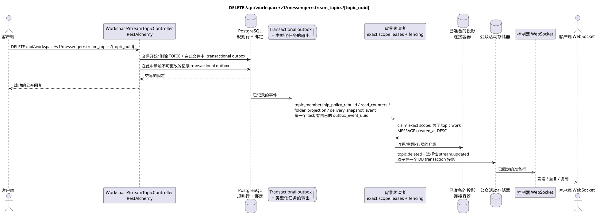

# DELETE /api/workspace/v1/messenger/stream_topics/{topic_uuid}


总目标可靠性变量:每个 immutable outbox 事件都会产生一个唯一的 immutable typed task `outbox_event_uuid`;并无 coalescing. Task 存储实际的 exact scope key,使用 lease/fencing, retry/backoff, max attempts/DLQ, reaper 和 idempotent effect guard. Topic scope 仅适用于 placement/message-binding work; shared rows 不会在 topic.

[← 文件的主要索引](../../../../index.md) · [序列图表的索引](../../README.md) · [部分 Core Messenger](../README.md)

## 现有合同的地位和边界

目标规范是docs-first. 方法,路径,公开JSON和授权遵循当前的合同 [`workspace_api.md`](../../../../workspace_api.md); bounded pagination 并且异步可视性是单独的 target compatibility ADR.



可编辑的源: [`delete_stream_topic.puml`](diagrams/delete_stream_topic.puml).

## 操作

**方法和方式:** `DELETE /api/workspace/v1/messenger/stream_topics/{topic_uuid}`

**目的:** 删除神典主题.

## 公开查询

没有身体 JSON.

## 成功的公众回应

HTTP `204`; 没有一个.

## 公众错误

需要 bearer-token IAM 和项目域. 错误的 UUID 或请求体返回 HTTP `400`;该区域缺少或无法访问的资源 `404`. 标准的文档化验证错误体:

```json
{
  "type": "ValidationErrorException",
  "code": 400,
  "message": "Validation error occurred."
}
```

## 目标边界 RestAlchemy

```python
from restalchemy.api import controllers
from restalchemy.api import resources
from restalchemy.dm import models
from restalchemy.dm import properties
from restalchemy.dm import types
from restalchemy.storage.sql import orm


class WorkspaceUserTopic(
    models.ModelWithUUID,
    models.ModelWithProject,
    orm.SQLStorableMixin,
):
    __tablename__ = "messenger_api_user_topics_v1"

    stream_uuid = properties.property(types.UUID(), read_only=True)
    user_uuid = properties.property(types.UUID(), read_only=True)
    last_message_uuid = properties.property(types.UUID(), read_only=True)
    summary_last_message_uuid = properties.property(types.UUID(), read_only=True)


class WorkspaceStreamTopicController(controllers.BaseResourceControllerPaginated):
    __resource__ = resources.ResourceByRAModel(
        WorkspaceUserTopic, convert_underscore=False, process_filters=True,
    )
```

实体的公共引用是用标量属性表示的.`types.UUID()`而不是关系.RestAlchemy它们的序列化URI实体列`*_uuid`仍然是被索引的外部密钥,具有明显的引用完整性操作.TOPIC作为一个规范的实质; 独特的USER_TOPIC_BINDING提供可见性,个人状态和主题计时器.

## 同步交易

1. 允许和检查权限.
2. 删除 TOPIC 通过外部键清理;如果需要,默认的流主题.
3. 添加每个独立的immutable transactional outbox事件
   引出的 `topic_membership_policy_rebuild`, `read_counters`,
   `folder_projection` 其他 `delivery_snapshot_event` task.

拖动状态: TOPIC,主题绑定/位置,默认流的主题标记和交易式出箱;其他位置的消息保存.

## 类型化任务和后台执行器

任务: 单独 `topic_membership_policy_rebuild`, `read_counters`,
`folder_projection` 和 `delivery_snapshot_event`,每个为自己的 source
outbox event.

Topic-scoped worker 处理删除主题的放置; shared
`user-topic`/`user-stream`/`user-folder` rows 获得了单独的 immutable tasks
exact scopes. 同时输入一个fenced owner key,没有 coalescing.

## 公共活动和 WebSocket

`topic.deleted` 和有条件的 `stream.updated`.

## 具有能力,种族和可见的时间特征

通过外部密钥和交易式出箱进行重复清理是安全的.主题会立即改变,投影和事件异步.

[← 文件的主要索引](../../../../index.md) · [序列图表的索引](../../README.md) · [部分 Core Messenger](../README.md)
