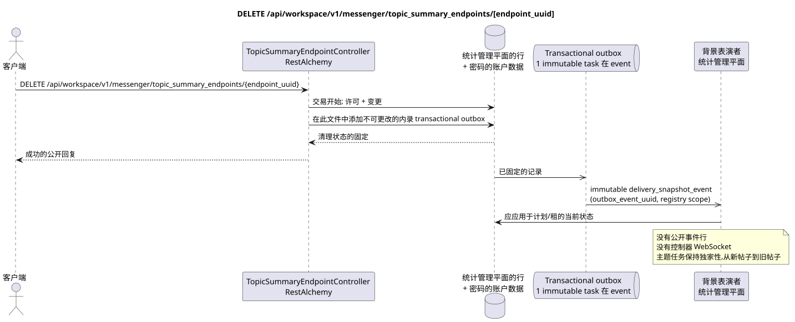

# DELETE /api/workspace/v1/messenger/topic_summary_endpoints/{endpoint_uuid}

[← 文件的主要索引](../../../../index.md) · [序列图表的索引](../../README.md) · [部分 Core Messenger](../README.md)

## 现有合同的地位和边界

目标规格是 docs-first. HTTP-合同仍然是当前合同 [`workspace_api.md`](../../../../workspace_api.md); 目标内部机制仅仅是建议.



可编辑的源: [`delete_topic_summary_endpoint.puml`](diagrams/delete_topic_summary_endpoint.puml).

## 操作

**方法和方式:** `DELETE /api/workspace/v1/messenger/topic_summary_endpoints/{endpoint_uuid}`

**目的:**删除全球结尾点和加密的账户数据.

## 公开查询

没有身体 JSON.

## 成功的公众回应

HTTP `204`; 没有一个.

状态和错误标记字段可能在回复中缺失,如果允许`null`并具有这个值. `api_key`和活跃请求代币永远不会返回.

## 公众错误

需要持有者代币 IAM. 错误的 UUID 或请求体返回 HTTP `400`; 没有管理权限  `403`. 标准验证错误体:

```json
{
  "type": "ValidationErrorException",
  "code": 400,
  "message": "Validation error occurred."
}
```

对于每个具有终点注册的操作,需要 `workspace.topic_summary_endpoint.manage`;缺失的终点给出 `404`.

## 目标边界 RestAlchemy

```python
from restalchemy.api import controllers
from restalchemy.api import resources
from restalchemy.dm import models
from restalchemy.dm import properties
from restalchemy.dm import types
from restalchemy.storage.sql import orm


class WorkspaceTopicSummaryEndpoint(
    models.ModelWithUUID,
    models.ModelWithTimestamp,
    orm.SQLStorableMixin,
):
    __tablename__ = "messenger_topic_summary_endpoints"

    name = properties.property(types.String(max_length=255), required=True)
    base_url = properties.property(types.String(max_length=2048), required=True)
    model = properties.property(types.String(max_length=255), required=True)
    credential_present = properties.property(types.Boolean(), read_only=True)


class TopicSummaryEndpointController(controllers.BaseResourceControllerPaginated):
    __resource__ = resources.ResourceByRAModel(
        WorkspaceTopicSummaryEndpoint,
        convert_underscore=False,
        process_filters=True,
    )
```

这个全球资源没有公开的实体关系字段.它的公开字段`uuid`  scalar 属性UUID.任何内部外部密钥或数据引用都会被索引并具有明确的引用完整性作用;`api_key`仅可用于写作,存储在加密中,从未被串行..

## 同步交易

1. 要求管理权限并恢复终点.
2. 删除终点根;外键链删除加密帐户数据.
3. 在此文件中添加不可更改的内删记录 transactional outbox.

## 类型化任务和后台执行器

独立的 immutable `delivery_snapshot_event` task 从 exact scope 寄存器
更新/清理终点 source outbox event; unique
`outbox_event_uuid`, 没有 coalescing.

控制平面的后台执行器将最终点从未来的选择中排除;活跃的限制请求根据选择的租政策完成. 扫描 MESSAGE 不执行.

## 公众事件,重复和时间特征

清理外部密钥是原子式的;重复看到缺失的资源. 公共事件Workspace和管理器操作不会创建.

没有一个已准备的公共事件 Workspace,因此管理员 WebSocket 不参与此操作.

[← 文件的主要索引](../../../../index.md) · [序列图表的索引](../../README.md) · [部分 Core Messenger](../README.md)
