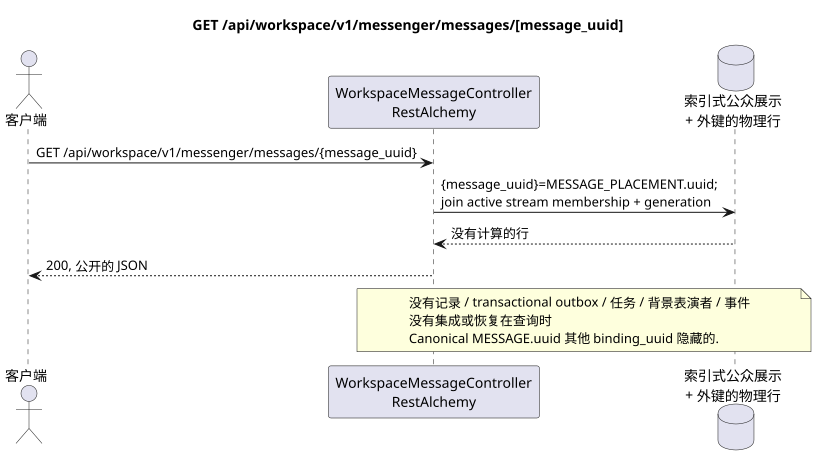

# GET /api/workspace/v1/messenger/messages/{message_uuid}

[← 文件的主要索引](../../../../index.md) · [序列图表的索引](../../README.md) · [部分 Core Messenger](../README.md)

## 现有合同的地位和边界

目标规范是docs-first. 方法,路径,公开JSON和授权遵循当前的合同 [`workspace_api.md`](../../../../workspace_api.md); bounded pagination 并且异步可视性是单独的 target compatibility ADR.



可编辑的源: [`get_message.puml`](diagrams/get_message.puml).

## 操作

**方法和方式:** `GET /api/workspace/v1/messenger/messages/{message_uuid}`

**目的:** 通过稳定获取可见的消息位置 public placement UUID.

## 公开查询

路径: `message_uuid = a93dca35-3061-4748-bda4-7f6f8c660ea5`;没有身体.

## 成功的公众回应

HTTP `200`:

```json
{
  "uuid": "a93dca35-3061-4748-bda4-7f6f8c660ea5",
  "project_id": "22222222-2222-2222-2222-222222222222",
  "stream_uuid": "75309057-419c-4b12-a7c1-3932429ec4a6",
  "topic_uuid": "4ec0b996-b778-45f8-8ef4-ef863be0c047",
  "author_uuid": "11111111-1111-1111-1111-111111111111",
  "payload": {
    "kind": "markdown",
    "content": "Привет, Workspace"
  },
  "user_uuid": "11111111-1111-1111-1111-111111111111",
  "read": true,
  "pinned": false,
  "starred": false,
  "is_own": true,
  "mentioned": false,
  "reactions": {},
  "reaction_users": {},
  "source_name": "native",
  "source": {
    "kind": "native"
  },
  "provider": null,
  "delivery": null,
  "created_at": "2026-06-22T10:10:00Z",
  "updated_at": "2026-06-22T10:10:00Z"
}
```

## 公众错误

需要 bearer-token IAM 和项目区域; 隐形或缺失的资源或标记器给出`404`..

## 目标边界 RestAlchemy

```python
from restalchemy.api import controllers
from restalchemy.api import resources
from restalchemy.dm import models
from restalchemy.dm import properties
from restalchemy.dm import types
from restalchemy.storage.sql import orm


class WorkspaceUserMessage(models.ModelWithProject, orm.SQLStorableMixin):
    __tablename__ = "messenger_api_user_messages_v1"

    binding_uuid = properties.property(types.UUID(), id_property=True)
    uuid = properties.property(types.UUID(), read_only=True)
    stream_uuid = properties.property(types.UUID(), read_only=True)
    topic_uuid = properties.property(types.UUID(), read_only=True)
    author_uuid = properties.property(types.UUID(), read_only=True)
    user_uuid = properties.property(types.UUID(), read_only=True)


class WorkspaceMessageController(controllers.BaseResourceControllerPaginated):
    __resource__ = resources.ResourceByRAModel(
        WorkspaceUserMessage, convert_underscore=False, process_filters=True,
    )
```

公共`uuid`路由标识符等于`MESSAGE_PLACEMENT.uuid = UUIDv5(namespace=TOPIC.uuid, name=MESSAGE.uuid)`; name — lowercase hyphenated canonical UUID圣经中的`MESSAGE.uuid`国内;`binding_uuid`技术上,这仍然是隐藏的.ORM控制器允许放置并同步检查active.`USER_STREAM_BINDING`并且是相符的 `membership_generation`.

## 同步读取路径

1. 允许 UUID 放置,要求通过索引链 USER_STREAM_BINDING -> USER_MESSAGE_BINDING -> MESSAGE_PLACEMENT 要求 active membership 和 generation 匹配,并加入一个 MESSAGE 和 placement-scoped USER_MESSAGE_STATE.
2. 直接从索引表达式返回结果.
3. 不要添加交易式出箱,任务,投影,公共事件或 WebSocket.

## 客户可见的一致性

这是一个GET它可以观察到从早期记录中可以看到的落后, 但它没有进行恢复,`COUNT`, `GROUP BY`窗口或侧面操作,相关的下求或搜索缺失的绑定.

[← 文件的主要索引](../../../../index.md) · [序列图表的索引](../../README.md) · [部分 Core Messenger](../README.md)
