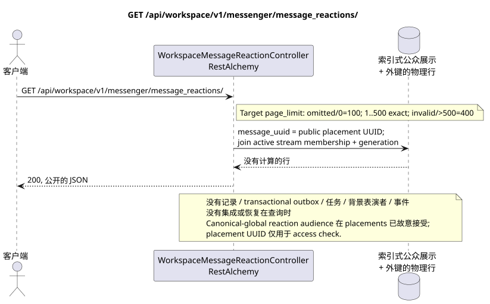

# GET /api/workspace/v1/messenger/message_reactions/

[← 文件的主要索引](../../../../index.md) · [序列图表的索引](../../README.md) · [部分 Core Messenger](../README.md)

## 现有合同的地位和边界

目标规范是docs-first. 方法,路径,公开JSON和授权遵循当前的合同 [`workspace_api.md`](../../../../workspace_api.md); target pagination `100/500` 是一个单独的 observable behavior change.



可编辑的源: [`get_message_reactions_list.puml`](diagrams/get_message_reactions_list.puml).

## 操作

**方法和方式:** `GET /api/workspace/v1/messenger/message_reactions/`

**目的:** 获取可见消息的反应列表.

## 公开查询

没有身体.:

```http
GET /api/workspace/v1/messenger/message_reactions/?message_uuid=a93dca35-3061-4748-bda4-7f6f8c660ea5&page_limit=100
Authorization: Bearer <access_token>
```

现在的语义 RestAlchemy:缺或等于 `0` `page_limit` 给出无限的样本;负或非整数值给出 HTTP `400`;正值没有最大值.这是 current gap. Target:缺或 `0` => `100`; `1..500` 准确接受;负,非整数值或 `>500` => HTTP `400` 没有; unbounded mode 没有. marker.

## 成功的公众回应

HTTP `200`:

```json
[
  {
    "uuid": "bd4b7632-8788-435a-93cc-6873657335c6",
    "project_id": "22222222-2222-2222-2222-222222222222",
    "message_uuid": "a93dca35-3061-4748-bda4-7f6f8c660ea5",
    "user_uuid": "11111111-1111-1111-1111-111111111111",
    "emoji_name": "thumbs_up",
    "provider": null,
    "delivery": null,
    "created_at": "2026-06-22T10:12:00Z",
    "updated_at": "2026-06-22T10:12:00Z"
  }
]
```

## 公众错误

需要 bearer-token IAM 和项目区域; 隐形或缺失的资源或标记器给出`404`..

## 目标边界 RestAlchemy

```python
from restalchemy.api import controllers
from restalchemy.api import resources
from restalchemy.dm import models
from restalchemy.dm import properties
from restalchemy.dm import types
from restalchemy.storage.sql import orm


class WorkspaceMessageReactionView(
    models.ModelWithUUID,
    models.ModelWithProject,
    orm.SQLStorableMixin,
):
    __tablename__ = "messenger_api_message_reactions_v1"

    message_uuid = properties.property(types.UUID(), read_only=True)
    canonical_message_uuid = properties.property(types.UUID(), read_only=True)
    user_uuid = properties.property(types.UUID(), read_only=True)


class WorkspaceMessageReactionController(controllers.BaseResourceControllerPaginated):
    __resource__ = resources.ResourceByRAModel(
        WorkspaceMessageReactionView, convert_underscore=False, process_filters=True,
    )
```

公众 `message_uuid`  标杆式 UUID 放置;内部
`canonical_message_uuid` 隐藏了域权限.UUID根据第2条
物理链接仍然是FK索引,而
提供商/交付的原始元数据已关闭.

## 同步读取路径

1. 解释公共选器 `message_uuid` 为
   `MESSAGE_PLACEMENT.uuid`, 恢复位置并通过其流检查
   active `USER_STREAM_BINDING` 并且是平等的.
   仅为 canonical message 添加消息
   清除 `provider`/`delivery`. 阅读时永远不要聚合.
2. 直接从索引表达式返回结果.
3. 不要添加交易式出箱,任务,投影,公共事件或 WebSocket.

## 客户可见的一致性

这是一个GET它可以观察到从早期记录中可以看到的落后, 但它没有进行恢复,`COUNT`, `GROUP BY`窗口或侧面操作,相关的下求或搜索缺失的绑定.

每行中的公共 `message_uuid` 仍然是placement UUID,并指定 access
check. Raw facts/snapshots 故意使用 canonical-message-global,并可在所有
placements 通过这些信息,我们可以让用户更了解自己的信息,
如何 Critic risk #8.

[← 文件的主要索引](../../../../index.md) · [序列图表的索引](../../README.md) · [部分 Core Messenger](../README.md)
