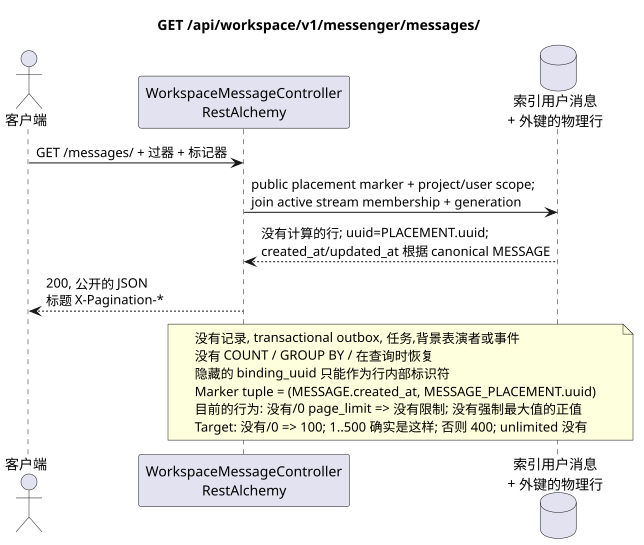

# GET /api/workspace/v1/messenger/messages/

[← 文件的主要索引](../../../../index.md) · [序列图表的索引](../../README.md) · [部分 Core Messenger](../README.md)

## 现有合同的地位和边界

实现的目标规范是docs-first. 方法,路径,公开 JSON,授权和过器遵循 [`workspace_api.md`](../../../../workspace_api.md); bounded pagination 并且是单独接受的目标兼容性变化..



可编辑的源: [`get_messages_list.puml`](diagrams/get_messages_list.puml).

## 操作

**方法和方式:** `GET /api/workspace/v1/messenger/messages/`

**目的:**获取当前用户可见的消息列表IAM具有稳定的组成页面.

## 公开查询

没有身体.:

```http
GET /api/workspace/v1/messenger/messages/?stream_uuid=75309057-419c-4b12-a7c1-3932429ec4a6&topic_uuid=4ec0b996-b778-45f8-8ef4-ef863be0c047&sort_key=created_at&sort_dir=desc&page_limit=50&page_marker=a93dca35-3061-4748-bda4-7f6f8c660ea5
Authorization: Bearer <access_token>
```

排列行列按`(MESSAGE.created_at, MESSAGE_PLACEMENT.uuid)`. `page_marker` 最后的公共位置UUID. 标记器在用户,项目和选器的同一区域之外被拒绝. 页面标题: `X-Pagination-Limit` 和,只有下一个页面存在, `X-Pagination-Marker`.

现在的语义 RestAlchemy:缺或等于 `0` `page_limit` 给出无限的样本;负或非整数值给出 HTTP `400`;正值没有最大值.这是 current gap. Target:缺或 `0` => `100`; `1..500` 准确接受;负,非整数值或 `>500` => HTTP `400` 没有; unbounded mode 没有. marker.

## 成功的公众回应

HTTP `200`:

```json
[
  {
    "uuid": "a93dca35-3061-4748-bda4-7f6f8c660ea5",
    "project_id": "22222222-2222-2222-2222-222222222222",
    "stream_uuid": "75309057-419c-4b12-a7c1-3932429ec4a6",
    "topic_uuid": "4ec0b996-b778-45f8-8ef4-ef863be0c047",
    "author_uuid": "11111111-1111-1111-1111-111111111111",
    "payload": {
      "kind": "markdown",
      "content": "Привет, Workspace"
    },
    "user_uuid": "11111111-1111-1111-1111-111111111111",
    "read": true,
    "pinned": false,
    "starred": false,
    "is_own": true,
    "mentioned": false,
    "reactions": {},
    "reaction_users": {},
    "source_name": "native",
    "source": {
      "kind": "native"
    },
    "provider": null,
    "delivery": null,
    "created_at": "2026-06-22T10:10:00Z",
    "updated_at": "2026-06-22T10:10:00Z"
  }
]
```

## 公众错误

需要 bearer-token IAM 和项目区域. 标记器在认证用户,项目,表示和选区域之外返回 `404`. 记录侧没有出现错误.

## 目标边界 RestAlchemy

```python
from restalchemy.api import controllers
from restalchemy.api import resources
from restalchemy.dm import models
from restalchemy.dm import properties
from restalchemy.dm import types
from restalchemy.storage.sql import orm


class WorkspaceUserMessage(models.ModelWithProject, orm.SQLStorableMixin):
    __tablename__ = "messenger_api_user_messages_v1"

    binding_uuid = properties.property(types.UUID(), id_property=True)
    uuid = properties.property(types.UUID(), read_only=True)
    stream_uuid = properties.property(types.UUID(), read_only=True)
    topic_uuid = properties.property(types.UUID(), read_only=True)
    author_uuid = properties.property(types.UUID(), read_only=True)
    user_uuid = properties.property(types.UUID(), read_only=True)


class WorkspaceMessageController(
    controllers.BaseResourceControllerPaginated,
):
    __resource__ = resources.ResourceByRAModel(
        WorkspaceUserMessage,
        convert_underscore=False,
        process_filters=True,
    )
```

公开的实体引用是以 UUID 标量属性,而不是以 RestAlchemy 关系为序列,这些关系是以 URI 序列为序列.物理列 `*_uuid` 是有明确指定的引用完整性操作的索引外部密钥..

公共 `uuid`等于 `MESSAGE_PLACEMENT.uuid = UUIDv5(namespace=TOPIC.uuid, name=MESSAGE.uuid)`;名字小写字母加标 UUID. `MESSAGE.uuid`内, `binding_uuid` 隐藏 ORM身份. 控制器恢复标记者在公共放置 UUID 和使用tuple `(MESSAGE.created_at,MESSAGE_PLACEMENT.uuid)`,没有 hidden binding key.

## 同步读取路径

1. 应用项目范围IAM和当前用户,以及文档流过器和主题.
2. 扫描一个有主 `USER_MESSAGE_BINDING` 和强制性的 join 到 active `USER_STREAM_BINDING` 的索引表达 generation.
3. 加入一个 `MESSAGE_PLACEMENT`,一个正规的 `MESSAGE` 和一个位置范围的行 `USER_MESSAGE_STATE`.
4. 阅读正规内容/时间标记和准备状态;串行 `uuid = MESSAGE_PLACEMENT.uuid`.
5. 返回公开的 JSON 没有计算反应的组合或未读.

## Transactional outbox, 背景表演者,事件和一致性

这个 GET 不添加到交易式出box中的记录,不创建类型化任务,不占用主题,不记录投影或事件,也不向 WebSocket 管理员发言.它不执行 `COUNT`, `GROUP BY`,窗口或侧面操作,相关的子查询,粉丝排放,恢复或搜索缺失的绑定.

答案反映了已经记录的投影行,并且可能显示了与早期记录的最终一致性 (eventual consistency). 阅读本身没有副作用.

[← 文件的主要索引](../../../../index.md) · [序列图表的索引](../../README.md) · [部分 Core Messenger](../README.md)
