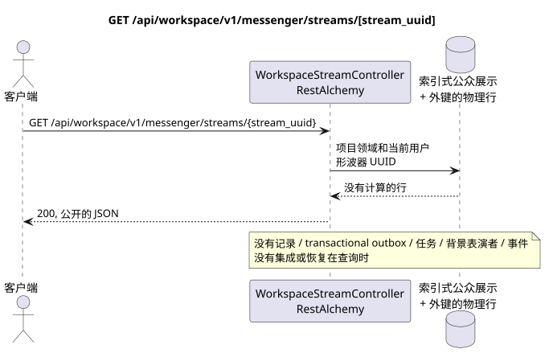

# GET /api/workspace/v1/messenger/streams/{stream_uuid}

[← 文件的主要索引](../../../../index.md) · [序列图表的索引](../../README.md) · [部分 Core Messenger](../README.md)

## 现有合同的地位和边界

目标规范是docs-first. 方法,路径,公开JSON和授权遵循当前的合同 [`workspace_api.md`](../../../../workspace_api.md); bounded pagination 并且异步可视性是单独的 target compatibility ADR.



可编辑的源: [`get_stream.puml`](diagrams/get_stream.puml).

## 操作

**方法和方式:** `GET /api/workspace/v1/messenger/streams/{stream_uuid}`

**目的:** 获取一个可见的流行.

## 公开查询

路径: `stream_uuid = 75309057-419c-4b12-a7c1-3932429ec4a6`;没有身体.

## 成功的公众回应

HTTP `200`:

```json
{
  "uuid": "75309057-419c-4b12-a7c1-3932429ec4a6",
  "name": "Инженерия",
  "description": "Инженерное пространство",
  "project_id": "22222222-2222-2222-2222-222222222222",
  "owner": "11111111-1111-1111-1111-111111111111",
  "user_uuid": "11111111-1111-1111-1111-111111111111",
  "role": "owner",
  "notification_mode": "all_messages",
  "unread_count": 2,
  "active_unread_count": 2,
  "passive_unread_count": 0,
  "source_name": "native",
  "source": {
    "kind": "native"
  },
  "invite_only": false,
  "announce": false,
  "private": false,
  "is_archived": false,
  "color": 3368601,
  "last_message_uuid": "a93dca35-3061-4748-bda4-7f6f8c660ea5",
  "default_topic_uuid": "4ec0b996-b778-45f8-8ef4-ef863be0c047",
  "created_at": "2026-06-22T09:00:00Z",
  "updated_at": "2026-06-22T10:10:00Z"
}
```

## 公众错误

需要 bearer-token IAM 和项目区域; 隐形或缺失的资源或标记器给出`404`..

## 目标边界 RestAlchemy

```python
from restalchemy.api import controllers
from restalchemy.api import resources
from restalchemy.dm import models
from restalchemy.dm import properties
from restalchemy.dm import types
from restalchemy.storage.sql import orm


class WorkspaceUserStream(
    models.ModelWithUUID,
    models.ModelWithProject,
    orm.SQLStorableMixin,
):
    __tablename__ = "messenger_api_user_streams_v1"

    owner = properties.property(types.UUID(), read_only=True)
    user_uuid = properties.property(types.UUID(), read_only=True)
    direct_user_uuid = properties.property(
        types.AllowNone(types.UUID()), default=None, read_only=True,
    )
    last_message_uuid = properties.property(types.UUID(), read_only=True)
    default_topic_uuid = properties.property(types.UUID(), read_only=True)


class WorkspaceStreamController(controllers.BaseResourceControllerPaginated):
    __resource__ = resources.ResourceByRAModel(
        WorkspaceUserStream, convert_underscore=False, process_filters=True,
    )
```

公开的实体引用是以 `types.UUID()` 标量属性,而不是以 RestAlchemy 关系为序列,它们是以 URI 序列的.物理列 `*_uuid` 仍然是具有明显选择的引用完整性操作的索引外部键.公开字段 `owner` 是 UUID 属性;物理字段 `owner_uuid`  是用户的索引外部键. USER_STREAM_BINDING 存储了已备用的流量级计数器..

## 同步读取路径

1. 允许索引绑定 `(project,user,stream)`,加入可定 STREAM 和已完成的绑定集. 引用 UUID 仍然是标数 JSON.
2. 直接从索引表达式返回结果.
3. 不要添加交易式出箱,任务,投影,公共事件或 WebSocket.

## 客户可见的一致性

这是一个GET它可以观察到从早期记录中可以看到的落后, 但它没有进行恢复,`COUNT`, `GROUP BY`窗口或侧面操作,相关的下求或搜索缺失的绑定.

[← 文件的主要索引](../../../../index.md) · [序列图表的索引](../../README.md) · [部分 Core Messenger](../README.md)
