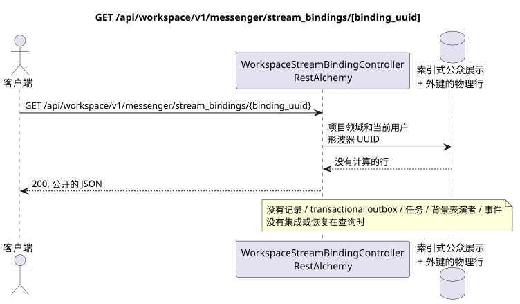

# GET /api/workspace/v1/messenger/stream_bindings/{binding_uuid}

[← 文件的主要索引](../../../../index.md) · [序列图表的索引](../../README.md) · [部分 Core Messenger](../README.md)

## 现有合同的地位和边界

目标规范是docs-first. 方法,路径,公开JSON和授权遵循当前的合同 [`workspace_api.md`](../../../../workspace_api.md); bounded pagination 并且异步可视性是单独的 target compatibility ADR.



可编辑的源: [`get_stream_binding.puml`](diagrams/get_stream_binding.puml).

## 操作

**方法和方式:** `GET /api/workspace/v1/messenger/stream_bindings/{binding_uuid}`

**目的:** 获取一个可见的流链接.

## 公开查询

路径: `binding_uuid = 3195a887-da5d-440b-bdf8-0d3d995a9e01`;没有身体.

## 成功的公众回应

HTTP `200`:

```json
{
  "uuid": "3195a887-da5d-440b-bdf8-0d3d995a9e01",
  "project_id": "22222222-2222-2222-2222-222222222222",
  "stream_uuid": "75309057-419c-4b12-a7c1-3932429ec4a6",
  "user_uuid": "33333333-3333-3333-3333-333333333333",
  "who_uuid": "11111111-1111-1111-1111-111111111111",
  "role": "member",
  "notification_mode": "all_messages",
  "notification_updated_at": "1970-01-01T00:00:00Z",
  "created_at": "2026-06-22T09:05:00Z",
  "updated_at": "2026-06-22T09:05:00Z"
}
```

## 公众错误

需要 bearer-token IAM 和项目区域; 隐形或缺失的资源或标记器给出`404`..

## 目标边界 RestAlchemy

```python
from restalchemy.api import controllers
from restalchemy.api import resources
from restalchemy.dm import models
from restalchemy.dm import properties
from restalchemy.dm import types
from restalchemy.storage.sql import orm


class WorkspaceStreamBindingView(
    models.ModelWithUUID,
    models.ModelWithProject,
    orm.SQLStorableMixin,
):
    __tablename__ = "messenger_api_stream_bindings_v1"

    stream_uuid = properties.property(types.UUID(), read_only=True)
    user_uuid = properties.property(types.UUID(), read_only=True)
    who_uuid = properties.property(types.UUID(), read_only=True)


class WorkspaceStreamBindingController(controllers.BaseResourceControllerPaginated):
    __resource__ = resources.ResourceByRAModel(
        WorkspaceStreamBindingView, convert_underscore=False, process_filters=True,
    )
```

公开的实体引用是以 `types.UUID()` 标量属性,而不是以 RestAlchemy 关系为序列,这些关系在 URI 中进行序列化.物理列 `*_uuid` 仍然是具有明显选择的引用完整性操作的索引外部键. USER_STREAM_BINDING 独特于 `(project_id, stream_uuid, user_uuid)`,并且可以物理存储已完成的计数器,但其当前的公开 JSON 绑定没有改变.

## 同步读取路径

1. 恢复UUID的绑定,检查观察员的成员和角色,串行UUID的尺度. 现成的物理计数器不扩展当前的公开JSON绑定.
2. 直接从索引表达式返回结果.
3. 不要添加交易式出箱,任务,投影,公共事件或 WebSocket.

## 客户可见的一致性

这是一个GET它可以观察到从早期记录中可以看到的落后, 但它没有进行恢复,`COUNT`, `GROUP BY`窗口或侧面操作,相关的下求或搜索缺失的绑定.

[← 文件的主要索引](../../../../index.md) · [序列图表的索引](../../README.md) · [部分 Core Messenger](../README.md)
