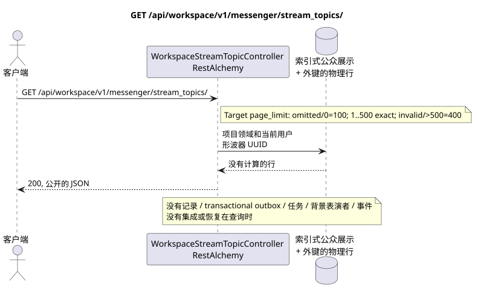

# GET /api/workspace/v1/messenger/stream_topics/

[← 文件的主要索引](../../../../index.md) · [序列图表的索引](../../README.md) · [部分 Core Messenger](../README.md)

## 现有合同的地位和边界

目标规范是docs-first. 方法,路径,公开JSON和授权遵循当前的合同 [`workspace_api.md`](../../../../workspace_api.md); target pagination `100/500` 是一个单独的 observable behavior change.



可编辑的源: [`get_stream_topics_list.puml`](diagrams/get_stream_topics_list.puml).

## 操作

**方法和方式:** `GET /api/workspace/v1/messenger/stream_topics/`

**目的:**获取用户可见的主题行列列表.

## 公开查询

没有身体.:

```http
GET /api/workspace/v1/messenger/stream_topics/?stream_uuid=75309057-419c-4b12-a7c1-3932429ec4a6&page_limit=50
Authorization: Bearer <access_token>
```

现在的语义 RestAlchemy:缺或等于 `0` `page_limit` 给出无限的样本;负或非整数值给出 HTTP `400`;正值没有最大值.这是 current gap. Target:缺或 `0` => `100`; `1..500` 准确接受;负,非整数值或 `>500` => HTTP `400` 没有; unbounded mode 没有. marker.

## 成功的公众回应

HTTP `200`:

```json
[
  {
    "uuid": "4ec0b996-b778-45f8-8ef4-ef863be0c047",
    "project_id": "22222222-2222-2222-2222-222222222222",
    "name": "Релизы",
    "stream_uuid": "75309057-419c-4b12-a7c1-3932429ec4a6",
    "user_uuid": "11111111-1111-1111-1111-111111111111",
    "color": 4491468,
    "last_message_uuid": "a93dca35-3061-4748-bda4-7f6f8c660ea5",
    "unread_count": 2,
    "active_unread_count": 2,
    "passive_unread_count": 0,
    "is_default": false,
    "is_done": false,
    "notification_mode": "default",
    "summary": null,
    "summary_last_message_uuid": null,
    "summary_has_new_messages": null,
    "summary_enabled": true,
    "summary_system_prompt": null,
    "summary_reasoning_effort": null,
    "source_name": "native",
    "source": {
      "kind": "native"
    },
    "provider": null,
    "delivery": null,
    "created_at": "2026-06-22T09:10:00Z",
    "updated_at": "2026-06-22T10:10:00Z"
  }
]
```

## 公众错误

需要 bearer-token IAM 和项目区域; 隐形或缺失的资源或标记器给出`404`..

## 目标边界 RestAlchemy

```python
from restalchemy.api import controllers
from restalchemy.api import resources
from restalchemy.dm import models
from restalchemy.dm import properties
from restalchemy.dm import types
from restalchemy.storage.sql import orm


class WorkspaceUserTopic(
    models.ModelWithUUID,
    models.ModelWithProject,
    orm.SQLStorableMixin,
):
    __tablename__ = "messenger_api_user_topics_v1"

    stream_uuid = properties.property(types.UUID(), read_only=True)
    user_uuid = properties.property(types.UUID(), read_only=True)
    last_message_uuid = properties.property(types.UUID(), read_only=True)
    summary_last_message_uuid = properties.property(types.UUID(), read_only=True)


class WorkspaceStreamTopicController(controllers.BaseResourceControllerPaginated):
    __resource__ = resources.ResourceByRAModel(
        WorkspaceUserTopic, convert_underscore=False, process_filters=True,
    )
```

实体的公共引用是用标量属性表示的.`types.UUID()`而不是关系.RestAlchemy它们的序列化URI实体列`*_uuid`仍然是被索引的外部密钥,具有明显的引用完整性操作.TOPIC作为一个规范的实质; 独特的USER_TOPIC_BINDING提供可见性,个人状态和主题计时器.

## 同步读取路径

1. 扫描唯一的行USER_TOPIC_BINDING;加入可规的TOPIC,STREAM和最后的MESSAGE.计数器是已准备的绑定字段;在查询时不执行聚合.
2. 直接从索引表达式返回结果.
3. 不要添加交易式出箱,任务,投影,公共事件或 WebSocket.

## 客户可见的一致性

这是一个GET它可以观察到从早期记录中可以看到的落后, 但它没有进行恢复,`COUNT`, `GROUP BY`窗口或侧面操作,相关的下求或搜索缺失的绑定.

[← 文件的主要索引](../../../../index.md) · [序列图表的索引](../../README.md) · [部分 Core Messenger](../README.md)
