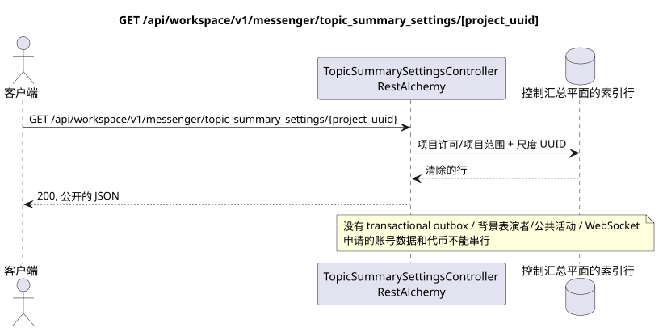

# GET /api/workspace/v1/messenger/topic_summary_settings/{project_uuid}

[← 文件的主要索引](../../../../index.md) · [序列图表的索引](../../README.md) · [部分 Core Messenger](../README.md)

## 现有合同的地位和边界

目标规格是 docs-first. HTTP-合同仍然是当前合同 [`workspace_api.md`](../../../../workspace_api.md); 目标内部机制仅仅是建议.



可编辑的源: [`get_topic_summary_settings.puml`](diagrams/get_topic_summary_settings.puml).

## 操作

**方法和方式:** `GET /api/workspace/v1/messenger/topic_summary_settings/{project_uuid}`

**目的:**阅读全球和当前项目相关的包含摘要的条件.

## 公开查询

路径: `project_uuid = 12345678-1234-4234-8234-123456789abc`;值必须与IAM项目一致;没有体.

## 成功的公众回应

HTTP `200`:

```json
{
  "project_id": "12345678-1234-4234-8234-123456789abc",
  "global_enabled": false,
  "project_enabled": false
}
```

状态和错误标记字段可能在回复中缺失,如果允许`null`并具有这个值. `api_key`和活跃请求代币永远不会返回.

## 公众错误

需要持有者代币 IAM. 错误的 UUID 或请求体返回 HTTP `400`; 没有管理权限  `403`. 标准验证错误体:

```json
{
  "type": "ValidationErrorException",
  "code": 400,
  "message": "Validation error occurred."
}
```

如果 UUID 在路径上与 IAM 项目不一致,则返回 `403`; GET 要求项目成员,而 PUT  管理权限.

## 目标边界 RestAlchemy

```python
from restalchemy.api import controllers
from restalchemy.api import resources
from restalchemy.dm import models
from restalchemy.dm import properties
from restalchemy.dm import types
from restalchemy.storage.sql import orm


class WorkspaceTopicSummarySettings(
    models.ModelWithProject,
    orm.SQLStorableMixin,
):
    __tablename__ = "messenger_topic_summary_settings"

    project_id = properties.property(types.UUID(), id_property=True, read_only=True)
    global_enabled = properties.property(types.Boolean(), default=False)
    project_enabled = properties.property(types.Boolean(), default=False)


class TopicSummarySettingsController(controllers.BaseResourceController):
    __resource__ = resources.ResourceByRAModel(
        WorkspaceTopicSummarySettings,
        convert_underscore=False,
        process_filters=True,
    )
```

公共字段`project_id`  标量性质UUID,而不是关系形式URI. 物理索引的外部键为项目Workspace具有明确的引用完整性作用. UUID的路径必须与项目语境相匹配 IAM.

## 同步读取路径

1. 要求文件许可和项目范围.
2. 通过标准对象读取索引的实体行 RestAlchemy.
3. 清除帐户数据和申请字段,然后串行当前的公共表格.
4. 不要创建交易外框,任务,背景执行者请求,公共事件或工作 WebSocket.

这种读取没有副作用,并且在查询时不会进行聚合或恢复.

[← 文件的主要索引](../../../../index.md) · [序列图表的索引](../../README.md) · [部分 Core Messenger](../README.md)
