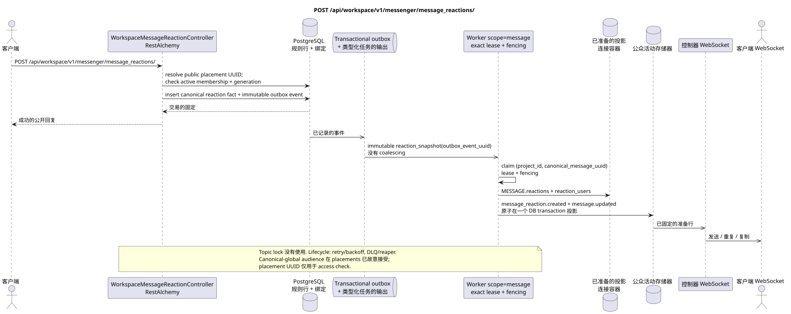

# POST /api/workspace/v1/messenger/message_reactions/

[← 文件的主要索引](../../../../index.md) · [序列图表的索引](../../README.md) · [部分 Core Messenger](../README.md)

## 现有合同的地位和边界

目标规范是docs-first. 方法,路径,公开JSON和授权遵循当前的合同 [`workspace_api.md`](../../../../workspace_api.md); bounded pagination 并且异步可视性是单独的 target compatibility ADR.



可编辑的源: [`post_message_reactions_create.puml`](diagrams/post_message_reactions_create.puml).

## 操作

**方法和方式:** `POST /api/workspace/v1/messenger/message_reactions/`

**目的:** 创建一个对定律信息的反应的原始事实.

## 公开查询

```json
{
  "message_uuid": "a93dca35-3061-4748-bda4-7f6f8c660ea5",
  "emoji_name": "thumbs_up"
}
```

## 成功的公众回应

HTTP `201`:

```json
{
  "uuid": "bd4b7632-8788-435a-93cc-6873657335c6",
  "project_id": "22222222-2222-2222-2222-222222222222",
  "message_uuid": "a93dca35-3061-4748-bda4-7f6f8c660ea5",
  "user_uuid": "11111111-1111-1111-1111-111111111111",
  "emoji_name": "thumbs_up",
  "provider": null,
  "delivery": null,
  "created_at": "2026-06-22T10:12:00Z",
  "updated_at": "2026-06-22T10:12:00Z"
}
```

## 公众错误

需要 bearer-token IAM 和项目域. 错误的 UUID 或请求体返回 HTTP `400`;该区域缺少或无法访问的资源 `404`. 标准的文档化验证错误体:

```json
{
  "type": "ValidationErrorException",
  "code": 400,
  "message": "Validation error occurred."
}
```

同样的用户,消息和表情符号的重复被拒绝;当前合同不指定单独的应用程序代码.

## 目标边界 RestAlchemy

```python
from restalchemy.api import controllers
from restalchemy.api import resources
from restalchemy.dm import models
from restalchemy.dm import properties
from restalchemy.dm import types
from restalchemy.storage.sql import orm


class WorkspaceMessageReactionView(
    models.ModelWithUUID,
    models.ModelWithProject,
    orm.SQLStorableMixin,
):
    __tablename__ = "messenger_api_message_reactions_v1"

    message_uuid = properties.property(types.UUID(), read_only=True)
    canonical_message_uuid = properties.property(types.UUID(), read_only=True)
    user_uuid = properties.property(types.UUID(), read_only=True)


class WorkspaceMessageReactionController(controllers.BaseResourceControllerPaginated):
    __resource__ = resources.ResourceByRAModel(
        WorkspaceMessageReactionView, convert_underscore=False, process_filters=True,
    )
```

公众 `message_uuid`  标杆式 UUID 放置;内部
`canonical_message_uuid` 隐藏了域权限.UUID根据第2条
物理链接仍然是FK索引,而
提供商/交付的原始元数据已关闭.

## 同步交易

1. 解释公开 `message_uuid` 作为 placement UUID,恢复
   立即检查其 active stream membership 和
   matching generation.
2. 输入一个为当前用户, canonical message 和 emoji;
   placement 它们的使用方式是授权,而不是 hidden public ID.
3. 在此中添加一个独立的immutable事件 transactional outbox; derived task
   唯一的 `outbox_event_uuid`, 照片不能同时更改.

影响状态:反应,接入和绑定 transactional outbox.

## 类型化任务和后台执行器

任务:单独的不可变 `reaction_snapshot` 和必要时单独的
`delivery_snapshot_event`; coalescing 没有.

一个 fenced owner scope `message`
`(project_id, canonical_message_uuid)` 阅读当前的事实和原子
取代`MESSAGE.reactions`/`reaction_users`; topic lock 不使用.
Task lifecycle 包含lease expiry,retry/backoff,DLQ 和 reaper.

## 公共活动和 WebSocket

对于发起者, `message_reaction.created`,然后通过管理员,对观察者, `message.updated`.

## 具有能力,种族和可见的时间特征

唯一性 `(project,canonical_message,user,emoji)` 防止重复和
更新丢失. 撤销会员会禁止请求后立即 commit,
无论是固态的信息绑定还是不固态的信息绑定.
事件异步.
通过不同培训的观众, Critic risk #8.

[← 文件的主要索引](../../../../index.md) · [序列图表的索引](../../README.md) · [部分 Core Messenger](../README.md)
