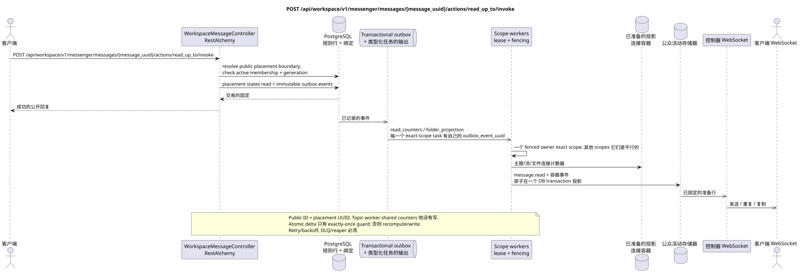

# POST /api/workspace/v1/messenger/messages/{message_uuid}/actions/read_up_to/invoke

[← 文件的主要索引](../../../../index.md) · [序列图表的索引](../../README.md) · [部分 Core Messenger](../README.md)

## 现有合同的地位和边界

目标规范是docs-first. 方法,路径,公开JSON和授权遵循当前的合同 [`workspace_api.md`](../../../../workspace_api.md); bounded pagination 并且异步可视性是单独的 target compatibility ADR.



可编辑的源: [`post_message_read_up_to_action.puml`](diagrams/post_message_read_up_to_action.puml).

## 操作

**方法和方式:** `POST /api/workspace/v1/messenger/messages/{message_uuid}/actions/read_up_to/invoke`

**目的:** 标记当前用户的主题的消息已读
选择的公共位置的边界 UUID 包含.

## 公开查询

没有身体 JSON.

## 成功的公众回应

HTTP `200`:

```json
{
  "uuid": "a93dca35-3061-4748-bda4-7f6f8c660ea5",
  "project_id": "22222222-2222-2222-2222-222222222222",
  "stream_uuid": "75309057-419c-4b12-a7c1-3932429ec4a6",
  "topic_uuid": "4ec0b996-b778-45f8-8ef4-ef863be0c047",
  "author_uuid": "11111111-1111-1111-1111-111111111111",
  "payload": {
    "kind": "markdown",
    "content": "Привет, Workspace"
  },
  "user_uuid": "33333333-3333-3333-3333-333333333333",
  "read": true,
  "pinned": false,
  "starred": false,
  "is_own": false,
  "mentioned": false,
  "reactions": {},
  "reaction_users": {},
  "source_name": "native",
  "source": {
    "kind": "native"
  },
  "provider": null,
  "delivery": null,
  "created_at": "2026-06-22T10:10:00Z",
  "updated_at": "2026-06-22T10:10:00Z"
}
```

## 公众错误

需要 bearer-token IAM 和项目域. 错误的 UUID 或请求体返回 HTTP `400`;该区域缺少或无法访问的资源 `404`. 标准的文档化验证错误体:

```json
{
  "type": "ValidationErrorException",
  "code": 400,
  "message": "Validation error occurred."
}
```

路线包含公共`MESSAGE_PLACEMENT.uuid`,因此具体的流和
topic 选择的方法是单一的,即使是一个位置的多个位置
关于规范信息.

## 目标边界 RestAlchemy

```python
from restalchemy.api import controllers
from restalchemy.api import resources
from restalchemy.dm import models
from restalchemy.dm import properties
from restalchemy.dm import types
from restalchemy.storage.sql import orm


class WorkspaceUserMessage(models.ModelWithProject, orm.SQLStorableMixin):
    __tablename__ = "messenger_api_user_messages_v1"

    binding_uuid = properties.property(types.UUID(), id_property=True)
    uuid = properties.property(types.UUID(), read_only=True)
    stream_uuid = properties.property(types.UUID(), read_only=True)
    topic_uuid = properties.property(types.UUID(), read_only=True)
    author_uuid = properties.property(types.UUID(), read_only=True)
    user_uuid = properties.property(types.UUID(), read_only=True)


class WorkspaceMessageController(controllers.BaseResourceControllerPaginated):
    __resource__ = resources.ResourceByRAModel(
        WorkspaceUserMessage, convert_underscore=False, process_filters=True,
    )
```

公共`uuid`和路由ID是相同的.`MESSAGE_PLACEMENT.uuid`; canonical `MESSAGE.uuid`没有`binding_uuid`隐藏的位置./topic边界,而action同时检查 active membership 和 generation.

## 同步交易

1. 允许公共的位置 UUID 在边界
   `(MESSAGE.created_at, MESSAGE_PLACEMENT.uuid)` 并且是主题的明确背景.
2. 设置适用的读取标记 USER_MESSAGE_STATE.
3. 添加一个独立的 immutable 输出箱事件 task
   实际的读取范围.

影响状态: USER_MESSAGE_STATE,访问区域和交易式的Outbox;容器计数器从未被保存在消息绑定中.

## 类型化任务和后台执行器

任务:单独的 immutable `read_counters` 对于exact `user-stream`和
`user-topic`, 并且`folder_projection`为了准确`user-folder`每一个 task
匹配自己的源Outbox事件,并发没有.

Fenced owners scopes `user-stream`, `user-topic` 并且 `user-folder` 是进电源
更新已备用的计数器/snapshot. Topic worker 不会写这些共享行. Atomic delta
只有在 `outbox_event_uuid` 上准确的一次守护;否则 scope worker
任务生命周期包括 retry/backoff, DLQ/reaper.

## 公共活动和 WebSocket

`message.read`, 更新主题,流和文件

## 具有能力,种族和可见的时间特征

状态设置是具有能力的;当前状态会立即改变,而组件和事件可能会滞后一段时间.

[← 文件的主要索引](../../../../index.md) · [序列图表的索引](../../README.md) · [部分 Core Messenger](../README.md)
