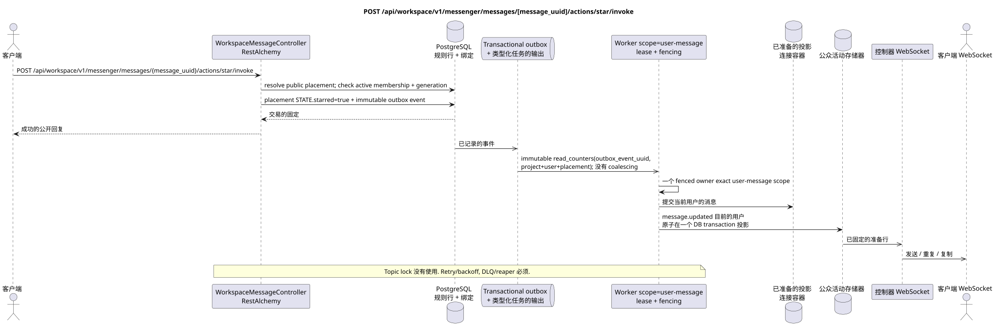

# POST /api/workspace/v1/messenger/messages/{message_uuid}/actions/star/invoke

[← 文件的主要索引](../../../../index.md) · [序列图表的索引](../../README.md) · [部分 Core Messenger](../README.md)

## 现有合同的地位和边界

目标规范是docs-first. 方法,路径,公开JSON和授权遵循当前的合同 [`workspace_api.md`](../../../../workspace_api.md); bounded pagination 并且异步可视性是单独的 target compatibility ADR.



可编辑的源: [`post_message_star_action.puml`](diagrams/post_message_star_action.puml).

## 操作

**方法和方式:** `POST /api/workspace/v1/messenger/messages/{message_uuid}/actions/star/invoke`

**目的:** 设置全球状态,以便在当前用户中进行通信.

## 公开查询

没有身体 JSON.

## 成功的公众回应

HTTP `200`:

```json
{
  "uuid": "a93dca35-3061-4748-bda4-7f6f8c660ea5",
  "project_id": "22222222-2222-2222-2222-222222222222",
  "stream_uuid": "75309057-419c-4b12-a7c1-3932429ec4a6",
  "topic_uuid": "4ec0b996-b778-45f8-8ef4-ef863be0c047",
  "author_uuid": "11111111-1111-1111-1111-111111111111",
  "payload": {
    "kind": "markdown",
    "content": "Привет, Workspace"
  },
  "user_uuid": "33333333-3333-3333-3333-333333333333",
  "read": true,
  "pinned": false,
  "starred": true,
  "is_own": false,
  "mentioned": false,
  "reactions": {},
  "reaction_users": {},
  "source_name": "native",
  "source": {
    "kind": "native"
  },
  "provider": null,
  "delivery": null,
  "created_at": "2026-06-22T10:10:00Z",
  "updated_at": "2026-06-22T10:10:00Z"
}
```

## 公众错误

需要 bearer-token IAM 和项目域. 错误的 UUID 或请求体返回 HTTP `400`;该区域缺少或无法访问的资源 `404`. 标准的文档化验证错误体:

```json
{
  "type": "ValidationErrorException",
  "code": 400,
  "message": "Validation error occurred."
}
```

## 目标边界 RestAlchemy

```python
from restalchemy.api import controllers
from restalchemy.api import resources
from restalchemy.dm import models
from restalchemy.dm import properties
from restalchemy.dm import types
from restalchemy.storage.sql import orm


class WorkspaceUserMessage(models.ModelWithProject, orm.SQLStorableMixin):
    __tablename__ = "messenger_api_user_messages_v1"

    binding_uuid = properties.property(types.UUID(), id_property=True)
    uuid = properties.property(types.UUID(), read_only=True)
    stream_uuid = properties.property(types.UUID(), read_only=True)
    topic_uuid = properties.property(types.UUID(), read_only=True)
    author_uuid = properties.property(types.UUID(), read_only=True)
    user_uuid = properties.property(types.UUID(), read_only=True)


class WorkspaceMessageController(controllers.BaseResourceControllerPaginated):
    __resource__ = resources.ResourceByRAModel(
        WorkspaceUserMessage, convert_underscore=False, process_filters=True,
    )
```

公开 `uuid` 和路由 ID 等于 `MESSAGE_PLACEMENT.uuid`;可定 `MESSAGE.uuid` 和 `binding_uuid` 隐藏. generation.

## 同步交易

1. 允许公开的 UUID 放置和当前用户访问.
2. 设置一个唯一值 USER_MESSAGE_STATE.starred=true.
3. 只有在更改时添加immutable outbox事件 task
   scope `user-message` `(project_id,user_uuid,placement_uuid)`.

影响状态: USER_MESSAGE_STATE,访问区域和交易式的Outbox;容器计数器从未被保存在消息绑定中.

## 类型化任务和后台执行器

任务:一个独立的 immutable task `read_counters` 源的Outbox事件;没有 coalescing.

Fenced owner exact scope `user-message` 阅读当前情况并准备
用户的公共事件; topic lock 不使用. Task lifecycle
包含 retry/backoff,DLQ/reaper 和 idempotent 效应 `outbox_event_uuid`.

## 公共活动和 WebSocket

`message.updated` 只有当前用户的数据被转换时,

## 具有能力,种族和可见的时间特征

状态设置是具有能力的;当前状态会立即改变,而组件和事件可能会滞后一段时间.

[← 文件的主要索引](../../../../index.md) · [序列图表的索引](../../README.md) · [部分 Core Messenger](../README.md)
