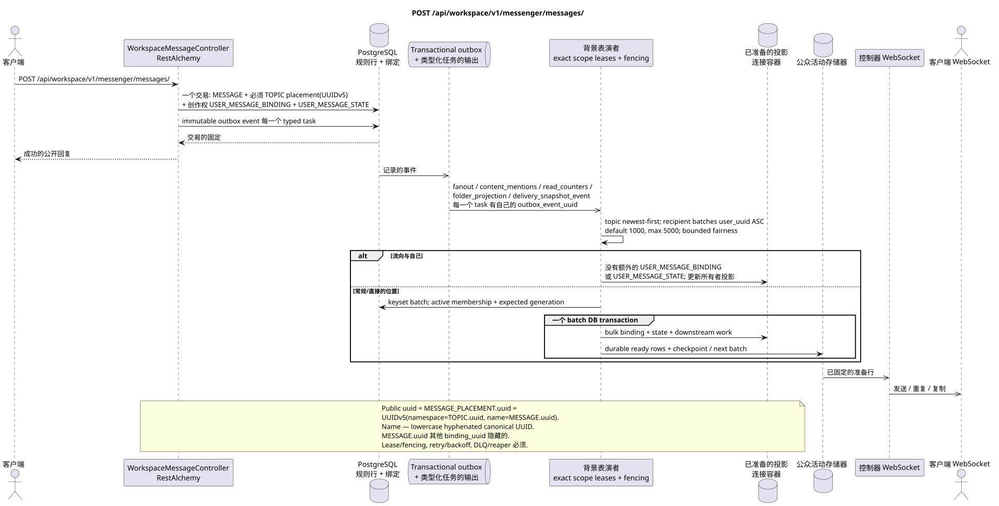

# POST /api/workspace/v1/messenger/messages/

[← 文件的主要索引](../../../../index.md) · [序列图表的索引](../../README.md) · [部分 Core Messenger](../README.md)

## 现有合同的地位和边界

目标规范是docs-first. 方法,路径,公开JSON和授权遵循当前的合同 [`workspace_api.md`](../../../../workspace_api.md); bounded pagination 并且异步可视性是单独的 target compatibility ADR.



可编辑的源: [`post_messages_create.puml`](diagrams/post_messages_create.puml).

## 操作

**方法和方式:** `POST /api/workspace/v1/messenger/messages/`

**目的:**创建一个可规性的标记下载信息,并进行其初始配置.

## 公开查询

```json
{
  "stream_uuid": "75309057-419c-4b12-a7c1-3932429ec4a6",
  "topic_uuid": "4ec0b996-b778-45f8-8ef4-ef863be0c047",
  "payload": {
    "kind": "markdown",
    "content": "Привет, Workspace"
  }
}
```

## 成功的公众回应

HTTP `201`:

```json
{
  "uuid": "a93dca35-3061-4748-bda4-7f6f8c660ea5",
  "project_id": "22222222-2222-2222-2222-222222222222",
  "stream_uuid": "75309057-419c-4b12-a7c1-3932429ec4a6",
  "topic_uuid": "4ec0b996-b778-45f8-8ef4-ef863be0c047",
  "author_uuid": "11111111-1111-1111-1111-111111111111",
  "payload": {
    "kind": "markdown",
    "content": "Привет, Workspace"
  },
  "user_uuid": "11111111-1111-1111-1111-111111111111",
  "read": true,
  "pinned": false,
  "starred": false,
  "is_own": true,
  "mentioned": false,
  "reactions": {},
  "reaction_users": {},
  "source_name": "native",
  "source": {
    "kind": "native"
  },
  "provider": null,
  "delivery": null,
  "created_at": "2026-06-22T10:10:00Z",
  "updated_at": "2026-06-22T10:10:00Z"
}
```

## 公众错误

需要 bearer-token IAM 和项目域. 错误的 UUID 或请求体返回 HTTP `400`;该区域缺少或无法访问的资源 `404`. 标准的文档化验证错误体:

```json
{
  "type": "ValidationErrorException",
  "code": 400,
  "message": "Validation error occurred."
}
```

缺少主题或缺少主题默认显示`400001007` (`StreamDefaultTopicNotConfiguredError`); 边框空格删除后,markdown 必须包含 1 到 40,000 个符号.

## 目标边界 RestAlchemy

```python
from restalchemy.api import controllers
from restalchemy.api import resources
from restalchemy.dm import models
from restalchemy.dm import properties
from restalchemy.dm import types
from restalchemy.storage.sql import orm


class WorkspaceUserMessage(models.ModelWithProject, orm.SQLStorableMixin):
    __tablename__ = "messenger_api_user_messages_v1"

    binding_uuid = properties.property(types.UUID(), id_property=True)
    uuid = properties.property(types.UUID(), read_only=True)
    stream_uuid = properties.property(types.UUID(), read_only=True)
    topic_uuid = properties.property(types.UUID(), read_only=True)
    author_uuid = properties.property(types.UUID(), read_only=True)
    user_uuid = properties.property(types.UUID(), read_only=True)


class WorkspaceMessageController(controllers.BaseResourceControllerPaginated):
    __resource__ = resources.ResourceByRAModel(
        WorkspaceUserMessage, convert_underscore=False, process_filters=True,
    )
```

公开 `uuid` 和路由 ID 等于 `MESSAGE_PLACEMENT.uuid`,计算为 `UUIDv5(namespace=TOPIC.uuid, name=MESSAGE.uuid)`;名字  低写 加号 UUID. `MESSAGE.uuid` 内, `binding_uuid` 隐藏. `topic_uuid` 物理强制;公开 null/omission 首先在 canonical default topic.

## 同步交易

1. 检查流和主题的当前访问量.
2. 插入一个 `MESSAGE`.
3. 计算确定位置 UUID 并插入一个 `MESSAGE_PLACEMENT`; retry 同一个 topic/message 双重返回相同的 UUID.
4. 插入作者 `USER_MESSAGE_BINDING` 和
   `USER_MESSAGE_STATE (read=true)`.
5. 在同一交易中添加一个独立的不变的Outbox事件
   引出的 initial typed task.

同步交易仅限于集合 `MESSAGE` +
`MESSAGE_PLACEMENT` + 创作者 `USER_MESSAGE_BINDING` + 创作者
`USER_MESSAGE_STATE` + transactional outbox.

## 类型化任务和后台执行器

任务: `fanout`, `content_mentions`, `read_counters`, `folder_projection` 和,
适用时,提供商 `delivery_snapshot_event`;每个都有
自己的 source outbox event.

机槽只占用 `(project_id, topic_uuid)`,处理
`MESSAGE.created_at DESC`, 接收者 immutable keyset 按
`user_uuid ASC`: default `1000`, hard maximum `5000`, 没有 `OFFSET` 和 unbounded
transaction. 每个批次都会重新检查 active membership/generation,
原子式写 binding/state,下游工作和ready events,然后 checkpoint;
retry 只有重复batch. Stale task 不使用;self-chat 不添加
第二套.

## 公共活动和 WebSocket

Worker 原子式地固定投影, ready `message.created`/
`topic.updated`/`stream.updated` rows. Dispatcher 已经送来了 durable events.

## 具有能力,种族和可见的时间特征

规范内容存储在一个副本中; UUIDv5
它们会重复的进行. (`201` =
primary commit), 收件/投影可能会落后;大约一秒 — SLO intent,
限制性公平性不会让大众取代旧的作品..

[← 文件的主要索引](../../../../index.md) · [序列图表的索引](../../README.md) · [部分 Core Messenger](../README.md)
