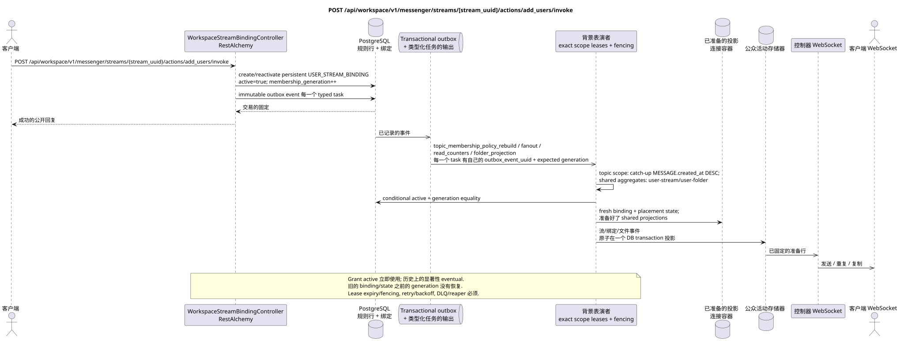

# POST /api/workspace/v1/messenger/streams/{stream_uuid}/actions/add_users/invoke

[← 文件的主要索引](../../../../index.md) · [序列图表的索引](../../README.md) · [部分 Core Messenger](../README.md)

## 现有合同的地位和边界

目标规范是docs-first. 方法,路径,公开JSON和授权遵循当前的合同 [`workspace_api.md`](../../../../workspace_api.md); bounded pagination 并且异步可视性是单独的 target compatibility ADR.



可编辑的源: [`post_stream_add_users_action.puml`](diagrams/post_stream_add_users_action.puml).

## 操作

**方法和方式:** `POST /api/workspace/v1/messenger/streams/{stream_uuid}/actions/add_users/invoke`

**目的:** 将用户按角色分组到普通流中.

## 公开查询

```json
{
  "member": [
    "33333333-3333-3333-3333-333333333333",
    "44444444-4444-4444-4444-444444444444"
  ],
  "owner": [
    "55555555-5555-5555-5555-555555555555"
  ]
}
```

## 成功的公众回应

HTTP `200`:

```json
[
  {
    "uuid": "3195a887-da5d-440b-bdf8-0d3d995a9e01",
    "project_id": "22222222-2222-2222-2222-222222222222",
    "stream_uuid": "75309057-419c-4b12-a7c1-3932429ec4a6",
    "user_uuid": "33333333-3333-3333-3333-333333333333",
    "who_uuid": "11111111-1111-1111-1111-111111111111",
    "role": "member",
    "notification_mode": "all_messages",
    "notification_updated_at": "1970-01-01T00:00:00Z",
    "created_at": "2026-06-22T09:05:00Z",
    "updated_at": "2026-06-22T09:05:00Z"
  },
  {
    "uuid": "4295a887-da5d-440b-bdf8-0d3d995a9e02",
    "project_id": "22222222-2222-2222-2222-222222222222",
    "stream_uuid": "75309057-419c-4b12-a7c1-3932429ec4a6",
    "user_uuid": "44444444-4444-4444-4444-444444444444",
    "who_uuid": "11111111-1111-1111-1111-111111111111",
    "role": "member",
    "notification_mode": "all_messages",
    "notification_updated_at": "1970-01-01T00:00:00Z",
    "created_at": "2026-06-22T09:05:00Z",
    "updated_at": "2026-06-22T09:05:00Z"
  }
]
```

## 公众错误

需要 bearer-token IAM 和项目域. 错误的 UUID 或请求体返回 HTTP `400`;该区域缺少或无法访问的资源 `404`. 标准的文档化验证错误体:

```json
{
  "type": "ValidationErrorException",
  "code": 400,
  "message": "Validation error occurred."
}
```

不支持的角色返回`400001004`;用户不以列表形式`400001005`;改变直流或流本身的成员 — `400`.

## 目标边界 RestAlchemy

```python
from restalchemy.api import controllers
from restalchemy.api import resources
from restalchemy.dm import models
from restalchemy.dm import properties
from restalchemy.dm import types
from restalchemy.storage.sql import orm


class WorkspaceStreamBindingView(
    models.ModelWithUUID,
    models.ModelWithProject,
    orm.SQLStorableMixin,
):
    __tablename__ = "messenger_api_stream_bindings_v1"

    stream_uuid = properties.property(types.UUID(), read_only=True)
    user_uuid = properties.property(types.UUID(), read_only=True)
    who_uuid = properties.property(types.UUID(), read_only=True)


class WorkspaceStreamBindingController(controllers.BaseResourceControllerPaginated):
    __resource__ = resources.ResourceByRAModel(
        WorkspaceStreamBindingView, convert_underscore=False, process_filters=True,
    )
```

公开的实体引用是以 `types.UUID()` 标量属性,而不是以 RestAlchemy 关系为序列,这些关系在 URI 中进行序列化.物理列 `*_uuid` 仍然是具有明显选择的引用完整性操作的索引外部键. USER_STREAM_BINDING 独特于 `(project_id, stream_uuid, user_uuid)`,并且可以物理存储已完成的计数器,但其当前的公开 JSON 绑定没有改变..

## 同步交易

1. 检查常规流中的角色访问权限.
2. 创建一个 persistent `USER_STREAM_BINDING` 的每个用户
   `active = true` 和初始的 `membership_generation` 或重新启动
   tombstone, 之前增加 generation; `who_uuid` 等于当前
   旧一代不会再被使用..
3. 添加每一个输出事件的immutable transactional outbox事件 typed
   task; 一个事件与另一个事件不相干.

影响状态:包 USER_STREAM_BINDING 和 transactional outbox.

## 类型化任务和后台执行器

任务: 单独 immutable `topic_membership_policy_rebuild`, `fanout`,
`read_counters` 和 `folder_projection`;每个任务都有自己的 source
`outbox_event_uuid`, exact scope key 预期的 `membership_generation` 在那里,
结果取决于 membership.

答案是,会员会员会员会员会员会员会员会员会员会员会员会员会员会员会员会员会员会员会员会员会员会员会员会员会员会员会员会员会员会员会员会员会员会员会员会员会员会员会员会员会员会员会员会员会员会员会员会员会员会员会员会员会员会员会员会员会员会员会员会员会员会员会员会员会员会员会员会员会员会员会员会员会员会员会员会员会员会员会员会员会员会员会员会员会员会员会员会员会员会员会员会员会员会员会员会员会员会员会员会员会员会员会员会员会员会员会员会员会员会员会员会员会员会员会员会员会员会员会员会员会员会员会员会员会员会员会员会员会员会员会员会员会员会员
标题范围的工作者创建 fresh
`USER_MESSAGE_BINDING` + placement-scoped `USER_MESSAGE_STATE` 如果
membership 保持活跃,生成一致;stale task 执行 no-op.
Shared aggregates 其他所有者更新 `user-stream`/`user-folder`.
所有任务都使用lease/fencing,retry/backoff,DLQ/reaper和imedpotent
effect guard. 旧的 bindings/state 已被自动删除
它们变得可见..

## 公共活动和 WebSocket

新用户使用`stream.created`对于现有的`stream_bindings.created`文件更新.

## 具有能力,种族和可见的时间特征

唯一的流和用户关键和单调的生成控制
积极的会员会立即回应,
消息/主题可视性在投影 commit 之后,并且只有
然后生出 ready WebSocket events.

[← 文件的主要索引](../../../../index.md) · [序列图表的索引](../../README.md) · [部分 Core Messenger](../README.md)
