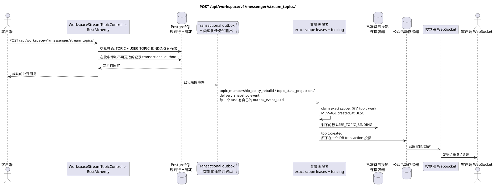

# POST /api/workspace/v1/messenger/stream_topics/


总目标可靠性变量:每个 immutable outbox 事件都会产生一个唯一的 immutable typed task `outbox_event_uuid`;并无 coalescing. Task 存储实际的 exact scope key,使用 lease/fencing, retry/backoff, max attempts/DLQ, reaper 和 idempotent effect guard. Topic scope 仅适用于 placement/message-binding work; shared rows 不会在 topic.

[← 文件的主要索引](../../../../index.md) · [序列图表的索引](../../README.md) · [部分 Core Messenger](../README.md)

## 现有合同的地位和边界

目标规范是docs-first. 方法,路径,公开JSON和授权遵循当前的合同 [`workspace_api.md`](../../../../workspace_api.md); bounded pagination 并且异步可视性是单独的 target compatibility ADR.



可编辑的源: [`post_stream_topics_create.puml`](diagrams/post_stream_topics_create.puml).

## 操作

**方法和方式:** `POST /api/workspace/v1/messenger/stream_topics/`

**目的:** 创建一个定律主题.

## 公开查询

```json
{
  "name": "Релизы",
  "stream_uuid": "75309057-419c-4b12-a7c1-3932429ec4a6"
}
```

## 成功的公众回应

HTTP `201`:

```json
{
  "uuid": "4ec0b996-b778-45f8-8ef4-ef863be0c047",
  "project_id": "22222222-2222-2222-2222-222222222222",
  "name": "Релизы",
  "stream_uuid": "75309057-419c-4b12-a7c1-3932429ec4a6",
  "user_uuid": "11111111-1111-1111-1111-111111111111",
  "color": 4491468,
  "last_message_uuid": "a93dca35-3061-4748-bda4-7f6f8c660ea5",
  "unread_count": 2,
  "active_unread_count": 2,
  "passive_unread_count": 0,
  "is_default": false,
  "is_done": false,
  "notification_mode": "default",
  "summary": null,
  "summary_last_message_uuid": null,
  "summary_has_new_messages": null,
  "summary_enabled": true,
  "summary_system_prompt": null,
  "summary_reasoning_effort": null,
  "source_name": "native",
  "source": {
    "kind": "native"
  },
  "provider": null,
  "delivery": null,
  "created_at": "2026-06-22T09:10:00Z",
  "updated_at": "2026-06-22T10:10:00Z"
}
```

## 公众错误

需要 bearer-token IAM 和项目域. 错误的 UUID 或请求体返回 HTTP `400`;该区域缺少或无法访问的资源 `404`. 标准的文档化验证错误体:

```json
{
  "type": "ValidationErrorException",
  "code": 400,
  "message": "Validation error occurred."
}
```

## 目标边界 RestAlchemy

```python
from restalchemy.api import controllers
from restalchemy.api import resources
from restalchemy.dm import models
from restalchemy.dm import properties
from restalchemy.dm import types
from restalchemy.storage.sql import orm


class WorkspaceUserTopic(
    models.ModelWithUUID,
    models.ModelWithProject,
    orm.SQLStorableMixin,
):
    __tablename__ = "messenger_api_user_topics_v1"

    stream_uuid = properties.property(types.UUID(), read_only=True)
    user_uuid = properties.property(types.UUID(), read_only=True)
    last_message_uuid = properties.property(types.UUID(), read_only=True)
    summary_last_message_uuid = properties.property(types.UUID(), read_only=True)


class WorkspaceStreamTopicController(controllers.BaseResourceControllerPaginated):
    __resource__ = resources.ResourceByRAModel(
        WorkspaceUserTopic, convert_underscore=False, process_filters=True,
    )
```

实体的公共引用是用标量属性表示的.`types.UUID()`而不是关系.RestAlchemy它们的序列化URI实体列`*_uuid`仍然是被索引的外部密钥,具有明显的引用完整性操作.TOPIC作为一个规范的实质; 独特的USER_TOPIC_BINDING提供可见性,个人状态和主题计时器.

## 同步交易

1. 检查流程的绑定.
2. 插入创建者 TOPIC 和 USER_TOPIC_BINDING.
3. 添加单独的 immutable 输出箱事件
   `topic_membership_policy_rebuild`, `topic_state_projection` 其他
   `delivery_snapshot_event` tasks.

影响状态: TOPIC,创建者绑定和 transactional outbox.

## 类型化任务和后台执行器

任务: 单独 `topic_membership_policy_rebuild`,
`topic_state_projection` 和 `delivery_snapshot_event`,每个为自己的
source outbox event.

每个用户 `USER_TOPIC_BINDING` 创建一个单独的 immutable
task scope `user-topic`; placement/message work 新的主题使用 scope
`topic`. 一个围所有者写出了"精确密钥",不同的范围并行.

## 公共活动和 WebSocket

`topic.created` 通过控制器.

## 具有能力,种族和可见的时间特征

定律行是唯一的,主题和用户的绑定是唯一的;创建者立即看到结果,其他用户和事件异步.

[← 文件的主要索引](../../../../index.md) · [序列图表的索引](../../README.md) · [部分 Core Messenger](../README.md)
