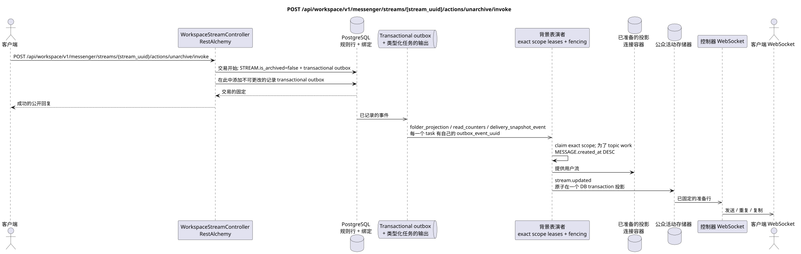

# POST /api/workspace/v1/messenger/streams/{stream_uuid}/actions/unarchive/invoke


总目标可靠性变量:每个 immutable outbox 事件都会产生一个唯一的 immutable typed task `outbox_event_uuid`;并无 coalescing. Task 存储实际的 exact scope key,使用 lease/fencing, retry/backoff, max attempts/DLQ, reaper 和 idempotent effect guard. Topic scope 仅适用于 placement/message-binding work; shared rows 不会在 topic.

[← 文件的主要索引](../../../../index.md) · [序列图表的索引](../../README.md) · [部分 Core Messenger](../README.md)

## 现有合同的地位和边界

目标规范是docs-first. 方法,路径,公开JSON和授权遵循当前的合同 [`workspace_api.md`](../../../../workspace_api.md); bounded pagination 并且异步可视性是单独的 target compatibility ADR.



可编辑的源: [`post_stream_unarchive_action.puml`](diagrams/post_stream_unarchive_action.puml).

## 操作

**方法和方式:** `POST /api/workspace/v1/messenger/streams/{stream_uuid}/actions/unarchive/invoke`

**目的:** 设置定律的意义 `is_archived=false`.

## 公开查询

没有身体 JSON.

## 成功的公众回应

HTTP `200`:

```json
{
  "uuid": "75309057-419c-4b12-a7c1-3932429ec4a6",
  "name": "Инженерия",
  "description": "Инженерное пространство",
  "project_id": "22222222-2222-2222-2222-222222222222",
  "owner": "11111111-1111-1111-1111-111111111111",
  "user_uuid": "11111111-1111-1111-1111-111111111111",
  "role": "owner",
  "notification_mode": "all_messages",
  "unread_count": 2,
  "active_unread_count": 2,
  "passive_unread_count": 0,
  "source_name": "native",
  "source": {
    "kind": "native"
  },
  "invite_only": false,
  "announce": false,
  "private": false,
  "is_archived": false,
  "color": 3368601,
  "last_message_uuid": "a93dca35-3061-4748-bda4-7f6f8c660ea5",
  "default_topic_uuid": "4ec0b996-b778-45f8-8ef4-ef863be0c047",
  "created_at": "2026-06-22T09:00:00Z",
  "updated_at": "2026-06-22T10:15:00Z"
}
```

## 公众错误

需要 bearer-token IAM 和项目域. 错误的 UUID 或请求体返回 HTTP `400`;该区域缺少或无法访问的资源 `404`. 标准的文档化验证错误体:

```json
{
  "type": "ValidationErrorException",
  "code": 400,
  "message": "Validation error occurred."
}
```

## 目标边界 RestAlchemy

```python
from restalchemy.api import controllers
from restalchemy.api import resources
from restalchemy.dm import models
from restalchemy.dm import properties
from restalchemy.dm import types
from restalchemy.storage.sql import orm


class WorkspaceUserStream(
    models.ModelWithUUID,
    models.ModelWithProject,
    orm.SQLStorableMixin,
):
    __tablename__ = "messenger_api_user_streams_v1"

    owner = properties.property(types.UUID(), read_only=True)
    user_uuid = properties.property(types.UUID(), read_only=True)
    direct_user_uuid = properties.property(
        types.AllowNone(types.UUID()), default=None, read_only=True,
    )
    last_message_uuid = properties.property(types.UUID(), read_only=True)
    default_topic_uuid = properties.property(types.UUID(), read_only=True)


class WorkspaceStreamController(controllers.BaseResourceControllerPaginated):
    __resource__ = resources.ResourceByRAModel(
        WorkspaceUserStream, convert_underscore=False, process_filters=True,
    )
```

公开的实体引用是由 `types.UUID()` 的标量属性,而不是 RestAlchemy 的关系,这些属性串行到 URI.物理列 `*_uuid` 仍然是具有明显选择的引用完整性操作的索引外部键.公开字段 `owner` 是 UUID 的属性;物理字段 `owner_uuid`  是用户的索引外部键. USER_STREAM_BINDING 存储了已备用的流量级数量..

## 同步交易

1. 允许和检查权限.
2. 设置 STREAM.is_archived=false.
3. 只有在更改时添加一个独立的immutable outbox event
   结果是 `folder_projection`, `read_counters` 和
   `delivery_snapshot_event` task.

影响状态: STREAM 和 transactional outbox.

## 类型化任务和后台执行器

任务:单独的 `folder_projection`, `read_counters` 和
`delivery_snapshot_event`, 每个人都为自己的 source outbox event.

用户/provider的投影得到了单独的 immutable tasks
`user-stream`/`user-folder`/provider scopes. Topic worker shared rows 他没有写;
一个fenced owner拥有 exact key.

## 公共活动和 WebSocket

`stream.updated` 对于用户来说.

## 具有能力,种族和可见的时间特征

恢复状态安全;调用者会立即看到结果,事件异步.

[← 文件的主要索引](../../../../index.md) · [序列图表的索引](../../README.md) · [部分 Core Messenger](../README.md)
