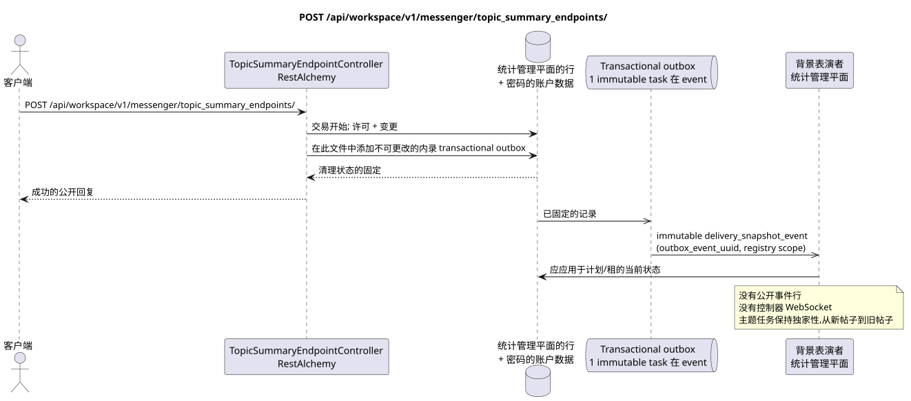

# POST /api/workspace/v1/messenger/topic_summary_endpoints/

[← 文件的主要索引](../../../../index.md) · [序列图表的索引](../../README.md) · [部分 Core Messenger](../README.md)

## 现有合同的地位和边界

目标规格是 docs-first. HTTP-合同仍然是当前合同 [`workspace_api.md`](../../../../workspace_api.md); 目标内部机制仅仅是建议.



可编辑的源: [`post_topic_summary_endpoints_create.puml`](diagrams/post_topic_summary_endpoints_create.puml).

## 操作

**方法和方式:** `POST /api/workspace/v1/messenger/topic_summary_endpoints/`

**目的:** 创建一个全球的结尾点,只能使用记录的帐户数据.

## 公开查询

```json
{
  "uuid": "e4ad6d80-6bc7-4a91-864c-8e97319a82bd",
  "name": "primary-summary-model",
  "base_url": "https://llm.example.com/v1",
  "model": "summary-model",
  "api_key": "<учётные данные только для записи>",
  "enabled": true,
  "priority": 10,
  "supports_vision": true,
  "supports_reasoning": true,
  "temperature": 0.2,
  "max_output_tokens": 512,
  "top_p": 1,
  "presence_penalty": 0,
  "frequency_penalty": 0
}
```

## 成功的公众回应

HTTP `201`:

```json
{
  "uuid": "e4ad6d80-6bc7-4a91-864c-8e97319a82bd",
  "name": "primary-summary-model",
  "base_url": "https://llm.example.com/v1",
  "model": "summary-model",
  "enabled": true,
  "priority": 10,
  "supports_vision": true,
  "supports_reasoning": true,
  "temperature": 0.2,
  "max_output_tokens": 512,
  "top_p": 1,
  "presence_penalty": 0,
  "frequency_penalty": 0,
  "credential_present": true,
  "failure_count": 0,
  "created_at": "2026-06-22T08:00:00Z",
  "updated_at": "2026-06-22T08:00:00Z"
}
```

状态和错误标记字段可能在回复中缺失,如果允许`null`并具有这个值. `api_key`和活跃请求代币永远不会返回.

## 公众错误

需要持有者代币 IAM. 错误的 UUID 或请求体返回 HTTP `400`; 没有管理权限  `403`. 标准验证错误体:

```json
{
  "type": "ValidationErrorException",
  "code": 400,
  "message": "Validation error occurred."
}
```

对于每个具有终点注册的操作,需要 `workspace.topic_summary_endpoint.manage`;缺失的终点给出 `404`.

## 目标边界 RestAlchemy

```python
from restalchemy.api import controllers
from restalchemy.api import resources
from restalchemy.dm import models
from restalchemy.dm import properties
from restalchemy.dm import types
from restalchemy.storage.sql import orm


class WorkspaceTopicSummaryEndpoint(
    models.ModelWithUUID,
    models.ModelWithTimestamp,
    orm.SQLStorableMixin,
):
    __tablename__ = "messenger_topic_summary_endpoints"

    name = properties.property(types.String(max_length=255), required=True)
    base_url = properties.property(types.String(max_length=2048), required=True)
    model = properties.property(types.String(max_length=255), required=True)
    credential_present = properties.property(types.Boolean(), read_only=True)


class TopicSummaryEndpointController(controllers.BaseResourceControllerPaginated):
    __resource__ = resources.ResourceByRAModel(
        WorkspaceTopicSummaryEndpoint,
        convert_underscore=False,
        process_filters=True,
    )
```

这个全球资源没有公开的实体关系字段.它的公开字段`uuid`  scalar 属性UUID.任何内部外部密钥或数据引用都会被索引并具有明确的引用完整性作用;`api_key`仅可用于写作,存储在加密中,从未被串行..

## 同步交易

1. 要求 `workspace.topic_summary_endpoint.manage`.
2. 检查UUID,OpenAI兼容的基础URL和生成范围.
3. 加密和保存帐户数据,然后插入终点.
4. 在此中添加不可更改的内录 transactional outbox.

## 类型化任务和后台执行器

独立的 immutable `delivery_snapshot_event` task 从 exact scope 寄存器
源外框事件的终点; unique `outbox_event_uuid`,没有
coalescing.

控制平面任务更新了合适的终点和它们的租.它本身不处理MESSAGE;后续的总结主题工作仍然是专属主题的,从新消息到旧消息.

## 公众事件,重复和时间特征

客户端立即获得清除的终点; 没有创建公共事件Workspace或记录WebSocket. 重复冲突UUID遵循当前创建语义; 账户数据从未进入日志,事件或答案.

没有一个已准备的公共事件 Workspace,因此管理员 WebSocket 不参与此操作.

[← 文件的主要索引](../../../../index.md) · [序列图表的索引](../../README.md) · [部分 Core Messenger](../README.md)
