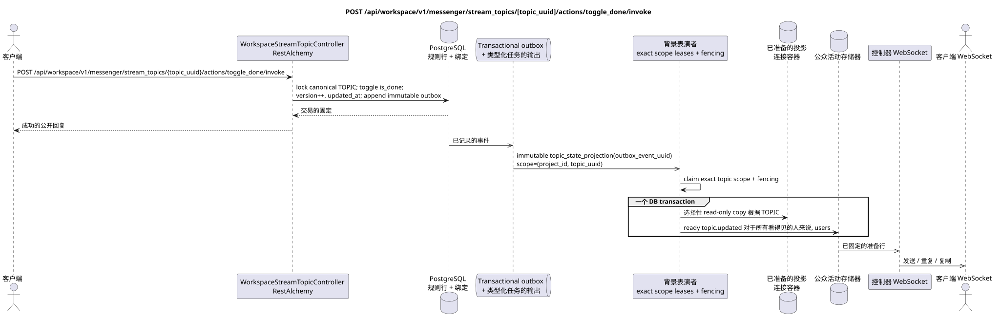

# POST /api/workspace/v1/messenger/stream_topics/{topic_uuid}/actions/toggle_done/invoke

[← 文件的主要索引](../../../../index.md) · [序列图表的索引](../../README.md) · [部分 Core Messenger](../README.md)

## 现有合同的地位和边界

目标规范是docs-first. 方法,路径,公开JSON和授权遵循当前的合同 [`workspace_api.md`](../../../../workspace_api.md); bounded pagination 并且异步可视性是单独的 target compatibility ADR.



可编辑的源: [`post_topic_toggle_done_action.puml`](diagrams/post_topic_toggle_done_action.puml).

## 操作

**方法和方式:** `POST /api/workspace/v1/messenger/stream_topics/{topic_uuid}/actions/toggle_done/invoke`

**目的:** 切换总结标志.

## 公开查询

没有身体 JSON.

## 成功的公众回应

HTTP `200`:

```json
{
  "uuid": "4ec0b996-b778-45f8-8ef4-ef863be0c047",
  "project_id": "22222222-2222-2222-2222-222222222222",
  "name": "Релизы",
  "stream_uuid": "75309057-419c-4b12-a7c1-3932429ec4a6",
  "user_uuid": "11111111-1111-1111-1111-111111111111",
  "color": 4491468,
  "last_message_uuid": "a93dca35-3061-4748-bda4-7f6f8c660ea5",
  "unread_count": 2,
  "active_unread_count": 2,
  "passive_unread_count": 0,
  "is_default": false,
  "is_done": true,
  "notification_mode": "default",
  "summary": null,
  "summary_last_message_uuid": null,
  "summary_has_new_messages": null,
  "summary_enabled": true,
  "summary_system_prompt": null,
  "summary_reasoning_effort": null,
  "source_name": "native",
  "source": {
    "kind": "native"
  },
  "provider": null,
  "delivery": null,
  "created_at": "2026-06-22T09:10:00Z",
  "updated_at": "2026-06-22T10:20:00Z"
}
```

## 公众错误

需要 bearer-token IAM 和项目域. 错误的 UUID 或请求体返回 HTTP `400`;该区域缺少或无法访问的资源 `404`. 标准的文档化验证错误体:

```json
{
  "type": "ValidationErrorException",
  "code": 400,
  "message": "Validation error occurred."
}
```

## 目标边界 RestAlchemy

```python
from restalchemy.api import controllers
from restalchemy.api import resources
from restalchemy.dm import models
from restalchemy.dm import properties
from restalchemy.dm import types
from restalchemy.storage.sql import orm


class WorkspaceUserTopic(
    models.ModelWithUUID,
    models.ModelWithProject,
    orm.SQLStorableMixin,
):
    __tablename__ = "messenger_api_user_topics_v1"

    stream_uuid = properties.property(types.UUID(), read_only=True)
    user_uuid = properties.property(types.UUID(), read_only=True)
    last_message_uuid = properties.property(types.UUID(), read_only=True)
    summary_last_message_uuid = properties.property(types.UUID(), read_only=True)


class WorkspaceStreamTopicController(controllers.BaseResourceControllerPaginated):
    __resource__ = resources.ResourceByRAModel(
        WorkspaceUserTopic, convert_underscore=False, process_filters=True,
    )
```

实体的公共引用是用标量属性表示的.`types.UUID()`而不是关系.RestAlchemy它们的序列化URI实体列`*_uuid`仍然是被索引的外部密钥,具有明显的引用完整性操作.TOPIC作为一个规范的实质; 独特的USER_TOPIC_BINDING提供可见性,个人状态和主题计时器.

## 同步交易

1. 允许 project-scoped topic 和 active stream membership; 检查一次
   authorization 在交易中.
2. 锁定可定 `TOPIC` 行,原子切换 `TOPIC.is_done`,
   放大 `TOPIC.version` 并更新 `updated_at`.
3. 在同一个Outbox中添加immutable `topic_state_projection`事件
   交易和返回视图,其中`is_done`从读取 canonical `TOPIC`.

需要的权威状态:仅可定式 `TOPIC` 和 transactional
outbox. `USER_TOPIC_BINDING` 存储 access/notification/counts,而不是
writable source `is_done`; `USER_MESSAGE_STATE` 这个命令不会改变.

## 类型化任务和后台执行器

任务:一个不可变的 `topic_state_projection` source event, scope
`topic (project_id,topic_uuid)`. Fenced owner 创建了准备的 `topic.updated`
rows; 如果测量后,只读副本`is_done`出现在 view/binding中,它
只是从 canonical `TOPIC` 中重建它. ready event rows
它们都被一个DB交易所记录./backoff, DLQ/reaper其他 idempotent effect
通过 `outbox_event_uuid` 必须.

## 公共活动和 WebSocket

`topic.updated` 管理员将为所有用户提供固定的已完成的行..

## 具有能力,种族和可见的时间特征

Row lock/version 如果您的数据被丢失, transaction
如果没有解决,服务器会返回现有的错误;
transport retry 客户端首先读取canonical state,然后不重复 toggle
调用者可以看到canonical state,即将到来的事件.

[← 文件的主要索引](../../../../index.md) · [序列图表的索引](../../README.md) · [部分 Core Messenger](../README.md)
