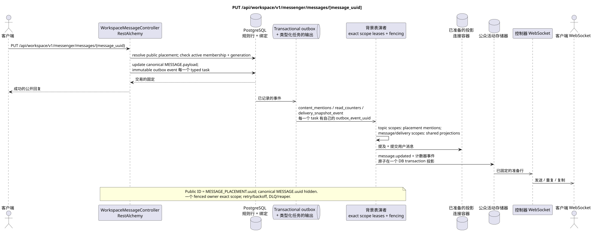

# PUT /api/workspace/v1/messenger/messages/{message_uuid}

[← 文件的主要索引](../../../../index.md) · [序列图表的索引](../../README.md) · [部分 Core Messenger](../README.md)

## 现有合同的地位和边界

目标规范是docs-first. 方法,路径,公开JSON和授权遵循当前的合同 [`workspace_api.md`](../../../../workspace_api.md); bounded pagination 并且异步可视性是单独的 target compatibility ADR.



可编辑的源: [`put_message.puml`](diagrams/put_message.puml).

## 操作

**方法和方式:** `PUT /api/workspace/v1/messenger/messages/{message_uuid}`

**目的:** 通过作者检查和访问后替换正文的收益负载.

## 公开查询

```json
{
  "payload": {
    "kind": "markdown",
    "content": "Отредактированный текст"
  }
}
```

## 成功的公众回应

HTTP `200`:

```json
{
  "uuid": "a93dca35-3061-4748-bda4-7f6f8c660ea5",
  "project_id": "22222222-2222-2222-2222-222222222222",
  "stream_uuid": "75309057-419c-4b12-a7c1-3932429ec4a6",
  "topic_uuid": "4ec0b996-b778-45f8-8ef4-ef863be0c047",
  "author_uuid": "11111111-1111-1111-1111-111111111111",
  "payload": {
    "kind": "markdown",
    "content": "Отредактированный текст"
  },
  "user_uuid": "11111111-1111-1111-1111-111111111111",
  "read": true,
  "pinned": false,
  "starred": false,
  "is_own": true,
  "mentioned": false,
  "reactions": {},
  "reaction_users": {},
  "source_name": "native",
  "source": {
    "kind": "native"
  },
  "provider": null,
  "delivery": null,
  "created_at": "2026-06-22T10:10:00Z",
  "updated_at": "2026-06-22T10:11:00Z"
}
```

## 公众错误

需要 bearer-token IAM 和项目域. 错误的 UUID 或请求体返回 HTTP `400`;该区域缺少或无法访问的资源 `404`. 标准的文档化验证错误体:

```json
{
  "type": "ValidationErrorException",
  "code": 400,
  "message": "Validation error occurred."
}
```

## 目标边界 RestAlchemy

```python
from restalchemy.api import controllers
from restalchemy.api import resources
from restalchemy.dm import models
from restalchemy.dm import properties
from restalchemy.dm import types
from restalchemy.storage.sql import orm


class WorkspaceUserMessage(models.ModelWithProject, orm.SQLStorableMixin):
    __tablename__ = "messenger_api_user_messages_v1"

    binding_uuid = properties.property(types.UUID(), id_property=True)
    uuid = properties.property(types.UUID(), read_only=True)
    stream_uuid = properties.property(types.UUID(), read_only=True)
    topic_uuid = properties.property(types.UUID(), read_only=True)
    author_uuid = properties.property(types.UUID(), read_only=True)
    user_uuid = properties.property(types.UUID(), read_only=True)


class WorkspaceMessageController(controllers.BaseResourceControllerPaginated):
    __resource__ = resources.ResourceByRAModel(
        WorkspaceUserMessage, convert_underscore=False, process_filters=True,
    )
```

公共`uuid`路由标识符等于`MESSAGE_PLACEMENT.uuid = UUIDv5(namespace=TOPIC.uuid, name=MESSAGE.uuid)`; name — lowercase hyphenated canonical UUID圣经中的`MESSAGE.uuid`国内;`binding_uuid`技术上,这仍然是隐藏的.ORM控制器允许放置并同时检查活跃会员以及匹配 generation.

## 同步交易

1. 通过适用绑定允许 public placement UUID, active membership 和 generation.
2. 检查作者.
3. 更新 MESSAGE.payload.
4. 添加单独的 immutable 输出箱事件
   `content_mentions`, `read_counters` 其他 `delivery_snapshot_event` tasks.

影响状态: MESSAGE 和交易户箱; 位置仍然是链接.

## 类型化任务和后台执行器

任务: `content_mentions`,条件 `read_counters`, `delivery_snapshot_event`.

Topic-scoped workers 阅读最新的canonical content并更新
placement-scoped mentions 在 `MESSAGE.created_at DESC`; canonical/delivery 和
container shared rows 它们可以得到不同的精确范围. outbox event
一个 immutable task;一个fenced owner 键入 exact key,而 topic
worker 没有 unsafe read-modify-write shared rows.

## 公共活动和 WebSocket

`message.updated` 通过管理器更改了容器行.

## 具有能力,种族和可见的时间特征

每个Outbox事件都有一个独立的Immutable任务;处理器是`outbox_event_uuid`的.调用者可以看到内容,投影和事件.

[← 文件的主要索引](../../../../index.md) · [序列图表的索引](../../README.md) · [部分 Core Messenger](../README.md)
