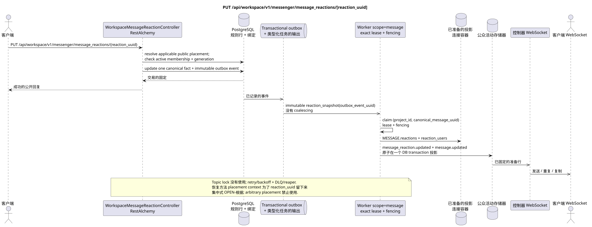

# PUT /api/workspace/v1/messenger/message_reactions/{reaction_uuid}

[← 文件的主要索引](../../../../index.md) · [序列图表的索引](../../README.md) · [部分 Core Messenger](../README.md)

## 现有合同的地位和边界

目标规范是docs-first. 方法,路径,公开JSON和授权遵循当前的合同 [`workspace_api.md`](../../../../workspace_api.md); bounded pagination 并且异步可视性是单独的 target compatibility ADR.



可编辑的源: [`put_message_reaction.puml`](diagrams/put_message_reaction.puml).

## 操作

**方法和方式:** `PUT /api/workspace/v1/messenger/message_reactions/{reaction_uuid}`

**目的:**更新当前用户的反应.

## 公开查询

```json
{
  "emoji_name": "heart"
}
```

## 成功的公众回应

HTTP `200`:

```json
{
  "uuid": "bd4b7632-8788-435a-93cc-6873657335c6",
  "project_id": "22222222-2222-2222-2222-222222222222",
  "message_uuid": "a93dca35-3061-4748-bda4-7f6f8c660ea5",
  "user_uuid": "11111111-1111-1111-1111-111111111111",
  "emoji_name": "heart",
  "provider": null,
  "delivery": null,
  "created_at": "2026-06-22T10:12:00Z",
  "updated_at": "2026-06-22T10:13:00Z"
}
```

## 公众错误

需要 bearer-token IAM 和项目域. 错误的 UUID 或请求体返回 HTTP `400`;该区域缺少或无法访问的资源 `404`. 标准的文档化验证错误体:

```json
{
  "type": "ValidationErrorException",
  "code": 400,
  "message": "Validation error occurred."
}
```

## 目标边界 RestAlchemy

```python
from restalchemy.api import controllers
from restalchemy.api import resources
from restalchemy.dm import models
from restalchemy.dm import properties
from restalchemy.dm import types
from restalchemy.storage.sql import orm


class WorkspaceMessageReactionView(
    models.ModelWithUUID,
    models.ModelWithProject,
    orm.SQLStorableMixin,
):
    __tablename__ = "messenger_api_message_reactions_v1"

    message_uuid = properties.property(types.UUID(), read_only=True)
    canonical_message_uuid = properties.property(types.UUID(), read_only=True)
    user_uuid = properties.property(types.UUID(), read_only=True)


class WorkspaceMessageReactionController(controllers.BaseResourceControllerPaginated):
    __resource__ = resources.ResourceByRAModel(
        WorkspaceMessageReactionView, convert_underscore=False, process_filters=True,
    )
```

公众 `message_uuid`  标杆式 UUID 放置;内部
`canonical_message_uuid` 隐藏了域权限.UUID根据第2条
物理链接仍然是FK索引,而
提供商/交付的原始元数据已关闭.

## 同步交易

1. 恢复用户所属的实例,适用公开 placement
   检查 active stream membership + matching generation.
2. 更新一个值 emoji.
3. 在此中添加一个独立的immutable事件 transactional outbox; derived task
   唯一的 `outbox_event_uuid`.

影响状态:反应和交易出箱; 没有查询的总记录 JSON.

## 类型化任务和后台执行器

任务:一个独立的不可变的 `reaction_snapshot` source event; coalescing
没有.

Fenced owner scope `message` 通过现实情况重建图像; topic
lock 租到期,重试/backoff,DLQ和收获器提供
故障后恢复.

## 公共活动和 WebSocket

`message_reaction.updated` 之前的字段,然后 `message.updated` 给观察者.

## 具有能力,种族和可见的时间特征

唯一的关键是允许比赛;会员身份检查即时创建
deny boundary. 业主立即获得事实,照片和事件 —
路线只包含`reaction_uuid`,所以保存和
返回它在多个可见的公共位置上下文 placements
仍然是一个集中式的 OPEN 解决方案;隐藏的绑定或任意
primary placement 没有人能选择. global reaction
semantics.

[← 文件的主要索引](../../../../index.md) · [序列图表的索引](../../README.md) · [部分 Core Messenger](../README.md)
