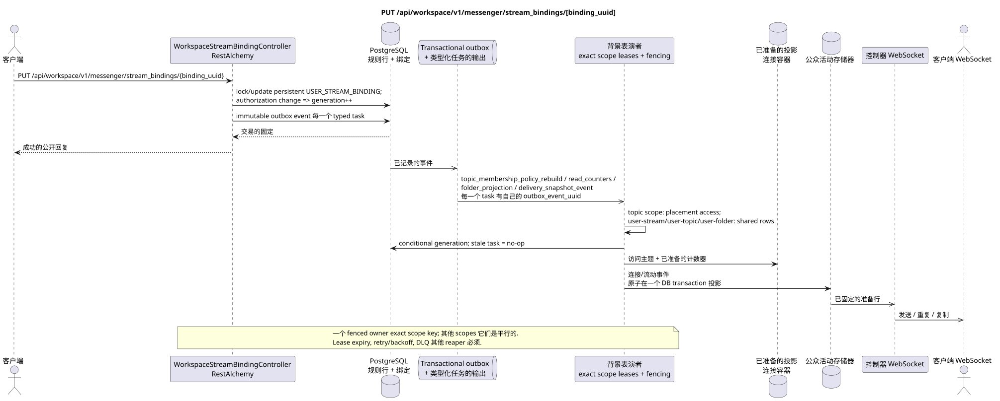

# PUT /api/workspace/v1/messenger/stream_bindings/{binding_uuid}

[← 文件的主要索引](../../../../index.md) · [序列图表的索引](../../README.md) · [部分 Core Messenger](../README.md)

## 现有合同的地位和边界

目标规范是docs-first. 方法,路径,公开JSON和授权遵循当前的合同 [`workspace_api.md`](../../../../workspace_api.md); bounded pagination 并且异步可视性是单独的 target compatibility ADR.



可编辑的源: [`put_stream_binding.puml`](diagrams/put_stream_binding.puml).

## 操作

**方法和方式:** `PUT /api/workspace/v1/messenger/stream_bindings/{binding_uuid}`

**目的:**更新常规绑定通知的角色或状态.

## 公开查询

```json
{
  "role": "moderator",
  "notification_mode": "mentions_only",
  "notification_updated_at": "2026-06-22T10:17:00Z"
}
```

## 成功的公众回应

HTTP `200`:

```json
{
  "uuid": "3195a887-da5d-440b-bdf8-0d3d995a9e01",
  "project_id": "22222222-2222-2222-2222-222222222222",
  "stream_uuid": "75309057-419c-4b12-a7c1-3932429ec4a6",
  "user_uuid": "33333333-3333-3333-3333-333333333333",
  "who_uuid": "11111111-1111-1111-1111-111111111111",
  "role": "moderator",
  "notification_mode": "mentions_only",
  "notification_updated_at": "2026-06-22T10:17:00Z",
  "created_at": "2026-06-22T09:05:00Z",
  "updated_at": "2026-06-22T10:17:00Z"
}
```

## 公众错误

需要 bearer-token IAM 和项目域. 错误的 UUID 或请求体返回 HTTP `400`;该区域缺少或无法访问的资源 `404`. 标准的文档化验证错误体:

```json
{
  "type": "ValidationErrorException",
  "code": 400,
  "message": "Validation error occurred."
}
```

更新直接流或流与自己绑定 `400`.

## 目标边界 RestAlchemy

```python
from restalchemy.api import controllers
from restalchemy.api import resources
from restalchemy.dm import models
from restalchemy.dm import properties
from restalchemy.dm import types
from restalchemy.storage.sql import orm


class WorkspaceStreamBindingView(
    models.ModelWithUUID,
    models.ModelWithProject,
    orm.SQLStorableMixin,
):
    __tablename__ = "messenger_api_stream_bindings_v1"

    stream_uuid = properties.property(types.UUID(), read_only=True)
    user_uuid = properties.property(types.UUID(), read_only=True)
    who_uuid = properties.property(types.UUID(), read_only=True)


class WorkspaceStreamBindingController(controllers.BaseResourceControllerPaginated):
    __resource__ = resources.ResourceByRAModel(
        WorkspaceStreamBindingView, convert_underscore=False, process_filters=True,
    )
```

公开的实体引用是以 `types.UUID()` 标量属性,而不是以 RestAlchemy 关系为序列,这些关系在 URI 中进行序列化.物理列 `*_uuid` 仍然是具有明显选择的引用完整性操作的索引外部键. USER_STREAM_BINDING 独特于 `(project_id, stream_uuid, user_uuid)`,并且可以物理存储已完成的计数器,但其当前的公开 JSON 绑定没有改变..

## 同步交易

1. 恢复和授权绑定.
2. 更新一个 persistentUSER_STREAM_BINDING. 如果变更影响
   authorization/membership, 增加 `membership_generation`;只有一
   改变通知设置 generation 不会重新使用 surrogate
   version.
3. 添加一个独立的immutable transactional outbox事件 typed
   task 实际领域.

影响状态: USER_STREAM_BINDING 和 transactional outbox.

## 类型化任务和后台执行器

任务: 单独 immutable `topic_membership_policy_rebuild`,
`read_counters`, `folder_projection` 和 `delivery_snapshot_event`,每个是
根据自己的源 `outbox_event_uuid`,精确的范围键
membership — 预期的 generation.

Topic-scoped worker 只使用到placements/bindings主题的访问;
user-stream/user-topic/user-folder scope workers 更新共享组件.
同时输入一个fenced owner exact key;stale generation 执行 no-op.
Task lifecycle 包含 retry/backoff,DLQ 和 reaper.

## 公共活动和 WebSocket

影响的连接和流程事件.

## 具有能力,种族和可见的时间特征

唯一的会员密钥,行锁和代号, 防止比赛.
视觉上可以看到一次,投影和事件异步; ready event 仅显示
原子化在一个DB交易与相应的投影.

[← 文件的主要索引](../../../../index.md) · [序列图表的索引](../../README.md) · [部分 Core Messenger](../README.md)
