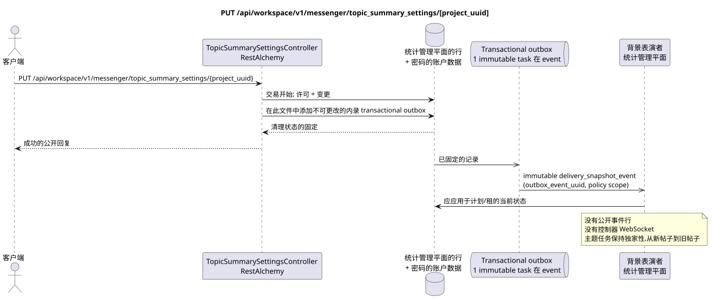

# PUT /api/workspace/v1/messenger/topic_summary_settings/{project_uuid}

[← 文件的主要索引](../../../../index.md) · [序列图表的索引](../../README.md) · [部分 Core Messenger](../README.md)

## 现有合同的地位和边界

目标规格是 docs-first. HTTP-合同仍然是当前合同 [`workspace_api.md`](../../../../workspace_api.md); 目标内部机制仅仅是建议.



可编辑的源: [`put_topic_summary_settings.puml`](diagrams/put_topic_summary_settings.puml).

## 操作

**方法和方式:** `PUT /api/workspace/v1/messenger/topic_summary_settings/{project_uuid}`

**目的:** 设置两个包含主题摘要的条件.

## 公开查询

```json
{
  "global_enabled": true,
  "project_enabled": true
}
```

## 成功的公众回应

HTTP `200`:

```json
{
  "project_id": "12345678-1234-4234-8234-123456789abc",
  "global_enabled": true,
  "project_enabled": true
}
```

状态和错误标记字段可能在回复中缺失,如果允许`null`并具有这个值. `api_key`和活跃请求代币永远不会返回.

## 公众错误

需要持有者代币 IAM. 错误的 UUID 或请求体返回 HTTP `400`; 没有管理权限  `403`. 标准验证错误体:

```json
{
  "type": "ValidationErrorException",
  "code": 400,
  "message": "Validation error occurred."
}
```

如果 UUID 在路径上与 IAM 项目不一致,则返回 `403`; GET 要求项目成员,而 PUT  管理权限.

## 目标边界 RestAlchemy

```python
from restalchemy.api import controllers
from restalchemy.api import resources
from restalchemy.dm import models
from restalchemy.dm import properties
from restalchemy.dm import types
from restalchemy.storage.sql import orm


class WorkspaceTopicSummarySettings(
    models.ModelWithProject,
    orm.SQLStorableMixin,
):
    __tablename__ = "messenger_topic_summary_settings"

    project_id = properties.property(types.UUID(), id_property=True, read_only=True)
    global_enabled = properties.property(types.Boolean(), default=False)
    project_enabled = properties.property(types.Boolean(), default=False)


class TopicSummarySettingsController(controllers.BaseResourceController):
    __resource__ = resources.ResourceByRAModel(
        WorkspaceTopicSummarySettings,
        convert_underscore=False,
        process_filters=True,
    )
```

公共字段`project_id`  标量性质UUID,而不是关系形式URI. 物理索引的外部键为项目Workspace具有明确的引用完整性作用. UUID的路径必须与项目语境相匹配 IAM.

## 同步交易

1. 要求项目与 IAM 项目之间的路径和权限一致 `workspace.topic_summary_settings.manage`.
2. 在同一行中设置两个逻辑条件.
3. 在此中添加不可更改的内录 transactional outbox.

## 类型化任务和后台执行器

单独的 immutable `delivery_snapshot_event` task 与 exact scope 政策
源Outbox事件的概要 计划相关项目; unique
`outbox_event_uuid`, 没有 coalescing.

后台执行器可以根据最后的条件值启用或取消计划.实际的汇总生成仍然是 `(project_id, topic_uuid)` 的独家,有限,并处理新到旧的正规消息.

## 公众事件,重复和时间特征

打开条件的回复即时返回;计划和取消是异步和无效的. 公共事件Workspace和发送WebSocket未定义.

没有一个已准备的公共事件 Workspace,因此管理员 WebSocket 不参与此操作.

[← 文件的主要索引](../../../../index.md) · [序列图表的索引](../../README.md) · [部分 Core Messenger](../README.md)
