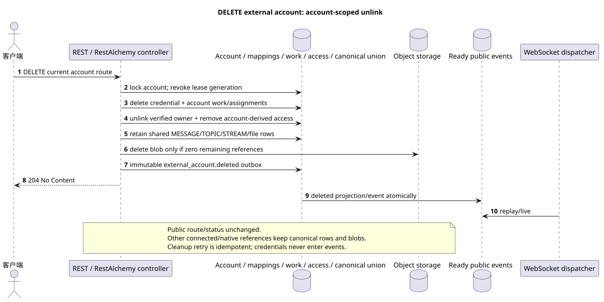

# 删除外部帐户

[← 文件的主要索引](../../../../index.md) ·
[序列图表的索引](../../README.md) ·
[外部集成部分/runtime](../README.md)

`DELETE /api/workspace/v1/messenger/external_accounts/{account_uuid}`

删除帐户凭证和帐户范围的连接/访问,保存 shared
canonical provider data, 其他人都可以使用 connected accounts.



[可编辑的源 PlantUML](diagrams/delete_external_account.puml)

## 查询

除了上面的变量路径,没有其他查询参数.

没有尸体,不要发送虚构的物体. JSON.

## 成功的答案

`204 No Content`; 答案体 JSON 没有.

## 错误

| HTTP | 公众行为 |
| --- | --- |
| `403` | 没有 `workspace.external_account.delete` 权限,或者资源在未经授权的区域. |
| `404` | 给定的区域中的资源不存在或看不到. |
| `400` | 对于不允许的路径值,查询参数或身体,使用标准验证错误 RESTAlchemy. |

验证错误体示例:

```json
{
  "type": "ValidationErrorException",
  "code": 400,
  "message": "Validation error occurred."
}
```

## 边界 RestAlchemy

资源/控制器的目标广告 (报价文件,非生产代码)):

```python
class ExternalAccount(models.ModelWithUUID, models.ModelWithTimestamp, orm.SQLStorableMixin):
    __tablename__ = "m_external_accounts_v2"

    owner_user_uuid = properties.property(types.UUID(), required=True)
    settings = properties.property(EXTERNAL_ACCOUNT_SETTINGS_TYPE, required=True)
    status = properties.property(types.Enum(ACCOUNT_STATUSES), read_only=True)
    capabilities = properties.property(types.Dict(), read_only=True)
    revision = properties.property(types.Integer(min_value=1), read_only=True)


class ExternalAccountController(controllers.BaseResourceControllerPaginated):
    __resource__ = resources.ResourceByRAModel(
        ExternalAccount, hidden_fields=["owner_user_uuid"]
    )
```

`owner_user_uuid` 隐藏; 公开`settings.default_project_id`是一个直角.UUID它们的物质在目标存储器中被索引.`owner_user_uuid`引用用户Workspace没有`ON DELETE CASCADE`已被提取的,而已被索引的.`default_project_uuid`项目与 项目`ON DELETE RESTRICT`序列化时,最后一个仍然被投资于`settings`公共广告RestAlchemy没有使用.`relationships.relationship`为了JSON在表格中UUID因为关系是这样的.URI在物理图的边界上,每个规范的非聚态连接`*_uuid`是一个具有明确选择的引用操作的索引外部密钥. 清洁器隐藏了所有者,帐户数据,原始提供商ID,密钥证书,内部地址和原始协议字段.

## 同步交易

1. 验证查询,确定域,检查分辨率/体,并找到指数密钥的正则行.
2. 封锁帐户,撤销租生成,删除 credential,
   account assignments/mappings/queued work 其他 account-derived bindings/access;
   解除 verified identity 的权限,并写 immutable 删除外框.
3. 在存在时不要删除 shared canonical messages/topics/streams/files
   其他提供商/native access/reference;仅在删除后才能删除 physical blob
   已被证明的 zero-reference check.
4. 只有在交易完成后返回回复; provider/network cleanup 不
   在它内部执行.

## 背景处理,事件和一致性

类型化 `delivery_snapshot_event` 服务 exact external-account
scope 已经准备好了.`external_account.deleted`; cleanup provider生命周期仍然是
通过稳定的背景工作,而不是计算. request path.

背景处理器在一个DB交易中记录了实质化的状态和完整图像的完整封面`external_account.deleted`;两个效果是共同提交或滚回. 在提交之后,单独的管理器WebSocket发送,重复和播放; API/worker不拥有客户端连接.

客户端可见的一致性: HTTP 204 表示 account 已从
公共图片,并且他的访问不再授权阅读. Shared canonical
history 留给其他帐户; 凭证从来没有进入 event.
这是一个不变的 public route/status下,并且不同于 accepted target semantics
更多的信息来自旧的 destructive product text.:
[`zulip_bridge/account_lifecycle_and_identity.md`](../../../../zulip_bridge/account_lifecycle_and_identity.md#delete-accepted-target-semantics).

## 具有能力和并行性

UUID 客户端创建时创建一个帐户;业务独特性允许一个帐户 `(owner_user_uuid, provider_kind)`. 帐户数据的密码文本是单独存储的,永远不会串行..

重复者使用稳定的商业密钥和当前的原始状态.每个 immutable outbox 事件创建一个单独的任务,具有独特的 `outbox_event_uuid`;该任务的重复交付必须是具有进量,没有 coalescing. 专有处理主题Messenger从新条目到旧条目只适用于当所涉及的正规位置确实与`(project_id, topic_uuid)`有关; 提供者管理/阅读操作不创建人工主题,也不属于这一排队.

## 他们的来源

- [`workspace_api.md`](../../../../workspace_api.md) — 有权威的公共路线,一般JSON,页面,活动和合同 WebSocket.
- [`zulip_bridge_v1_product_and_api.md`](../../../../zulip_bridge_v1_product_and_api.md) — 外部资源的清洁生命周期,许可和提供商语义.

[← 文件的主要索引](../../../../index.md) ·
[序列图表的索引](../../README.md) ·
[外部集成部分/runtime](../README.md)
