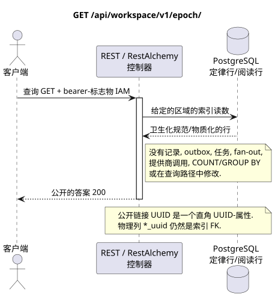

# 获取当前事件时代

[← 文件的主要索引](../../../../index.md) ·
[序列图表的索引](../../README.md) ·
[外部集成部分/runtime](../README.md)

`GET /api/workspace/v1/epoch/`

返回可见的最后一个标签和已验证用户的下存边界.



[可编辑的源 PlantUML](diagrams/get_epoch.puml)

## 查询

除了上面的变量路径,没有其他查询参数.

没有尸体,不要发送虚构的物体. JSON.

## 成功的答案

HTTP `200`:

```json
{
  "epoch_version": 124,
  "epoch_generation": "781203",
  "current_epoch_version": 124,
  "minimum_epoch_version": 37
}
```

## 错误

| HTTP | 公众行为 |
| --- | --- |
| `400` | 对于不允许的路径值,查询参数或身体,使用标准验证错误 RESTAlchemy. |

验证错误体示例:

```json
{
  "type": "ValidationErrorException",
  "code": 400,
  "message": "Validation error occurred."
}
```

## 边界 RestAlchemy

资源/控制器的目标广告 (报价文件,非生产代码)):

```python
class WorkspaceEpoch(models.Model, orm.SQLStorableMixin):
    # Read-only, calculation-free view rooted in one physical event-cursor row.
    __tablename__ = "m_workspace_epoch_view"

    project_id = properties.property(types.UUID(), required=True)
    user_uuid = properties.property(types.UUID(), required=True)
    epoch_generation = properties.property(types.String(min_length=1), read_only=True)
    epoch_version = properties.property(types.Integer(min_value=0), read_only=True)
    current_epoch_version = properties.property(types.Integer(min_value=0), read_only=True)
    minimum_epoch_version = properties.property(types.Integer(min_value=1), read_only=True)

    @classmethod
    def get_id_property(cls) -> dict[str, typing.Any]:
        return {
            "project_id": cls.properties.properties["project_id"],
            "user_uuid": cls.properties.properties["user_uuid"],
        }


class WorkspaceEpochController(controllers.BaseResourceController):
    __resource__ = resources.ResourceByRAModel(
        WorkspaceEpoch,
        hidden_fields=["project_id", "user_uuid"],
    )

    def filter(self, filters, order_by=None):
        del filters, order_by
        return WorkspaceEpoch.objects.get_one(
            filters={
                "project_id": dm_filters.EQ(self.get_context().project_id),
                "user_uuid": dm_filters.EQ(self.get_context().user_uuid),
            }
        )
```

视图显示一个索引的事件指针物理行,一个公共回复行,并设置一个代号`epoch_version <- current_epoch_version`;它不进行事件记录的聚合.隐藏的组合身份`(project_id, user_uuid)`是RestAlchemy行的技术身份,而不是公共身份JSON.两个物理列UUID索引的外部密钥是`ON DELETE CASCADE`.公共广告RestAlchemy不使用`relationships.relationship`为JSON以UUID的形式,因为关系是串行的 URI.

## 同步交易

1. 验证请求并确定项目/用户域 IAM.
2. 检查路径,请求设置和所需的权限.
3. 执行一个索引读取,保留从正则行或预先物质化的读取表面的区域.
4. 仅将扫描的公共字段串行.

读取交易不会写出box域,类型化投影任务,想要状态命令或准备好公开事件.在请求期间,它不会执行`COUNT`,`GROUP BY`,相关子查询,粉丝-out绑定,提供商调用或缓存修复.

## 背景处理,事件和一致性

投影类型任务:没有.

没有一个已准备的公共事件 Workspace 创建,因此单独的管理员 WebSocket 没有什么可提供.

客户可见的一致性:没有额外的延迟; 答案是权威的记录图片.

## 具有能力和并行性

`epoch_version` 在 `epoch_generation` 中单调; `(epoch_generation, epoch_version)` 是播放/标志器的同一性.

重复者使用稳定的商业密钥和当前的原始状态.每个 immutable outbox 事件创建一个单独的任务,具有独特的 `outbox_event_uuid`;该任务的重复交付必须是具有进量,没有 coalescing. 专有处理主题Messenger从新条目到旧条目只适用于当所涉及的正规位置确实与`(project_id, topic_uuid)`有关; 提供者管理/阅读操作不创建人工主题,也不属于这一排队.

## 他们的来源

- [`workspace_api.md`](../../../../workspace_api.md) — 有权威的公共路线,一般JSON,页面,活动和合同 WebSocket.
- [`zulip_bridge_v1_product_and_api.md`](../../../../zulip_bridge_v1_product_and_api.md) — 外部资源的清洁生命周期,许可和提供商语义.

[← 文件的主要索引](../../../../index.md) ·
[序列图表的索引](../../README.md) ·
[外部集成部分/runtime](../README.md)
