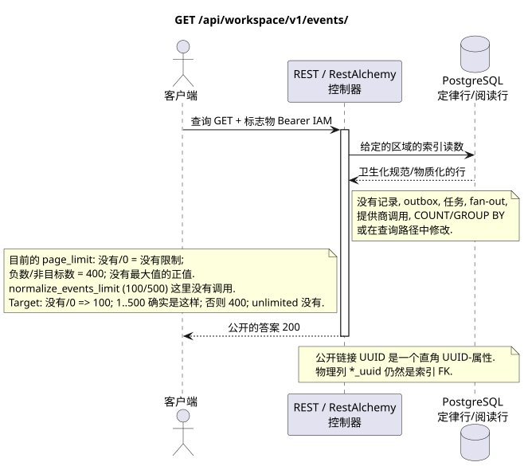

# 持续事件列表 Workspace

[← 文件的主要索引](../../../../index.md) ·
[序列图表的索引](../../README.md) ·
[外部集成和执行时间的分类](../README.md)

`GET /api/workspace/v1/events/`

返回当前用户可见的稳定事件后以时代的增长顺序.



[可编辑的源 PlantUML](diagrams/get_events.puml)

## 查询

查询参数合同:

- `epoch_version>` (编码为URL,以`epoch_version%3E`) 整数标签
- `epoch_generation` 伴随着每个非零指针
- 整数 `page_limit`; `page_marker`  时代的整数版本
- 其他记录的类型化事件过器 AIP-160 `q`

现行实现中的 `page_limit` 行为:没有参数或 `0` 表示
无限的选择;负数或不整数值 HTTP `400`;
任何正值都没有最大值和限制
代码库中有一个辅助功能.
`normalize_events_limit` 设置为 `100` 和 `500` 的默认值,但
控制者是这个.HTTP它们是不是在运行中引起的,所以这些数字不是
目标策略:没有/`0` => `100`; `1..500` 准确接受;负,不整和 `>500` => HTTP `400` 没有. marker.

没有尸体,不要发送虚构的物体. JSON.

## 成功的答案

HTTP `200`:

```json
[
  {
    "schema_version": 1,
    "uuid": "5bb95582-b4f3-4de1-bf84-f0244910fc82",
    "epoch_version": 124,
    "project_id": "00000000-0000-4000-8000-000000000001",
    "user_uuid": "3f433fee-b27f-4c67-98bd-31fe4df42cc8",
    "object_type": "external_account",
    "action": "updated",
    "created_at": "2026-07-17T12:12:00Z",
    "updated_at": "2026-07-17T12:12:00Z",
    "payload": {
      "kind": "external_account.updated",
      "uuid": "0d4ae1d0-30ad-4d15-bf26-5789e8406201",
      "snapshot": {
        "uuid": "0d4ae1d0-30ad-4d15-bf26-5789e8406201",
        "settings": {
          "kind": "zulip",
          "server_url": "https://zulip.example.invalid",
          "email": "owner@example.invalid",
          "selection_mode": "explicit",
          "history_depth": "30_days",
          "default_project_id": "00000000-0000-4000-8000-000000000001"
        },
        "credential_present": true,
        "status": "live",
        "live_ready": true,
        "safe_error": null,
        "capabilities": {},
        "desired_generation": 7,
        "applied_generation": 7,
        "last_progress_at": "2026-07-17T12:00:00Z",
        "created_at": "2026-07-17T11:00:00Z",
        "updated_at": "2026-07-17T12:00:00Z",
        "revision": 7
      }
    }
  }
]
```

## 错误

| HTTP | 公众行为 |
| --- | --- |
| `410` | `EventsCursorExpiredError` 没有/改变后代,未来光标或被删除后时,用 `Cache-Control: no-store`. |
| `400` | 对于不允许的路径值,查询参数或身体,使用标准验证错误 RESTAlchemy. |

验证错误体示例:

```json
{
  "type": "ValidationErrorException",
  "code": 400,
  "message": "Validation error occurred."
}
```

标签过期时的答案体:

```json
{
  "type": "EventsCursorExpiredError",
  "code": 410,
  "error": "epoch_pruned",
  "message": "The event cursor is outside the retained suffix.",
  "reason": "epoch_pruned",
  "epoch_generation": "781203",
  "current_epoch_version": 124,
  "minimum_epoch_version": 37
}
```

## 边界 RestAlchemy

资源/控制器的目标广告 (报价文件,非生产代码)):

```python
class WorkspaceEvent(models.ModelWithUUID, models.ModelWithTimestamp, orm.SQLStorableMixin):
    __tablename__ = "m_workspace_events"

    epoch_version = properties.property(types.Integer(min_value=1), required=True)
    project_id = properties.property(types.UUID(), required=True)
    user_uuid = properties.property(types.AllowNone(types.UUID()), default=None)
    object_type = properties.property(types.String(), required=True)
    action = properties.property(types.String(), required=True)
    payload = properties.property(types.Dict(), required=True)


class WorkspaceEventController(controllers.BaseResourceControllerPaginated):
    __resource__ = resources.ResourceByRAModel(WorkspaceEvent)
    # Scope by project/user or stored compact audience before indexed keyset read.
```

`uuid`, `project_id`, `user_uuid` 并且 UUID 在实用负载图片内是标数值UUID. 索引`project_id`事件和允许`null` `user_uuid`引用其可定区域行列`ON DELETE CASCADE`; UUID,复制到不可变JSON实用负载,是事件数据,而不是关系列,因此不被串行为URI,并且不被认为是有效的外部密钥.公共广告RestAlchemy不使用`relationships.relationship`用于JSON的形式UUID,因为关系串行为URI.在物理图的边界,每个可定非聚合性连接`*_uuid`都是一个显然选择的链接作用的索引外部密钥. 卫生机隐藏了所有者,账户,原始供应商ID,密码证书,内部地址和原始协议字段.

## 同步交易

1. 验证请求并确定项目/用户域 IAM.
2. 检查路径,请求设置和所需的权限.
3. 执行一个索引读取,保留从正则行或预先物质化的读取表面的区域.
4. 仅将扫描的公共字段串行.

读取交易不会写出box域,类型化投影任务,想要状态命令或准备好公开事件.在请求期间,它不会执行`COUNT`,`GROUP BY`,相关子查询,粉丝-out绑定,提供商调用或缓存修复.

## 背景处理,事件和一致性

投影类型任务:没有.

没有一个已准备的公共事件 Workspace 创建,因此单独的管理员 WebSocket 没有什么可提供.

客户可见的一致性:没有额外的延迟; 答案是权威的记录图片.

## 具有能力和并行性

`epoch_version` 在 `epoch_generation` 中单调; `(epoch_generation, epoch_version)` 是播放/标志器的同一性.

重复者使用稳定的商业密钥和当前的原始状态.每个 immutable outbox 事件创建一个单独的任务,具有独特的 `outbox_event_uuid`;该任务的重复交付必须是具有进量,没有 coalescing. 专有处理主题Messenger从新条目到旧条目只适用于当所涉及的正规位置确实与`(project_id, topic_uuid)`有关; 提供者管理/阅读操作不创建人工主题,也不属于这一排队.

## 他们的来源

- [`workspace_api.md`](../../../../workspace_api.md) — 有权威的公共路线,一般JSON,页面,活动和合同 WebSocket.
- [`zulip_bridge_v1_product_and_api.md`](../../../../zulip_bridge_v1_product_and_api.md) — 外部资源的清洁生命周期,许可和提供商语义.

[← 文件的主要索引](../../../../index.md) ·
[序列图表的索引](../../README.md) ·
[外部集成和执行时间的分类](../README.md)
