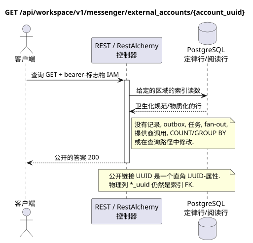

# 获取外部帐户

[← 文件的主要索引](../../../../index.md) ·
[序列图表的索引](../../README.md) ·
[外部集成部分/runtime](../README.md)

`GET /api/workspace/v1/messenger/external_accounts/{account_uuid}`

返回一个清理的帐户照片.



[可编辑的源 PlantUML](diagrams/get_external_account.puml)

## 查询

除了上面的变量路径,没有其他查询参数.

没有尸体,不要发送虚构的物体. JSON.

## 成功的答案

HTTP `200`:

```json
{
  "uuid": "0d4ae1d0-30ad-4d15-bf26-5789e8406201",
  "settings": {
    "kind": "zulip",
    "server_url": "https://zulip.example.invalid",
    "email": "owner@example.invalid",
    "selection_mode": "explicit",
    "history_depth": "30_days",
    "default_project_id": "00000000-0000-4000-8000-000000000001"
  },
  "credential_present": true,
  "status": "live",
  "live_ready": true,
  "safe_error": null,
  "capabilities": {},
  "desired_generation": 7,
  "applied_generation": 7,
  "last_progress_at": "2026-07-17T12:00:00Z",
  "created_at": "2026-07-17T11:00:00Z",
  "updated_at": "2026-07-17T12:00:00Z",
  "revision": 7
}
```

资源的审核答案包含严格的 `ETag: "<revision>"`.

## 错误

| HTTP | 公众行为 |
| --- | --- |
| `403` | 没有 `workspace.external_account.read` 权限,或者资源在未经授权的区域. |
| `404` | 给定的区域中的资源不存在或看不到. |
| `400` | 对于不允许的路径值,查询参数或身体,使用标准验证错误 RESTAlchemy. |

验证错误体示例:

```json
{
  "type": "ValidationErrorException",
  "code": 400,
  "message": "Validation error occurred."
}
```

## 边界 RestAlchemy

资源/控制器的目标广告 (报价文件,非生产代码)):

```python
class ExternalAccount(models.ModelWithUUID, models.ModelWithTimestamp, orm.SQLStorableMixin):
    __tablename__ = "m_external_accounts_v2"

    owner_user_uuid = properties.property(types.UUID(), required=True)
    settings = properties.property(EXTERNAL_ACCOUNT_SETTINGS_TYPE, required=True)
    status = properties.property(types.Enum(ACCOUNT_STATUSES), read_only=True)
    capabilities = properties.property(types.Dict(), read_only=True)
    revision = properties.property(types.Integer(min_value=1), read_only=True)


class ExternalAccountController(controllers.BaseResourceControllerPaginated):
    __resource__ = resources.ResourceByRAModel(
        ExternalAccount, hidden_fields=["owner_user_uuid"]
    )
```

`owner_user_uuid` 隐藏; 公开`settings.default_project_id`是一个直角.UUID它们的物质在目标存储器中被索引.`owner_user_uuid`引用用户Workspace没有`ON DELETE CASCADE`已被提取的,而已被索引的.`default_project_uuid`项目与 项目`ON DELETE RESTRICT`序列化时,最后一个仍然被投资于`settings`公共广告RestAlchemy没有使用.`relationships.relationship`为了JSON在表格中UUID因为关系是这样的.URI在物理图的边界上,每个规范的非聚态连接`*_uuid`是一个具有明确选择的引用操作的索引外部密钥. 清洁器隐藏了所有者,帐户数据,原始提供商ID,密钥证书,内部地址和原始协议字段.

## 同步交易

1. 验证请求并确定项目/用户域 IAM.
2. 检查路径,请求设置和所需的权限.
3. 执行一个索引读取,保留从正则行或预先物质化的读取表面的区域.
4. 仅将扫描的公共字段串行.

读取交易不会写出box域,类型化投影任务,想要状态命令或准备好公开事件.在请求期间,它不会执行`COUNT`,`GROUP BY`,相关子查询,粉丝-out绑定,提供商调用或缓存修复.

## 背景处理,事件和一致性

投影类型任务:没有.

没有一个已准备的公共事件 Workspace 创建,因此单独的管理员 WebSocket 没有什么可提供.

客户可见的一致性:没有额外的延迟; 答案是权威的记录图片.

## 具有能力和并行性

UUID 客户端创建时创建一个帐户;业务独特性允许一个帐户 `(owner_user_uuid, provider_kind)`. 帐户数据的密码文本是单独存储的,永远不会串行..

重复者使用稳定的商业密钥和当前的原始状态.每个 immutable outbox 事件创建一个单独的任务,具有独特的 `outbox_event_uuid`;该任务的重复交付必须是具有进量,没有 coalescing. 专有处理主题Messenger从新条目到旧条目只适用于当所涉及的正规位置确实与`(project_id, topic_uuid)`有关; 提供者管理/阅读操作不创建人工主题,也不属于这一排队.

## 他们的来源

- [`workspace_api.md`](../../../../workspace_api.md) — 有权威的公共路线,一般JSON,页面,活动和合同 WebSocket.
- [`zulip_bridge_v1_product_and_api.md`](../../../../zulip_bridge_v1_product_and_api.md) — 外部资源的清洁生命周期,许可和提供商语义.

[← 文件的主要索引](../../../../index.md) ·
[序列图表的索引](../../README.md) ·
[外部集成部分/runtime](../README.md)
