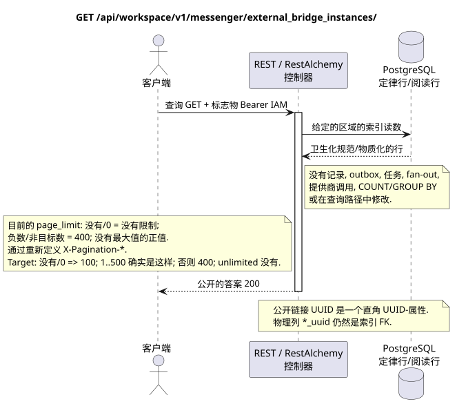

# 外桥副本列表

[← 文件的主要索引](../../../../index.md) ·
[序列图表的索引](../../README.md) ·
[外部集成和执行时间的分类](../README.md)

`GET /api/workspace/v1/messenger/external_bridge_instances/`

列出所有类型的服务提供商执行时间桥的清理身份.



[可编辑的源 PlantUML](diagrams/get_external_bridge_instances.puml)

## 查询

查询参数合同:

- 文件类型过器/AIP-160 `q`
- `page_limit`
- `page_marker` (UUID 最后一个副本)

现行实现中的 `page_limit` 行为:没有参数或 `0` 表示
无限的选择;负数或不整数值 HTTP `400`;
任何正值都没有最大值和限制
答案是:`ExternalResourceController`通过
标准标题`X-Pagination-*`目标政策:没有`0` => `100`; `1..500`它们的确有所接受; 负面,不完全,`>500` => HTTP `400`没有.无限制模式不存在;完全出口客户端将在下一个没有之前进行 marker.

没有尸体,不要发送虚构的物体. JSON.

## 成功的答案

HTTP `200`:

```json
[
  {
    "uuid": "6dd6741b-0d90-490a-8e51-749a411be1ad",
    "provider": "zulip",
    "identity_generation": 3,
    "status": "active",
    "capabilities": {},
    "last_heartbeat_at": "2026-07-17T12:11:00Z",
    "certificate_not_after": "2026-10-17T12:00:00Z",
    "safe_error": null,
    "revision": 8,
    "created_at": "2026-07-01T09:00:00Z",
    "updated_at": "2026-07-17T12:11:00Z"
  }
]
```

## 错误

| HTTP | 公众行为 |
| --- | --- |
| `403` | 没有 `workspace.external_bridge_instance.read` 权限,或者资源在未经授权的区域. |
| `400` | 对于不允许的路径值,查询参数或身体,使用标准验证错误 RESTAlchemy. |

验证错误体示例:

```json
{
  "type": "ValidationErrorException",
  "code": 400,
  "message": "Validation error occurred."
}
```

## 边界 RestAlchemy

资源/控制器的目标广告 (报价文件,非生产代码)):

```python
class ExternalBridgeInstance(models.ModelWithUUID, models.ModelWithTimestamp, orm.SQLStorableMixin):
    __tablename__ = "m_external_bridge_instances_v2"

    provider = properties.property(types.Enum(PROVIDER_KINDS), required=True)
    identity_generation = properties.property(types.Integer(min_value=1), required=True)
    status = properties.property(types.Enum(BRIDGE_STATUSES), read_only=True)
    capabilities = properties.property(types.Dict(), read_only=True)
    revision = properties.property(types.Integer(min_value=1), read_only=True)


class ExternalBridgeInstanceController(controllers.BaseResourceControllerPaginated):
    __resource__ = resources.ResourceByRAModel(ExternalBridgeInstance)
    # Dedicated IAM permission checks wrap standard indexed reads/actions.
```

UUID 资源的类型是其尺度初级密钥; 提供者类型是路径/域名的行密钥.UUID需要额外的外钥匙.RestAlchemy没有使用.`relationships.relationship`为了JSON在表格中UUID因为这种关系是以URI在物理图的边界上,每个规范的非聚态连接`*_uuid`是一个具有明确选择的引用操作的索引外部密钥. 清洁器隐藏了所有者,帐户数据,原始提供商ID,密钥证书,内部地址和原始协议字段.

## 同步交易

1. 验证请求并确定项目/用户域 IAM.
2. 检查路径,请求设置和所需的权限.
3. 执行一个索引读取,保留从正则行或预先物质化的读取表面的区域.
4. 仅将扫描的公共字段串行.

读取交易不会写出box域,类型化投影任务,想要状态命令或准备好公开事件.在请求期间,它不会执行`COUNT`,`GROUP BY`,相关子查询,粉丝-out绑定,提供商调用或缓存修复.

## 背景处理,事件和一致性

投影类型任务:没有.

没有一个已准备的公共事件 Workspace 创建,因此单独的管理员 WebSocket 没有什么可提供.

客户可见的一致性:没有额外的延迟; 答案是权威的记录图片.

## 具有能力和并行性

UUID 通过认证中心,我们可以确定身份的桥梁..

重复者使用稳定的商业密钥和当前的原始状态.每个 immutable outbox 事件创建一个单独的任务,具有独特的 `outbox_event_uuid`;该任务的重复交付必须是具有进量,没有 coalescing. 专有处理主题Messenger从新条目到旧条目只适用于当所涉及的正规位置确实与`(project_id, topic_uuid)`有关; 提供者管理/阅读操作不创建人工主题,也不属于这一排队.

## 他们的来源

- [`workspace_api.md`](../../../../workspace_api.md) — 有权威的公共路线,一般JSON,页面,活动和合同 WebSocket.
- [`zulip_bridge_v1_product_and_api.md`](../../../../zulip_bridge_v1_product_and_api.md) — 外部资源的清洁生命周期,许可和提供商语义.

[← 文件的主要索引](../../../../index.md) ·
[序列图表的索引](../../README.md) ·
[外部集成和执行时间的分类](../README.md)
