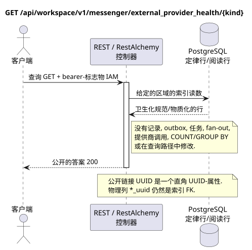

# 获取外部提供商的健康状况

[← 文件的主要索引](../../../../index.md) ·
[序列图表的索引](../../README.md) ·
[外部集成部分/runtime](../README.md)

`GET /api/workspace/v1/messenger/external_provider_health/{kind}`

阅读一个供应商类型的桥梁健康,帐户,聊天和交易的整合清理状态.



[可编辑的源 PlantUML](diagrams/get_external_provider_health.puml)

## 查询

除了上面的变量路径,没有其他查询参数.

没有尸体,不要发送虚构的物体. JSON.

## 成功的答案

HTTP `200`:

```json
{
  "provider": "zulip",
  "status": "healthy",
  "account_counts": {
    "live": 2
  },
  "chat_counts": {
    "live": 12
  },
  "bridge_counts": {
    "active": 1
  },
  "operation_counts": {
    "queued": 1,
    "failed": 0
  },
  "metrics": {
    "queue_depth": 1,
    "selected_chats": 12,
    "synchronized_messages": 4800,
    "synchronized_users": 93
  },
  "updated_at": "2026-07-17T12:12:30Z"
}
```

## 错误

| HTTP | 公众行为 |
| --- | --- |
| `403` | 没有 `workspace.external_provider_health.read` 权限,或者资源在未经授权的区域. |
| `400` | 对于不允许的路径值,查询参数或身体,使用标准验证错误 RESTAlchemy. |

验证错误体示例:

```json
{
  "type": "ValidationErrorException",
  "code": 400,
  "message": "Validation error occurred."
}
```

## 边界 RestAlchemy

资源/控制器的目标广告 (报价文件,非生产代码)):

```python
class ExternalProviderHealth(models.Model, orm.SQLStorableMixin):
    # Worker-maintained physical projection; public controller is read-only.
    __tablename__ = "m_external_provider_health_state_v1"

    provider = properties.property(types.Enum(PROVIDER_KINDS), required=True)
    status = properties.property(types.String(), read_only=True)
    account_counts = properties.property(types.Dict(), read_only=True)
    chat_counts = properties.property(types.Dict(), read_only=True)
    bridge_counts = properties.property(types.Dict(), read_only=True)
    operation_counts = properties.property(types.Dict(), read_only=True)
    metrics = properties.property(types.Dict(), read_only=True)
    updated_at = properties.property(types.UTCDateTimeZ(), read_only=True)

    @classmethod
    def get_id_property(cls) -> dict[str, typing.Any]:
        return {"provider": cls.properties.properties["provider"]}


class ExternalProviderHealthController(controllers.BaseResourceController):
    __resource__ = resources.ResourceByRAModel(ExternalProviderHealth)
    # GET by provider kind reads one pre-materialized row; writes are worker-only.
```

物理投影包含一个行为提供者视图,而`provider`同时是其独特的技术身份和公共路径密钥.后台工作者以无限强大的方式替换该行从固定的原始状态.公共控制器从未在查询时汇总帐户,聊天,桥梁,操作,消息或用户.计数器/指标卡没有资源关系或外部链接UUID.公共广告RestAlchemy不使用`relationships.relationship`为JSON以UUID的形式,因为关系 (relationship) 串行为URI. 卫生机隐藏了所有者,账户,原始供应商ID,密码证书,内部地址和原始协议字段.

## 同步交易

1. 验证请求并确定项目/用户域 IAM.
2. 检查路径,请求设置和所需的权限.
3. 执行一个索引读取,保留从正则行或预先物质化的读取表面的区域.
4. 仅将扫描的公共字段串行.

读取交易不会写出box域,类型化投影任务,想要状态命令或准备好公开事件.在请求期间,它不会执行`COUNT`,`GROUP BY`,相关子查询,粉丝-out绑定,提供商调用或缓存修复.

## 背景处理,事件和一致性

投影类型任务:没有.

没有一个已准备的公共事件 Workspace 创建,因此单独的管理员 WebSocket 没有什么可提供.

客户可见的一致性:答案读取了最近的预先体现的健康预测,并故意最终与心跳和排队一致.

## 具有能力和并行性

每个提供商都有一个物质化的投影.更新都能替代最后一个聚合图像..

重复者使用稳定的商业密钥和当前的原始状态.每个 immutable outbox事件创建一个单独的任务,具有独特的 `outbox_event_uuid`;重复传递该任务必须是具有进量,没有 coalescing. 专有处理主题Messenger从新条目到旧条目只适用于当所涉及的正规位置确实与`(project_id, topic_uuid)`有关;提供商的管理/阅读操作不会创建人工主题,也不会进入这个排队.

## 他们的来源

- [`workspace_api.md`](../../../../workspace_api.md) — 有权威的公共路线,一般JSON,页面,活动和合同 WebSocket.
- [`zulip_bridge_v1_product_and_api.md`](../../../../zulip_bridge_v1_product_and_api.md) — 外部资源的清洁生命周期,许可和提供商语义.

[← 文件的主要索引](../../../../index.md) ·
[序列图表的索引](../../README.md) ·
[外部集成部分/runtime](../README.md)
