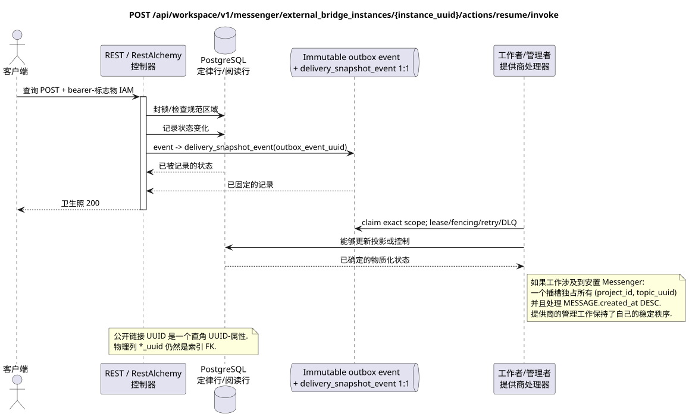

# 恢复外部桥梁副本工作

[← 文件的主要索引](../../../../index.md) ·
[序列图表的索引](../../README.md) ·
[外部集成部分/runtime](../README.md)

`POST /api/workspace/v1/messenger/external_bridge_instances/{instance_uuid}/actions/resume/invoke`

恢复暂停但未撤销身份.



[可编辑的源 PlantUML](diagrams/post_external_bridge_instance_resume.puml)

> 协议说明:现在生成的OpenAPI错误地表示该操作的响应为`ExternalOperation_Get`.运行时控制器的行为和相关的公开合同返回了该终点家族的更新资源.此文档保留了公开的运行时边界;修复生成的OpenAPI仅在文档上超出了这一任务的范围 (docs-only).

## 查询

除了上面的变量路径,没有其他查询参数.

没有尸体,不要发送虚构的物体. JSON.

## 成功的答案

HTTP `200`:

```json
{
  "uuid": "6dd6741b-0d90-490a-8e51-749a411be1ad",
  "provider": "zulip",
  "identity_generation": 3,
  "status": "active",
  "capabilities": {},
  "last_heartbeat_at": "2026-07-17T12:11:00Z",
  "certificate_not_after": "2026-10-17T12:00:00Z",
  "safe_error": null,
  "revision": 9,
  "created_at": "2026-07-01T09:00:00Z",
  "updated_at": "2026-07-17T12:11:00Z"
}
```

## 错误

| HTTP | 公众行为 |
| --- | --- |
| `403` | 没有 `workspace.external_bridge_instance.resume` 权限,或者资源在未经授权的区域. |
| `404` | 给定的区域中的资源不存在或看不到. |
| `403` | 没有特别许可或转移是禁止的 (例如,撤回后恢复/暂停)). |
| `400` | 对于不允许的路径值,查询参数或身体,使用标准验证错误 RESTAlchemy. |

验证错误体示例:

```json
{
  "type": "ValidationErrorException",
  "code": 400,
  "message": "Validation error occurred."
}
```

## 边界 RestAlchemy

资源/控制器的目标广告 (报价文件,非生产代码)):

```python
class ExternalBridgeInstance(models.ModelWithUUID, models.ModelWithTimestamp, orm.SQLStorableMixin):
    __tablename__ = "m_external_bridge_instances_v2"

    provider = properties.property(types.Enum(PROVIDER_KINDS), required=True)
    identity_generation = properties.property(types.Integer(min_value=1), required=True)
    status = properties.property(types.Enum(BRIDGE_STATUSES), read_only=True)
    capabilities = properties.property(types.Dict(), read_only=True)
    revision = properties.property(types.Integer(min_value=1), read_only=True)


class ExternalBridgeInstanceController(controllers.BaseResourceControllerPaginated):
    __resource__ = resources.ResourceByRAModel(ExternalBridgeInstance)
    # Dedicated IAM permission checks wrap standard indexed reads/actions.
```

UUID 资源的类型是其尺度初级密钥; 提供者类型是路径/域名的行密钥.UUID需要额外的外钥匙.RestAlchemy没有使用.`relationships.relationship`为了JSON在表格中UUID因为关系是这样的.URI在物理图的边界上,每个规范的非聚态连接`*_uuid`是一个具有明确选择的引用操作的索引外部密钥. 清洁器隐藏了所有者,帐户数据,原始提供商ID,密钥证书,内部地址和原始协议字段.

## 同步交易

1. 验证查询,确定域,检查分辨率/体,并找到指数密钥的正则行.
2. 封锁桥本;应用 `resume`状态转换和修改/代号规则;写不变域名Outbox条目;记录交易.
3. 只有在交易被固定后返回回复;网络交付从来没有在交易内执行.

## 背景处理,事件和一致性

类型化 `delivery_snapshot_event` 服务 exact bridge-instance
scope; topic task 没有安装就无法建立.
每次查询前再次检查已固定的身份状态.

没有一个已准备的公共事件 Workspace 创建,因此单独的管理员 WebSocket 没有什么可提供.

客户可见的一致性:管理状态在固定后有效. 身体健康/能力状态可能会在稍后更新; 桥架事件的公共视图未被记录.

## 具有能力和并行性

UUID 通过认证中心,我们可以确定身份的桥梁..

重复者使用稳定的商业密钥和当前的原始状态.每个 immutable outbox事件创建一个单独的任务,具有独特的 `outbox_event_uuid`;重复传递该任务必须是具有进量,没有 coalescing. 专有处理主题Messenger从新条目到旧条目只适用于当所涉及的正规位置确实与`(project_id, topic_uuid)`有关;提供商的管理/阅读操作不会创建人工主题,也不会进入这个排队.

## 他们的来源

- [`workspace_api.md`](../../../../workspace_api.md) — 有权威的公共路线,一般JSON,页面,活动和合同 WebSocket.
- [`zulip_bridge_v1_product_and_api.md`](../../../../zulip_bridge_v1_product_and_api.md) — 外部资源的清洁生命周期,许可和提供商语义.

[← 文件的主要索引](../../../../index.md) ·
[序列图表的索引](../../README.md) ·
[外部集成部分/runtime](../README.md)
