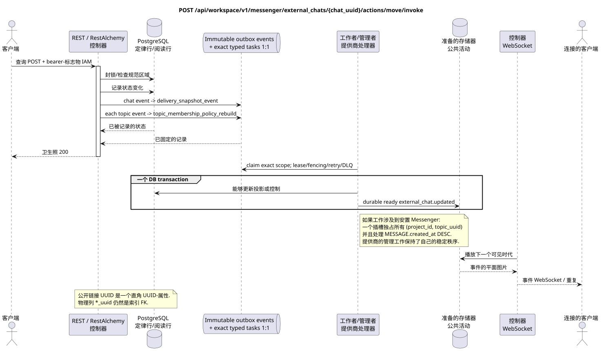

# 移动外部聊天投影

[← 文件的主要索引](../../../../index.md) ·
[序列图表的索引](../../README.md) ·
[外部集成部分/runtime](../README.md)

`POST /api/workspace/v1/messenger/external_chats/{chat_uuid}/actions/move/invoke`

通过存储稳定的 UUID 资源,将所选投影转移到另一个项目.



[可编辑的源 PlantUML](diagrams/post_external_chat_move.puml)

## 查询

除了上面的变量路径,没有其他查询参数.

持有者代币的加上标题:

- `If-Match: "<revision>"` 必须

```json
{
  "project_id": "00000000-0000-4000-8000-000000000001"
}
```

## 成功的答案

HTTP `200`:

```json
{
  "uuid": "26f4907e-d181-4b7b-bdac-cc9685d37c40",
  "external_account_uuid": "0d4ae1d0-30ad-4d15-bf26-5789e8406201",
  "source": {
    "kind": "zulip",
    "chat_type": "channel",
    "original_url": "https://zulip.example.invalid/#narrow/channel/42"
  },
  "display_name": "Engineering",
  "selected": true,
  "project_id": "00000000-0000-4000-8000-000000000001",
  "history_depth": "30_days",
  "projection_stream_uuid": "8ce8c018-4c4f-4f48-9bb7-9d95ce6d5d91",
  "status": "syncing",
  "capabilities": {},
  "safe_error": null,
  "transition_pending": false,
  "revision": 4,
  "created_at": "2026-07-17T11:05:00Z",
  "updated_at": "2026-07-17T12:05:00Z"
}
```

资源的审核答案包含严格的 `ETag: "<revision>"`.

## 错误

| HTTP | 公众行为 |
| --- | --- |
| `404` | 给定的区域中的资源不存在或看不到. |
| `428` | 没有 `If-Match`. |
| `412` | 修改不一致. |
| `409` | `ExternalProjectionMoveConflictError`, 在执行传送读取提供商时. |
| `400` | 对于不允许的路径值,查询参数或身体,使用标准验证错误 RESTAlchemy. |

验证错误体示例:

```json
{
  "type": "ValidationErrorException",
  "code": 400,
  "message": "Validation error occurred."
}
```

## 边界 RestAlchemy

资源/控制器的目标广告 (报价文件,非生产代码)):

```python
class ExternalChat(models.ModelWithUUID, models.ModelWithTimestamp, orm.SQLStorableMixin):
    __tablename__ = "m_external_chats_v2"

    external_account_uuid = properties.property(types.UUID(), required=True)
    source = properties.property(EXTERNAL_CHAT_SOURCE_TYPE, required=True)
    project_id = properties.property(types.AllowNone(types.UUID()), default=None)
    projection_stream_uuid = properties.property(types.AllowNone(types.UUID()), read_only=True)
    selected = properties.property(types.Boolean(), default=False)
    revision = properties.property(types.Integer(min_value=1), read_only=True)


class ExternalChatController(controllers.BaseResourceControllerPaginated):
    __resource__ = resources.ResourceByRAModel(ExternalChat)
    # Owner/account scope and narrow select/deselect/move actions only.
```

`external_account_uuid`, `project_id` 没有`projection_stream_uuid`它们是直角形.UUID对于相应的索引物理列,使用`external_account_uuid -> external_account ON DELETE CASCADE`, `project_id -> project registry ON DELETE RESTRICT`并且允许`null` `projection_stream_uuid -> STREAM ON DELETE SET NULL`公共广告RestAlchemy没有使用.`relationships.relationship`为了JSON在表格中UUID因为关系是这样的.URI在物理图的边界上,每个规范的非聚态连接`*_uuid`是一个具有明确选择的引用操作的索引外部密钥. 清洁器隐藏了所有者,帐户数据,原始提供商ID,密钥证书,内部地址和原始协议字段.

## 同步交易

1. 验证查询,确定域,检查分辨率/体,并找到指数密钥的正则行.
2. 阻止聊天修改和旧/新项目目的;拒绝提供商的并行阅读传输;原子添加可规的移动转换,可选状态和不变 outbox.
3. 只有在交易被固定后返回回复;网络交付从来没有在交易内执行.

## 背景处理,事件和一致性

类型化任务:单独的 `topic_membership_policy_rebuild`
新的主题和 `delivery_snapshot_event` 对于 external-chat state/event,每个
通过其源的Outbox事件; request path 不执行 fan-out 或扫描组件.

背景处理器在一个DB交易中记录了实质化的状态和完整图像的完整封面`external_chat.updated`;两个效果是共同提交或滚回. 在提交之后,单独的管理器WebSocket发送,重复和播放; API/worker不拥有客户端连接.

客户可见的一致性: 目标转换可以等待,而旧/新项目的投影一致; 稳定的公共UUID聊天/实体保持.

## 具有能力和并行性

UUID 聊天稳定; 目的变更将在聊天/帐户领域进行序列化. 项目/流的 UUID 字段是索引的外部密钥,而不是公开的 URI 关系 (relationship).

重复者使用稳定的商业密钥和当前的原始状态.每个 immutable outbox 事件创建一个单独的任务,具有独特的 `outbox_event_uuid`;该任务的重复交付必须是具有进量,没有 coalescing. 专有处理主题Messenger从新条目到旧条目只适用于当所涉及的正规位置确实与`(project_id, topic_uuid)`有关; 提供者管理/阅读操作不创建人工主题,也不属于这一排队.

## 他们的来源

- [`workspace_api.md`](../../../../workspace_api.md) — 有权威的公共路线,一般JSON,页面,活动和合同 WebSocket.
- [`zulip_bridge_v1_product_and_api.md`](../../../../zulip_bridge_v1_product_and_api.md) — 外部资源的清洁生命周期,许可和提供商语义.

[← 文件的主要索引](../../../../index.md) ·
[序列图表的索引](../../README.md) ·
[外部集成部分/runtime](../README.md)
