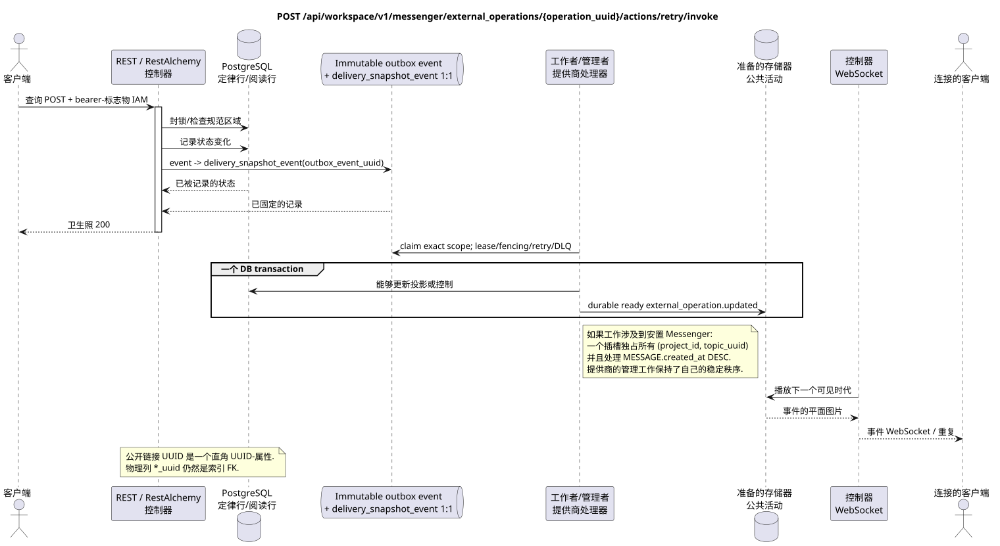

# 重复外部操作

[← 文件的主要索引](../../../../index.md) ·
[序列图表的索引](../../README.md) ·
[外部集成部分/runtime](../README.md)

`POST /api/workspace/v1/messenger/external_operations/{operation_uuid}/actions/retry/invoke`

重复允许此失败的操作.



[可编辑的源 PlantUML](diagrams/post_external_operation_retry.puml)

## 查询

除了上面的变量路径,没有其他查询参数.

```json
{
  "confirm_duplicate_risk": false
}
```

## 成功的答案

HTTP `200`:

```json
{
  "uuid": "42bd324f-45f0-4755-9a59-7b7316b2923c",
  "external_account_uuid": "0d4ae1d0-30ad-4d15-bf26-5789e8406201",
  "action": "message.create",
  "target_type": "message",
  "target_uuid": "a93dca35-3061-4748-bda4-7f6f8c660ea5",
  "details": {
    "kind": "zulip"
  },
  "attempt_history": [],
  "status": "queued",
  "attempt": 1,
  "safe_error": null,
  "can_retry": false,
  "can_discard": true,
  "duplicate_risk": false,
  "retry_requires_confirmation": false,
  "original_url": null,
  "reconciliation_state": "not_required",
  "reconciliation_reason": null,
  "reconciliation_evidence": {},
  "revision": 1,
  "created_at": "2026-07-17T12:10:00Z",
  "updated_at": "2026-07-17T12:10:00Z"
}
```

资源的审核答案包含严格的 `ETag: "<revision>"`.

## 错误

| HTTP | 公众行为 |
| --- | --- |
| `404` | 给定的区域中的资源不存在或看不到. |
| `400` | 复制是不可能的,或者需要,但没有证据.. |
| `400` | 对于不允许的路径值,查询参数或身体,使用标准验证错误 RESTAlchemy. |

验证错误体示例:

```json
{
  "type": "ValidationErrorException",
  "code": 400,
  "message": "Validation error occurred."
}
```

## 边界 RestAlchemy

资源/控制器的目标广告 (报价文件,非生产代码)):

```python
class ExternalOperation(models.ModelWithUUID, models.ModelWithTimestamp, orm.SQLStorableMixin):
    __tablename__ = "m_external_operations_v2"

    external_account_uuid = properties.property(types.UUID(), required=True)
    target_uuid = properties.property(types.AllowNone(types.UUID()), default=None)
    action = properties.property(types.String(), required=True)
    status = properties.property(types.Enum(OPERATION_STATUSES), read_only=True)
    details = properties.property(types.Dict(), read_only=True)
    revision = properties.property(types.Integer(min_value=1), read_only=True)


class ExternalOperationController(controllers.BaseResourceControllerPaginated):
    __resource__ = resources.ResourceByRAModel(ExternalOperation)
    # Owner scope; retry, discard and preflight are narrow action overrides.
```

`external_account_uuid` 并且允许`null` `target_uuid`它们是直角形.UUID它们的特性,是指数的物理.`external_account_uuid`引用了c 的帐户`ON DELETE CASCADE`因为`target_uuid`现在的形式是不能正确的单个外部键.SQL目标句子应该选择目标的正规目录或FK的典型列,同时保留相同的公开目录.JSON `target_uuid`公共广告RestAlchemy没有使用.`relationships.relationship`为了JSON在表格中UUID因为关系是这样的.URI在物理图的边界上,每个规范的非聚态连接`*_uuid`是一个有明显选择的引用操作的索引外键. 卫生机隐藏了所有者,账户,原始供应商ID,密码证书,内部地址和原始协议字段.

## 同步交易

1. 验证查询,确定域,检查分辨率/体,并找到指数密钥的正则行.
2. 阻止操作;检查重复是否允许和验证重复风险;添加一个重复/业务尝试记录;更新操作;记录不可更改的更新出箱;记录交易.
3. 只有在交易被固定后返回回复;网络交付从来没有在交易内执行.

## 背景处理,事件和一致性

类型化投影任务:创建一个独立的 immutable task `delivery_snapshot_event` 源Outbox事件和目标,当适用时; 提供商的交付仍然是帐户/聊天排队中的稳定工作.

背景处理器在一个DB交易中记录了实质化的状态和完整图像的完整封面`external_operation.updated`;两个效果是共同提交或滚回. 在提交之后,单独的管理器WebSocket发送,重复和播放; API/worker不拥有客户端连接.

客户可见的一致性:排队的重复照片立即可访问. 交付,对照证, URL 供应商和目标交付照片都会异步更新.

## 具有能力和并行性

UUID 操作是稳定的定位/重复识别器. 尝试号码的增加和终端过渡被锁定在行中..

重复者使用稳定的商业密钥和当前的原始状态.每个 immutable outbox 事件创建一个单独的任务,具有独特的 `outbox_event_uuid`;该任务的重复交付必须是具有进量,没有 coalescing. 专有处理主题Messenger从新条目到旧条目只适用于当所涉及的正规位置确实与`(project_id, topic_uuid)`有关; 提供者管理/阅读操作不创建人工主题,也不属于这一排队.

## 他们的来源

- [`workspace_api.md`](../../../../workspace_api.md) — 有权威的公共路线,一般JSON,页面,活动和合同 WebSocket.
- [`zulip_bridge_v1_product_and_api.md`](../../../../zulip_bridge_v1_product_and_api.md) — 外部资源的清洁生命周期,许可和提供商语义.

[← 文件的主要索引](../../../../index.md) ·
[序列图表的索引](../../README.md) ·
[外部集成部分/runtime](../README.md)
