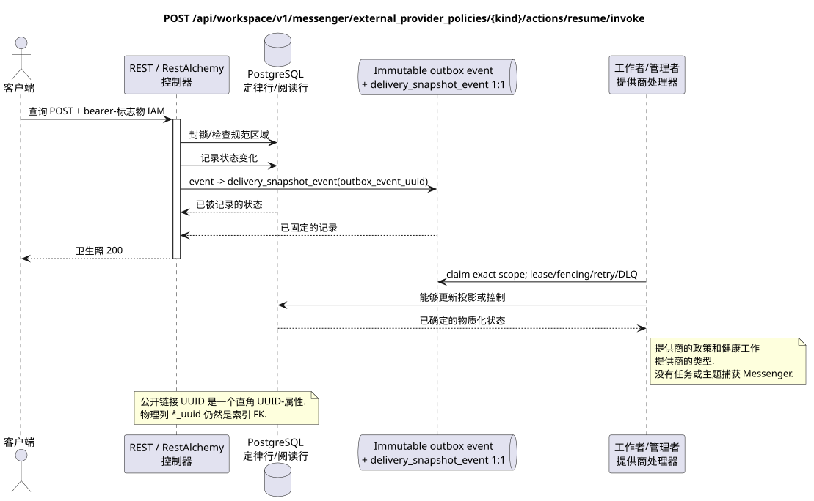

# 恢复外部提供者的政策

[← 文件的主要索引](../../../../index.md) ·
[序列图表的索引](../../README.md) ·
[外部集成部分/runtime](../README.md)

`POST /api/workspace/v1/messenger/external_provider_policies/{kind}/actions/resume/invoke`

检查后恢复全域的服务提供者视图.



[可编辑的源 PlantUML](diagrams/post_external_provider_policy_resume.puml)

> 协议说明:现在生成的OpenAPI错误地表示该操作的响应为`ExternalOperation_Get`.运行时控制器的行为和相关的公开合同返回了该终点家族的更新资源.此文档保留了公开的运行时边界;修复生成的OpenAPI仅在文档上超出了这一任务的范围 (docs-only).

## 查询

除了上面的变量路径,没有其他查询参数.

没有尸体,不要发送虚构的物体. JSON.

## 成功的答案

HTTP `200`:

```json
{
  "uuid": "bbf5398b-7d85-5770-aaf6-827605ca1200",
  "provider": "zulip",
  "enabled": true,
  "emergency_suspended": false,
  "limits": {
    "max_accounts": 100,
    "max_selected_chats_per_account": 1000,
    "max_file_bytes": 5368709120
  },
  "custom_ca_bundle": {
    "uuid": "40a917df-3c67-43a7-b5a3-d0ea38e24666",
    "generation": 4,
    "sha256": "0123456789abcdef0123456789abcdef0123456789abcdef0123456789abcdef",
    "certificate_count": 1
  },
  "revision": 5,
  "created_at": "2026-07-01T09:00:00Z",
  "updated_at": "2026-07-17T12:12:00Z"
}
```

资源的审核答案包含严格的 `ETag: "<revision>"`.

## 错误

| HTTP | 公众行为 |
| --- | --- |
| `403` | 没有 `workspace.external_provider_policy.resume` 权限,或者资源在未经授权的区域. |
| `400` | 对于不允许的路径值,查询参数或身体,使用标准验证错误 RESTAlchemy. |

验证错误体示例:

```json
{
  "type": "ValidationErrorException",
  "code": 400,
  "message": "Validation error occurred."
}
```

## 边界 RestAlchemy

资源/控制器的目标广告 (报价文件,非生产代码)):

```python
class ExternalProviderPolicy(models.ModelWithUUID, models.ModelWithTimestamp, orm.SQLStorableMixin):
    __tablename__ = "m_external_provider_policies_v1"

    provider = properties.property(types.Enum(PROVIDER_KINDS), required=True)
    enabled = properties.property(types.Boolean(), required=True)
    emergency_suspended = properties.property(types.Boolean(), read_only=True)
    limits = properties.property(types.Dict(), required=True)
    custom_ca_bundle = properties.property(types.AllowNone(types.Dict()), read_only=True)
    revision = properties.property(types.Integer(min_value=1), read_only=True)

    @classmethod
    def get_id_property(cls) -> dict[str, typing.Any]:
        return {"provider": cls.properties.properties["provider"]}


class ExternalProviderPolicyController(controllers.BaseResourceController):
    __resource__ = resources.ResourceByRAModel(ExternalProviderPolicy)
    # ResourceByRAModel restores by provider kind, not by the hidden storage UUID.
```

公共资源以 `kind` 提供商为地址; UUID 元数据仍然是标杆性 UUID 属性.如果用户CA元数据是物理正常化的,则索引允许的 `null` `custom_ca_bundle_uuid` 引用了 CA保护包的 `ON DELETE SET NULL`.公共广告 RestAlchemy 不使用 `relationships.relationship` 用于 JSON 形式的 UUID,因为关系是以 URI 序列化的.在物理图的边界,可规范的非多态连接 `*_uuid` 是一个具有明显选择的引用作用的索引外部密钥. 清理器隐藏了所有者,原始帐户数据,提供商ID,密封证书,内部地址和协议字段..

## 同步交易

1. 验证查询,确定域,检查分辨率/体,并找到指数密钥的正则行.
2. 封锁政策;设置`emergency_suspended=false`;扩大修改;原子添加所需状态和不变 outbox.
3. 只有在交易被固定后返回回复;网络交付从来没有在交易内执行.

## 背景处理,事件和一致性

投影的类型化任务:单独 immutable `delivery_snapshot_event`
每个源户箱事件和单独的可持续工作
每个都具有实际的供应商范围,
unique `outbox_event_uuid`; coalescing 没有安置,操作就无法完成.
创建 topic task/claim.

没有一个已准备的公共事件 Workspace 创建,因此单独的管理员 WebSocket 没有什么可提供.

客户可见的一致性:政策旗立即起作用. 有效性,帐户/聊天状态和健康情况异步一致. 提供商政策事件的公开视图未登录.

## 具有能力和并行性

每个提供商类型都有一个政策行.修改/ETag防止更新丢失;每一个改变操作都会产生自己的不变任务,而重复一个任务是强大的..

重复者使用稳定的商业密钥和当前的原始状态.每个 immutable outbox 事件创建一个单独的任务,具有独特的 `outbox_event_uuid`;该任务的重复交付必须是具有进量,没有 coalescing. 专有处理主题Messenger从新条目到旧条目只适用于当所涉及的正规位置确实与`(project_id, topic_uuid)`有关; 提供者管理/阅读操作不创建人工主题,也不属于这一排队.

## 他们的来源

- [`workspace_api.md`](../../../../workspace_api.md) — 有权威的公共路线,一般JSON,页面,活动和合同 WebSocket.
- [`zulip_bridge_v1_product_and_api.md`](../../../../zulip_bridge_v1_product_and_api.md) — 外部资源的清洁生命周期,许可和提供商语义.

[← 文件的主要索引](../../../../index.md) ·
[序列图表的索引](../../README.md) ·
[外部集成部分/runtime](../README.md)
