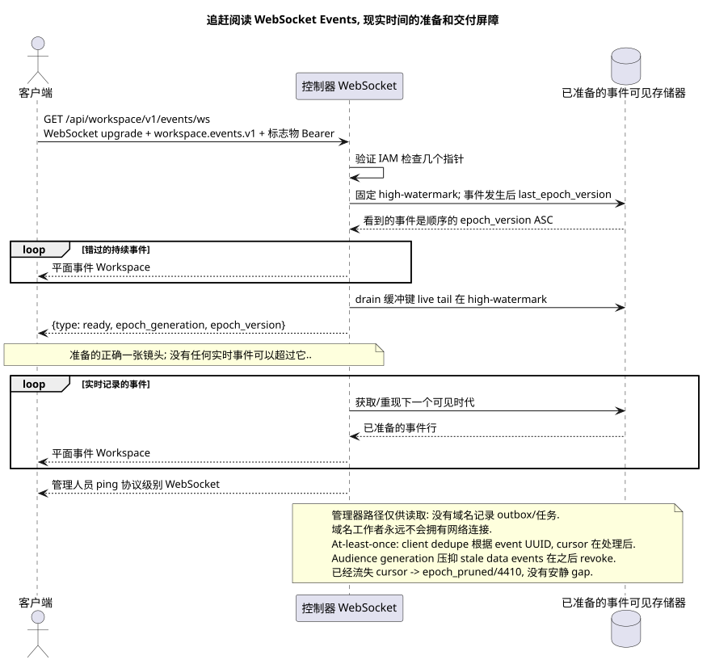

# 事件的连接 WebSocket

[← 文件的主要索引](../../../../index.md) ·
[序列图表的索引](../../README.md) ·
[外部集成和执行时间的分类](../README.md)

输入点: `GET /api/workspace/v1/events/ws` 和 WebSocket 升级 query
`last_epoch_version=<number>&epoch_generation=<generation>`.

打开实时的公共流, 播放可见的稳定后, 获得一个准备的镜头, 然后接收平面事件.Workspace实际时间.这是记录的执行时间输入点,而不是HTTP- 他们的手术. OpenAPI.



[可编辑的源 PlantUML](diagrams/websocket_events.puml)

## 连接设置

查询的参数:

- `last_epoch_version`: 最后一个完全处理的整数时代; `0` 冷.
- `epoch_generation`: 必须与非零指针并列,并且与保存的代相匹配.

按顺序进行 `Sec-WebSocket-Protocol` 值:

```text
workspace.events.v1, bearer.<IAM access token>
```

请求体 JSON 没有发送. 客户端没有发送 `ack` 或 `pong` 级的应用程序; 活动检查使用协议级ping控制 WebSocket.

## 服务器消息

准备状态的控制信息在追赶读取后和实时事件之前发送.:

```json
{
  "type": "ready",
  "epoch_generation": "781203",
  "epoch_version": 124
}
```

接下来,每个事件信息的形状都会完全相同的平面, REST `/events/`:

```json
{
  "schema_version": 1,
  "uuid": "5bb95582-b4f3-4de1-bf84-f0244910fc82",
  "epoch_version": 124,
  "project_id": "00000000-0000-4000-8000-000000000001",
  "user_uuid": "3f433fee-b27f-4c67-98bd-31fe4df42cc8",
  "object_type": "external_account",
  "action": "updated",
  "created_at": "2026-07-17T12:12:00Z",
  "updated_at": "2026-07-17T12:12:00Z",
  "payload": {
    "kind": "external_account.updated",
    "uuid": "0d4ae1d0-30ad-4d15-bf26-5789e8406201",
    "snapshot": {
      "uuid": "0d4ae1d0-30ad-4d15-bf26-5789e8406201",
      "settings": {
        "kind": "zulip",
        "server_url": "https://zulip.example.invalid",
        "email": "owner@example.invalid",
        "selection_mode": "explicit",
        "history_depth": "30_days",
        "default_project_id": "00000000-0000-4000-8000-000000000001"
      },
      "credential_present": true,
      "status": "live",
      "live_ready": true,
      "safe_error": null,
      "capabilities": {},
      "desired_generation": 7,
      "applied_generation": 7,
      "last_progress_at": "2026-07-17T12:00:00Z",
      "created_at": "2026-07-17T11:00:00Z",
      "updated_at": "2026-07-17T12:00:00Z",
      "revision": 7
    }
  }
}
```

JSON-没有应用程序级别的 `hello`, `ping`, `pong`或 `ack` 消息.

## 导航器错误

如果你的指针已经过期,则会发出下一个类型错误 JSON,然后连接会关闭,并将代码 `4410` 和原因 `epoch_pruned`:

```json
{
  "type": "EventsCursorExpiredError",
  "code": 410,
  "error": "epoch_pruned",
  "message": "The event cursor is outside the retained suffix.",
  "reason": "epoch_pruned",
  "epoch_generation": "781203",
  "current_epoch_version": 124,
  "minimum_epoch_version": 37
}
```

## 读取和调度路径

连接安装时,验证区域IAM,检查
`(epoch_generation, last_epoch_version)` 并且被固定 high-watermark durable
event store. Dispatcher 随着增长, 播放所有可见事件
cursor, 同时缓冲出现的活尾巴,排水它,
之后,它会转换为没有 gap 的 live./business events
工作者已经存储了一个原子的投影更新, ready event row
在一个DB交易中; 调度器只读 durable store 并传递.

## RestAlchemy边界和身份

```python
class WorkspaceEvent(models.ModelWithUUID, models.ModelWithTimestamp, orm.SQLStorableMixin):
    __tablename__ = "m_workspace_events"

    epoch_version = properties.property(types.Integer(min_value=1), required=True)
    project_id = properties.property(types.UUID(), required=True)
    user_uuid = properties.property(types.AllowNone(types.UUID()), default=None)
    object_type = properties.property(types.String(), required=True)
    action = properties.property(types.String(), required=True)
    payload = properties.property(types.Dict(), required=True)


class WorkspaceEventController(controllers.BaseResourceControllerPaginated):
    __resource__ = resources.ResourceByRAModel(WorkspaceEvent)
    # Scope by project/user or stored compact audience before indexed keyset read.
```

公开的UUID事件/实体是UUID关系的标数性质,而不是URI关系.索引的`project_id`事件和允许的`null` `user_uuid`事件引用了`ON DELETE CASCADE`区域的可规则行;复制到不变的JSON使用量中的UUID事件数据,而不是关系的现有列.事件的认同/重演使用`(epoch_generation, epoch_version)`,而不是UUID实体.

## 时间与重建

追赶阅读和drin live buffer 在准备屏障之前完成.
实时交付无法超过准备.
at-least-once: 客户端通过 event UUID 进行重复,并且只推移光标
观众队在进行完整处理后, membership generation; dispatcher
并且在不活跃的会员或不匹配的会员时不能传输数据事件
generation 答案是 4410/`epoch_pruned` 要求清除
转换到原始存储器,
保持数值保留窗口 operational
policy, 但不允许隐的事件发生..

## 他们的来源

- [`workspace_api.md`](../../../../workspace_api.md), 部分 `Runtime Entry Points`, `Events And Epoch` 和 `WebSocket Realtime Summary`.

[← 文件的主要索引](../../../../index.md) ·
[序列图表的索引](../../README.md) ·
[外部集成和执行时间的分类](../README.md)
