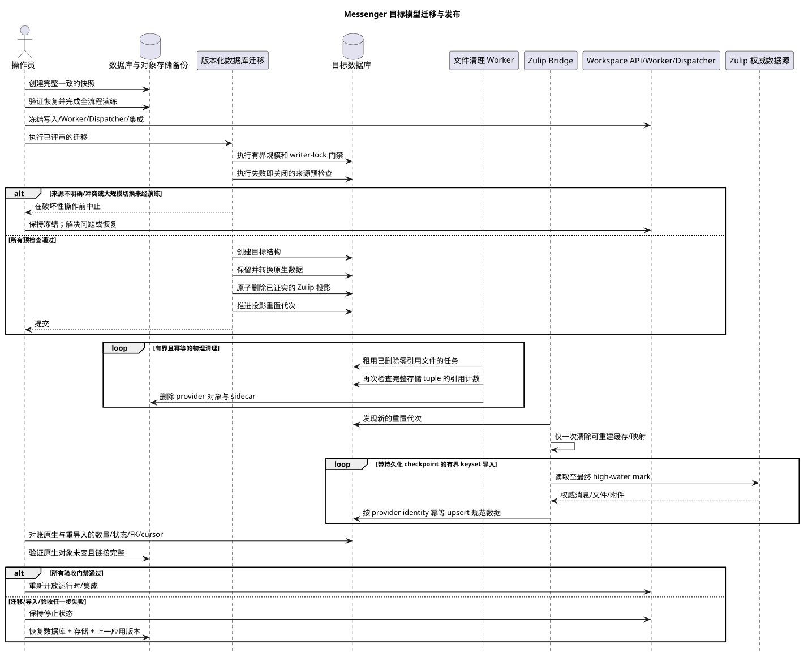

[← 文档索引](../../../index.md) · [时序图索引](../README.md) · [Worker 流程](README.md)

# Messenger 目标模型迁移与发布运行手册

状态：**已为 Workspace Server v2 实现；这是强制性的运维流程**。

本手册用于解决 Critic 风险 #11。它本身并不授权执行迁移、删除数据或
修改生产环境数据库结构。当前公共契约由
[`workspace_api.md`](../../../workspace_api.md) 定义。

可编辑的图表源文件：
[`migration_release_runbook.puml`](diagrams/migration_release_runbook.puml)。

## 职责边界

| 机制 | 职责 | 执行时机 |
| --- | --- | --- |
| 版本化数据库迁移 | 创建目标结构、迁移权威的原生数据、删除已证实的 Zulip 消息/文件投影，并推进重置代次 | 完成备份、演练、规模和冻结检查后，由正常发布流水线执行 |
| Messenger worker | 只对数据库中已经删除且零引用的 Zulip 文件行执行有界、幂等的物理清理 | 数据库迁移提交后自动执行 |
| Zulip Bridge | 识别新的重置代次、清除可重建的本地状态，并运行一次完整的全新导入 | 自动执行，使用持久化的 backfill checkpoint 和重试 |
| 运维检查 | 验证备份/恢复、冻结、迁移前后计数、对账和验收门禁 | 迁移前以及重新导入完成后 |

每个手工辅助程序都必须提供 `check-only`/`dry-run` 和 `apply` 模式，
明确限定 project/range/provider/account 范围，使用有界批次和可恢复的
checkpoint，支持幂等重跑，并生成进度日志、审计日志和最终 manifest。
任何检查失败都会阻止下一步。

## 准备与冻结

1. 创建约定的数据库和对象存储完整备份或快照。
2. 将备份恢复到隔离实例，记录原始应用版本、schema/migration 版本以及
   outbox/task/event/provider cursors。
3. 在恢复出的类生产副本上完整演练流程，测量耗时和空间占用，并验证
   rollback。
4. 在不兼容切换期间停止 API 写入、worker slots、WebSocket dispatcher
   和 provider integrations。等待活动事务和任务完成，并记录最终的
   high-water marks。
5. 从最终 watermark/backup 到转换完成并重新开放写入之间，不得留下
   producer 可能产生丢失数据的窗口。

## 按来源区分数据

### 原生 Workspace 数据

原生消息以及上传到原生聊天的文件是权威的本地数据，不会被删除或重新
导入。版本化数据库迁移会确定性地将它们转换为目标 `MESSAGE`、
`MESSAGE_PLACEMENT`、`USER_MESSAGE_BINDING` 和 `USER_MESSAGE_STATE` 行，
同时保留内容和用户状态。原生文件行、blob 对象、引用、校验和与 UUID
在发布前后必须一致。

### Zulip：有意重置派生的 Workspace 身份

从 Zulip 导入的消息、文件/附件及其派生投影都可以重建。完成并验证备份
后，版本化迁移只删除冻结的 `provider=zulip` 范围内已证实的行，推进
account/chat desired generations，并发布 `projection_reset_generation`。
Bridge 随后丢弃旧的可重建去重状态，并从权威 Zulip 数据源执行一次完整
的全新导入。已选择的 account/chat 配置以及 identity/catalog 会保留。

这是一个**有意的破坏性身份边界**，仅适用于 Zulip 派生的 Workspace
数据：

- 旧的规范 `MESSAGE.uuid`、公共 `MESSAGE_PLACEMENT.uuid`、deep links
  以及指向已导入 Zulip 消息的其他引用不会保留；
- 与旧 Zulip UUID 关联的 Workspace 本地 bindings/states（`read`、
  `starred`、`hidden`）、reactions 和手工 placements，在权威 Zulip
  payload 无法重建时不保证保留；
- Zulip 派生的 file UUID、attachment/link identity 和 blob identity
  不会保留；重新导入可能创建新的行、UUID 和存储对象；
- 不会创建或恢复 external-id 到旧 Workspace UUID 的映射；
- 此边界不适用于原生消息、原生状态或原生所有的文件。

## 失败即关闭的来源分类

清理绝不会只根据一个 nullable 字段作出决定。历史迁移并不能保证每条
导入消息都有正确的 `source_name`；另一方面，原生出站消息在 echo 对账
后也可能带上 provider/account 标识。因此，迁移会在同一个 writer freeze
下执行确定性的预检查，并且只接受以下组合：

- 入站消息：`source_name` 与 `source.kind` 一致，存在
  `source.message_id`，并且还具有匹配的 Zulip account 与
  `provider_external_id`、Zulip 所有的 stream，或可相互印证的历史
  entity evidence 之一；
- 原生出站消息：`m_external_operations_v2` 中存在持久化记录，包含
  `action=message.create`、匹配的 `target_uuid`、本地
  `owner_user_uuid`，并且在消息已有 account 时二者一致；
- 外部文件：属于 Zulip account，位于专用 external-content 存储命名空间，
  且没有任何保留消息引用它。任何仍然存在的
  `urn:file|image|video:<uuid>` 引用都具有最高优先级，会保留数据库行和
  物理对象。

任何带有不完整或相互矛盾 Zulip 信号的行，都会在破坏性操作开始前中止
迁移。同时被证明为入站和本地出站的行也会中止迁移。
`m_zulip_processed_entities` 绝不能单独作为证据，只能在 source 字段一致
时提供补充证明。

来自 provider 的 reactions 按其 Zulip account 来源删除，包括附着在
保留的原生/出站消息上的 reactions。原生 reactions 会保留。Compact
read/topic state 和依赖 events 只对已证实的 reset candidates 清理。

数据库重置在冻结的 writer scope 内作为单个、原子、基于集合的事务执行。
无人值守切换最多处理一百万条 legacy messages；等待 writer locks 的时间
最多为 30 秒，statement deadline 为 30 分钟。更大的 legacy 数据库会在
破坏性操作前被拒绝，除非操作员已经在生产规模副本上成功演练、验证备份，
并明确授权 large cutover。五千万消息的目标规模描述的是全新导入后的稳态，
并不允许未经演练就自动转换 legacy 数据。

数据库行以原子方式删除，因此任何失败都会恢复完整的迁移前状态。物理文件
对象则有意交给提交后的持久化有界 worker queue 处理。删除共享或去重对象
之前，worker 会再次检查完整 tuple
`(storage_type,storage_id,storage_object_id)` 的零引用计数，并确认不存在
任何保留的原生引用。Metadata sidecar 单独删除，重试保持幂等。

当前 schema 没有规范化的 message↔attachment 表；引用以
`urn:file|image|video:<uuid>` 形式位于 Markdown 内。迁移会在选择文件候选
项前扫描所有保留 payload，因此既不会产生悬空链接，也不会依赖不存在的 FK。

## 完整的全新 Zulip 导入

全新导入会分配新的规范 `MESSAGE.uuid`；公共 placement UUID 仍按
`UUIDv5(namespace=TOPIC.uuid, name=MESSAGE.uuid)` 计算。文件也可能获得
新的 UUID。导入不会查找旧的 Workspace 身份。

幂等性在**本次新导入内部**是强制要求。消息至少使用物理唯一 provider key
`(project_id, external_account_uuid, provider_external_id)`。运行时还携带
`source.message_id`，它会明确映射到规范化的 `provider_external_id`。
第一次导入创建新的规范行；使用相同 provider key 重试或恢复时会复用/upsert
该行，而不是生成重复项。

文件和附件链接使用 account/project 范围内对应且稳定的 Zulip file/message
identity。重复批次会收敛到同一组新 file/attachment 行，不会重复 blob，
并恢复指向已导入新规范消息的链接。

导入使用有界 keyset batches 自动运行，并带有持久化 checkpoints、
retry/backoff、进度日志和对账。在记录最终 source cursor/high-water mark
之前，provider integration 保持冻结，从而避免 freeze 边界上的丢失或重复。

## 重建与验收门禁

迁移和重新导入完成后，版本化流程会重建 placements、bindings/states、
reaction snapshots、folder items/snapshots、unread/mention counts 以及其他
materialized projections。重建必须幂等，但不能替代源数据验证。

在所有门禁通过前，写入保持关闭：

- 原生 message/content/state 总量和确定性的原生 placement mapping 一致；
- `UNIQUE(project_id, uuid)`、组合 tenant FKs、topic→stream/project 完整性
  和 membership generations 均有效；
- 原生 file row/blob/reference 的数量、校验和与大小保持不变；
- Zulip 清理后不存在待处理的 history/provider/file-transfer producers、
  orphan rows/objects、悬空的 `urn:file|image|video` 引用，且未删除任何
  应保留的原生对象；
- 重新导入后 source high-water marks、counts 和 ranges 一致，provider
  identity 不存在重复或缺口，抽样/完整内容对账均通过；
- Zulip file/blob/attachment 的总量、校验和/大小与 links 完整、已去重且
  无损坏；
- reactions、folders、folder-item snapshots、unread counts 以及
  outbox/task/event/provider cursors 对账一致；
- 所有必需的手工流程已完成、checkpoints 已关闭，并且不存在 DLQ/stuck
  work，除非 release owner 已明确接受。

Control-plane 规模门禁至少包含 15,000 个大型 assignments。它必须证明：
snapshot creation 在不构建进程内集合的情况下写入规范化有序行；分页每次只
读取有界行；backend RSS 保持有界；Bridge 在推进 anchor cursor 前恰好安装
每个 resource 一次。

## 失败与回滚

任何 migration、cleanup、reimport 或 acceptance failure 都会停止流程。
不得用生产环境临时修补替代恢复。应恢复已验证的迁移前数据库/对象存储备份
和上一应用版本，重新检查记录的 cursors，然后再安排新的维护窗口。备份和
manifests 必须保留到明确验收完成并超过设定的保留期。

此流程解决了风险 #11：原生数据无损迁移；Zulip 派生的消息/文件身份具有
明确的破坏性重置边界，并由备份、失败即关闭的来源检查、有界的物理清理、
完整全新导入和可验证 rollback 共同保护。

[← 文档索引](../../../index.md) · [时序图索引](../README.md) · [Worker 流程](README.md)
