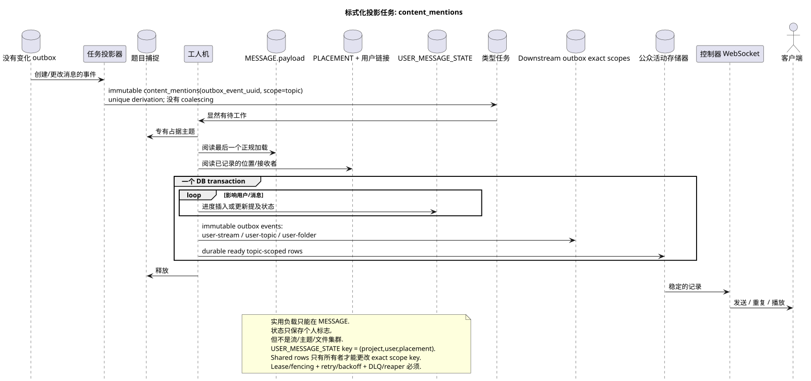

# 类型任务: `content_mentions`

[← 文件的主要索引](../../../index.md) · [序列图表的索引](../README.md) · [工作流的分区](README.md)

状态: **建议的背景流;不是终点 HTTP**.

可编辑的源:
[`task_content_mentions.puml`](diagrams/task_content_mentions.puml).

## 真理的目的和来源

任务更新内容和引用的现实状态
创建/改变规范信息,并出现绑定后
收件者. 真理的来源  最后状态 `MESSAGE.payload`,明显
`MESSAGE_PLACEMENT`, 准备好接收者访问和正规标识符
公共版权仍然是唯一的
`MESSAGE`; 个人提及旗将存储在独特的记录中
`USER_MESSAGE_STATE (project,user,placement)`.

## 流量

1. 变态交易 API 记录了正规变化和
   无法改变的事件; `GET` 和列表任务不会创建.
2. 投影机为每个任务输出一个独立的 immutable `content_mentions`
   source outbox event; `outbox_event_uuid` 唯一的联系事件和任务.
3. 专有主题插槽选择 `MESSAGE.created_at DESC`.
4. 工作者读取了最后的有效率和记录的绑定
   收取者.
5. 工作者只能创建或更新个人标志/状态
   引用和所有相关的 durable ready `message.updated` rows
   一个DB交易;它不会复制用量,也不会改变公开的
   UUID 或是短暂的信息标记.
6. 如果提到/未读消息的分类发生了变化,
   精确领域的单独任务: `user-stream`, `user-topic`和/或
   `user-folder`. Topic-worker 不会改变这些通用行.
7. 提交后,管理员将传输,重复和播放已完成的 events;
   event rows 容器创建他们的 exact-scope tasks 原子与自己的
   并且主题工作者没有记录 shared rows.

## 复习,比赛和一致性

- 每个任务都符合一个事件; handler 读出最后一个事件
  规律性负载,并应用事件的impotently;
- 状态键 `(project_id,user_uuid,placement_uuid)` 排除重复
  没有混合不同的 placements;
- 捕获一个主题,不允许同时处理一个主题.;
- lease expiry/fencing, retry/backoff, DLQ 收割器恢复工作后
  失败; initial design 没有执行 coalescing;
- 插入或更新的重复操作 (upsert) 归结为最后一个源的相同结果;
- 在工作人员固定之前,客户端可以简单地看到之前的状态.
  提及/计数器;对改变定律内容的回应已经
  显示了已被记录的 `MESSAGE`.

[← 文件的主要索引](../../../index.md) · [序列图表的索引](../README.md) · [工作流的分区](README.md)
