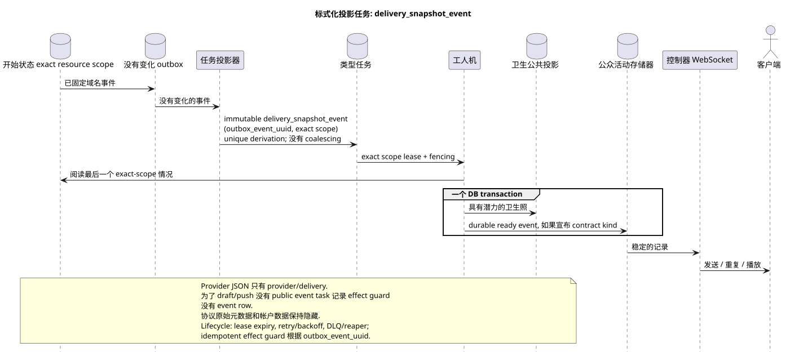

# 类型任务: `delivery_snapshot_event`

[← 文件的主要索引](../../../index.md) · [序列图表的索引](../README.md) · [工作流的分区](README.md)

状态: **建议的背景流;不是终点 HTTP**.

可编辑的源:
[`task_delivery_snapshot_event.puml`](diagrams/task_delivery_snapshot_event.puml).

## 真理的目的和来源

任务将转换到最后一个固定的初始状态 exact resource
scope 准备好的卫生投影和/或可持续的公共活动.
它可以提供提供者/delivery,文件/user等简单的服务. resource-event
flows. 对于没有公开活动的 contract families (例如 draft/push
registration) 同一个处理器将唯一的 effect guard 记录下来,并完成 task
没有创建 public event row. 公共 API 保存当前 JSON;原始
协议元数据,账号数据和内部交付字段不会成为
公共.

## 流量

1. 域名转换以原子更新原始行和不变事件
   outbox.
2. 投影器将源Outbox事件的独立immutable任务输出
   唯一的 `outbox_event_uuid` 和明确宣布的 scope 资源; coalescing
   没有.
3. 工人读取最新的精确范围状态和在 ** 一个 DB transaction**
   卫生投影,与所有相关的
   durable ready public event rows; 两个 commit 或 rollback 效果一起.
   如果当前合约没有 public event resource kind,
   交易只保存 effect guard/task completion,并且不会发明
   event kind.
4. 提交后,一个单独的管理员发送,重复和播放
   已准备的记录; 没有worker
   拥有 WebSocket/网络连接.

## 复习,比赛和一致性

- 没有一个间隔事件被错过:一个 immutable outbox event
  符合一个 immutable task;
- 重复物质化读取了最后的状态,是具有能力的.;
- exact scope lease/fencing, retry/backoff, max attempts/DLQ 保护收割者
  lifecycle; reconciliation 恢复缺失的 derivation;
- 提供商的过时的结尾不应重新写一个更新的
  权威性;具体的比较/版本机制仍然是细节
  提供商当前域名的销售;
- 变更确认 API 和最终的交付投影可能是
  按最终计算的一致性间隔分成;
- 调度器重复不重复提供商/域名更改.

[← 文件的主要索引](../../../index.md) · [序列图表的索引](../README.md) · [工作流的分区](README.md)
