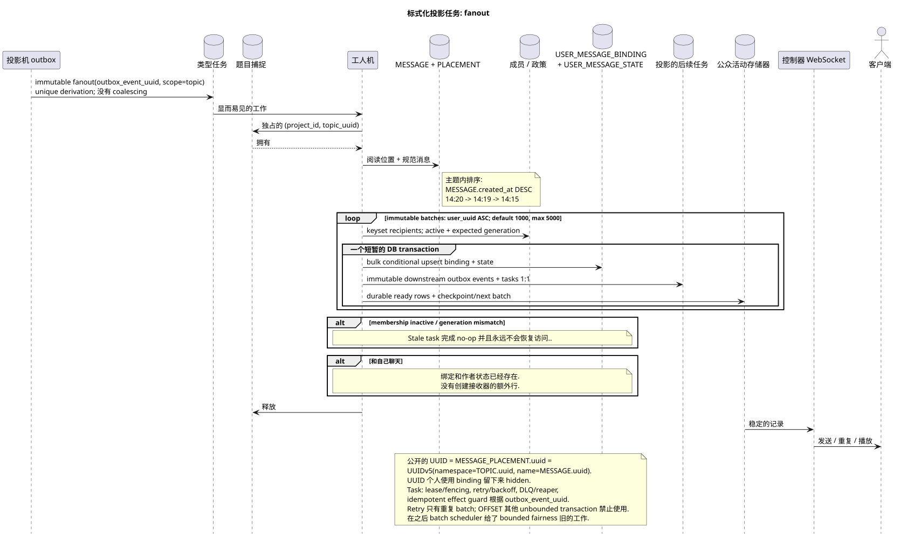

# 类型任务: `fanout`

[← 文件的主要索引](../../../index.md) · [序列图表的索引](../README.md) · [工作流的分区](README.md)

状态: **建议的背景流;不是终点 HTTP**.

可编辑的源:
[`task_fanout.puml`](diagrams/task_fanout.puml).

## 真理的目的和来源

任务可以建立一个缺少的对. `USER_MESSAGE_BINDING` +
`USER_MESSAGE_STATE` 每个被允许的收取者
`MESSAGE_PLACEMENT`. 位置已经包含了正规的
`message_uuid`, `stream_uuid` 并且是强制性的 `topic_uuid`; 沃克没有输出
收件人链接的背景.`MESSAGE`身体上是独身的,
公共 UUID/参数 `{message_uuid}` 是
`MESSAGE_PLACEMENT.uuid = UUIDv5(namespace=TOPIC.uuid, name=MESSAGE.uuid)`.

## 流量

1. 发送同步交易创建 `MESSAGE`, `MESSAGE_PLACEMENT`,
   创作者 `USER_MESSAGE_BINDING` 和 `USER_MESSAGE_STATE`,以及
   由于此,作者可以立即看到消息..
2. 投影机可以在一个事件中输出一个 immutable `fanout` root task
   outbox; 唯一的导出键包含 `outbox_event_uuid`, coalescing
   没有.
3. 斯洛特获得断 `(project_id,topic_uuid)`.
4. 待定的位置是按照规范选择的
   `MESSAGE.created_at DESC`: `14:20`, `14:19`, `14:15`.
5. 沃克读取了最新的成员资格/政策.
   预期的 `membership_generation`;只允许接收者
   `USER_STREAM_BINDING.active = true` 并且是完全一致的. generation.
6. Root 创建了默认 `1000`,最大 `5000` 的不可变批量.
   选择一个 keyset 查询 `USER_STREAM_BINDING.user_uuid ASC` 没有 `OFFSET`;
   设置值在 `1..5000` 之外,阻止 startup.
7. 每一个短批次都会重新检查会员生成和 bulk
   insert/upsert 创建一个唯一的 `USER_MESSAGE_BINDING`
   `(project_id,placement_uuid,user_uuid)`, 通过一代的快照,
   `USER_MESSAGE_STATE`, 唯一的
   `(project_id,user_uuid,placement_uuid)`. Stale task 没有做了什么,也没做
   恢复访问;新一代会员获得新鲜的 binding/state.
8. 在同一批次交易中, immutable downstream outbox
   events 工作和相应的任务 1:1:placement/topic-scoped
   总结在 `topic` 范围内,
   `user-stream`/`user-folder`/`user-topic`; 一个任务与另一个任务相符
   自己的 source event.
9. Binding/state, downstream outbox/tasks 其他 ready event rows commit/rollback
   检查点标/count/status 和下一个 immutable batch
   只有在成功批发后才会得到记录..

聊天与自己已经有版权 `USER_MESSAGE_BINDING` 和
`USER_MESSAGE_STATE` 只有一个可见的参与者.
作者收件器的数量是空的,所以粉丝成功完成没有
收件人的新行,并且没有 UI.

## 复习,比赛和一致性

- 任务允许重复:唯一的键和状态阻止
  复制品;
- retry 只重复当前的 batch; root+start cursor — unique derivation
  key, 已注册的批量不会重播;
- 由于独占的抓住;
- 不同主题可以在设置的限制范围内并行处理;
- 沃克读取最新的初始状态并对待预期的代;
- 任务通过 `pending -> leased/running -> completed/failed`,使用
  lease expiry/fencing, retry/backoff, DLQ 其他 reaper; `outbox_event_uuid`
  提供了具有潜力的 effect guard;
- topic-worker 不改变共享流/folder/message行:为它们创建
  实际领域的任务;
- 绑定时间标记不会改变公开的消息日期/顺序;
- 接收者在原子固定 binding/state/event后看到消息
  延迟;大约一秒钟和`<=1s p95`batch transaction  SLO intent
  测量,没有 hard guarantee;
- 每次批次后,主题可以转到旧工作; newest-first 不
  取消 bounded fairness;
- metrics: batch latency/rows/WAL, recipients remaining, fanout lag, oldest
  batch, retries/DLQ. Unbounded recipient transaction 禁止使用.

[← 文件的主要索引](../../../index.md) · [序列图表的索引](../README.md) · [工作流的分区](README.md)
