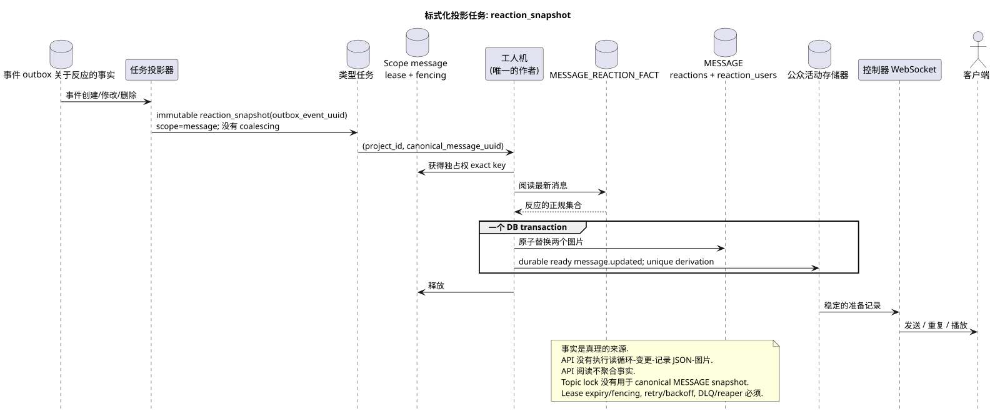

# 类型任务: `reaction_snapshot`

[← 文件的主要索引](../../../index.md) · [序列图表的索引](../README.md) · [工作流的分区](README.md)

状态: **建议的背景流;不是终点 HTTP**.

可编辑的源:
[`task_reaction_snapshot.puml`](diagrams/task_reaction_snapshot.puml).

## 真理的目的和来源

原始行 `WorkspaceMessageReactionFact` 是唯一的来源
商业关键 `(project_id,canonical_message_uuid,user_uuid,emoji_name)` 禁止
一个参与者对正规消息的反应重复.
位置只需要检查访问 API;反应不适用于
具体的位置.

## 流量

1. 创建/修改/删除反应改变了其中一个
   添加一个不变的事件到短的Outbox
   交易.
2. 投影机输出一个 immutable `reaction_snapshot` task source event;
   `outbox_event_uuid` 是一个独特的衍生/effect键.
3. 任务将被转向一个用键的 scope `message`
   `(project_id, canonical_message_uuid)`. 一个lease/fencing token允许
   仅为一个用户记录图片; topic lock 不使用.
4. 沃克读取最新的原始数据,并在一个DB交易中完成
   取代 `MESSAGE.reactions`/`MESSAGE.reaction_users` **和**
   两个效果都与相应的 durable ready `message.updated` rows commit
   或是一起滚回.
5. 提交后,管理员将传输,重复和播放已完成的 rows.

## 复习,比赛和一致性

- 并行参与者安全地插入/删除独立的事实行;
- 商业钥匙的复制品由当前冲突合同处理;
- API 永远不会执行阅读-更改-写入总体 JSON 图片循环;
- 重复任务重建相同的最后状态图片;
- task lifecycle 包含lease expiry,retry/backoff,DLQ 和 reaper; initial
  design 没有执行 coalescing;
- API 阅读/列表不聚合事实,可以简短地返回前一个
  图片;
- 公共投影`provider`/`delivery` 保存,原始
  `provider_metadata`/`delivery_metadata` 没有发表.

[← 文件的主要索引](../../../index.md) · [序列图表的索引](../README.md) · [工作流的分区](README.md)
