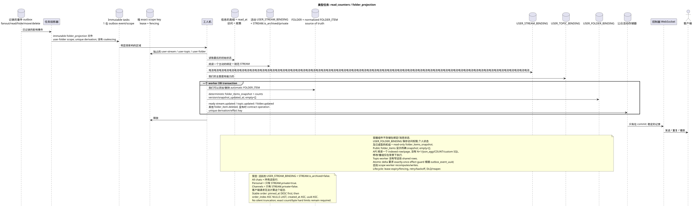

# 类型化任务: `read_counters` 和 `folder_projection`

[← 文件的主要索引](../../../index.md) · [序列图表的索引](../README.md) · [工作流的分区](README.md)

状态: **建议的背景流;不是终点 HTTP**.

可编辑的源:
[`task_read_counters.puml`](diagrams/task_read_counters.puml).

## 真理的目的和来源

单个消息的原始状态包含保存的 `read_at`
(公共的`read = read_at IS NOT NULL`它们的旗.
容器的重复性不应在 `USER_MESSAGE_BINDING`/`USER_MESSAGE_STATE`.
已完成的计时器将存储在唯一的 `USER_STREAM_BINDING
(project,user,stream)`, `USER_TOPIC_BINDING (project,user,topic)` 其他
`USER_FOLDER_BINDING (project,user,folder)`.

规范 `FOLDER` 存储一次; `FOLDER_ITEM` 将其连接到
根据当前的,可以支持的对象,例如`STREAM`,
协议. `USER_FOLDER_BINDING` 定义用户访问权限,
文件的个人状态,并包含未读消息的准备集
并且提到.
规范的 `FOLDER_ITEM`  source of truth 组成,而 read-only
JSONB `USER_FOLDER_BINDING.folder_items_snapshot` — 准备好公开的
形式.空数组等于 `[]`; 线条是串行
确定性和随时准备的计数器 `USER_STREAM_BINDING`.
确切的顺序: pinned items 首先通过 `pinned_at DESC`,然后
其他; 在组内 — `order_index ASC NULLS LAST`, `created_at ASC`,
`uuid ASC`. 版本/时间快照内部和不替代公众
时间标记. 照片不会被切,
数字硬限制 count/bytes 和兼容的政策
系统性 `All chats`.
系统绑定文件具有固定的内部规则和类型,
没有任何问题.`FOLDER_ITEM`它们是可重建的投影.
源词 活跃 `USER_STREAM_BINDING`,连接到正规的
`STREAM`, 对于 `STREAM.is_archived = false`. `All chats` 包括所有
这样的行, `Personal`  只有行 `STREAM.private = true`, `Channels`
— 只有 `STREAM.private = false`.

## 触发器和流量 {#триггеры-и-поток}

单独的任务在阅读帖子/主题/流之后出现,
在此之前读取,隐藏,移动,删除消息/消息,
变更会员/政策,创建/更新/删除`USER_STREAM_BINDING`,存档
改变`STREAM.private`和其他操作,改变有效的
没有读到的消息的分类.

1. 之前的交易或 worker 写单独的 immutable
   outbox event 对于每个实际区域,新UUID;投影器
   在每一个事件中,
   `UNIQUE(project_id,outbox_event_uuid)`. 对于文件 exact kind —
   `folder_projection`, exact scope —
   `user-folder:(project_id,user_uuid,folder_uuid)`; coalescing 没有.
2. 拥有者 exact scope 租用 fencing token: `user-stream`,
   `user-topic` 或 `user-folder`. Topic-worker 不会记录这些 shared rows.
   业主阅读最新的信息,访问和通知政策.
3. 工作者可以将 `raw`/`active`/`passive`和
   `last_message_uuid` 关键字  关键字  关键字  关键字
   用户的主题,而已准备 `unread_count` 和集目引用文件 —
   在用户文件中绑定.
4. 系统文件,它读取当前的活跃 `USER_STREAM_BINDING` 和
   圣经中的`STREAM`只有一个`STREAM.is_archived = false`然后
   进力带来自动 `FOLDER_ITEM` 规则:所有剩余
   对于 `All chats`, `STREAM.private = true` 和 `Personal` 的行
   `STREAM.private = false` 为了 `Channels`.
5. 在 **一个 worker DB 交易** 拥有者 exact scope 输出
   automatic `FOLDER_ITEM` 取代了现成的投影,
   state/snapshot/version/timestamp, 并且所有 ready
   `topic.updated`, `stream.updated`, `folder.updated` 或
   `folder_item.deleted` event rows 对于真正变化的资源.
   由于失败,投影也会被推翻, ready event rows.
6. 只有在 commit 之后,管理员才会发送,重复和播放
   长期记录;它不会创建 business event.

视图 API 流/主题/文件只连接一个已完成的
对于文件`folder_items`来说,它已经在这个行中
准备好了JSONB它们没有
执行 `COUNT`, `GROUP BY`,窗口,侧面或相关请求,而不是
通过传输,我们可以通过传输,
修改/重建任务.

## 复习,比赛和一致性

- 任务读取最新的源,并确定取代投影;
- 容器的独特用户密钥排除竞争行
  机组设备;
- 同时对exact scope key有一个lease;不同的领域可以
  更新并行,并可见 eventual-consistently;
- 只有在 exactly-once effect guard 时才允许电表的原子三角
  `outbox_event_uuid`; 否则, scope worker 定制地重新计算,
  取代行;
- task lifecycle, lease expiry/fencing, retry/backoff, max attempts/DLQ 其他 reaper
  符合一般的架构; initial design 不符合 coalescing;
- 复发安全; 准备好事件仅在
  关于固定情况;
- 客户端的记录的响应可能会比更新提前大约一秒
  总结了这个问题..

[← 文件的主要索引](../../../index.md) · [序列图表的索引](../README.md) · [工作流的分区](README.md)
