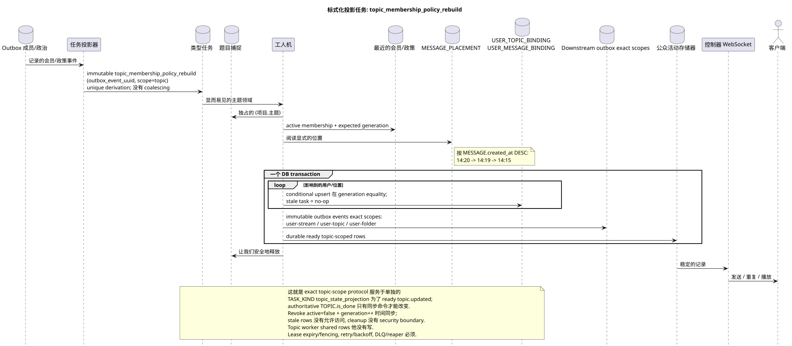

# 类型任务: `topic_membership_policy_rebuild`

[← 文件的主要索引](../../../index.md) · [序列图表的索引](../README.md) · [工作流的分区](README.md)

状态: **建议的背景流;不是终点 HTTP**.

可编辑的源:
[`task_topic_membership_policy_rebuild.puml`](diagrams/task_topic_membership_policy_rebuild.puml).

## 真理的目的和来源

任务更新用户在主题,权限和受影响的已准备的可见性
成员/政策变更后的投影. 规范 `TOPIC` 保存一个
访问,通知和用户计数器属于唯一的
`USER_TOPIC_BINDING (project,user,topic)`. 预设的消息语境
只有从明显的 `MESSAGE_PLACEMENT` 来,而不是从束中得到.

## 流量

1. 成员/政策团队记录了权威变化和不可变化
   事件 outbox.
2. 投影器将源Outbox事件的单独immutable任务输出 scope
   `topic`; `outbox_event_uuid` 唯一的,没有合并.
3. 一个插槽获得主题的独占权;不同的主题可以
   处理平行到设置的限制.
4. 工作者阅读最新会员/政策和公开的位置;
   membership-dependent task 带来了预期的 `membership_generation`.
5. 条件-upsert 工作者创建/更新访问行和相应的
   durable ready topic-scoped event rows 在一个DB交易中,只需要 active
   `USER_STREAM_BINDING` 并且一致 generation; stale task 执行 no-op.
   Revoke 已经同步禁止阅读路径,而清理旧行是不
   security boundary.
6. 工人产生了单独的 tasks `user-stream`/`user-topic`/`user-folder`
   对于共享行; topic worker 不会自己修改它们,也不会执行重量级的任务
   在查询中的组件 API.
7. 在 commit 之后,单独的管理器将 ready topic-scoped events.
   投影/ready 流,文件和其他共享行事件
   单独的 exact-scope 任务,也在交易中以原子为对..

## `topic_state_projection` {#topic_state_projection}

同一个 topic-owned flow 记录了单个精确的 TASK_KIND
`topic_state_projection`: 在同步 commit 之后,
`TOPIC.is_done`/version 他在范围 `(project_id,topic_uuid)` 原子固定
准备好 `topic.updated` 如果它是物理上的需要, rebuildable read-only copy.
这个任务不改变 authoritative `TOPIC.is_done`,并且有自己的 source
outbox event/`outbox_event_uuid`.

## 重复,秩序和一致性

- 工作人员得到显式的任务;扫描表格寻找缺失的
  没有使用绑定;
- 按主题内大量建立链接的信息
  `MESSAGE.created_at DESC` (`14:20`, `14:19`, `14:15`) 并且保证最终
  进步;
- 唯一的键将用户绑定到主题中,避免访问/状态行重复;
- 这个任务读取了最新的策略并检查 generation;重复是有潜力的
  根据 `outbox_event_uuid`;
- lease expiry/fencing, retry/backoff, max attempts/DLQ 必须有收割者;
- 修改/修复从未启动`GET`或列表操作;
- 用户可以简单地查看之前的访问/计数器
  投影; 随着现成事件状态REST和WebSocket一致.

[← 文件的主要索引](../../../index.md) · [序列图表的索引](../README.md) · [工作流的分区](README.md)
