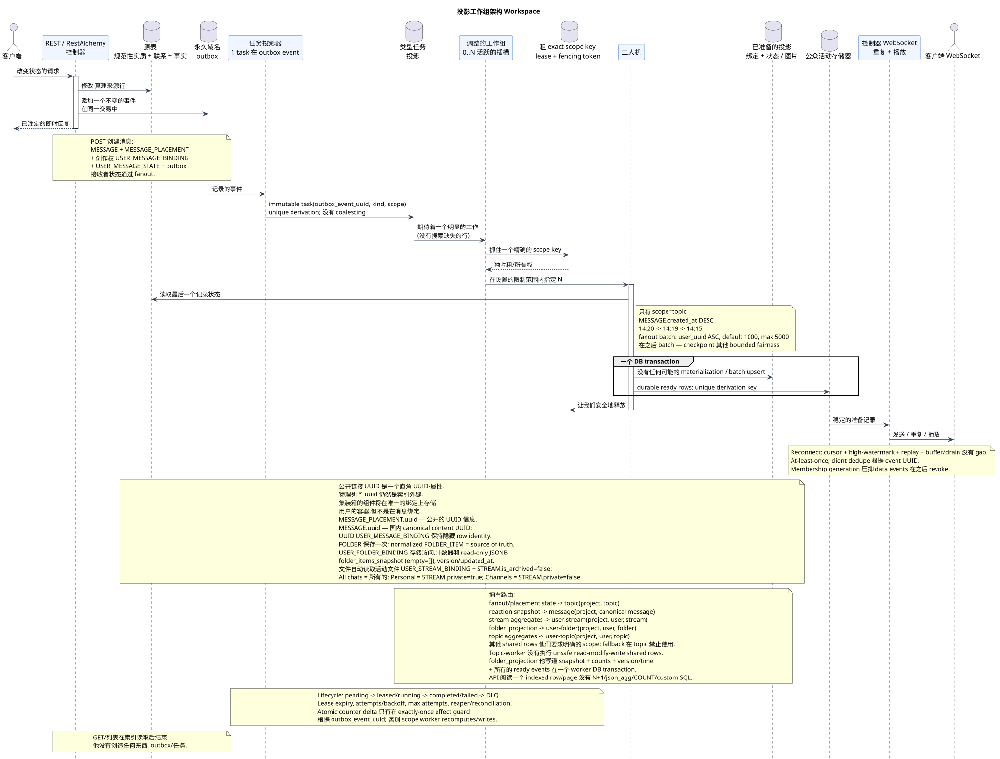

# 工厂的架构

[← 文件的主要索引](../../../index.md) · [序列图表的索引](../README.md) · [工作流的分区](README.md)

状态: **建议从文档开始;公开 API Workspace 不变**.

这份文件描述了规格引用的通用背景路径
没有选择生产实现,
配置,排队/租技术, SQL.

可编辑的源:
[`worker_architecture.puml`](diagrams/worker_architecture.puml).

## 边界 API 和背景处理

每一次改变状态的交易API都会原子化改变行源
并将不可变域事件添加到交易日志中
(transactional outbox). `GET` 并且列表操作不会产生事件或
问题. 在最初的设计中.**没有合并**每一个事件 outbox
符合一个单独的不变型式任务
`outbox_event_uuid`/通过 derivation 键.重复执行相同的函数
事件是无效的,不会产生重复.
取代真理的来源:每次执行时,worker
已固定行.

暂时发送的消息限制 `MESSAGE` +
`MESSAGE_PLACEMENT` + 创作者 `USER_MESSAGE_BINDING` + 创作者
`USER_MESSAGE_STATE` + transactional outbox. 绑定 (binding) 和状态
每个收件人通过风机发送器一起创建
(fan-out) bounded batches; 收容器和公共活动会出现.
已经存在的作者链接和状态; fan-out 不会创建
收件人的额外行.

## 并行性和秩序

- 设置一个同时活动的工作机插槽的最大数量
  配置; 参数名称和执行机制保持开放;
- 专利所有权单位 —
  `(project_id, topic_uuid)`, 而不是流量.;
- 一个主题同时不超过一个插槽;不同的主题
  在 `N`;
- `MESSAGE.created_at DESC`: `14:20`,然后
  `14:19`, 然后 `14:15`;
- 任务和绑定的临时标记不会改变顺序或公开的临时标记
  消息标记;
- 稳定的指针在相同的时间,实现抓取和有限的
  公正仍然是实现狭窄的开放解决方案;
- 从新条目到旧条目处理不能永久地阻止旧条目
  工作.

Fan-out root 扫描一个 active `USER_STREAM_BINDING` 键盘 `user_uuid ASC`,
不是 `OFFSET`. 默认批量 `1000`,硬最大 `5000`;配置不在
`1..5000` 没有启动验证. batch commit
标/count/status 固定,然后才出现下一个 immutable
batch. Scheduler 后 batch 给了旧的 roots/history;一个
没有大观众. unbounded transaction.

## 拥有投影

`TOPIC` 没有一个通用的锁定.
`scope_kind` 并且精确`scope_key`;同时不超过一个租
具有一个密钥的fencing token. 不同的密钥和不同类型的区域
在池限度范围内并行处理:

| 任务类型 | 拥有范围 | 记录保证 |
| --- | --- | --- |
| `fanout`, placement-scoped `content_mentions`, history/backfill | `topic`: `(project_id, topic_uuid)` | 连续工作,在一个主题上进行 placements/bindings `MESSAGE.created_at DESC` |
| `reaction_snapshot` 其他神圣信息的图片 | `message`: `(project_id, canonical_message_uuid)` | 一位作者 `MESSAGE.reactions`/`reaction_users` |
| 流量组件 | `user-stream`: `(project_id, user_uuid, stream_uuid)` | 一个已准备的行作者 `USER_STREAM_BINDING` |
| `folder_projection` | `user-folder`: `(project_id, user_uuid, folder_uuid)` | 一个作者normalized `FOLDER_ITEM`, `folder_items_snapshot`,准备计数器和 ready event |
| 题目组合 | `user-topic`: `(project_id, user_uuid, topic_uuid)` | 一个已准备的行作者 `USER_TOPIC_BINDING` |
| 交付和其他一般行 | 显然宣布的区域,符合物理行 | 禁止隐性反弹 `topic` |

Topic-worker 执行不安全的读-修改-写通行.
只有原子增量/decrement才允许 exactly-once
effect guard, 唯一的 `outbox_event_uuid`;否则,相关的所有者
它们可以通过测量,分析,分析,分析,
没有同步全球交易:他们的结果和公开
事件可能在不同的时间内出现 eventual
consistency.

`MESSAGE`, `STREAM`, `TOPIC` 和 `FOLDER`  唯一的定律实体
位置明确地表示信息的背景.
UUID `MESSAGE_PLACEMENT.uuid` 的消息; 定制的 `MESSAGE.uuid` 仍然存在
内部 UUID 内容,而 UUID 用户绑定仍然隐藏
字符串的技术身份.
容器的用户组件将存储在唯一的
`USER_STREAM_BINDING`, `USER_TOPIC_BINDING` 其他 `USER_FOLDER_BINDING`.
`USER_MESSAGE_BINDING`/`USER_MESSAGE_STATE` 仅存储访问和状态
一个消息 (`read_at`,`mentioned`/`starred`/`pinned`和类似的旗),但
永远不会包含容器计数器.

规范 `FOLDER` 存储一次. `USER_FOLDER_BINDING` 定义
用户访问,其个人状态和未读的
没有任何消息或提及.`FOLDER_ITEM`将文件与正规文件连接
支持的对象,例如`STREAM`,根据当前的公开
系统文件的自动组合只由活跃文件构建.
`USER_STREAM_BINDING`, 连接到正规的 `STREAM`,
`STREAM.is_archived = false`: `All chats` 包含所有这些流.,
`Personal` — 只有 `STREAM.private = true`, `Channels`
`STREAM.private = false`. 公共终端, JSON 和用户
文件和文件元素 (`folders`/`folder_items`) 的语义没有
变更的.

标准化 `FOLDER_ITEM` — source of truth. `USER_FOLDER_BINDING`
也可以保存读式JSONB`folder_items_snapshot`
公共形式 (`[]`用于空文件),内部版本和时间
更新. `folder_projection` 将 items 串行到稳定的顺序中,
原子式记录快照 + 计数 + 版本/timestamp + 所有 ready event
rows. 只有在 commit 之后,管理器才能传递这些事件.. API
读取一个已完成的行/页面,没有N+1,`json_agg`,`COUNT`, custom SQL.

类型化任务并不断更新准备的投影 (projection).
仅允许从原始事实或绑定恢复为背景
校正,表示API只有简单的索引
没有一个接一个或多接一个的连接,
查询 `COUNT`, `GROUP BY`,窗口,侧面或相关查询.

现实反应是真理的源泉. `message`
实现了可规的 `MESSAGE.reactions` 和 `MESSAGE.reaction_users`; API
不执行阅读-更改-写入的一般循环» (read-modify-write) JSON.

## 公共活动和运输

Handler 记录了物质化状态和所有相关的 durable ready event
rows 在一个DB交易中:两个 commit 或 rollback 效果一起. Unique
event derivation key 通过 `outbox_event_uuid` 防止在 retry.
单独的 WebSocket 调度器不会创建业务事件:它会读 durable
store, 网络发送不会影响
长久使用.

Reconnect 发送器将记录
high-watermark, replay 所有新的可见行,缓冲活尾声和
drain-提供 at-least-once;客户端在事件 UUID 并且
cursor advance 只有经过处理.
`epoch_pruned`/`410`; retention window 留下来 operational policy. Data event
audience 存储会员代,所以 inactive/new generation
抑制了之后的stale delivery/replay revoke.

## 故障保证

- 修改源并添加到Outbox中;
- derivation 使用一个唯一的 `(project_id, outbox_event_uuid)`,所以
  复制不会创建第二个任务,而调整则重建
  事件记录和事件记录之间丢失的 derivation;
- 任务的生命周期: `pending -> leased/running -> completed` 或
  `failed -> pending` 后面是 `attempts`, `next_retry_at` 和 backoff;
  `max_attempts` 任务进入 DLQ;
- 租金存储了 owner, expiry 和 fencing token; Reaper 返回了过期的
  `running` 工作任务,而老版主无法记录;
- 由于独特的商业密钥,重复运输是安全的,
  `outbox_event_uuid` effect guard 并且可以通过投影记录来;
- 工人交易故障会推翻投影, ready events; retry
  它们的效果是:;
- 管理器重复不会重复域名更改,使用稳定
  事件标识符/标;
- 计量表覆盖 lag, pending/running age, retries, expired leases, stuck
  tasks 和 DLQ;没有凝聚意味着每个事件一个任务,
  因此,capacity/backpressure是运营的必不可少部分.

## 类型任务目录

| 任务类型 | Scope kind/key | 准备好结果 |
| --- | --- | --- |
| `fanout` | `topic`: `(project_id, topic_uuid)` | 接收器的 `USER_MESSAGE_BINDING` + `USER_MESSAGE_STATE` 组 |
| `content_mentions` | `topic`: `(project_id, topic_uuid)` 对于安装状态; 单独的下游任务 | 位置提及旗 |
| `reaction_snapshot` | `message`: `(project_id, canonical_message_uuid)` | 图片 `reactions` + `reaction_users` |
| `read_counters` | `user-stream`: `(project_id, user_uuid, stream_uuid)` | 已准备的机组 `USER_STREAM_BINDING` |
| `folder_projection` | `user-folder`: `(project_id, user_uuid, folder_uuid)` | normalized items + `folder_items_snapshot` + 计数器 + 版本/timestamp + 准备事件 |
| `read_counters` | `user-topic`: `(project_id, user_uuid, topic_uuid)` | 已准备的机组 `USER_TOPIC_BINDING` |
| `delivery_snapshot_event` | `message:(project_id,canonical_message_uuid)` 为了交付或 `resource:(project_id,resource_kind,resource_uuid)` | 卫生投影/ready事件或 effect-guarded no-public-event completion |
| `topic_membership_policy_rebuild` | `topic`: `(project_id, topic_uuid)`; shared rows — 实际领域的单独任务 | 已准备的绑定/许可 |
| `topic_state_projection` | `topic`: `(project_id, topic_uuid)` | ready `topic.updated` 其他 read-only copies canonical `TOPIC.is_done` |

详细的任务流:

- [`fanout`](task_fanout.md)
- [`content_mentions`](task_content_mentions.md)
- [`reaction_snapshot`](task_reaction_snapshot.md)
- [`read_counters`](task_read_counters.md)
- [`delivery_snapshot_event`](task_delivery_snapshot_event.md)
- [`topic_membership_policy_rebuild`](task_topic_membership_policy_rebuild.md)

[← 文件的主要索引](../../../index.md) · [序列图表的索引](../README.md) · [工作流的分区](README.md)
