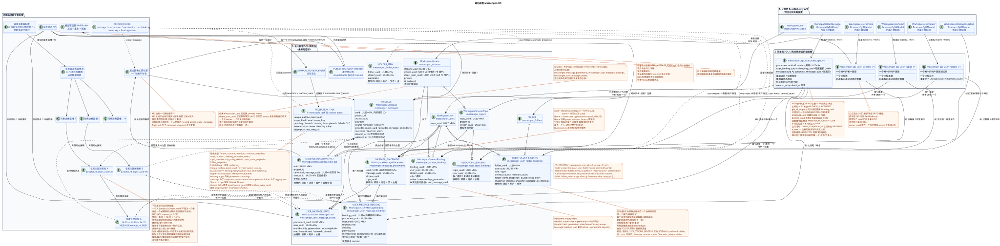

# 域名模型 Messenger API

状态: ** 未来改造的项目提案**.

这份文件描述了目标内部设备MessengerAPI.
改变当前路线, JSON 字段,过器,页面,活动,事件
没有WebSocket现在的公开合同是
[`workspace_api.md`](workspace_api.md) 并且仍然是固态.
域名解决方案描述在
[`messenger_domain_model.md`](messenger_domain_model.md).
具体的声明 RestAlchemy,显示字段和完整的合同
它们的主要终点位于
[`messenger_restalchemy_api_spec.md`](messenger_restalchemy_api_spec.md).

术语在 [总词典](index.md#глоссарий-проектной-документации):
交易日记,交易日记,交易日记
事件 (transactional outbox),投影 (projection),风传播
(fan-out) 和背景表演者 (worker).

## 现状和项目建议之间的边界

目前已经存在公共域名模型
`WorkspaceUserMessage`, `WorkspaceUserStream`, `WorkspaceUserTopic` 其他
`WorkspaceUser`. 首先三个是从 SQL 表示中读取的, Messenger
它们使用的是 `StoreResourceController` 和 `sql_canonical_store`.
现在的表现是由集群,侧/相关的子查询和
阅读路径上的其他计算.

目标模型保留了资源的公开名称和形式,但只改变了它们
内部来源:

- 物理存储在SQLRestAlchemy模型中存储了正规数据,
  预先实现的用户状态;
- SQL-只有阅读的表达适应平面形状,不执行重度表达
  计算的;
- `ResourceByRAModel`, 标准`objects`/`filters`和标数UUID属性
  对于公开的 UUID 链接,实体列保持索引 FK;
  具有页面化的控制器可为正常的阅读方式提供服务;
- 接着,限制区域和重新定义控制器只留在需要的地方
  IAM-语境,保存 query/header 和 marker shape 的名称 target
  页面化 `100/500`,或者域名活动;
- 手写的 SQL 和当前的非标准的 SQL 存储器不属于基本存储器
  请求路径.

没有一个表名或新列标记为设计
通过批准的迁移.
终点或字段.

## 三层

可编辑的PlantUML源:
[`messenger_api_domain_model.puml`](diagrams/messenger_api_domain_model.puml).

| 公众 RestAlchemy 模型 | 已确认的当前源 | 目标来源 |
| --- | --- | --- |
| `WorkspaceUserMessage` | `m_workspace_user_messages_view` | `messenger_api_user_messages_v1`: 引领 `USER_MESSAGE_BINDING`,一个索引的关联 placement/message/state. |
| `WorkspaceUserStream` | `m_workspace_user_streams` | `messenger_api_user_streams_v1`: 领先的 `USER_STREAM_BINDING`,准备计时器和一个 canonical stream. |
| `WorkspaceUserTopic` | `m_workspace_user_topics_view` | `messenger_api_user_topics_v1`: 领先的 `USER_TOPIC_BINDING`,已准备好用户计数和一个 canonical topic global `is_done`. |
| `WorkspaceUser` | `m_workspace_users` | 直接的目标 `WorkspaceUser`/`messenger_users`;不需要单独的可计算的视图. |

`WorkspaceStreamBinding`, `WorkspaceStream`, `WorkspaceUserTopicFlags`,
`WorkspaceStreamTopic` 和 `WorkspaceUser`  已确认的当前名称
RestAlchemy-现在的物理 `WorkspaceMessage` 使用
`m_workspace_messages`; 这个名字仅用于对比.
未来迁移的目标句子使用单一的对
模型/表格: `WorkspaceMessage`/`messenger_messages`,
`WorkspaceMessagePlacement`/`messenger_message_placements`,
`WorkspaceUserMessageBinding`/`messenger_user_message_bindings` 其他
`WorkspaceUserMessageState`/`messenger_user_message_states`. 这些名字是
对于未来的移民,但尚未存在
工作方案.

RestAlchemy `relationships.relationship` 不用于 UUID 字段,
它们的作用者 JSON 返回 UUID:关系将被串行为
URI. 例如,公共 `WorkspaceStream.owner` 普通 UUID 属性,而
物理 `owner_uuid`  索引 FK 在 `WorkspaceUser`
`ON DELETE RESTRICT`. 同样的分离API/BD适用于公开
`author_uuid`, `user_uuid`, `message_uuid`, `stream_uuid`, `topic_uuid` 其他
其他 UUID - 链接的现有合同. UUID 发布的位置是
`WorkspaceUserMessage.uuid`; 隐藏的`binding_uuid`和内部的规范
`MESSAGE.uuid` 仍然是物理外部上方的尺度性质UUID
关键/身份,但不属于当前的公共 JSON.
完整性不转移到验证中
具体的FK限制和行动列在
[`messenger_restalchemy_api_spec.md`](messenger_restalchemy_api_spec.md#uuid-свойства-в-api-и-внешние-ключи-в-бд).

## 消息:从公开 UUID 位置的绑定行

### 物理实体

目标设计 `WorkspaceMessage` (`messenger_messages`) 得到语义
规范的`MESSAGE`;现有表单仅与
现在的状态.在未来的迁移后,一个目标记录会保存一个
副本:

- 内容和作者;
- 田间投影 `source`, `provider`, `delivery`;
- 已实现的 `reactions` 和 `reaction_users`;
- 公共 `created_at` 和 `updated_at`.

`MESSAGE.uuid` — 唯一记录的稳定的内部标识符
内容.所有答案中的公众标识符, URL —
`MESSAGE_PLACEMENT.uuid`, 对于所有使用者来说是相同的,
不同的不同主题相同的规范 `MESSAGE`.

目标物理模型分为三个概念:

- `MESSAGE_PLACEMENT` — 在一个规范的全球背景`MESSAGE`
  特定的流/主题,
  `(project_id,message_uuid,stream_uuid,topic_uuid)`; `topic_uuid` 必须;
- `USER_MESSAGE_BINDING` — 用户访问特定位置,
  视觉和分辨率,
  `(project_id,placement_uuid,user_uuid)`;
- `USER_MESSAGE_STATE` — 用户唯一的位置和行
  保存 `read_at` (公共) `read = read_at IS NOT NULL`), `mentioned`,
  `starred`, `pinned` 其他国旗,
  `(project_id,user_uuid,placement_uuid)`.

用户绑定具有自己的隐藏 UUID 生命周期
并且恢复了该物体. UUID 位置,相反,被发布为
消息标识符. `revision`或绑定版本不存在.
复制创建新的显式`MESSAGE_PLACEMENT`和需要的用户
绑定,但保留了原来的内部 `MESSAGE.uuid`.

### 已作出决定 UUIDv5

`MESSAGE_PLACEMENT.uuid` 确定性计算为
`UUIDv5(namespace=TOPIC.uuid, name=MESSAGE.uuid)`. Namespace — 规范性
全球独一无二的 UUID 主题; 名称  只有可规的 UUID 消息
lowercase hyphenated ASCII-没有子,前和额外的表达
项目和流不是 name.

只有在物理变量中,它是安全的:每个 `TOPIC` 都属于
它们的所有权是`PROJECT`和`STREAM`的,而其所有权/identity是不可变的.
创建一个新的主题.`TOPIC`更多的移民, update
现在我们可以使用UUIDv5没有取代权威的 business key
`(project_id,message_uuid,stream_uuid,topic_uuid)`, 组合FK和检查
相关的 topic project/stream.

### 平面模型 `WorkspaceUserMessage`

仅读 `messenger_api_user_messages_v1` 的目标
模型从一个行开始 `USER_MESSAGE_BINDING` 并执行
索引连接一个
`MESSAGE_PLACEMENT`, 一个 `WorkspaceMessage` 和一个
`USER_MESSAGE_STATE`. FK 和唯一密钥禁止行复制: 一个
用户绑定给出一个公开行.

| 公开字段 | 来源 |
| --- | --- |
| `uuid` | `MESSAGE_PLACEMENT.uuid`; 确定公众标识符 placement. |
| 隐藏的 `binding_uuid` | `USER_MESSAGE_BINDING.uuid`; 唯一的技术身份是 ORM 行,目前的公共文件中没有 JSON. |
| 国内 `message_uuid` | `MESSAGE.uuid`; 现有公共的内容 JSON. |
| `project_id`, `user_uuid` | 使用者绑定/状态区域. |
| `stream_uuid`, `topic_uuid` | 文本从 `MESSAGE_PLACEMENT`. |
| `read`, `mentioned`, `starred`, `pinned` | 用户的准备状态,可从 `USER_MESSAGE_STATE`; `read`  梯形投影中进行放置 `read_at IS NOT NULL`. |
| `is_own` | 简单的尺度比较`user_uuid`和`MESSAGE.author_uuid`的绑定;它不需要绕过其他行. |
| `author_uuid`, `payload` | 规范性 `MESSAGE`. |
| `source_name`, `source`, `provider`, `delivery` | 定制性 `MESSAGE`;内部存储器 `provider`/`delivery` 不会公开. |
| `reactions`, `reaction_users` | 预先实现的正规状态`MESSAGE`,没有读取表现中的聚合物. |
| `created_at`, `updated_at` | 只有正规的 `MESSAGE`. |

公共时间标记从创建或修改时始终不会被删除
发送者和收件人看到的都是同一天,
接收者被绑定后出现./
固定/改变可见度可能会改变
技术状态/绑定时间标记,但不是公开的
`WorkspaceUserMessage.updated_at`.

按密钥进行公开排序和页面化合同
`(created_at, uuid)`: `created_at` 来自 `MESSAGE`,而 `uuid` 来自
`MESSAGE_PLACEMENT`. 没有
现在没有重复的时间标签或排序键
经批准.

如果用户有多个位置,一个正规的 `MESSAGE`,列表
包含多行,不同的公共位置.UUID其他
`stream_uuid`/`topic_uuid`; 隐藏的 `binding_uuid`
它们仍然是独一无二的.`get_id_property()`仅供恢复/显示
没有RestAlchemy公共资源适配器和路线使用
`MESSAGE_PLACEMENT.uuid` 并且从来没有公布过内部信息. binding key.
获取和placement-scoped actions 完全恢复一个可见的
通过`(project_id,current_user,placement_uuid)`. 页面标记器  公共
placement UUID; 控制器恢复稳定的边界
`(MESSAGE.created_at,MESSAGE_PLACEMENT.uuid)` 没有隐藏的. `binding_uuid`.

### 反应

对于反应来说,真相的来源是单独的变化线.
业务密钥行
`(project_id, canonical_message_uuid, user_uuid, emoji_name)`
代表一个特定用户对规则的反应 `MESSAGE`;
视觉绑定是唯一可以用于
检查公开的访问/许可证.UUID反应是正规的
全球和故意在所有位置的信息,即使他们的
隐私权交易被认为是 Critic risk
#8 并且不是 OPEN.

公共字段`reactions`和`reaction_users`将保存,而不会被重命名为
唯读图片在 `MESSAGE`. 创建/更新/
删除请求交易中的反应,改变了一个事实行,而不是
执行一个循环 阅读 更改 记录 总 JSON. fenced
拥有者 scope `message` 具有 `(project_id, canonical_message_uuid)` 键的读取
作为唯一的作家,
实际是真理的来源,照片可以重构,
它们更新的短暂延迟是最终的协议
计算 (eventual consistency).

## 用户阅读模式,流和主题

### `WorkspaceUser`

`WorkspaceUser` 成为一个直接的目标物理模型
`messenger_users`; `m_workspace_users` 这里只涉及到 current-runtime
comparison 在上面.
标准的 `ResourceByRAModel` 隐藏了供应商内部的标识符,
保持当前的公众投影.
只通过索引外部键引用用户
«许多对一个并不会汇总用户数据.

### `WorkspaceUserStream`

`WorkspaceUserStream` 保持当前的公共领域,但目标表示
由现有用户`WorkspaceStreamBinding`构建:

- 成员/角色/通知和用户领域状态从绑定中获取;
- 标准名称/描述/来源/隐私/默认主题和时间标记
  它们是从一个 `WorkspaceStream`;
- 未读消息计数器和其他预先计算状态
  直接在唯一的绑定行中实现
  `(project_id,user_uuid,stream_uuid)`;
- `last_message_uuid` 也可以作为现成的物质保存,而不是
  每次读取时都会用边向下查询搜索;
- 显示个人聊天名字只能使用简单的
  索引连接 多个对一个 带 `WorkspaceUser`,没有风
  传播.

物理 `WorkspaceStream` 存储 `owner_uuid` 和初始
`direct_user_uuid` 作为一个标数 UUID FK. `owner` — alias
`owner_uuid AS owner`, 而是公开的 `direct_user_uuid` viewer-relative: owner
看到 `stream.direct_user_uuid`,第二个参与者 — `stream.owner_uuid`, self-chat
— 自己的UUID. 视图只使用标数`CASE`在一个流行和
引领的 `USER_STREAM_BINDING`; list/get/event snapshot 的图像相同
语义,关系 URI 或一个到许多的加入不需要.

物理 `WorkspaceStreamBinding` 在撤销时不会被删除.
`active` 并且单调`membership_generation`经历了修改/re-add,而不是
添加到 public 中JSON. Message/reaction view/action总是检查 active
membership 和相匹配 generation snapshot; 仅仅是可视性绑定
是 authorization.

创建一个 `direct_user_uuid` 总是保留流 `private=true`.
如果 UUID 是当前的用户,那么它与自己进行聊天:
只有一个用户可以看到流..
通过发送给聊天,你会产生一个可规的 `MESSAGE`,一个明显的
位置,作者和其独特的绑定`USER_MESSAGE_STATE`;风扇
发送给收件人并没有产生其他用户联系,
只有当前状态,所以消息只出现一次
用户.

默认情况下不输入单个用户状态表:
访问和投影生命周期使用相同的独特
只有单独的用户/流的卡丁度才能被分类.
证明的需要.

### `WorkspaceUserTopic`

`WorkspaceUserTopic` 使用目标表达
`messenger_api_user_topics_v1`. 领先的物理线成为独特的
`USER_TOPIC_BINDING` `(project_id,user_uuid,topic_uuid)`:

- 通知模式和用户领域的计数器从准备的
  `USER_TOPIC_BINDING`;
- 全球 `is_done`,名字/流/来源/配置 摘要和正规
  时间标记来自一个 `WorkspaceStreamTopic`/`TOPIC`;
- `last_message_uuid`, 陈旧的信号和未读消息的计数器
  提前提供;
- 提交消息不能用于计算或搜索最后一个消息.

主题级集体存储在这个绑定行.
默认状态不被引入;公众演出执行一个
标记式主题的索引连接.

### 文件

规范性`FOLDER`和独特的 `(project_id,user_uuid,folder_uuid)`
`USER_FOLDER_BINDING` 分开文件的一般数据和用户文件
视力/状态. `unread_count` 和 `mention_count` 直接存储在
连接与仅读 JSONB `folder_items_snapshot`,其内部
版本和更新时间. 公共 `folder_items` 显示图片
直接 (`[]`为空文件),而文件阅读表示将一个文件连接
已经将链接到一个正规文件的行.
`unread_count`, `active_unread_count` 并且 `passive_unread_count` 取自
根据索引密钥,相应的 `USER_STREAM_BINDING`
文件或文件元素都无法显示
执行 `COUNT`, `GROUP BY`,相关请求或绕行绑定
信息.

`FOLDER_ITEM` 将文件与可规则支持的对象联系起来,例如
对于系统文件,
它们的 `USER_FOLDER_BINDING` 包含一个不能被固定的 `rule`/`type`
通过普通用户操作删除或任意更改.
系统文件预先在自动文件中实现 `FOLDER_ITEM`:

- `All chats` — 所有可访问的非档案流;
- `Personal` — 可用非档案流,有规范的 `private = true`;
- `Channels` — 已访问的非档案流 `private = false`.

这是一个精确的 `Personal` 标准:它被定义为 `private = true`,而
没有存在的`direct_user_uuid`.
`USER_STREAM_BINDING` 和规范的 `STREAM` 有强制性的
`is_archived = false`; 然后 `private` 分别为 `Personal` 和 `Channels`,
`All chats` 任何变化都会引起更多的关注.
标准化 items/pin或自动组合的 transactional outbox
并且输出无变的任务 `folder_projection` 没有结合, scope
`user-folder:(project_id,user_uuid,folder_uuid)`. 背景表演者带来
`FOLDER_ITEM` 现有的真理来源和原子替代了准备
照片,计时器,投影版本/时间和准备式事件.
读取返回一个没有 N+1, `json_agg`, `COUNT`
和 custom SQL;任务结束前显示上一个图片.

## 显示 RestAlchemy 和控制器

目标实现遵循常规风格 Exordos Core:

1. 物理实体使用 `SQLStorableMixin`,标准
   `objects`/`filters` 它们是形的.UUID未来的图形将保持
   显然选择的引用键的外部键的索引限制
   公共 UUID 永远不会变成 URI 关系
   RestAlchemy.
2. 公共阅读模型通过 `ResourceByRAModel` 显示,
   隐藏字段和仅读权限.
3. 收藏服务`BaseResourceControllerPaginated`与最小的
   重新定义和添加项目/用户领域的限制.
   Target policy: 缺少的 `page_limit` 和 `0` 返回 `100`, `1..500`
   负/不整/大于 `500` 得到 HTTP `400` 没有
   clamp; unbounded mode 没有. 已确认的现行实现缺口
   项目建议中分离:缺少的 `page_limit` 和
   `page_limit=0` 现在可以看到无限的负或
   HTTP `400`,而正值没有
   目标 `100/500`  意识
   observable compatibility change, 而不是当前的描述 runtime.
4. 狭义重新定义是允许保留现行组成
   关键和当前IAM/域活动,但它
   通过模型/过器 RestAlchemy,而不是原料 SQL或
   存储器的单独抽象.
5. 创建/更新操作是当前交易中写的物理模型
   查询;仅读表达永远不会作为目标
   记录.

## 阅读方式

### 消息

1. IAM-语境指定`project_id`和 `user_uuid`.
2. 常规的波器 RestAlchemy 选择了索引
   `USER_MESSAGE_BINDING` 在这方面.
3. 简单的表达式将一个 `MESSAGE_PLACEMENT`,一个
   规范性 `MESSAGE` 和一个独特的 `USER_MESSAGE_STATE`.
4. `ResourceByRAModel` 返回现有的平面
   `WorkspaceUserMessage`: `MESSAGE_PLACEMENT.uuid` 发行者表示`uuid`,而
   规范 `MESSAGE.uuid`,技术 `binding_uuid` 和访问字段
   他们隐藏着.

没有观众计算, 没有解像度,
所有这些值都已经记录在绑定/状态/消息中..

### 流,主题,文件和用户

流,主题和文件的集合从一个独特的物理行开始
绑定用户到容器并连接一个正则行
已完成的集体已经写入了主链接.
没有一个方法可以直接读取 `WorkspaceUser`.
聚合用户的消息绑定,并不绕过集合
信息.

## 记录路径

### 同步发送

常规 `POST /messages/` 在一个时间内执行最小的同步工作
查询交易:

1. 检查作者目前访问所选流/主题.
2. 创建一个正规的 `MESSAGE`.
3. 在所选的流/主题中创建一个显式`MESSAGE_PLACEMENT`.
4. 立即创建一个版权 `USER_MESSAGE_BINDING` 和它独特的
   `USER_MESSAGE_STATE` 已准备好通讯的共同旗.
5. 在同一交易中写不变域名事件 transactional
   outbox — 每个被提取的 initial typed task.
6. 返回该绑定的平面API行.

API 没有向收件人进行网络传播,没有计算权利,
并且没有计算集体.
立即发送的消息.

### 其他记录

- 复制创建了一个新的显式`MESSAGE_PLACEMENT`,
  连接作者和事件的日志的出发事件
  现在的 `MESSAGE`. 新的公共终点
  没有引入.
- 阅读/添加到选择/固定的唯一更改
  `USER_MESSAGE_STATE`; 视力/访问权限属于 `USER_MESSAGE_BINDING`
  具体的位置.
- 编辑内容首先通过适用的
  通过一个用户绑定,然后改变唯一的正规绑定
  `MESSAGE`; 所有的位置都读取更新内容.
- 现有 `DELETE /messages/{uuid}` 保存完整的公共语义
  删除: `MESSAGE_PLACEMENT.uuid` 通过适用的
  查看用户的访问权限和作者身份,
  删除 `MESSAGE`,位置,用户绑定和状态.
  隐藏或删除单个连接,留下其他内部域名
  操作,并没有取代公开的
  `DELETE`.

每一个状态变更操作都会写出一个不变域事件/事件
每个事件都会产生一个新的交易.
单独的 immutable typed task 具有唯一的 `outbox_event_uuid`;重复
derivation 首先,我们需要一个简单的方法来解决问题.`GET`没有任何行动.
列表不会创建事件或任务.

Task 通过 `pending -> leased/running -> completed|failed`;租有
expiry, owner 错误增加了尝试和计划
`next_retry_at` 后退; 尝试后,记录将进入 DLQ. Reaper
返回已过期的运行工作, reconciliation 创建一个缺失的
immutable outbox event, handlers 并且投影写的
`outbox_event_uuid`. 观察到的包括lag, retries, stuck/expired leases和
DLQ. 由于没有凝聚,因此增加了通过量/storage,
backpressure 未来优化不包括在
initial design.

## 背景处理路径 {#путь-фоновой-обработки}

随时发送后,输出事件日志处理器/投影机将创建
典型的任务 `fanout` 具体的位置;背景执行者
通过扫描缺失的链接, 发现工作不了.
执行者不同步:

1. 背景表演者一个空缺的插槽获得独家所有权
   具体的 `(project_id, topic_uuid)` 等待消息.
2. 在被捕获的主题中,选择明确的排序任务,并将它们排列
   规范 `MESSAGE` 从最晚到最早
   `MESSAGE.created_at DESC`.
3. 计算接收者,分辨率和可见度.
4. 对于每个位置, `USER_MESSAGE_BINDING` 单独创建了允许的
   接收者,唯一的 `(project_id,placement_uuid,user_uuid)`,并一起
   通过它创造或具有独特的功能.
   `USER_MESSAGE_STATE` 通过 `(project_id,user_uuid,placement_uuid)`. 绑定和
   state 它们保持相同的 `membership_generation`.
   另一个状态会被创建.;
   现有的状态只能在同一状态内再使用 placement.
   目标流/主题从未从
   用户绑定.
   预期的 `membership_generation` 来自 source event/task; conditional
   upsert 只有在 active membership 和精确匹配的情况下执行. Stale
   task 转换了相同的单独的条件.
   binding/state rows 转换到新 generation,并完全放弃 state
   defaults; 旧的个人旗不被再使用.
5. 创建单独的immutable任务实际领域的共同
   每个处理器都会原子地记录投影更新,
   相关的 durable ready public event 行在一个 DB transaction.

已确认的类型字母: `fanout`,
`content_mentions`, `reaction_snapshot`, `read_counters`,
`delivery_snapshot_event`, `topic_state_projection` 其他
`topic_membership_policy_rebuild`. Initial design 不把任务组合在一起:一个
source outbox event 匹配一个唯一的 immutable typed task
`outbox_event_uuid`; handler 在执行时读取最后一个记录的
源的状态.

任务的掌握是由它们实际改变的行来决定的:

| Task kind | Scope kind/key | 序列和唯一作者 |
| --- | --- | --- |
| `fanout`, placement-scoped `content_mentions`, history/backfill | `topic`: `(project_id, topic_uuid)` | 在内部连续 topic, `MESSAGE.created_at DESC` |
| `reaction_snapshot` | `message`: `(project_id, canonical_message_uuid)` | 一位作者 canonical reaction snapshots |
| stream counters | `user-stream`: `(project_id, user_uuid, stream_uuid)` | 一行作者 stream binding |
| folder counters/automatic items | `user-folder`: `(project_id, user_uuid, folder_uuid)` | 一行作者 folder binding/items |
| topic counters | `user-topic`: `(project_id, user_uuid, topic_uuid)` | 一行作者 topic binding |
| `topic_state_projection` | `topic`: `(project_id, topic_uuid)` | ready events/read-only copies 在之后 canonical `TOPIC.is_done` commit |
| 其他 shared projection | 显而易见的 scope exact physical row | fallback 在 `topic` 禁止 |

同时,一个 lease/fencing token 适用于一个 exact scope key;
其他 scopes 同时运行.
placements/bindings 没有完成自己的主题 unsafe read-modify-write shared
rows. Atomic counter delta 只有通过 exactly-once effect guard 允许
`outbox_event_uuid`; 否则,scope worker 将重新读取源码并替换
结果可以在不同的时间内向客户显示.
在本次会议的 eventual consistency.

通过风传播,阅读,隐藏,移动,删除等
影响变化,类型化计数器任务不断更新.
独特的准备好了
`USER_STREAM_BINDING`, `USER_TOPIC_BINDING` 没有`USER_FOLDER_BINDING`这些
总结永远不会被保存在单独的信息状态中.
仅允许从事事实/链接的消息重新计算,
恢复/重组;没有 `GET`/清单操作,也没有改变状态
客户端请求无法同步执行.

Fan-out root 处理一个Outbox事件 recipients immutable keyset
batches: `USER_STREAM_BINDING.user_uuid ASC`, 没有 `OFFSET`. Default batch size
`1000`, hard maximum `5000`; 设置在 `1..5000` 外无法启动. Batch
原子式写 binding/state,downstream outbox/tasks 和ready events,然后
固定标/count并创建下一个批量.
batch. 每次批次后,主题可以被赋予另一个旧工作;
newest-first 没有任何食物可以被食.`<=1s p95`要求
benchmark 并且不是 hard API guarantee.

创建,修改或删除 `USER_STREAM_BINDING` 也会产生
单独的immutable typed任务自动文件. 后台执行器
阅读当前的活跃链接,并只读取可规的 `STREAM`
`is_archived = false`: `All chats` 包括所有可用的流,
`Personal` — 带有 `private = true`, `Channels`  带有 的行
`private = false`. 然后他大力地带来了准备的.`FOLDER_ITEM`对于这些
规则并更新他们的集成
`USER_FOLDER_BINDING`. 这个投影完全可重建;客户端`GET`没有
创建任务,而不是计算文件成员.

为了改变反应,任务 scope `message` 得到了相关的定律
阅读其原始反应数据并独占更新
`MESSAGE.reactions` 它们是`MESSAGE.reaction_users`其他类型的查询 API
安全地插入/删除独立的事实行,独特的商业密钥
防止用户重复使用相同的照片,
任何信息都不会被查询处理器记录下来.
在几个主题中,正确的关键`(project_id, canonical_message_uuid)`不管怎样
将任务直接转移到一个所有者;此共享行的 topic lock 不存在
它们被使用.

在一个DB交易中,背景执行器更新了 materialized state和
创建所有相关的公开记录
`WorkspaceEvent`/WebSocket; 两个 commit/rollback 效果一起. Unique
derivation key 通过 `outbox_event_uuid` 让重复处理器具有权力,而不是
创建重复事件存储器. 单独的 WebSocket 调度器不会创建
business events: 它读取了持续的行,提供/重复/播放它们,
而网络发送不会影响录音的长度..

在重新连接时,客户端传递最后一个完全处理的光标.
固定高水印,播放越来越新的可见 durable events,
缓冲现有尾巴,然后在下水后,切换连接,而无需 gap.
发送 at-least-once:客户端通过 event UUID 进行重复并推广 cursor
只有处理完毕. `epoch_pruned`/`410`
错误; 数值保留窗口仍然是操作策略.
用户会员生成;调度器和重播压制 data
events, 如果会员身份已不活跃或代已经更改.
`stream.deleted`/revocation-事件保持单独 control effect.

处理由背景的几个并行槽的池执行
设置最大的同时工作人数.
插槽 `N`;配置参数的具体名称和执行模型  流
操作系统,asyncio任务,进程或其他实现尚未选择.
每一刻,每一个插槽处理不超过一个主题,
`(project_id, topic_uuid)` 它们不应属于一个以上的插槽.
待发的消息可以同时由不同的插槽处理,但
总数不超过设置的限制 `N`.

掌握主题并不意味着要不断地进行分类.
获取主题,安全地释放它,并允许另一个插槽重复
建筑类型  没有同时拥有同一主题
租行,建议
锁定, `SKIP LOCKED`,协调器或其他特定的机制
没有被选中.

这种方式是必须的,
收费者,堆积/重建以及任何其他大规模的建设
基本的秩序只能由规范性
`MESSAGE.created_at`, 而不是背景执行者的任务创建时间,
接收者会在接收者面前看到或连接消息.
标记 `14:20`, `14:19`, `14:15` 按顺序处理
`14:20` → `14:19` → `14:15`, 让客户端看到最新的消息
首先.

新消息的优先级最终不会取消推进:旧消息
报告不能无休止的饥饿不断的新.
具体机制
限制包,公平,边界的图片或排队必须工作
虽然我们还在这个领域,
没有提出.

单独的排斥单位是 `TOPIC`,而不是 `STREAM`. placement,
包括直接聊天和自发聊天,
技术 `TOPIC`; `null`, sentinel 和备用截分 stream
禁止使用.

接收者接收时,可能会延迟一秒左右.
接收者看不到消息;这是计划中的一致性
终点,而不是错误.API经过接后API事件
显示一个真实时的消息,
`MESSAGE.created_at`/`updated_at`, 而不是风的传播时间..

图中显示出发事件日志,背景表演者和管理员
任务生命周期已经有了 lease expiry, owner/fencing token,
attempts, retry/backoff, max attempts/DLQ 和 reaper/reconciliation;具体的
runtime/transport 管理员无法选择.

## 简单表达式,枢机性和指数的直变

1. 一个主要的物理行,可以提供一个完全的读取表达行..
2. 仅允许索引 `LEFT JOIN`/`INNER JOIN`链接
   «连接不能乘以行.
3. 阅读表示禁止集群,`GROUP BY`,窗口函数,
   侧接,相关的次要要求和风扇传播
   «一个多一个».
4. 每个参与连接的外部密钥都被索引.
   项目/用户和实际的公共过/排序方式
   必须有合适的组合指数;精确的DDL
   移民前的查询.
5. `MESSAGE_PLACEMENT` 唯一的
   `(project_id,message_uuid,stream_uuid,topic_uuid)` 是唯一的
   作为目标背景的真理来源. `USER_MESSAGE_BINDING`
   `(project_id,placement_uuid,user_uuid)`; 没有父母的照顾
   字符串是不可能的. `TOPIC` 是强制性的,全球性的,独特的,而且是不可变的.
   属于一个`PROJECT`/`STREAM`;组成的FK保证了这一点
   无论是什么 UUIDv5.
6. `USER_MESSAGE_STATE` 唯一的
   `(project_id,user_uuid,placement_uuid)`, 所以 `read`, `mentioned`,
   `starred`, `pinned` 完全属于公开地 placement.
7. 流/主题/文件的正规数据只存储一次. 已准备的集体
   直接在用户的唯一链接中
   钥匙容器
   `(project,user,stream)`, `(project,user,topic)` 其他 `(project,user,folder)`;
   没有证明需要,不引入单独的状态表
   生命周期.
8. 公众的消息顺序使用正规的 `MESSAGE.created_at`;
   时间标记不会改变时间表.
9. 背景执行器同时工作的最多插槽
   设置; 参数名称和执行原始词不是
   建筑合同.
10. 专属所有权单位 —
    `(project_id, topic_uuid)`. 一个主题同时处理最多
    单个插槽;不同的主题可以在
    设置了对称性限制.
    其他 message/user-stream/user-folder rows.
11. 掌握一个主题可以让我们有动态的捕获,
    无同时拥有者的释放和重新夺取.
12. 在每一个被捕获的主题中,背景执行者处理明显的任务
    选择了根据
    `MESSAGE.created_at DESC`. 任务/绑定的时间标记不参与
    首先使用.
13. 优先考虑的新信息必须保持
    让他们无法忍受无休止的饥饿..
14. 请求路径不会创建接收者绑定/状态,也不会重新计算
    背景表演者创造了一个联系,
    接收者和相应的唯一`USER_MESSAGE_STATE`一起.
15. `revision`/没有绑定版本.
16. 公众 UUID 消息总是等于 `MESSAGE_PLACEMENT.uuid`,并计算
    如何?`UUIDv5(namespace=TOPIC.uuid, name=MESSAGE.uuid)`. `MESSAGE.uuid`其他
    `binding_uuid` 不包括公共 JSON;不同的安置有不同的
    公开的 UUID.
17. 反应的事实是独特的
    `(project_id,canonical_message_uuid,user_uuid,emoji_name)`. API 改变一个事实行,
    而一个独家拥有者  背景表演者  是唯一的
    摄影师 `reactions`/`reaction_users`.
18. 每一次状态变更交易都会写出一个不变域名
    事件/事件出发事件日志; `GET`/操作列表不会创建
    每个事件都应对一个 immutable typed task unique
    `outbox_event_uuid`; coalescing 没有,处理者是有能力的.
19. 背景表演者创建现成的公共记录 WebSocket
    只有一个DB交易具有物质化状态.
    发送/重复/播放属于单独的管理员/服务.
20. 公众 UUID 链接被宣布为标数 UUID 属性,而物理
    存储列仍然是显著的外部密钥
    尤其是对其他人的行为., `WorkspaceStream.owner` — UUID,
    物理 `owner_uuid` 引用用户.公共 placement UUID,
    内 `MESSAGE.uuid` 和隐藏 `binding_uuid` 是积分数
    UUID/FK/标识符;只有第一个资源被串行化为UUID.
21. `direct_user_uuid` 在强制创建时,意味着 `private=true`.
    聊天与自己,其中 `direct_user_uuid` 等于 UUID 的当前用户,
    拥有一个绑定;其放置不会获得额外的
    收件者链接,只显示一次正规消息
    这个用户.
22. 单个消息的状态保存`read_at` (或等级标记)
    公共的标志,但不是集装箱.
    视频流/主题/文件阅读已准备的字段 `COUNT`,
    `GROUP BY`, 相关的小询问或绕过消息链接.
23. 升级的投影是终极的和一致的.;
    仅仅是背景任务.
    恢复.
24. 系统 `USER_FOLDER_BINDING` 有固定的 `rule`/`type`,而
    自动`FOLDER_ITEM`是重建的物质化
    通过主动`USER_STREAM_BINDING`和正规`STREAM`的投影
    `is_archived = false`: `All chats` 包含所有, `Personal`  只有
    `private = true`, `Channels` — 只有 `private = false`.
    用户路径不会删除系统文件或更改其规则.
25. `USER_STREAM_BINDING` — persistent lifecycle row. Revoke 同步更换
    `active=false` 并且增加了 generation;每一个 read/action都会检查
    状态,stale task无法恢复访问,cleanup 是可选的.
26. 每个任务都有自己的scopes.
    `message`, `user-stream`/`user-topic`/`user-folder`;隐形的
    fallback 禁止在 `topic` 上. lease/fencing
    token 原子三角只有在一个键上,
    exactly-once effect guard 在 `outbox_event_uuid`;否则 scope worker
    recomputes/writes.
27. `TOPIC.is_done` — 标签: 标签: 标签: 标签: 标签:
    `TOPIC`, 增加版本/`updated_at`并写出box;用户
    binding 没有 authoritative writer.
28. 在所有中对canonical-message-global的反应 placements; cross-audience
    visibility 经过故意的 placement access check.
29. `2xx`/`201` 意思是主要提交,而不是完成背景效果.
    创作者RYW时间同步; recipient/history/counters/snapshots/events
    它们的时间不同步,大约一秒钟. — SLO intent.
30. Projection update 并且准备事件是原子的 worker transaction.
    Reconnect 通过 cursor replay 提供 at-least-once.
31. Tenant-owned rows 它们有`project_id`,`UNIQUE(project_id,uuid)`, composite
    FK; worker scope/query 启动项目. 权限再次检查
    它们的确切的非直接角色矩阵仍然是 OPEN,
    因为当前合同不定义它..
32. Fan-out 没有使用 unbounded recipient transaction: immutable batches
    它们有 `1000`, `5000`, `user_uuid ASC`, checkpoint 和 `user_uuid ASC`
    bounded fairness.

## 封闭的阻断风险 Critic-review

- **Risk #1 resolved:** public message ID — 确定性 placement UUID;
  canonical content ID 保持内部.
- **Risk #2 resolved:** persistent stream membership 对于 `active` 和
  `membership_generation` 创建同步 deny boundary.
- **Risk #3 resolved:** initial design 不使用联结;单个 immutable
  task 符合一个outbox事件,而lease/retry/reaper/DLQ关闭
  crash-stuck lifecycle.
- **Risk #4 resolved:** topic ownership 限制了 topic-scoped work; 每一个
  shared projection 具有自己的精确范围和唯一的 fenced writer.
- **Risk #5 resolved:** pagination `100/500`, `0 -> 100` 其他 observable async
  timing 作为有意识的行为改变.
- **Risk #6 resolved:** `TOPIC.is_done` 规范性和变化
  编序式的切换版本/outbox;没有绑定 writable source.
- **Risk #8 accepted:** reactions 故意在所有 canonical-message-global
  placements, 包括不同的观众.
- **Risk #9 resolved:** projection 和 ready event rows 是原子的; mandatory
  cursor replay 已关闭 event-loss window.
- **Risk #7 partially resolved:** tenant integrity 其他 transactional recheck
  固定;非直接作用/action细胞保持点性 OPEN.
- **Risk #10 resolved:** bounded keyset fan-out batches `1000/5000` 取消
  unbounded transaction 他们给予 checkpoint/retry/fairness.
- **Risk #11 resolved:** native data 转换后的版本迁移
  verified backup/restore rehearsal; 手动的边界脚本执行重建和
  单独的破坏性重置 Zulip-衍生消息/files fresh reimport.
  完全的程序和rollback gate 定义在
    [`migration_release_runbook.md`](diagrams/sequence/worker_flows/migration_release_runbook.md).
- **Risk #12 resolved:** 常态化`FOLDER_ITEM`仍然是源头
  并且 `USER_FOLDER_BINDING.folder_items_snapshot` 给出了公开的确切
  没有N+1的一个索引读数和 runtime aggregation.

## 开放式解决方案

唯一的正规名单是
[`messenger_architecture_inventory.md`](messenger_architecture_inventory.md#единственный-список-open-решений).
这个文档不支持单独的列表副本.
