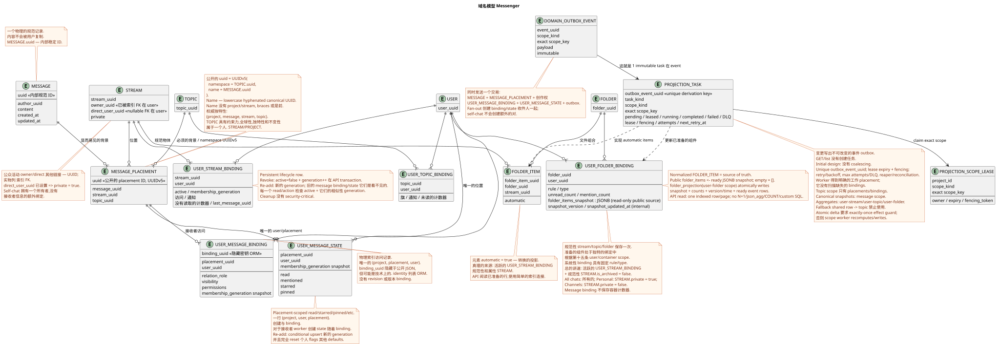

# 黑色域名模型 Messenger

状态: ** 共同讨论的提案**.

这份文件描述了未来重构的目标域模型.
现在的公共合同
在 [`workspace_api.md`](workspace_api.md) 并且应该
保持不变.

术语在 [总词典](index.md#глоссарий-проектной-документации):
放置 (placement),绑定 (binding),交易式的外箱,投影
(projection), fan-out 和一个工作者 (后台表演者)).

## 基本想法

`MESSAGE` — 核心独立的定律实体.
信息不论数量如何都只存放在一个副本中
看到它的人.

位置,访问和用户状态分开.
`MESSAGE_PLACEMENT` 将正规信息与特定的语境联系起来
stream/topic. `USER_MESSAGE_BINDING` 允许用户访问
存储 `visibility`/`permissions`. `USER_MESSAGE_STATE` 存储个人信息
提供用户的状态,
复制创建了一个新的公开位置,
没有人会看到你.UUID资源的使用量变得更为有限. UUID
地方.

这种模型的公众 RestAlchemy 模型和 API 路径的表示
另一个 proposal
[`messenger_api_domain_model.md`](messenger_api_domain_model.md).
详细的声明 RestAlchemy 和不可变的 HTTP/JSON-合同收集在
[`messenger_restalchemy_api_spec.md`](messenger_restalchemy_api_spec.md).

## 实体

### `MESSAGE`

- 唯一的正规记录.
- 它的 `uuid` 是唯一的稳定的内部标识符
  内容的正规记录,并不是发布作为 UUID 消息资源.
- 保存作者和公开的 `created_at`/`updated_at`信息.
- 没有重复,当新用户出现,他们可以看到消息.
- 不保存个人浏览或用户状态标志.
- 其他字段的组成将被单独确定,并且在这个草图模型中没有
  进入.

### `MESSAGE_PLACEMENT`

全球物理排列 `MESSAGE` 在一个 stream/topic:

- `uuid`, 同时也是位置的物理身份,
  公共 UUID 消息资源;
- `message_uuid`, `stream_uuid`, `topic_uuid`;
- 商业关键 `(project_id,message_uuid,stream_uuid,topic_uuid)`.

几个位置的一个 `MESSAGE` 独立处理.
从用户绑定集中输出所需的流/topic. `topic_uuid`
必须:直通和自动聊天也具有规范或技术
`TOPIC`, 没有 `null` 和 sentinel 值.

### `USER_MESSAGE_BINDING`

特定用户访问一个物理索引行
如何使用:

- 隐藏的内部 `binding_uuid`;
- `placement_uuid`, `user_uuid`;
- 关系/角色, `visibility`, `permissions`;
- 唯一的密钥 `(project_id,placement_uuid,user_uuid)`.

删除或隐藏链接将阻止用户访问该位置,
没有删除.`MESSAGE`没有改变其他用户的访问权限.`revision`或
没有绑定版本.

### `USER_MESSAGE_STATE`

唯一的个人状态行,
`(project_id,user_uuid,placement_uuid)`. 这里保存了 `read_at`
(标记符号 (或等级标记符), `membership_generation`, `mentioned`, `starred`, `pinned`等
公共的 `read` 是一个标杆投影
`read_at IS NOT NULL`. 容器组件没有存储.
在一个位置的绑定之间重复.
stream/topic 创建一个单独的状态; 全球级别旗
没有单独的确认决定,.
在re-add条件上 upsert 将同一个 business-key行转换为新的行
generation 并且将所有个人旗都原子化抛弃到默认状态;
状态不能再使用.

## 公众信息的同一性决定

决定的状态: **已通过**.它取代了之前的发表
`MESSAGE.uuid`.

- 在所有公共 `WorkspaceUserMessage.uuid` 和 `{message_uuid}` 参数
  存在的 URL 等于 `MESSAGE_PLACEMENT.uuid`.
- UUID 计算为
  `UUIDv5(namespace=TOPIC.uuid, name=MESSAGE.uuid)`.
- Namespace — 定制 `TOPIC.uuid`. Name  只有定制
  `MESSAGE.uuid` 在标准小写字母中.ASCII- 没有. braces,
  附加字段或前.
- 对于其他 namespace
  `4ec0b996-b778-45f8-8ef4-ef863be0c047` 其他 name
  `aaaaaaaa-aaaa-4aaa-8aaa-aaaaaaaaaaaa` 结果是
  `8b9eb310-407c-55fb-881b-092f92ddce88`.
- 同样的 topic/message 双重重复或 retry 时总是会产生相同的结果 UUID.
  复制到另一个主题,包括另一个流, UUID
  没有复制 `MESSAGE`.
- `TOPIC.uuid` 全球独一无二,每个`TOPIC`都是一样的
  只有一个.`STREAM`没有`PROJECT`. 将主题移动到其他流/project没有
  身份更新:需要新的 `TOPIC` 和显式的迁移.
- UUIDv5 没有取代数据库的完整性.
  `(project_id,message_uuid,stream_uuid,topic_uuid)`, 补充了 FK,
  确保主题属于指定的 stream/project.
- `USER_MESSAGE_BINDING` 唯一的至少是
  `(project_id,user_uuid,placement_uuid)`. 他自己的UUID保持隐藏
  字符串的技术键 ORM.

公共 JSON 和 URL 的形式不会改变,但语义 UUID 却会改变.
未来的迁移应该产生一个明确的显示旧的公共
标识符在placement UUID,更新链接/标记器,并提供时间
兼容性或已达成的切换/rollback. 具体的推出仍然存在
单独的项目阶段.

### `USER`, `STREAM`, `TOPIC`, `FOLDER` 他们的束.

`STREAM`, `TOPIC` 和 `FOLDER`  唯一的定律实体
它们的可见性和个人状况
唯一的行:

- `USER_STREAM_BINDING (project,user,stream)`;
- `USER_TOPIC_BINDING (project,user,topic)`;
- `USER_FOLDER_BINDING (project,user,folder)`.

`USER_STREAM_BINDING` 是 persistent membership lifecycle 序列: 无可撤销
并且将它移除,然后原子化设置`active=false`,并增加单调
`membership_generation`. Re-add 让我们再一次增加一代.
message bindings/state 没有自动显示.

已完成的`unread_count`,`mention_count`和其他相应的组件
它们的水平都存储在这些束中,因为集体的区域与
单独的状态表不能输入,
需要分开访问和投影的生命周期.

`FOLDER_ITEM` 连接一个支持的正规`FOLDER`
严格的形式的现有物体,例如`STREAM`,
公共合同folders/folder_items. 它不复制对象,也不输入
文件和元素只能使用
简单的索引连接;`COUNT`和绕过查询路径的消息
禁止使用.

标准化 `FOLDER_ITEM`  真理的来源的组成.
插入公共 `folder_items` 没有N+1和读取时的聚合
`USER_FOLDER_BINDING` 保持准备 read-only JSONB
`folder_items_snapshot`, 您可以查看其内部版本和更新时间.
公有数组总是 `[]`; 已准备的元素计数器来自
独特的 `USER_STREAM_BINDING`.

系统文件是系统文件 `USER_FOLDER_BINDING`
`rule`/`type`: 规则不能通过常规的
它们的组成不会在客户端读取时被计算出来.
支持自动`FOLDER_ITEM` worker 作为重建
活跃的信息是真理的来源.
`USER_STREAM_BINDING` 并且是正规的属性.`STREAM`总的讲义
活跃的 `USER_STREAM_BINDING` + 定制的
`STREAM.is_archived = false`; 在此之后,有确切的规则:

- `All chats` 包含每个可访问的非档案 stream;
- `Personal` 包含可用非档案流,
  `private = true` — 实际合同使用的标准是;
- `Channels` 包含可用的非档案流 `private = false`.

每一次更改 items/pin或自动组合时, immutable
transactional outbox event. 这里有一个 immutable typed task
`folder_projection` 没有结合和 scope
`user-folder:(project_id,user_uuid,folder_uuid)`. 拥有这家房租公司的房东
标准化 items 到一个真相的来源,然后在一个
交易取代快照,准备的计时器,投影版本/时间,
创建一个ready public event. 公共文件/folder_items终点和JSON不是
它们可以看到之前的照片,.

在 RestAlchemy API 中,公共 UUID 引用仍然是标数 UUID 属性,而
物理列 `*_uuid` 是显然的索引外键
它们的选择是通过选择的引用完整性操作.,
`WorkspaceStream.owner` 它们的序列化方式是UUID,而物理 `owner_uuid`
引用用户工作空间; URI 关系在公共 JSON 中没有出现.

创建一个`direct_user_uuid`的流总是创建 private stream.
如果 `direct_user_uuid` 等于 UUID 拥有者/当前用户,
self-chat 只有一个用户.
有一个正规的 `MESSAGE` 和一个位置;
`USER_MESSAGE_BINDING` 和 `USER_MESSAGE_STATE` 已经允许访问和准备好的旗
只有一个受众,因此受众粉丝不会产生其他粉丝.
绑定对/state,而消息只显示给这个用户一次.

## 联系人

可编辑的PlantUML源:
[`messenger_domain_model.puml`](diagrams/messenger_domain_model.puml).

任何网站都必须与`TOPIC`联系,包括直接聊天和
self-chat. 作者是圣经的作者 `MESSAGE`.

## 阅读路径和背景更新

公共 API 阅读已准备的物理和索引
`USER_MESSAGE_BINDING`-连接一个
`MESSAGE_PLACEMENT`, 活跃的 `USER_STREAM_BINDING` 同样 generation,
唯一的 `MESSAGE` 和唯一的
`USER_MESSAGE_STATE`. 隐藏的 `binding_uuid` 可能是技术
字符串的同一性是 ORM,但公共 JSON/URL 总是使用
`MESSAGE_PLACEMENT.uuid`. 查询路径不应包含复杂的计算
对于一个公司的投资或重额计算.

同时发送一个交易,创建一个正规的 `MESSAGE`,
一个 `MESSAGE_PLACEMENT`,一个 `USER_MESSAGE_BINDING`,
`USER_MESSAGE_STATE`, 并且是不变的 transactional outbox  记录
每一个输出初始类型任务都需要一个.
作者可以立即阅读准备好的原始旗,而不会惰地创作 state.

每个变态的交易都会写出一个不变域事件
transactional outbox. 每个事件都会产生一个独立的 immutable typed task
唯一的 `outbox_event_uuid`; `GET`/list 不会创建问题.
没有被扫描,每个接收者
单独的位置,一起创造`USER_MESSAGE_BINDING`和独特的
`USER_MESSAGE_STATE`. Task 带来预期的会员代并使
conditional upsert 只有当 active membership 和确切匹配时 generation;
stale task 没有任何操作. 没有在读取路径上惰地创建状态.
延迟最终一致性大约一秒作为目标 SLO 意图,而不是
严格的保证,在选择 operational 之前SLO. `2xx`/`201`这意味着 commit
其他作者则会得到即时读写,
工作人员记录了投影的变化
和所有相应的 durable ready WebSocket 事件行在一个原子 DB
transaction: 它们要么固定,要么翻转. dispatcher
仅仅阅读事件存储,发送/重复/播放事件,并拥有
网络连接.

Topic worker 仅拥有 topic-scoped placements/bindings 和主题内部
遵守`MESSAGE.created_at DESC`单个投影机可以获得 exact
scopes: `message` 对于可定快照, `user-stream`, `user-topic` 和
`user-folder` 它们的电池,
lease/fencing token 在 exact scope key 上;不同的 scopes 是并行. Topic worker
不执行 unsafe read-modify-write 分享行. 允许Atomic counter delta
只有在 `outbox_event_uuid` 上使用 exactly-once effect guard;否则 scope worker
计算和替换投影.

Fan-out 一个投放分为 immutable keyset batches. Default
容量  `1000`接收者,允许的运行时间最大  `5000`;配置
`<=0` 或 `>5000` 不通过启动验证.
`USER_STREAM_BINDING.user_uuid ASC` 没有 `OFFSET`;每批次重复
检查 active membership/generation,原子式写 binding/state,
downstream work 并且在 commit 之后才会创建 checkpoint/下一个
batch. 一个批次具有短交易; root 存储 cursor/count/status.

## 变量

1. 公众客户端API及其观察的行为保持不变.
2. 每个消息的内容都存储在一个记录中 `MESSAGE`.
3. 每个流/topic的上下文都呈现为明显的 `MESSAGE_PLACEMENT`.
4. 用户只能通过相应的
   `USER_MESSAGE_BINDING`.
5. 接收者绑定是唯一的
   `(project_id,placement_uuid,user_uuid)`.
6. 个人消息旗仅属于用户和
   位置 `USER_MESSAGE_STATE`,而不是正规的消息.
7. 隐藏或删除绑定不会删除`MESSAGE`或改变访问
   其他用户.
8. 查询路径使用已准备的绑定/位置/状态行;
   复杂的计算是没有请求的.
9. `revision` 或连接版本没有添加到单独的设计
   背景处理.
10. 公共 UUID 消息总是等于 `MESSAGE_PLACEMENT.uuid`,计算
    如何?`UUIDv5(namespace=TOPIC.uuid, name=MESSAGE.uuid)`他对所有人都是一样的.
    对于不同主题,使用者可以使用相同的位置,
    `MESSAGE.uuid` 内, UUID 用户绑定隐藏.
11. 改变状态的操作将写出box中不可改变的事件;读取不了
    创建任务,而 worker 不是通过扫描缺失的行搜索工作.
12. WebSocket dispatcher 工人写出投影,然后写出投影.
    ready event rows 在一个交易中; 调度器不会创建业务事件,
    网络发送不会影响其持久性.
13. 公开的 UUID 引用是 RestAlchemy 的标数 UUID 属性,但
    物理 UUID 列仍然是显著的外部键索引
    选择的操作; URI 关系不改变 JSON 合同.
14. `direct_user_uuid` 在创建流时表示 `private=true`; self-chat
    包含一个 binding/state作者对,不给其他用户创建对.
15. 流/topic/folder的组件只能在唯一的绑定中存储
    没有被绑定/状态
    它们可以读取已完成的值, `COUNT`,
    `GROUP BY` 或绕过消息.
16. Worker 更新组件,以后按类型化任务进行
    fan-out, read/hide/move/delete 修复/rebuild 的
    仅允许在背景中绑定消息; eventual consistency 已被接受.
17. 定制式 `FOLDER` 存储一次; `USER_FOLDER_BINDING` 定义
    用户访问/状态和已完成的组件,而 `FOLDER_ITEM`
    只会将文件与支持的正规对象连接.
18. 系统文件绑定有固定规则,
    元素是从活跃的投影 stream bindings;
    API 读取已准备的元素和计数器,而没有计算组件.
19. 同时发送创建了作者 `USER_MESSAGE_BINDING` 和
    `USER_MESSAGE_STATE` 通过一个单独的用户,
    已准备的 binding/state; 惰地在 read path 中创建 state 禁止.
20. Initial design 不使用联结:单个 immutable outbox event
    匹配一个唯一的 immutable typed task derivation key.
    Lease expiry, fencing token, retry/backoff, max attempts/DLQ 其他 reaper
    提供崩恢复;处理器是 source event.
21. Revoke stream membership 同时安装`active=false`并且增加了
    persistent `membership_generation`. 每一个 message/reaction read/action
    检查 active membership 和 generation; background cleanup 是否是
    security boundary.
22. Topic UUID 对于安置是强制性的,但不是通用的
    每个共享投影任务都有自己的实际投影任务. exact
    scope key; fallback 禁止对 topic 的总行.
23. `TOPIC.is_done` — 一个主题的全球定律状态. Toggle
    在 `TOPIC` 线上串行,将其扩大到 version/`updated_at`,然后写
    outbox 在同一笔交易中. `USER_TOPIC_BINDING` 不是 authoritative
    writer 这种迹象.
24. 反应故意一般的规范`MESSAGE`在所有 placements.
    Placement UUID 仅用于访问检查; raw facts 和
    `reactions`/`reaction_users` 有 message scope. Cross-placement visibility
    通过不同听众之间的语义.
25. 每个公共资源列表都会出现缺/`0` `page_limit`
    `100`, `1..500` 其他值是 HTTP `400`;
    unbounded mode 没有.
26. Reconnect 使用 durable cursor/replay: 在最后一次处理后
    cursor 随着时间的推移, live.
    发送 at-least-once;客户端通过 event UUID 进行重复并推广
    cursor 只有经过处理.
27. 所有的tenant-owned行和scope keys 都包含 `project_id`; physical
    `UNIQUE(project_id,uuid)` 并且禁止使用 Composite FK cross-project edges.
    Mutation 在封锁交易中重新检查 authorization.
28. Fan-out batch default `1000`, hard maximum `5000`; keyset cursor —
    `user_uuid ASC`, retry 仅限于一个 batch, unbounded transaction
    禁止, scheduler 提供了旧工作的有限公平性.
29. Migration/release 只有在 verified backup/restore rehearsal
    接收门./states/files它们保存和迁移;
    Zulip-derived messages/files 通过故意的Destructive Reset
    scoped cleanup 并且可以重新导入. Zulip Workspace UUID,
    链接和本地状态不需要保存.

## 问题

唯一的正规名单是
[`messenger_architecture_inventory.md`](messenger_architecture_inventory.md#единственный-список-open-решений).
这个文档只保存已接受的域名变量.
