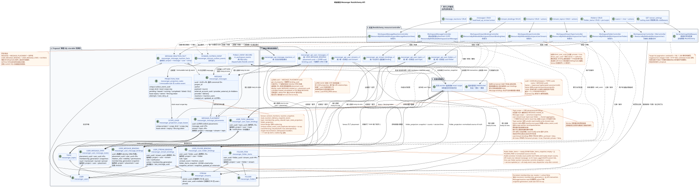

# 项目规范 RestAlchemy API Messenger

状态: ** 实施的项目规范; 实施前的文件**.

这份文件显示了如何操作Workspace/Messengerv1 API
通过普通的 RestAlchemy 模型,简单的 SQL 代表,
它不会改变任何公共路线., HTTP-
方法, JSON 字段,操作,事件或实用负载 WebSocket.语义
UUID 信息的位置和位置被改为"位置身份",
客户端可见的变更传播时间得到明显接受
需要一个单独的发布说明和
migration/cutover mapping.
现行合同的规范性
[`workspace_api.md`](workspace_api.md). 域名变量和背景路径
在 [`messenger_domain_model.md`](messenger_domain_model.md) 其他
[`messenger_api_domain_model.md`](messenger_api_domain_model.md).

现在的 `StoreResourceController`, `sql_canonical_store`,重构,
模型的内部继承和控制器类的现有分类
它们只是建筑模型.
观察到的公开合同的来源,并被认为是可替换的.

## 项目解决方案和当前合同的边界

已确认的目标设计类型:

1. `MESSAGE` 保存了作者, `source`/`provider`/`delivery`和
   公众 `created_at`/`updated_at` 一次.
2. 物理 `MESSAGE_PLACEMENT` 给出流的全球背景和主题
   没有任何关于我们.`MESSAGE_PLACEMENT`提供了安置 (placement),而
   `USER_MESSAGE_BINDING` — 让用户访问到
   只有一个地方, `(project,user,placement)`
   `USER_MESSAGE_STATE` 保存个人信息 `read`, `mentioned`, `starred`,
   `pinned` 和类似的通讯级别旗.
3. `WorkspaceUserMessage.uuid` 没有UUID在所有人身上.URL,这是一个好消息.
   `MESSAGE_PLACEMENT.uuid = UUIDv5(namespace=TOPIC.uuid, name=MESSAGE.uuid)`.
   `MESSAGE.uuid` 并且 `USER_MESSAGE_BINDING.uuid` 仍然是内部.
4. 几个位置的同一可规性 `MESSAGE` 给出几个行
   不同的公共UUID和不同的流/topic.个人状态
   placement-scoped 并且来自 `USER_MESSAGE_STATE`.
5. 稳定的UI链接包含UUIDplacement;它明确地指定了上下文
   stream/topic. Canonical content UUID 客户不需要.
6. 代表 `WorkspaceUserMessage` 基于一个用户绑定行,只做
   索引连接一个位置,一个 `MESSAGE` 和一个用户状态.
   公共时间标记总是来自 `MESSAGE`.
7. 通过一次的同步发送, `MESSAGE`,
   `MESSAGE_PLACEMENT`, 创作者`USER_MESSAGE_BINDING`和
   `USER_MESSAGE_STATE`, 并且是不变的 transactional outbox  记录
   每一个被提取的 initial typed task.
   这会给作者一个即时的回复,
   工作者 (背景表演者) 与每个
   接收者被绑定,它是`USER_MESSAGE_STATE`;它不是在寻找工作.
   扫描缺失的绑定.
8. 工作者集群具有可调的并行性限制. Topic-scoped work
   专有主题,并在主题中选择 `MESSAGE.created_at DESC`;
   shared projections 它们使用自己的精确范围.
   添加一个新的公开 API.
9. `revision` 没有链接.
10. 反应的原始事实属于可规性`MESSAGE`;API改变了一个事实行,
    专属的 owner scope `message` 将公共图像`reactions`和
    `reaction_users`, 只有阅读,没有循环 阅读 修改 写 查询路径.
    图像在所有投放中都是相同的,.
11. 任何改变状态的操作都会以原子形式将一个不变域事件写入 outbox.
    每一次事件都会产生一个单独的事件. immutable typed projection task
    唯一的 `outbox_event_uuid`; initial design 不使用 coalescing.
    `GET` 没有创建任务列表的操作.
12. Worker 在一个DB交易中,记录了所有物质化状态和
    相关的 durable ready WebSocket 事件行. dispatcher
    只有阅读事件存储,发送/重复/播放,并拥有
    网络连接.
13. UUID-现在的公共 JSON 传输的链接是 UUID,
    API RestAlchemy-它们的模型是普通的`properties.property(types.UUID())`,而不是
    `relationships.relationship`: 这种连接将被串行为URI,
    合同被打破了.相应的物理列 `*_uuid` 仍然存在
    显然具有引用完整性的索引外部密钥.
14. 如果创建流包含`direct_user_uuid`,域名命令总是
    保持`private=true`值是相同的UUID现在的`owner`, 创建
    只有用户的唯一联系; 只有用户可以在此收到消息
    并且显示一次.
15. `STREAM`, `TOPIC` 并且 `FOLDER`  唯一的实体. 准备好
    没有读过的信息和提及的个人集成直接存储在
    链接和状态,单个消息
    只有存储访问, `read_at` 和个人旗;容器计数器在那里
    禁止使用.
16. `USER_STREAM_BINDING` — persistent lifecycle row 具有 `active` 和单调
    `membership_generation`. Revoke 同步禁止 message/reaction access;
    stale tasks 旧的 generation 无法恢复访问.
17. 所有列表公开操作都被限制:默认值 `100`,
    硬最大值 `500`;缺少 `page_limit` 和 `page_limit=0` 表示
    `100`, 负数,不整数,或大于 `500` 的值 HTTP `400`.
18. `2xx`/`201` 证明了原始突变的固定,而不是全部的完成.
    它们可以直接读到,收到,计数器,
    materialized snapshots 随着时间的推移,.
19. `TOPIC.is_done` — 论文的规范性,全球性.
    用户的绑定;`USER_TOPIC_BINDING`仅存储访问,
    通知,个人设置和已备用的用户组件.

下面的 `messenger_*` 名称是**这个设计解决方案的确切名称**,而不是
移民.在一个单独的移民项目之前,.

## 层面概述



可编辑的PlantUML源:
[`messenger_restalchemy_api_spec.puml`](diagrams/messenger_restalchemy_api_spec.puml).

```text
текущий маршрут -> стандартные RA-контроллер и ресурс -> представление формы только для чтения
                                                               \-> записываемая физическая модель
```

SQL-只有一个主要的设计方法是:
物理行给出一个输出行;允许一个对一个和多个对一个的索引连接»
`LEFT JOIN`/`INNER JOIN`. 禁止组件, `GROUP BY`,窗口功能,
边际和相关的小询问,以及粉丝/一个对许多的分配».

## 共同协议 RestAlchemy

### 区域,交易和页面

- 中间软件 IAM 将 `project_id` 和当前 `user_uuid` 传输到请求的上下文中.
- `get_autofilters()` 将区域添加到所有 `get`/`filter`/`update`/`delete`;
  客户端不能用 JSON 字段或查询行替代它.
- `get_autovalues()` 在创建时指定服务器的区域.
- 查询交易 RestAlchemy 一个.域名操作得到当前
  `session`; 单独的 `engine_factory.session_manager()` 不打开.
- 收藏使用`BaseResourceControllerPaginated`并保存
  `page_limit`, `page_marker`, `X-Pagination-Limit` 其他
  `X-Pagination-Marker`; `sort_key=created_at&sort_dir=asc|desc` 留下来
  没有变化.
- 实际的当前执行语义包含确认的空白:
  共同的RestAlchemy没有`StoreResourceController`它们会
  `_pagination_limit = 0`. 因此,缺少的 `page_limit` 和
  `page_limit=0` 现在给出`limit=None`和无限阅读;
  负数和非整数返回 HTTP `400`,而对于过大的正数
  没有严格的最高和限制.
  行为.
- 目标政策是所有公开操作的单一的
  `page_limit` 和 `page_limit=0` 给出 `100`; 值 `1..500` 应用于
  确切;负数,非整数和大于 `500` 返回值
  HTTP `400` 没有无声,没有无限制模式,没有规则绕道..
- 对于 `GET .../topic_summary_endpoints/`,它现在不接受参数
  目标控制器接受相同的 `page_limit`/`page_marker`,
  保存 JSON 阵列,没有新的封面,并添加标准
  `X-Pagination-Limit`/`X-Pagination-Marker`. 这是一种意识. observable
  变更,而不是当前执行的描述.
- 路线索引返回了已注册的终极静态
  路径,并不能从数据库中读取用户集合;它们结构性
  仅限于本名单,并不是规避政策 resource-list.
- 公众的消息标记是 UUID 位置.
  恢复它到同一个视频/project/filter范围,并使用
  稳定的车队 `(MESSAGE.created_at,MESSAGE_PLACEMENT.uuid)`;隐藏
  `binding_uuid` 标记器不包括.
- 允许 `null` 的字段可能不在 REST 包装器的标准输出中; JSON
  下面显示了一个完全的形式,其中允许`null`的投影显然
  均等于 `null`.

### UUID-在 API 中的属性和DB中的外部密钥 {#uuid-свойства-в-api-и-внешние-ключи-в-бд}

联系RestAlchemy作为一个值.API在表格中URI因此,公共场
`owner`, `author_uuid`, `user_uuid`, `message_uuid`, `stream_uuid`,
`topic_uuid`, `direct_user_uuid`, `default_topic_uuid` 其他
其他 UUID 引用的当前合同被宣布为普通的 UUID 属性.
通信对象没有参与它们的序列化.
记录的物理RestAlchemy模型:应用程序可以使用尺度模型. UUID,
而迁移的图表为基础图表创造了真正的限制和指数.
列 `*_uuid`. `project_id` 仍然是 IAM 区域;内部
`scope_kind`/`scope_key` outbox 和任务编码一个区域的精确组合密钥,
而不是一次多个表的假外键.

`MESSAGE_PLACEMENT.uuid` 声明为一个可变的 UUID 属性,并以
`WorkspaceUserMessage.uuid`. 内 `MESSAGE.uuid` 和隐藏 `binding_uuid`
它们也保持着直角.UUID/FK/关键,但权限字段不让他们
现在 message JSON.

基本设计解决方案的目标限制:

| UUID-属性 RestAlchemy | 物理索引列和目标 | 引用完整性的作用 |
| --- | --- | --- |
| 信息 `author_uuid` | `messenger_messages.author_uuid -> messenger_users.uuid` | `ON DELETE RESTRICT` |
| 位置 `message_uuid` | `messenger_message_placements.message_uuid -> messenger_messages.uuid` | `ON DELETE CASCADE` |
| 位置 `stream_uuid` | `messenger_message_placements.stream_uuid -> messenger_streams.uuid` | `ON DELETE CASCADE` |
| 必须放置 `topic_uuid` | `messenger_message_placements.topic_uuid -> messenger_topics.uuid` | `ON DELETE CASCADE` |
| 绑定用户 `placement_uuid` | `messenger_user_message_bindings.placement_uuid -> messenger_message_placements.uuid` | `ON DELETE CASCADE` |
| 绑定用户 `user_uuid` | `messenger_user_message_bindings.user_uuid -> messenger_users.uuid` | `ON DELETE CASCADE` |
| 用户状态 `placement_uuid` / `user_uuid` | 相关的 UUID 位置和用户 | `ON DELETE CASCADE` |
| 反应的事实 `canonical_message_uuid` / `user_uuid` | 相关的UUID定制信息和用户 | `ON DELETE CASCADE` |
| 流量 `owner` | 物理 `messenger_streams.owner_uuid -> messenger_users.uuid`;在公众面前的称仍然是 `owner` | `ON DELETE RESTRICT` |
| 流量 `direct_user_uuid` | `messenger_streams.direct_user_uuid -> messenger_users.uuid` | `ON DELETE RESTRICT` |
| 流量 `default_topic_uuid` | `messenger_streams.default_topic_uuid -> messenger_topics.uuid` | `ON DELETE SET NULL` |
| 连接流 `stream_uuid` / `user_uuid` | 相关的UUID流和用户 | `ON DELETE CASCADE` |
| 连接流 `who_uuid` | `messenger_stream_bindings.who_uuid -> messenger_users.uuid` | `ON DELETE RESTRICT` |
| 将用户绑定到流中 `stream_uuid` / `user_uuid` | 相关的UUID流和用户 | `ON DELETE CASCADE` |
| 将用户绑定到文件中 `folder_uuid` / `user_uuid` | 相关的 UUID 文件和用户 | `ON DELETE CASCADE` |
| 问题 `stream_uuid` | `messenger_topics.stream_uuid -> messenger_streams.uuid` | `ON DELETE CASCADE` |
| 公开链接 `summary_last_message_uuid` / `last_message_uuid` | 相关公开 UUID placement | `ON DELETE SET NULL` |
| 将用户绑定到主题 `topic_uuid` / `user_uuid` | 相关的 UUID 主题和用户 | `ON DELETE CASCADE` |

对于租户拥有边缘,迁移必须使用 unique/FK
`project_id`, 另外,这个位置必须引用
同样的流/project. `TOPIC.uuid` 全球独一无二,所有权是不可变的.
`USER_STREAM_BINDING` 在撤销时保存为墓石; business key
保持独一无二,而`(active,membership_generation)`是 persistent
security state. `USER_MESSAGE_BINDING.membership_generation` — snapshot 这里
并且参与了 access predicate.

`WorkspaceStream.owner` 在 API 和 RestAlchemy 模型中,读取仍然是 UUID 属性,
它们的序列化方式是UUID物理列是一个叫做
`owner_uuid`; 没有计算的流表达给出了标数化名
`owner_uuid AS owner`. 没有公共资源或物理外部密钥被转换为
连接 RestAlchemy 或 URI. DDL 在这里没有创建:表格固定
未来迁移项目的强制限制.

### ADR: tenant isolation 现在的角色边界

每一个规范,投影,绑定/state,Outbox,任务和 public-event
应用的网页域包含`project_id`.
表格指定`UNIQUE(project_id, uuid)`和组合 FK
`(project_id, referenced_uuid)` 为了 `MESSAGE`, `MESSAGE_PLACEMENT`, user
bindings/state, `TOPIC`, `STREAM`, `FOLDER`, `FOLDER_ITEM`, reaction facts,
outbox/tasks/events. 组合 FK 位置 -> 话题/stream 确保
`TOPIC` 属于指定的 `STREAM` 和同一个 project. Worker queries,
scope keys 并且 migration/backfill joins 总是包含 `project_id`.

API 通过此,它可以重用当前的 `ModelWithProject`, request project scope, session 和
RestAlchemy filters. Lookup/list/action 在当前项目之外或隐形项目
资源给出`404`;可见资源的分辨率不足 — `403`.
Mutation 重新读/封锁 project-scoped资源并检查 active
membership/permission 在同一笔交易中,而不是信任 preflight view.

下面的 current-runtime矩阵不会将 policy 转换为
新的目标权限:

| 操作 current API | `guest` | `member` | `moderator` | `administrator` | `owner` | Target role |
| --- | --- | --- | --- | --- | --- | --- |
| `add_users` 在可见的 stream | runtime 允许 | runtime 允许 | runtime 允许 | runtime 允许 | runtime 允许 | **OPEN:** target permission/assignable-role matrix 不继承没有 current 检查 |
| `PUT stream_bindings/{uuid}` non-direct | actor role 没有检查; project-only lookup | 这样 | 这样 | 这样 | 这样 | **OPEN:** actor × target-role/self matrix |
| `DELETE stream_bindings/{uuid}` non-direct | actor role 没有检查; project-only lookup | 这样 | 这样 | 这样 | 这样 | **OPEN:** actor × target-role/self 其他 last-owner rule |
| update/delete binding direct/self | `400` | `400` | `400` | `400` | `400` | membership/role immutable |

`add_users` 需要父母的 `WorkspaceUserStream` 显现,所以 actor
是一个参与者,但 role hierarchy current code 没有检查. Binding
get/update/delete 目前是 project-scoped,但没有检查 role actor 或其
membership 在目标流中. `workspace_api.md` 固定了 role literals 和
immutable direct membership, 但没有宣布 non-direct permission matrix.

Tenant-integrity 风险第7部分是密钥密封的, transactional
recheck. Role/action 部分保持点性 OPEN:可以添加哪些角色
谁更改/删除自己的或别人的角色 binding;
否至少一个 `owner`;是否允许 self-demotion/self-removal
如果 owner 是强制性的, mutation 阻止了流, owner
bindings 或使用 version/CAS,检查 post-state `owner_count >= 1` 和
只有 commit 之后;竞争对手不会留下零 owners. Direct/self
关闭规则: membership等于 identity pair, update/add/remove binding 提供
`400`, self-chat 包含一个所有者,删除自发聊天流也可以 `400`.

项目解决方案的最低一般杂质:

```python
from restalchemy.common import contexts
from restalchemy.dm import filters


class RequestSessionMixin:
    @property
    def session(self):
        return contexts.Context().get_session()


class ProjectScopeMixin(RequestSessionMixin):
    def get_autofilters(self):
        return {
            "project_id": filters.EQ(self.get_context().project_id),
        }

    def get_autovalues(self):
        return {
            "project_id": self.get_context().project_id,
        }


class ViewerScopeMixin(ProjectScopeMixin):
    def get_autofilters(self):
        result = super().get_autofilters()
        result["user_uuid"] = filters.EQ(self.get_context().user_uuid)
        return result

    def get_autovalues(self):
        result = super().get_autovalues()
        result["user_uuid"] = self.get_context().user_uuid
        return result


class BoundedPaginationMixin:
    _pagination_limit = 100
    _pagination_max_limit = 500

    def normalize_page_limit(self, value):
        # Proposal contract: omitted/0 -> 100; 1..500 exact; otherwise HTTP 400.
        return pagination_policy.validate(value, default=100, maximum=500)
```

用户区域中的物理绑定使用该区域的常规存储器身份.
它们的 UUID 不是公共资源ID的消息:资源路径接受
`MESSAGE_PLACEMENT.uuid`, 控制器单独检查当前的绑定
用户和活跃流成员 generation.

```python
from restalchemy.dm import models
from restalchemy.dm import properties
from restalchemy.dm import types


class ProjectUserScopedModelWithUUID(models.ModelWithUUID):
    project_id = properties.property(
        types.UUID(), required=True, read_only=True, id_property=True,
    )
    user_uuid = properties.property(
        types.UUID(), required=True, read_only=True, id_property=True,
    )

    @classmethod
    def get_id_property(cls):
        return {"uuid": cls.properties.properties["uuid"]}
```

### 字段的权限

`ResourceByRAModel` 保持 snake_case (`convert_underscore=False`) 和
`process_filters=True`. 公开演讲模型包含完全平面的答案;
`FieldsPermissions` 单独指定可用于写的表面 CREATE/UPDATE. 内外键,
工作记录和原始存储器隐藏,而不是公布给客户进行记录.

### 总体HTTP语义

- `GET` 集合: `200` 和数组 JSON;
- `POST` 收藏: `201` 和完全创建的资源;重复
  确定性直接流的创建可以返回现有资源
  `200`;
- `GET`/`PUT` 资源: `200` 和完整资源;
- 操作 `POST .../invoke`: `200` 和完整的资源或文档
  列表;
- 已经成功了.`DELETE`: `204`尸体没有;
- 域名请求不正确或不允许: `400`;没有身份验证: `401`;缺陷
  权利: `403`; 领域中看不见或没有资源: `404`.

### ADR: 限制页面化和变化的可见时间

状态: **已接受有意识的行为改变;风险 #5已关闭**.

所有资源列表终点使用`page_limit`:缺/`0`表示
`100`, `1..500` 准确,负,不整数和以上都被接受 `500`
值返回 HTTP `400`. 目前的小限制的终点特定
没有确认公开的 Workspace 合同;因此 target overrides
没有. 外部桥梁控制 API 不属于此政策.

使用缺失参数或 `0` 作为完整的客户端 export,
必须在下一个标记符没有之前阅读页面.JSON没有
变化,但rollout需要 release/compatibility note 随着变化
语义学 message UUID.

变更事务同步记录正则初始状态,
需要的作者位置/binding/state 和一个或多个 immutable
outbox events — 对于每一个输出初始类型任务,
commit 作者获得 immediate read-your-write. Recipient bindings/history,
集装箱,物质化的快照和准备好公开活动
所以`2xx`/`201`表示接收和固定初级
变异,但并不是完成所有背景投影;其他用户可以
延迟约1秒目标 SLO 意图,而
没有严格的保证,直到选择和使用测量 SLO.

准备的记录WebSocket和投影 commit/rollback在一个原子 worker DB
transaction. 事件接收者在传递后可以阅读
通过REST发送器不是创建商业活动,
网络发送不会影响它的持久性.

Reconnect 通过指针重播没有空白:客户端传输最后一个
处理过的光标,服务器固定了高水标,播放更多
新的可见的 durable rows,缓冲了live tail,然后在drin之后切换
连接. 交付 at-least-once;客户端通过事件 UUID 和
只有在处理完毕后才会移动.
`epoch_pruned`/`410` 错误; 保留窗口的尺寸保持 operational
policy. Event audience rows 它们是成员代,所以调度器和
replay 没有传输 data events 后的 revooke 或旧 generation.

错误的确切通用封面和应用程序代码仍然在
[`workspace_api.md`](workspace_api.md#general-rules).

## 消息

### ADR: 通过 placement

状态: **已通过**.此决定关闭第一个Critic-review封锁器和
取代了之前讨论的公共资源的正确身份.

公开的 `WorkspaceUserMessage.uuid`, `{message_uuid}`, `page_marker`,
`last_message_uuid` 事件的引用意味着 `MESSAGE_PLACEMENT.uuid`.
唯一的记录的内部FK仍然是可规性的`MESSAGE.uuid`
内容. UUID 放置是严格计算的
`UUIDv5(namespace=TOPIC.uuid, name=MESSAGE.uuid)`: name — 只有 lowercase
hyphenated ASCII UUID 没有括号,前或其他
项目和流没有在 name.

重复/retry 一对 topic/message 返回相同的 UUID;另一个 topic 返回
其他 UUID. `TOPIC` 是强制性的,全球性的,是唯一的,
只有一个.`PROJECT`/`STREAM`. 移动它意味着一个新的主题和迁移
placements. 专科院的权威独特性仍然存在
`(project_id,message_uuid,stream_uuid,topic_uuid)`; UUIDv5 不取代组合
FK, unique constraint 或是检查属性 topic.

HTTP paths 并且 JSON 键不会改变,但标识符的意思会改变. cutover
需要后填位置 UUID,显示以前的 links/markers/events,
碰撞检查和兼容性计划/rollback.
成为未来迁移设计的必然部分,
request path.

### 物理通信,位置,绑定和用户状态

`WorkspaceMessage` — 编写的规范模型.
访问和个人状态的信息层是三个不同的可记录
RestAlchemy-模型. UUID-引用是标量性质;物理
限制定义在上面,而公众表示保留了以前的 UUID 字段.

```python
from restalchemy.dm import models
from restalchemy.dm import properties
from restalchemy.dm import types
from restalchemy.storage.sql import orm

from workspace.messenger_api.dm import message_payloads


class WorkspaceMessage(
    models.ModelWithUUID,
    models.ModelWithProject,
    models.ModelWithTimestamp,
    orm.SQLStorableMixin,
):
    __tablename__ = "messenger_messages"

    # Realm-global provider identity; cross-account project projection is the
    # one remaining Bridge boundary and must not choose an arbitrary account.
    PROVIDER_MAPPING_KEY = ("provider_realm_uuid", "provider_message_id")

    author_uuid = properties.property(
        types.UUID(), required=True, read_only=True,
    )
    payload = properties.property(
        message_payloads.WORKSPACE_MESSAGE_PAYLOAD_TYPE, required=True,
    )
    source_name = properties.property(
        types.Enum(["native", "zulip"]), default="native",
    )
    source = properties.property(types.Dict(), default=lambda: {"kind": "native"})
    provider_uuid = properties.property(
        types.AllowNone(types.UUID()), default=None, read_only=True,
    )
    provider_realm_uuid = properties.property(
        types.AllowNone(types.UUID()), default=None, read_only=True,
    )
    provider_message_id = properties.property(
        types.AllowNone(types.String(max_length=2048)), default=None,
        read_only=True,
    )
    provider = properties.property(types.AllowNone(types.Dict()), default=None)
    delivery = properties.property(types.AllowNone(types.Dict()), default=None)
    reactions = properties.property(types.Dict(), default=dict, read_only=True)
    reaction_users = properties.property(
        types.Dict(), default=dict, read_only=True,
    )


class WorkspaceMessagePlacement(
    models.ModelWithUUID,
    models.ModelWithProject,
    models.ModelWithTimestamp,
    orm.SQLStorableMixin,
):
    __tablename__ = "messenger_message_placements"

    # Domain command sets uuid = UUIDv5(namespace=topic_uuid, name=message_uuid).

    BUSINESS_KEY = (
        "project_id", "message_uuid", "stream_uuid", "topic_uuid",
    )

    message_uuid = properties.property(
        types.UUID(), required=True, read_only=True,
    )
    stream_uuid = properties.property(
        types.UUID(), required=True, read_only=True,
    )
    topic_uuid = properties.property(
        types.UUID(), required=True, read_only=True,
    )


class WorkspaceUserMessageBinding(
    models.ModelWithUUID,
    models.ModelWithProject,
    models.ModelWithTimestamp,
    orm.SQLStorableMixin,
):
    __tablename__ = "messenger_user_message_bindings"

    BUSINESS_KEY = ("project_id", "placement_uuid", "user_uuid")

    placement_uuid = properties.property(
        types.UUID(), required=True, read_only=True,
    )
    user_uuid = properties.property(
        types.UUID(), required=True, read_only=True,
    )
    membership_generation = properties.property(
        types.Integer(min_value=1), required=True, read_only=True,
    )
    relation_role = properties.property(types.String(max_length=64), required=True)
    visibility = properties.property(types.String(max_length=64), required=True)
    permissions = properties.property(types.Dict(), required=True)


class WorkspaceUserMessageState(
    models.ModelWithUUID,
    models.ModelWithProject,
    models.ModelWithTimestamp,
    orm.SQLStorableMixin,
):
    __tablename__ = "messenger_user_message_states"

    BUSINESS_KEY = ("project_id", "user_uuid", "placement_uuid")

    placement_uuid = properties.property(
        types.UUID(), required=True, read_only=True,
    )
    user_uuid = properties.property(
        types.UUID(), required=True, read_only=True,
    )
    membership_generation = properties.property(
        types.Integer(min_value=1), required=True, read_only=True,
    )
    read_at = properties.property(
        types.AllowNone(types.UTCDateTimeZ()), default=None,
    )
    mentioned = properties.property(types.Boolean(), default=False)
    starred = properties.property(types.Boolean(), default=False)
    pinned = properties.property(types.Boolean(), default=False)
```

未来迁移将为
`(provider_realm_uuid,provider_message_id)`: importing account UUID, mutable
email/server URL 它们是"project"的标识,而不是"canonical provider identity".
隐藏于 public JSON 并提供 retry/resume fresh provider import;它们没有
保存旧的Workspace UUID. Public `provider.account_uuid`留下来
current-contract access/account projection. 当一个帐户 realm
指定一个提供者聊天不同的项目,
canonical row 选择 account projection 仍然是一个明显的 Bridge OPEN;
没有办法给出决定 arbitrary primary account.

Numeric Zulip object UUIDs 均为计算:
`UUIDv5(namespace=verified_realm_uuid,
name="<entity_type>:<decimal_provider_id>")`. 仅允许
`user`, `channel`, `message`, `attachment`; decimal ID — unsigned shortest
base-10 ASCII (`0` 或是没有数字 leading zeros/sign/whitespace), name bytes —
精确的 ASCII/UTF-8 字节. lowercase
hyphenated UUID 他知道 16 RFC 4122/network-order octets. Project/account
UUID 没有参与到算法中.

是生命周期内时间标记.
取代了公开的时间标记.:
`messenger_api_user_messages_v1`.

`USER_MESSAGE_STATE.read_at` (或语义等效的保存标记)
只有一个用户和位置对的真相来源. `read`
结果是简单的标数表达式 `read_at IS NOT NULL`.,
没有 `USER_MESSAGE_BINDING` 存储未读的流信息或文件集:这些
计数器属于下面描述的用户对容器的唯一绑定.

```python
from restalchemy.dm import models
from restalchemy.dm import properties
from restalchemy.dm import types
from restalchemy.storage.sql import orm

from workspace.messenger_api.dm import message_payloads


class WorkspaceUserMessage(
    models.ModelWithProject,
    models.ModelWithTimestamp,
    orm.SQLStorableMixin,
):
    __tablename__ = "messenger_api_user_messages_v1"

    binding_uuid = properties.property(
        types.UUID(), required=True, read_only=True, id_property=True,
    )
    uuid = properties.property(types.UUID(), required=True, read_only=True)
    canonical_message_uuid = properties.property(
        types.UUID(), required=True, read_only=True,
    )
    user_uuid = properties.property(types.UUID(), required=True, read_only=True)
    stream_uuid = properties.property(types.UUID(), required=True)
    topic_uuid = properties.property(types.UUID(), required=True)
    author_uuid = properties.property(types.UUID(), required=True, read_only=True)
    payload = properties.property(
        message_payloads.WORKSPACE_MESSAGE_PAYLOAD_TYPE, required=True,
    )
    read = properties.property(types.Boolean(), default=False, read_only=True)
    pinned = properties.property(types.Boolean(), default=False, read_only=True)
    starred = properties.property(types.Boolean(), default=False, read_only=True)
    is_own = properties.property(types.Boolean(), default=False, read_only=True)
    mentioned = properties.property(types.Boolean(), default=False, read_only=True)
    reactions = properties.property(types.Dict(), default=dict, read_only=True)
    reaction_users = properties.property(types.Dict(), default=dict, read_only=True)
    source_name = properties.property(
        types.Enum(["native", "zulip"]), default="native",
    )
    source = properties.property(types.Dict(), default=lambda: {"kind": "native"})
    provider = properties.property(
        types.AllowNone(types.Dict()), default=None, read_only=True,
    )
    delivery = properties.property(
        types.AllowNone(types.Dict()), default=None, read_only=True,
    )

    @classmethod
    def get_id_property(cls):
        # Unique technical ORM identity of one view row; never a public ID.
        return {"binding_uuid": cls.properties.properties["binding_uuid"]}
```

上面的 `get_id_property()` 故意 **而不是** 是信息的公众身份.
没有计算的表示需要一个唯一的关键来恢复和对比物体,
每个位置都有一个单独的行. 公共JSON路线的参考和参数
它们总是使用 `MESSAGE_PLACEMENT.uuid`; `binding_uuid` 隐藏在每个方法中.
因为标准`ResourceByRAModel.get_resource_id()`赋予了模型的技术ID,
目的解决方案需要下面显示的狭窄资源适配器和控制器的搜索 placement ID.
这是一个标准的 RestAlchemy 扩展,而不是专用的 SQL 存储..

进行比较:

| 公开字段 | 物理来源 | 许可证 API | 记录路径 |
| --- | --- | --- | --- |
| `uuid` | `MESSAGE_PLACEMENT.uuid` | 确定位置ID仅读 | 建立一个位置 |
| 内部 `binding_uuid` | `USER_MESSAGE_BINDING.uuid` | 隐藏,永远不是资源ID | 创建一个链接的作者或 worker |
| 内部 `canonical_message_uuid` | `MESSAGE.uuid` | 隐藏 | 创建正规消息 |
| `project_id`, `user_uuid` | 连接区域和用户状态 | 仅供阅读 | IAM 或 worker |
| `stream_uuid`, `topic_uuid` | 标数式UUID-柱子`MESSAGE_PLACEMENT`;数据库中的索引外键 | 仅供在公共网站上创建 API | 首次安置 |
| `read`, `mentioned`, `starred`, `pinned` | 唯一的位置 `USER_MESSAGE_STATE`;公开的位置 `read`  尺度 `read_at IS NOT NULL` | 仅供阅读 CRUD | 行动或 worker |
| `is_own` | 连接的尺度等式 ID | 仅供阅读 | 没有作为真理的来源保存 |
| `author_uuid`, `payload` | `MESSAGE.author_uuid/payload` | 仅供阅读的作者; `payload` 创建和更新 | 规范的消息 |
| `source_name`, `source` | `MESSAGE` | 仅用于创建 | 规范的消息 |
| `provider`, `delivery` | 现实化的投影 `MESSAGE` | 仅供阅读 | 提供商的路径或后台路径 |
| `reactions`, `reaction_users` | 现实的正规状态 | 仅供阅读 | 反应或背景路径的变化 |
| `created_at`, `updated_at` | `MESSAGE.created_at/updated_at` | 仅供阅读 | 只有正规消息 |

代表性是由一个直线 `USER_MESSAGE_BINDING` 组成,»
只有一个 `MESSAGE_PLACEMENT`,一个活跃的 `USER_STREAM_BINDING`
project/user/stream 现在的 `membership_generation`,然后是  许多
只有一个.`MESSAGE`根据第1条第1款
连接一个到一个从`USER_MESSAGE_STATE`到 `(project_id,user_uuid,placement_uuid)`.
它将`uuid <- placement.uuid`,隐藏`binding_uuid <- user_binding.uuid`和
隐藏的 `canonical_message_uuid <- message.uuid`.它没有收件人的计算,
通过使用 active+generation 实现了
security predicate, 没有最终的投影.
接着,在一个行中,
公共的投放 UUID 和 placement-scoped state.

`MESSAGE_PLACEMENT` 唯一的
`(project_id,message_uuid,stream_uuid,topic_uuid)`. 收件人的访问是唯一的
通过`(project_id,placement_uuid,user_uuid)`个人状况是唯一的
`(project_id,user_uuid,placement_uuid)` 只有在其中才能再利用.
位置. `topic_uuid` 对于每个位置都是强制性的,包括 direct/self
chat; `null`, sentinel 仅限于流的备份版本禁止.

UUID placement 在插入之前由域名命令计算:
`UUIDv5(namespace=TOPIC.uuid, name=MESSAGE.uuid)`. Name 只有
lowercase hyphenated ASCII UUID 没有括号,前的正文信息
没有任何其他字段.`TOPIC.uuid`具有全球性的独特性; FK
确保 topic 属于指定的 `project_id` 和 `stream_uuid`.
Ownership topic 不变:转移意味着新的 topic 和明显的迁移
placements. UUIDv5 不取代权威的 business key, FK.

### Transactional outbox 投影的类型化任务

每一个改变状态的命令都会将不变域事件记录在同一个outbox中
操作者没有扫描到
没有连接,也没有对比整个搜索表.
为每个类型创建一个独立的 immutable typed task source event;
在执行任务时,读取了最后一个固定的原始状态. `GET`并获得列表
收藏器永远不会创建出箱事件或任务.

```python
from restalchemy.dm import models
from restalchemy.dm import properties
from restalchemy.dm import types
from restalchemy.storage.sql import orm


TASK_KINDS = (
    "fanout",
    "content_mentions",
    "reaction_snapshot",
    "read_counters",
    "folder_projection",
    "delivery_snapshot_event",
    "topic_state_projection",
    "topic_membership_policy_rebuild",
)


class WorkspaceDomainOutboxEvent(
    models.ModelWithUUID,
    models.ModelWithProject,
    models.ModelWithTimestamp,
    orm.SQLStorableMixin,
):
    __tablename__ = "messenger_domain_outbox_events"

    event_kind = properties.property(types.Enum(TASK_KINDS), required=True)
    scope_kind = properties.property(types.String(max_length=64), required=True)
    scope_key = properties.property(types.String(max_length=512), required=True)
    payload = properties.property(types.Dict(), required=True)


class WorkspaceProjectionTask(
    models.ModelWithUUID,
    models.ModelWithProject,
    models.ModelWithTimestamp,
    orm.SQLStorableMixin,
):
    __tablename__ = "messenger_projection_tasks"

    DERIVATION_KEY = ("project_id", "outbox_event_uuid")

    outbox_event_uuid = properties.property(types.UUID(), required=True, read_only=True)
    task_kind = properties.property(types.Enum(TASK_KINDS), required=True)
    scope_kind = properties.property(types.String(max_length=64), required=True)
    scope_key = properties.property(types.String(max_length=512), required=True)
    payload = properties.property(types.Dict(), required=True)
    execution_stats = properties.property(types.Dict(), default=dict, read_only=True)
    status = properties.property(types.Enum([
        "pending", "leased", "running", "completed", "failed", "dead_letter",
    ]), default="pending")
    lease_owner = properties.property(types.AllowNone(types.String()), default=None)
    fencing_token = properties.property(types.Integer(min_value=0), default=0)
    lease_expires_at = properties.property(
        types.AllowNone(types.UTCDateTimeZ()), default=None,
    )
    attempts = properties.property(types.Integer(min_value=0), default=0)
    next_retry_at = properties.property(
        types.AllowNone(types.UTCDateTimeZ()), default=None,
    )
    last_error = properties.property(
        types.AllowNone(types.String(max_length=4096)), default=None,
    )


class WorkspaceProjectionScopeLease(
    models.ModelWithUUID,
    models.ModelWithProject,
    models.ModelWithTimestamp,
    orm.SQLStorableMixin,
):
    __tablename__ = "messenger_projection_scope_leases"
    BUSINESS_KEY = ("project_id", "scope_kind", "scope_key")

    scope_kind = properties.property(types.String(max_length=64), required=True)
    scope_key = properties.property(types.String(max_length=512), required=True)
    owner = properties.property(types.AllowNone(types.String()), default=None)
    fencing_token = properties.property(types.Integer(min_value=0), default=0)
    lease_expires_at = properties.property(
        types.AllowNone(types.UTCDateTimeZ()), default=None,
    )


class WorkspaceFanoutRoot(
    models.ModelWithUUID,
    models.ModelWithProject,
    models.ModelWithTimestamp,
    orm.SQLStorableMixin,
):
    __tablename__ = "messenger_fanout_roots"
    DERIVATION_KEY = ("project_id", "outbox_event_uuid")

    outbox_event_uuid = properties.property(types.UUID(), required=True)
    placement_uuid = properties.property(types.UUID(), required=True)
    next_user_uuid = properties.property(types.AllowNone(types.UUID()), default=None)
    processed_count = properties.property(types.Integer(min_value=0), default=0)
    status = properties.property(
        types.Enum(["pending", "running", "completed", "failed"]),
        default="pending",
    )


class WorkspaceFanoutBatchTask(
    models.ModelWithUUID,
    models.ModelWithProject,
    models.ModelWithTimestamp,
    orm.SQLStorableMixin,
):
    __tablename__ = "messenger_fanout_batch_tasks"
    BUSINESS_KEY = ("project_id", "fanout_root_uuid", "batch_no")

    fanout_root_uuid = properties.property(types.UUID(), required=True)
    batch_no = properties.property(types.Integer(min_value=0), required=True)
    start_user_uuid = properties.property(types.AllowNone(types.UUID()), default=None)
    end_user_uuid = properties.property(types.AllowNone(types.UUID()), default=None)
    batch_size = properties.property(types.Integer(min_value=1, max_value=5000))
    status = properties.property(
        types.Enum(["pending", "leased", "running", "completed", "failed", "dead_letter"]),
        default="pending",
    )
    lease_owner = properties.property(types.AllowNone(types.String()), default=None)
    fencing_token = properties.property(types.Integer(min_value=0), default=0)
    lease_expires_at = properties.property(
        types.AllowNone(types.UTCDateTimeZ()), default=None,
    )
    attempts = properties.property(types.Integer(min_value=0), default=0)
    next_retry_at = properties.property(
        types.AllowNone(types.UTCDateTimeZ()), default=None,
    )
    last_error = properties.property(
        types.AllowNone(types.String(max_length=4096)), default=None,
    )
```

`batch_no` 开始于`0`,并且仅在 `0` 之后单调增加 commit
之前的批量. non-null idempotency key; nullable
`start_user_uuid` 只有键盘边界,所以 PostgreSQL
几个`NULL`的语义不能创建第一个的重复 batch.

这些名称是设计解决方案的内部名称,而不是公众资源.
后置箱事件保存每个状态转换; immutable task
引用它是唯一的 `outbox_event_uuid`.
如果进程在/no-op之间发生,
append 并且是指数的调整.`OUTBOX LEFT JOIN TASK`根据
UUID 创建错过的任务; 事件不会丢失.

Worker 原子能获得租,新增了围代币,将任务转移到
`pending`/retryable `failed` 在 `leased`/`running` 中,只能完成录制
已过期的租返回reaper/reconciliation. 错误增加
`attempts`, 设置 `next_retry_at` 后的 backoff; configurable max attempts
task 转到DLQ (`dead_letter`处理器和投影写作是
`outbox_event_uuid`. 强制性指标: outbox/task lag, retry rate, oldest
pending/running age, expired leases, stuck tasks 其他 DLQ size.

Initial design 意识地为一个简单的可证明任务付出大量的费用
需要一个容量/backpressure限制和一个诚实的 throughput budget.
Coalescing 只有在后期的单独优化
测量,并不是这个模型的一部分.

### Bounded fan-out batches

一个 immutable `fanout` 根任务仍然是从一个单独的
source outbox event. 它产生了连续性. immutable child
`fanout_batch` units; 这不是合并或源事件的组合.
独特的 derivation key — `(project_id, fanout_root_uuid, batch_no)`;
`start_user_uuid` 只有允许 `null` 键盘设置边界.
batch 使用相同的强制性 lease/fencing/retry/backoff/DLQ/reaper
只有这样的协议才会重复. batch.

设置批量大小具有默认 `1000` 接收者和 runtime hard maximum
`5000`. 值 `<=0` 或 `>5000` 偏离 validation/startup; silent
clamp 默认和最大的必须是
load-tested 并且在指定的范围内保持调整 hard maximum.

Recipient scan 使用稳定键盘,不是 `OFFSET`:活跃
`USER_STREAM_BINDING` 设置 project/stream 的选项
`user_uuid ASC`, 条件为`user_uuid > start_user_uuid`;作者被排除在外.
对于每个候选人,batch 重新检查`active=true`和预期
`membership_generation`. Re-add/已发生的会员变更 cursor,
服务于一个单独的 membership/history 事件,因此,光标不能
返回,不再使用旧的 state.

每个批次都执行短 DB transaction: bulk insert/upsert
`USER_MESSAGE_BINDING` + placement-scoped `USER_MESSAGE_STATE`, immutable
downstream outbox/tasks 实际范围和所有相关的 durable ready
events 单独绑定/state键和 source/batch derivation
keys 让一个批次的重试是无效的;重复不会重播
已固定的前一批次. 下一批次行和新一批次 checkpoint
根只能在之前的 commit 中创建. cursor, processed count,
status 其他 completion.

Topic scheduler 首先选择 `MESSAGE.created_at DESC` 上的粉丝根,但
每个 bounded batch 之后,就会释放/requeue claim,这样旧的
batch/history tasks 接收队列和 backpressure
考虑 project/topic 和 configured 同步;一个巨大的观众不
可以占用无限的交易或无限地排挤其他交易 topics.

Transaction-time intent 对于量度后的批量 `<=1s p95`;这不是 hard API
guarantee 必须要达到基准.: batch latency, rows processed,
WAL bytes 如果可以, recipients remaining, fan-out lag, oldest pending
batch, retry rate 并且 DLQ. 大观众支持的群体 batches.

`scope_key` — 内部可索引的构成 **的**
密钥来自下表;它不是公开的 UUID.
关键是选择的,但不能失去任何一个
一个 `WorkspaceProjectionScopeLease` 带有围令牌允许
同时写一个 exact scope;不同的 keys/scopes 平行.

| Task kind/effect | `scope_kind` 实际情况 scope key | 担保 |
| --- | --- | --- |
| `fanout`, placement-scoped `content_mentions`, history/backfill | `topic`: `(project_id, topic_uuid)` | 在主题中连续的新est-first placement processing |
| `reaction_snapshot`/canonical snapshot | `message`: `(project_id, canonical_message_uuid)` | 一位作者 canonical `MESSAGE` snapshots |
| stream aggregates | `user-stream`: `(project_id, user_uuid, stream_uuid)` | 相关书籍的作者之一 `USER_STREAM_BINDING` |
| `folder_projection` | `user-folder`: `(project_id, user_uuid, folder_uuid)` | 一位作者 normalized items, ready `USER_FOLDER_BINDING` snapshot/counts 和 event rows |
| topic aggregates | `user-topic`: `(project_id, user_uuid, topic_uuid)` | 一位作者 `USER_TOPIC_BINDING` |
| `topic_state_projection` | `topic`: `(project_id, topic_uuid)` | 事件和可重建后的可选副本 canonical `TOPIC.is_done` commit |
| delivery/其他 shared row | 单独的明确声明的类型/key物理行 | fallback 在 `topic` 禁止 |

Topic worker 没有执行 unsafe read-modify-write shared rows. Atomic SQL
increment/decrement 只有一个计时器可以 exactly-once effect guard,
唯一的在 `outbox_event_uuid`;否则实际范围的所有者会读
如果一个域转换需要
几个作用域效应, API 交易写一个单独的 immutable outbox
event 每一个输出任务: 一个事件一个任务的变量保留.
不同的 scopes 的结果可以在
eventual consistency.

Membership-dependent payload 包含预期的
`membership_generation` 对于每个用户/stream目标.
conditional create/upsert recipient binding/state 如果 physical
`USER_STREAM_BINDING.active=true` 并且 generation 仍然是预期的.
不一致表示idempotent no-op:stale fan-out/history/backfill不能
创建的 `USER_MESSAGE_BINDING` 和 `USER_MESSAGE_STATE`
它们保存了代相. membership lifecycle conditional
upsert 将两个独特的行转换到新的一代和原子
将个人状态标志转换为默认; `read/star/pin/hidden`
旧一代的选修不是
security-critical.

### 控制器和消息资源

```python
from restalchemy.api import actions
from restalchemy.api import constants
from restalchemy.api import controllers
from restalchemy.api import field_permissions
from restalchemy.api import resources
from restalchemy.dm import filters


class WorkspaceUserMessageResource(resources.ResourceByRAModel):
    def get_resource_id(self, model):
        # Location/resource identity exposed to the client.
        return str(model.uuid)

    def get_id_type(self):
        return self.get_property_type("uuid")


MESSAGE_FIELDS = field_permissions.FieldsPermissions(
    default=field_permissions.Permissions.RO,
    fields={
        "binding_uuid": {
            constants.ALL: field_permissions.Permissions.HIDDEN,
        },
        "canonical_message_uuid": {
            constants.ALL: field_permissions.Permissions.HIDDEN,
        },
        "stream_uuid": {
            constants.CREATE: field_permissions.Permissions.RW,
        },
        "topic_uuid": {
            constants.CREATE: field_permissions.Permissions.RW,
        },
        "payload": {
            constants.CREATE: field_permissions.Permissions.RW,
            constants.UPDATE: field_permissions.Permissions.RW,
        },
        "source_name": {
            constants.CREATE: field_permissions.Permissions.RW,
        },
        "source": {
            constants.CREATE: field_permissions.Permissions.RW,
        },
    },
)


class WorkspaceMessageController(
    ViewerScopeMixin,
    controllers.BaseResourceControllerPaginated,
):
    __default_sort__ = {"created_at": "asc"}
    __sortable_fields__ = ("created_at",)
    __resource__ = WorkspaceUserMessageResource(
        WorkspaceUserMessage,
        convert_underscore=False,
        process_filters=True,
        fields_permissions=MESSAGE_FIELDS,
    )

    def get(self, uuid):
        # The public path always carries MESSAGE_PLACEMENT.uuid.
        return message_queries.visible_by_placement_uuid(
            context=self.get_context(), placement_uuid=uuid, session=self.session,
        )

    def create(self, **values):
        # One transaction: message + placement + author binding/state + outbox.
        return message_commands.send(
            context=self.get_context(), values=values, session=self.session,
        )

    def update(self, uuid, **values):
        return message_commands.edit(
            context=self.get_context(), placement_uuid=uuid,
            payload=values["payload"], session=self.session,
        )

    def delete(self, uuid):
        message_commands.hard_delete(
            context=self.get_context(), placement_uuid=uuid, session=self.session,
        )

    @actions.post
    def read(self, resource, *args, **kwargs):
        return message_commands.set_read_by_placement_uuid(
            context=self.get_context(), placement_uuid=resource.uuid,
            value=True, session=self.session,
        )

    @actions.post
    def read_up_to(self, resource, *args, **kwargs):
        return message_commands.read_through(
            context=self.get_context(), placement_uuid=resource.uuid,
            session=self.session,
        )

    @actions.post
    def star(self, resource, *args, **kwargs):
        return message_commands.set_starred_by_placement_uuid(
            context=self.get_context(), placement_uuid=resource.uuid,
            value=True, session=self.session,
        )

    @actions.post
    def unstar(self, resource, *args, **kwargs):
        return message_commands.set_starred_by_placement_uuid(
            context=self.get_context(), placement_uuid=resource.uuid,
            value=False, session=self.session,
        )
```

`message_commands` 这里表示一个域名操作的狭窄模块
没有专门的存储库和手写的物体RestAlchemy和物理模型
SQL. 他总是得到.`session`没有任何要求.`visible_by_placement_uuid`这也是
通过索引式绑定模型运行,一定会连接到活跃的
`USER_STREAM_BINDING` 检查一个代码,然后
现在的用户的下文.
在每一个变更命令中重复到记录; visibility binding
没有积极的会员 authorization.
标准的 RestAlchemy `get()` 到 `get_id_property()` 不使用:
公共管理者接受,更新,删除和执行
placement UUID 通过这些定义. pagination
adapter 也可以从 `model.uuid` 形成 `X-Pagination-Marker`,恢复
通过`(project_id,current_user,placement_uuid)`可见的标记,并建立
RestAlchemy filters 为了游行
`(MESSAGE.created_at sort_dir,MESSAGE_PLACEMENT.uuid ASC)`. 隐藏的
`binding_uuid` 不属于标记或公众排序.

### 覆盖消息终点

| 操作 | 目前的路线 | 目标读取和记录 | 身体 | 成功的答案 |
| --- | --- | --- | --- | --- |
| 列表 | `GET /api/workspace/v1/messenger/messages/` | `WorkspaceMessageController` -> 公共演出 | 没有身体;过器和页面是下面的 | `200`, `MESSAGE_LIST_RESPONSE` |
| 建立 | `POST /api/workspace/v1/messenger/messages/` | `MESSAGE` + `MESSAGE_PLACEMENT` + 创作者 `USER_MESSAGE_BINDING`/`USER_MESSAGE_STATE` + 不变的Outbox事件 1:1 initial tasks | `MESSAGE_CREATE_REQUEST` | `201`, `MESSAGE_RESPONSE` |
| 获得 | `GET /api/workspace/v1/messenger/messages/{message_uuid}` | placement UUID + 目前用户访问 | 没有身体 | `200`, `MESSAGE_RESPONSE` |
| 更新 | `PUT /api/workspace/v1/messenger/messages/{message_uuid}` | placement UUID -> 经过权限检查后的正规 `MESSAGE.payload` | `MESSAGE_UPDATE_REQUEST` | `200`, `MESSAGE_EDIT_RESPONSE` |
| 删除 | `DELETE /api/workspace/v1/messenger/messages/{message_uuid}` | placement UUID -> 取消已接受的语义上的正则根 | 没有身体 | `204`, 没有一个 |
| 阅读 | `POST .../{message_uuid}/actions/read/invoke` | placement UUID -> 独特的 placement-scoped `USER_MESSAGE_STATE` | 没有身体 | `200`, `MESSAGE_READ_RESPONSE` |
| 在消息之前读取 | `POST .../{message_uuid}/actions/read_up_to/invoke` | placement UUID 确切表示 stream/topic boundary | 没有身体 | `200`, `MESSAGE_READ_RESPONSE` |
| 添加到所选的 | `POST .../{message_uuid}/actions/star/invoke` | placement UUID -> placement-scoped `USER_MESSAGE_STATE` | 没有身体 | `200`, `MESSAGE_STAR_RESPONSE` |
| 从选项中删除 | `POST .../{message_uuid}/actions/unstar/invoke` | placement UUID -> placement-scoped `USER_MESSAGE_STATE` | 没有身体 | `200`, `MESSAGE_RESPONSE` |

列表示例:

```http
GET /api/workspace/v1/messenger/messages/?stream_uuid=75309057-419c-4b12-a7c1-3932429ec4a6&topic_uuid=4ec0b996-b778-45f8-8ef4-ef863be0c047&sort_key=created_at&sort_dir=desc&page_limit=50&page_marker=a93dca35-3061-4748-bda4-7f6f8c660ea5
```

如果有下一个页面,答案包含标题.:

```text
X-Pagination-Limit: 50
X-Pagination-Marker: 6e486abb-d881-4a50-9843-2c8514908835
```

`MESSAGE_CREATE_REQUEST`:

```json
{
  "stream_uuid": "75309057-419c-4b12-a7c1-3932429ec4a6",
  "topic_uuid": "4ec0b996-b778-45f8-8ef4-ef863be0c047",
  "payload": {
    "kind": "markdown",
    "content": "Hello, workspace"
  }
}
```

`topic_uuid` 可以在公开查询中省略或传输为`null`;
在创建placement之前,
否则它会返回 `400` 带有 `400001007` 代码.
`MESSAGE_PLACEMENT.topic_uuid` 总是不 null,包括
direct/self chat.

`MESSAGE_UPDATE_REQUEST`:

```json
{
  "payload": {
    "kind": "markdown",
    "content": "Edited text"
  }
}
```

`MESSAGE_RESPONSE`:

```json
{
  "uuid": "a93dca35-3061-4748-bda4-7f6f8c660ea5",
  "project_id": "22222222-2222-2222-2222-222222222222",
  "stream_uuid": "75309057-419c-4b12-a7c1-3932429ec4a6",
  "topic_uuid": "4ec0b996-b778-45f8-8ef4-ef863be0c047",
  "author_uuid": "11111111-1111-1111-1111-111111111111",
  "payload": {
    "kind": "markdown",
    "content": "Hello, workspace"
  },
  "user_uuid": "11111111-1111-1111-1111-111111111111",
  "read": true,
  "pinned": false,
  "starred": false,
  "is_own": true,
  "mentioned": false,
  "reactions": {},
  "reaction_users": {},
  "source_name": "native",
  "source": {
    "kind": "native"
  },
  "provider": null,
  "delivery": null,
  "created_at": "2026-06-22T10:10:00Z",
  "updated_at": "2026-06-22T10:10:00Z"
}
```

`MESSAGE_EDIT_RESPONSE`:

```json
{
  "uuid": "a93dca35-3061-4748-bda4-7f6f8c660ea5",
  "project_id": "22222222-2222-2222-2222-222222222222",
  "stream_uuid": "75309057-419c-4b12-a7c1-3932429ec4a6",
  "topic_uuid": "4ec0b996-b778-45f8-8ef4-ef863be0c047",
  "author_uuid": "11111111-1111-1111-1111-111111111111",
  "payload": {
    "kind": "markdown",
    "content": "Edited text"
  },
  "user_uuid": "11111111-1111-1111-1111-111111111111",
  "read": true,
  "pinned": false,
  "starred": false,
  "is_own": true,
  "mentioned": false,
  "reactions": {},
  "reaction_users": {},
  "source_name": "native",
  "source": {
    "kind": "native"
  },
  "provider": null,
  "delivery": null,
  "created_at": "2026-06-22T10:10:00Z",
  "updated_at": "2026-06-22T10:11:00Z"
}
```

`MESSAGE_READ_RESPONSE` 完全的资源,并包含 `read: true`:

```json
{
  "uuid": "a93dca35-3061-4748-bda4-7f6f8c660ea5",
  "project_id": "22222222-2222-2222-2222-222222222222",
  "stream_uuid": "75309057-419c-4b12-a7c1-3932429ec4a6",
  "topic_uuid": "4ec0b996-b778-45f8-8ef4-ef863be0c047",
  "author_uuid": "11111111-1111-1111-1111-111111111111",
  "payload": {
    "kind": "markdown",
    "content": "Hello, workspace"
  },
  "user_uuid": "33333333-3333-3333-3333-333333333333",
  "read": true,
  "pinned": false,
  "starred": false,
  "is_own": false,
  "mentioned": false,
  "reactions": {},
  "reaction_users": {},
  "source_name": "native",
  "source": {
    "kind": "native"
  },
  "provider": null,
  "delivery": null,
  "created_at": "2026-06-22T10:10:00Z",
  "updated_at": "2026-06-22T10:10:00Z"
}
```

`MESSAGE_STAR_RESPONSE` — 同一个完整的行 `starred: true`:

```json
{
  "uuid": "a93dca35-3061-4748-bda4-7f6f8c660ea5",
  "project_id": "22222222-2222-2222-2222-222222222222",
  "stream_uuid": "75309057-419c-4b12-a7c1-3932429ec4a6",
  "topic_uuid": "4ec0b996-b778-45f8-8ef4-ef863be0c047",
  "author_uuid": "11111111-1111-1111-1111-111111111111",
  "payload": {
    "kind": "markdown",
    "content": "Hello, workspace"
  },
  "user_uuid": "33333333-3333-3333-3333-333333333333",
  "read": true,
  "pinned": false,
  "starred": true,
  "is_own": false,
  "mentioned": false,
  "reactions": {},
  "reaction_users": {},
  "source_name": "native",
  "source": {
    "kind": "native"
  },
  "provider": null,
  "delivery": null,
  "created_at": "2026-06-22T10:10:00Z",
  "updated_at": "2026-06-22T10:10:00Z"
}
```

`MESSAGE_LIST_RESPONSE`:

```json
[
  {
    "uuid": "a93dca35-3061-4748-bda4-7f6f8c660ea5",
    "project_id": "22222222-2222-2222-2222-222222222222",
    "stream_uuid": "75309057-419c-4b12-a7c1-3932429ec4a6",
    "topic_uuid": "4ec0b996-b778-45f8-8ef4-ef863be0c047",
    "author_uuid": "11111111-1111-1111-1111-111111111111",
    "payload": {
      "kind": "markdown",
      "content": "Hello, workspace"
    },
    "user_uuid": "11111111-1111-1111-1111-111111111111",
    "read": true,
    "pinned": false,
    "starred": false,
    "is_own": true,
    "mentioned": false,
    "reactions": {},
    "reaction_users": {},
    "source_name": "native",
    "source": {
      "kind": "native"
    },
    "provider": null,
    "delivery": null,
    "created_at": "2026-06-22T10:10:00Z",
    "updated_at": "2026-06-22T10:10:00Z"
  }
]
```

只有作者才能修改或永久删除正文.
开始于 `(project_id, текущий пользователь, UUID placement)` 并要求
流的活跃会员加上可用可见绑定;无法访问
返回消息 `404`.
在此权限检查后,编辑和删除内容是正规操作.
Placement 单独指定答案行和个人操作状态.
标记的 `payload` 字段 Markdown
限制在14万个字符, 删除边缘空格,.

## 对于消息的反应

公共字段 `reactions` 和 `reaction_users` 在每个
答案 `WorkspaceUserMessage` 现在的名称和形式 JSON.
唯有阅读可用的可定图像`MESSAGE`;查询API从未
没有执行任何一个 JSON 值的读/修改/写循环.

真理的来源 是可以记录的单独的原始事实模型.
一个参与者给一个正规的反应 `emoji_name` `MESSAGE`.
现在,公共的请求/响应字段是 `message_uuid` 和 UUID 位置
单独设置访问语境; hidden fact FK 仍然是 canonical message UUID.
`USER_MESSAGE_BINDING` 和 active `USER_STREAM_BINDING` 用于检查
访问和 generation.

已接受 canonical-message-global语义:事实和快照是所有人都能使用的
placements 只有一个.`MESSAGE`. 动作使用公开的放置UUID只有
为了检查 project/access/generation,然后记录一个事实 canonical
message UUID. 因此, UUID/反应堆活动可以故意看到
其他观众,包括私人,
显然接受了隐私权交易 (Critic risk #8),而不是OPEN或缺陷.
`WorkspaceMessageReactionView.message_uuid` 剩下的是具体的placement UUID
access-scoped 答案行; canonical FK 隐藏.

```python
from restalchemy.dm import models
from restalchemy.dm import properties
from restalchemy.dm import types
from restalchemy.storage.sql import orm


# Reaction-relevant excerpt of the canonical declaration shown above.
class WorkspaceMessage(
    models.ModelWithUUID,
    models.ModelWithProject,
    models.ModelWithTimestamp,
    orm.SQLStorableMixin,
):
    __tablename__ = "messenger_messages"

    reactions = properties.property(types.Dict(), default=dict, read_only=True)
    reaction_users = properties.property(
        types.Dict(), default=dict, read_only=True,
    )


class WorkspaceMessageReactionFact(
    models.ModelWithUUID,
    models.ModelWithProject,
    models.ModelWithTimestamp,
    orm.SQLStorableMixin,
):
    __tablename__ = "messenger_message_reaction_facts"

    BUSINESS_KEY = (
        "project_id", "canonical_message_uuid", "user_uuid", "emoji_name",
    )

    canonical_message_uuid = properties.property(
        types.UUID(), required=True, read_only=True,
    )
    user_uuid = properties.property(
        types.UUID(), required=True, read_only=True,
    )
    emoji_name = properties.property(types.String(max_length=128), required=True)


class WorkspaceMessageReactionView(
    models.ModelWithUUID,
    models.ModelWithProject,
    models.ModelWithTimestamp,
    orm.SQLStorableMixin,
):
    __tablename__ = "messenger_api_message_reactions_v1"

    # Public placement UUID; never the internal canonical MESSAGE.uuid.
    message_uuid = properties.property(types.UUID(), required=True)
    user_uuid = properties.property(types.UUID(), required=True, read_only=True)
    emoji_name = properties.property(types.String(max_length=128), required=True)
    provider = properties.property(
        types.AllowNone(types.Dict()), default=None, read_only=True,
    )
    delivery = properties.property(
        types.AllowNone(types.Dict()), default=None, read_only=True,
    )
```

进行比较:

| 公开字段 | 物理来源 | 许可证 API | 记录路径 |
| --- | --- | --- | --- |
| `uuid` | UUID 反应的起始事实 | ID 仅供阅读 | 创造一个事实 |
| `project_id` | 起始事实领域 | 仅供阅读 | IAM |
| `message_uuid` | 公开的`MESSAGE_PLACEMENT.uuid`;在记录之前,链接允许隐藏的`canonical_message_uuid`事实 | 创建和更新 | 事件发生后一行 access check placement |
| `user_uuid` | 起始事实参与者 | 仅供阅读 | IAM 在创建 |
| `emoji_name` | 起始事实的意义 | 创建和更新 | 一条事实 |
| `provider`, `delivery` | 简单的信息和服务提供商的清理投影 | 仅供阅读 | 提供商的路径或后台路径 |
| `created_at`, `updated_at` | 起始事实的生命周期 | 仅供阅读 | 一条事实 |

数据库确保了业务密钥的独特性
`(project_id, canonical_message_uuid, user_uuid, emoji_name)`. 并行用户可以安全插入
删除独立行; 根据
没有一个图片 JSON 参与到
确保独特性或处理冲突.

公共演讲是一个主要的行,
many-to-one joins 选择了一个 canonical message access placement.
`WorkspaceMessageReactionController` 应用的领域
项目,并在退回或改变事实之前检查准备好的索引路径
`USER_MESSAGE_BINDING -> MESSAGE_PLACEMENT -> active USER_STREAM_BINDING` 在
视觉,生成和权利.
没有进入商业身份的反应,
由于 UUID-only GET/PUT/DELETE反应没有
placement UUID, 保存/恢复公众信息的确切方法
`message_uuid` 并且 access context 在多个放置时保持在一个中
OPEN-列表:只允许选择明显的稳定政策,
但不是隐藏绑定或任意行 view.

```python
from restalchemy.api import constants
from restalchemy.api import controllers
from restalchemy.api import field_permissions
from restalchemy.api import resources


REACTION_FIELDS = field_permissions.FieldsPermissions(
    default=field_permissions.Permissions.RO,
    fields={
        "message_uuid": {
            constants.CREATE: field_permissions.Permissions.RW,
            constants.UPDATE: field_permissions.Permissions.RW,
        },
        "emoji_name": {
            constants.CREATE: field_permissions.Permissions.RW,
            constants.UPDATE: field_permissions.Permissions.RW,
        },
    },
)


class WorkspaceMessageReactionController(
    ProjectScopeMixin,
    controllers.BaseResourceControllerPaginated,
):
    __resource__ = resources.ResourceByRAModel(
        WorkspaceMessageReactionView,
        convert_underscore=False,
        process_filters=True,
        fields_permissions=REACTION_FIELDS,
    )

    def create(self, **values):
        return reaction_fact_commands.create_one(
            context=self.get_context(), values=values, session=self.session,
        )

    def get(self, uuid):
        reaction = super().get(uuid=uuid)
        reaction_access.ensure_visible_for_resolved_placement(
            context=self.get_context(), reaction=reaction,
            session=self.session,
        )
        return reaction

    def filter(self, **filters):
        return reaction_queries.visible_facts(
            context=self.get_context(), filters=filters, session=self.session,
        )

    def update(self, uuid, **values):
        return reaction_fact_commands.update_one_owned(
            context=self.get_context(), reaction_uuid=uuid,
            values=values, session=self.session,
        )

    def delete(self, uuid):
        reaction_fact_commands.delete_one_owned(
            context=self.get_context(), reaction_uuid=uuid, session=self.session,
        )
```

这些狭的命令允许公开发布.UUID进行同步检查
active membership 然后调用标准操作
RestAlchemy 任何一个原始事实
它们不会更新. `MESSAGE.reactions`,
`MESSAGE.reaction_users` 没有任何共同的文件.JSON他们唯一的
编辑器是 worker. 过器的重新定义类似地使用了索引的 RestAlchemy 模型和
接口 RestAlchemy 在已完成的绑定上;它没有添加集成表达或
手写的 SQL.

成功修改后,背景处理选择了一个 fenced
关键的范围 `message` 插槽 `(project_id, canonical_message_uuid)`.
这个插槽读出了所有有关的正规信息.
`canonical_message_uuid` — 既是旧的,也是新的目标,如果更新移动的事实,和
原子式替换 `MESSAGE.reactions` 和 `MESSAGE.reaction_users`.
这些图像是可重建的衍生状态,可能会在
通过接收到的结果,
删除独立行;只有这个唯一的所有者写共享图片,
所以,在 API 请求路径上,没有因为阅读,编辑和写入循环而失去更新的比赛.
规范性消息有多个主题,scope key没有
已被修改, topic lock 不使用; 特定的 storage/claim primitive
总租协议/fencing仍然是开放的 implementation detail.

| 操作 | 目前的路线 | 目标读取和记录 | 身体 | 成功的答案 |
| --- | --- | --- | --- | --- |
| 列表 | `GET /api/workspace/v1/messenger/message_reactions/` | 提供有关领域的反应 | 没有体;支持`message_uuid`/`user_uuid`过器和页面 | `200`, `REACTION_LIST_RESPONSE` |
| 建立 | `POST /api/workspace/v1/messenger/message_reactions/` | placement UUID -> access check -> 对于规范信息的反应的一个初始事实 | `REACTION_CREATE_REQUEST` | `201`, `REACTION_RESPONSE` |
| 获得 | `GET /api/workspace/v1/messenger/message_reactions/{reaction_uuid}` | 提供有关领域的反应 | 没有身体 | `200`, `REACTION_RESPONSE` |
| 更新 | `PUT /api/workspace/v1/messenger/message_reactions/{reaction_uuid}` | 一个属于用户的原始事实 | `REACTION_UPDATE_REQUEST` | `200`, `REACTION_UPDATE_RESPONSE` |
| 删除 | `DELETE /api/workspace/v1/messenger/message_reactions/{reaction_uuid}` | 一个属于用户的原始事实 | 没有身体 | `204`, 没有一个 |

列表示例:

```http
GET /api/workspace/v1/messenger/message_reactions/?message_uuid=a93dca35-3061-4748-bda4-7f6f8c660ea5&page_limit=100
```

`REACTION_CREATE_REQUEST`:

```json
{
  "message_uuid": "a93dca35-3061-4748-bda4-7f6f8c660ea5",
  "emoji_name": "thumbs_up"
}
```

`REACTION_UPDATE_REQUEST`:

```json
{
  "emoji_name": "heart"
}
```

`REACTION_RESPONSE`:

```json
{
  "uuid": "bd4b7632-8788-435a-93cc-6873657335c6",
  "project_id": "22222222-2222-2222-2222-222222222222",
  "message_uuid": "a93dca35-3061-4748-bda4-7f6f8c660ea5",
  "user_uuid": "11111111-1111-1111-1111-111111111111",
  "emoji_name": "thumbs_up",
  "provider": null,
  "delivery": null,
  "created_at": "2026-06-22T10:12:00Z",
  "updated_at": "2026-06-22T10:12:00Z"
}
```

`REACTION_UPDATE_RESPONSE`:

```json
{
  "uuid": "bd4b7632-8788-435a-93cc-6873657335c6",
  "project_id": "22222222-2222-2222-2222-222222222222",
  "message_uuid": "a93dca35-3061-4748-bda4-7f6f8c660ea5",
  "user_uuid": "11111111-1111-1111-1111-111111111111",
  "emoji_name": "heart",
  "provider": null,
  "delivery": null,
  "created_at": "2026-06-22T10:12:00Z",
  "updated_at": "2026-06-22T10:13:00Z"
}
```

`REACTION_LIST_RESPONSE`:

```json
[
  {
    "uuid": "bd4b7632-8788-435a-93cc-6873657335c6",
    "project_id": "22222222-2222-2222-2222-222222222222",
    "message_uuid": "a93dca35-3061-4748-bda4-7f6f8c660ea5",
    "user_uuid": "11111111-1111-1111-1111-111111111111",
    "emoji_name": "thumbs_up",
    "provider": null,
    "delivery": null,
    "created_at": "2026-06-22T10:12:00Z",
    "updated_at": "2026-06-22T10:12:00Z"
  }
]
```

创建可规的重复 `(canonical_message_uuid, user_uuid, emoji_name)` 已被拒绝
任何看到此消息的用户都可以
获取列表或单独的资源;只有反应的主人可以更新或删除它.
允许作为placementUUID通过可见的绑定和 active membership;
规范的FK事实没有发布.
故意使用上述canonical-message-global语义.
已知的当前合同差异仍然明确表示:生成的 OpenAPI 包含
开始的 `provider_metadata` 和 `delivery_metadata`
图片`WorkspaceMessageReactions`执行时间投影将它们删除.
目标公众 JSON 上面遵循执行时间的行为,并只发布 `provider`/`delivery`.

## 流和流的绑定

### 物理和公众模型

流的正规数据和成员身份仍然是分开的.
未读到的消息和最后一个消息的状态直接存储在
由于集成区域具有
基本相同; 默认情况下没有单独的状态表.
公众性 `owner` 和 `direct_user_uuid`  标数性 UUID 属性,而物理性
列 `owner_uuid`/`direct_user_uuid` 是索引的外部
通过键.如果 `direct_user_uuid` 域名命令,
设置`private=true`没有任何问题.`private`在公开创建合同中
对于常规的直通,
存储创建者在 `owner_uuid` 和第二个参与者在 `direct_user_uuid`,但
公众视图返回了view-relative peer: 的主人 —
`STREAM.direct_user_uuid`, 对于第二个参与者 `STREAM.owner_uuid`. self-chat
这两个值对当前用户来说都是相同的.`CASE`一个以上
规范行和领先行`USER_STREAM_BINDING`而不是 relationship, URI,
聚合或绕过参与者.

`WorkspaceStreamBinding` 是 persistent membership lifecycle row. Revoke
没有物理删除:交易以原子式方式设置 `active=false`,
增加一个单调的 `membership_generation` 并写出box.
增加 generation 并激活与新一行相同的 business-key lifecycle.
旧的 message bindings/states永远不会自动显示.

每一个公开的消息GET/list/action和反应访问检查都执行
索引连接或复试活跃连接
`USER_STREAM_BINDING` 在 `(project_id,current_user,placement.stream_uuid)` 上,
代步相等于 `USER_MESSAGE_BINDING` 的当前代步.
一个 `USER_MESSAGE_BINDING` 没有活跃的会员不会给出 authorization.
因此,revoke 关闭提交后的访问,无论有多久的时间.
cleanup/projections.

```python
from restalchemy.dm import models
from restalchemy.dm import properties
from restalchemy.dm import types
from restalchemy.storage.sql import orm


class WorkspaceStream(
    models.ModelWithUUID,
    models.ModelWithProject,
    models.ModelWithRequiredNameDesc,
    models.ModelWithTimestamp,
    orm.SQLStorableMixin,
):
    __tablename__ = "messenger_streams"

    owner_uuid = properties.property(types.UUID(), required=True, read_only=True)
    source_name = properties.property(
        types.Enum(["native", "zulip"]), default="native",
    )
    source = properties.property(types.Dict(), default=lambda: {"kind": "native"})
    invite_only = properties.property(types.Boolean(), default=False)
    announce = properties.property(types.Boolean(), default=False)
    direct_user_uuid = properties.property(
        types.AllowNone(types.UUID()), default=None,
    )
    private = properties.property(types.Boolean(), default=False)
    is_archived = properties.property(types.Boolean(), default=False)
    color = properties.property(types.Integer(min_value=0, max_value=16777215))
    default_topic_uuid = properties.property(
        types.AllowNone(types.UUID()), default=None, read_only=True,
    )
    provider = properties.property(types.AllowNone(types.Dict()), default=None)
    delivery = properties.property(types.AllowNone(types.Dict()), default=None)


class WorkspaceStreamBinding(
    models.ModelWithUUID,
    models.ModelWithProject,
    models.ModelWithTimestamp,
    orm.SQLStorableMixin,
):
    __tablename__ = "messenger_stream_bindings"

    BUSINESS_KEY = ("project_id", "user_uuid", "stream_uuid")

    stream_uuid = properties.property(types.UUID(), required=True, read_only=True)
    user_uuid = properties.property(types.UUID(), required=True, read_only=True)
    who_uuid = properties.property(types.UUID(), required=True, read_only=True)
    active = properties.property(types.Boolean(), default=True, read_only=True)
    membership_generation = properties.property(
        types.Integer(min_value=1), default=1, read_only=True,
    )
    role = properties.property(
        types.Enum(["guest", "member", "moderator", "administrator", "owner"]),
        default="member",
    )
    notification_mode = properties.property(
        types.Enum(["mentions_only", "muted", "all_messages"]),
        default="all_messages",
    )
    notification_updated_at = properties.property(types.UTCDateTimeZ(), required=True)
    unread_count = properties.property(types.Integer(min_value=0), default=0)
    active_unread_count = properties.property(types.Integer(min_value=0), default=0)
    passive_unread_count = properties.property(types.Integer(min_value=0), default=0)
    last_message_uuid = properties.property(
        types.AllowNone(types.UUID()), default=None,
    )
```

提供流的公众表示
`messenger_api_user_streams_v1` 建立在当前的独特的绑定
连接一个可规的流.
消息和 `last_message_uuid` 已经存储在引头链接;
没有状态连接,没有通讯连接,
集团.

```python
from restalchemy.dm import models
from restalchemy.dm import properties
from restalchemy.dm import types
from restalchemy.storage.sql import orm


class WorkspaceUserStream(
    ProjectUserScopedModelWithUUID,
    models.ModelWithRequiredNameDesc,
    models.ModelWithTimestamp,
    orm.SQLStorableMixin,
):
    __tablename__ = "messenger_api_user_streams_v1"

    owner = properties.property(types.UUID(), required=True, read_only=True)
    role = properties.property(types.String(max_length=32), required=True, read_only=True)
    notification_mode = properties.property(types.String(max_length=32), read_only=True)
    unread_count = properties.property(types.Integer(min_value=0), read_only=True)
    active_unread_count = properties.property(types.Integer(min_value=0), read_only=True)
    passive_unread_count = properties.property(types.Integer(min_value=0), read_only=True)
    source_name = properties.property(types.String(max_length=32), required=True)
    source = properties.property(types.Dict(), default=lambda: {"kind": "native"})
    invite_only = properties.property(types.Boolean(), default=False)
    announce = properties.property(types.Boolean(), default=False)
    direct_user_uuid = properties.property(
        types.AllowNone(types.UUID()), default=None, read_only=True,
    )
    private = properties.property(types.Boolean(), default=False, read_only=True)
    is_archived = properties.property(types.Boolean(), default=False, read_only=True)
    color = properties.property(types.Integer(min_value=0, max_value=16777215))
    last_message_uuid = properties.property(
        types.AllowNone(types.UUID()), default=None, read_only=True,
    )
    default_topic_uuid = properties.property(
        types.AllowNone(types.UUID()), default=None, read_only=True,
    )
    provider = properties.property(types.AllowNone(types.Dict()), default=None, read_only=True)
    delivery = properties.property(types.AllowNone(types.Dict()), default=None, read_only=True)
```

提供公众的绑定
`messenger_api_stream_bindings_v1` 保存现有的平面UUID字段.
写入的物理模型使用了上面相同的 UUID 素质
索引列的外部密钥,并不披露URI连接.

在 `messenger_api_user_streams_v1` 公众 `owner` 显示为
`STREAM.owner_uuid AS owner`. 公众 `direct_user_uuid` 计算
viewer-relative 简单的标数 `CASE`:为 `binding.user_uuid =
stream.owner_uuid` возвращается `stream.direct_user_uuid`, 而第二个
参与者 `stream.owner_uuid`;self-chat返回相同的 UUID.
计算只使用一个主要的绑定行和一个正规的 stream row,
不包含一个到许多的加入或聚合,并且同样适用于
list/get/event snapshot.

```python
class WorkspaceStreamBindingView(
    models.ModelWithUUID,
    models.ModelWithProject,
    models.ModelWithTimestamp,
    orm.SQLStorableMixin,
):
    __tablename__ = "messenger_api_stream_bindings_v1"

    viewer_user_uuid = properties.property(types.UUID(), required=True, read_only=True)
    stream_uuid = properties.property(types.UUID(), required=True, read_only=True)
    user_uuid = properties.property(types.UUID(), required=True, read_only=True)
    who_uuid = properties.property(types.UUID(), required=True, read_only=True)
    role = properties.property(types.String(max_length=32), required=True)
    notification_mode = properties.property(types.String(max_length=32), required=True)
    notification_updated_at = properties.property(types.UTCDateTimeZ(), required=True)
```

区块比较:

| 公共资源/字段 | 物理来源 | 录制权限/路径 |
| --- | --- | --- |
| 流程: `uuid`, name/description/source/privacy/color/default/timestamps | `WorkspaceStream` | 创建/更新或操作流;身份/源的限制保留 |
| 流程: `owner` | 规律流的形 UUID-名 `owner_uuid AS owner` | CRUD 仅供阅读 |
| 流程: `direct_user_uuid` | viewer-relative scalar `CASE` 超过 `WorkspaceStream.owner_uuid/direct_user_uuid` 和当前 `WorkspaceStreamBinding.user_uuid` | 只有在创建时;只有在回答时 |
| 流程: `user_uuid`, `role`, `notification_mode` | 用户与流的独特绑定 | CRUD 仅用于阅读;通知的作用 |
| 流量计数器, `last_message_uuid` | 同一个用户与流的唯一连接 | 仅读/背景更新 |
| 流程: `provider`, `delivery` | 定制/物质化的投影 | 只有阅读 |
| 结合: `uuid`, `stream_uuid`, `user_uuid`, `who_uuid` | 索引外键之上方的标数式UUID-绑定属性 | 只有阅读身份识别器; add-users |
| 绑定: `role`,通知字段 | 结合 | `PUT` 联系或执行通知 |
| 绑定时间标记 | 结合 | 只有阅读 |

内 `active` 和 `membership_generation` 不会添加到公开 JSON.
它们是安全状态:所有公开消息/reaction路径都必须检查
它们是同步的,而背景清理并没有参与到访问决策中..

### 控制器/资源

```python
from restalchemy.api import actions
from restalchemy.api import constants
from restalchemy.api import controllers
from restalchemy.api import field_permissions
from restalchemy.api import resources
from restalchemy.dm import filters


STREAM_FIELDS = field_permissions.FieldsPermissions(
    default=field_permissions.Permissions.RO,
    fields={
        "name": {
            constants.CREATE: field_permissions.Permissions.RW,
            constants.UPDATE: field_permissions.Permissions.RW,
        },
        "description": {
            constants.CREATE: field_permissions.Permissions.RW,
            constants.UPDATE: field_permissions.Permissions.RW,
        },
        "source_name": {constants.CREATE: field_permissions.Permissions.RW},
        "source": {constants.CREATE: field_permissions.Permissions.RW},
        "invite_only": {
            constants.CREATE: field_permissions.Permissions.RW,
            constants.UPDATE: field_permissions.Permissions.RW,
        },
        "announce": {
            constants.CREATE: field_permissions.Permissions.RW,
            constants.UPDATE: field_permissions.Permissions.RW,
        },
        "direct_user_uuid": {constants.CREATE: field_permissions.Permissions.RW},
        "color": {
            constants.CREATE: field_permissions.Permissions.RW,
            constants.UPDATE: field_permissions.Permissions.RW,
        },
    },
)


class WorkspaceStreamController(
    ViewerScopeMixin,
    controllers.BaseResourceControllerPaginated,
):
    __resource__ = resources.ResourceByRAModel(
        WorkspaceUserStream,
        convert_underscore=False,
        process_filters=True,
        fields_permissions=STREAM_FIELDS,
    )

    def create(self, **values):
        # The domain command forces private=True whenever direct_user_uuid exists.
        # direct_user_uuid == context.user_uuid is the supported self-chat case.
        return stream_commands.create(
            context=self.get_context(), values=values, session=self.session,
        )

    def update(self, uuid, **values):
        return stream_commands.update(
            context=self.get_context(), stream_uuid=uuid,
            values=values, session=self.session,
        )

    def delete(self, uuid):
        stream_commands.delete(
            context=self.get_context(), stream_uuid=uuid, session=self.session,
        )

    @actions.post
    def archive(self, resource, *args, **kwargs):
        return stream_commands.set_archived(resource, True, session=self.session)

    @actions.post
    def unarchive(self, resource, *args, **kwargs):
        return stream_commands.set_archived(resource, False, session=self.session)

    @actions.post
    def notifications(self, resource, *args, **values):
        return stream_commands.set_notifications(resource, values, self.session)

    @actions.post
    def read(self, resource, *args, **kwargs):
        return stream_commands.mark_read(resource, session=self.session)


class WorkspaceStreamBindingController(
    ProjectScopeMixin,
    controllers.BaseResourceControllerPaginated,
):
    __resource__ = resources.ResourceByRAModel(
        WorkspaceStreamBindingView,
        hidden_fields=["viewer_user_uuid"],
        convert_underscore=False,
        process_filters=True,
    )

    def get_autofilters(self):
        result = super().get_autofilters()
        result["viewer_user_uuid"] = filters.EQ(self.get_context().user_uuid)
        return result

    def update(self, uuid, **values):
        return stream_binding_commands.update_visible(
            context=self.get_context(), binding_uuid=uuid,
            values=values, session=self.session,
        )

    def delete(self, uuid):
        stream_binding_commands.revoke_visible(
            context=self.get_context(), binding_uuid=uuid, session=self.session,
        )

    @actions.post
    def add_users(self, resource, *args, **role_users):
        return stream_binding_commands.add_users(
            context=self.get_context(), stream_uuid=resource.uuid,
            role_users=role_users, session=self.session,
        )
```

`add_users` 仍然在流中路由,但正在处理
保持个人聊天/聊天的成员身份和身份
它们仍然是域检查,而不是通用控制器的分支..
聊天与自己建立唯一的流连接,只为当前的用户;
常规私人聊天可以为两个用户建立联系..

`revoke_visible` 没有删除物理行.
增加到 `membership_generation`,设置到
`active=false` 并且写出box. `add_users` 对于现有的 tombstone 也是
通过锁定增加 generation,设置`active=true`,并创建一个新的
历史上的粉丝工作与预期的一代.
membership 立即活跃;历史消息异步显示.
旧的placement-scoped状态不能再使用:worker conditional-upsert
将 binding/state 转换到当前的 generation,并完全抛弃 state
defaults. 在 `(project_id,user_uuid,placement_uuid)` 时的唯一业务密钥
旧旗不会经历新的 lifecycle.

### 流的终点覆盖

| 操作 | 目前的路线 | 读/写的目标路径 | 身体 | 成功的答案 |
| --- | --- | --- | --- | --- |
| 列表 | `GET /api/workspace/v1/messenger/streams/` | 限制用户区域的流表现 | 没有身体;过器/页面 | `200`, `STREAM_LIST_RESPONSE` |
| 建立 | `POST /api/workspace/v1/messenger/streams/` | 流程 + 业主绑定 + 默认主题 | `STREAM_CREATE_REQUEST` | `201`, `STREAM_RESPONSE`; 现有的私人流: `200` |
| 获得 | `GET /api/workspace/v1/messenger/streams/{stream_uuid}` | 限制用户区域的流表现 | 没有身体 | `200`, `STREAM_RESPONSE` |
| 更新 | `PUT /api/workspace/v1/messenger/streams/{stream_uuid}` | 规则流 | `STREAM_UPDATE_REQUEST` | `200`, `STREAM_RESPONSE` |
| 删除 | `DELETE /api/workspace/v1/messenger/streams/{stream_uuid}` | 定律流的根 | 没有身体 | `204`, 没有一个 |
| 添加用户 | `POST .../{stream_uuid}/actions/add_users/invoke` | 电流的物理连接 | `STREAM_ADD_USERS_REQUEST` | `200`, `STREAM_BINDING_LIST_RESPONSE` |
| 存档 | `POST .../{stream_uuid}/actions/archive/invoke` | 规范性 `is_archived=true` | 没有身体 | `200`, `STREAM_ARCHIVED_RESPONSE` |
| 从档案中恢复 | `POST .../{stream_uuid}/actions/unarchive/invoke` | 规范性 `is_archived=false` | 没有身体 | `200`, `STREAM_RESPONSE` |
| 通知 | `POST .../{stream_uuid}/actions/notifications/invoke` | 关联当前用户 | `STREAM_NOTIFICATIONS_REQUEST` | `200`, `STREAM_NOTIFICATIONS_RESPONSE` |
| 阅读 | `POST .../{stream_uuid}/actions/read/invoke` | 目前用户的消息状态 | 没有身体 | `200`, `STREAM_READ_RESPONSE` |

获取列表的例子:

```http
GET /api/workspace/v1/messenger/streams/?private=false&page_limit=50&page_marker=75309057-419c-4b12-a7c1-3932429ec4a6
```

`STREAM_CREATE_REQUEST`:

```json
{
  "name": "Engineering",
  "description": "Engineering workspace",
  "source_name": "native",
  "source": {
    "kind": "native"
  },
  "invite_only": false,
  "announce": false
}
```

`STREAM_DIRECT_CREATE_REQUEST` 使用相同的路线并添加 UUID
其他参与者:

```json
{
  "name": "Direct",
  "description": "Private workspace",
  "source_name": "native",
  "source": {
    "kind": "native"
  },
  "direct_user_uuid": "33333333-3333-3333-3333-333333333333"
}
```

`STREAM_SELF_CHAT_CREATE_REQUEST` 使用UUID现在的IAM-用户:

```json
{
  "name": "Personal notes",
  "description": "",
  "source_name": "native",
  "source": {
    "kind": "native"
  },
  "direct_user_uuid": "11111111-1111-1111-1111-111111111111"
}
```

在这两种情况下,客户端不会传输`private`:域名命令保存和
返回 `private: true`. 交谈回复与自己相同的公共形式
流程:当前用户在`owner`/`user_uuid`,角色`owner`和相同 UUID
在此时使用者 `direct_user_uuid`:

```json
{
  "uuid": "64184b31-e43c-5b0d-95f8-b7b50bdc03c9",
  "name": "Personal notes",
  "description": "",
  "project_id": "22222222-2222-2222-2222-222222222222",
  "owner": "11111111-1111-1111-1111-111111111111",
  "user_uuid": "11111111-1111-1111-1111-111111111111",
  "role": "owner",
  "notification_mode": "all_messages",
  "unread_count": 0,
  "active_unread_count": 0,
  "passive_unread_count": 0,
  "source_name": "native",
  "source": {
    "kind": "native"
  },
  "invite_only": false,
  "announce": false,
  "direct_user_uuid": "11111111-1111-1111-1111-111111111111",
  "private": true,
  "is_archived": false,
  "color": 3368601,
  "last_message_uuid": null,
  "default_topic_uuid": "4ec0b996-b778-45f8-8ef4-ef863be0c047",
  "provider": null,
  "delivery": null,
  "created_at": "2026-06-22T09:00:00Z",
  "updated_at": "2026-06-22T09:00:00Z"
}
```

创建返回`201`;重复/并行创建相同的
通过确定个人聊天的身份,可以将现有资源从
`200`, 根据目前的合同,
现在的用户的唯一可见性.
仍然会产生一个规范的 `MESSAGE`,一个位置
通过此私人流/主题,
播放器的发行时间 (fan-out)
找到一个额外的接收者,因此不会创建另一个接收者.
`USER_MESSAGE_BINDING`; 消息显示给这个用户
一次.

`STREAM_UPDATE_REQUEST`:

```json
{
  "name": "Platform Engineering",
  "description": "Platform and reliability",
  "invite_only": true,
  "announce": false,
  "color": 3368601
}
```

创建后源的身份是不变的.
个人聊天的内容也保持不变;冲突的请求返回 `400`.

`STREAM_ADD_USERS_REQUEST`:

```json
{
  "member": [
    "33333333-3333-3333-3333-333333333333",
    "44444444-4444-4444-4444-444444444444"
  ],
  "owner": [
    "55555555-5555-5555-5555-555555555555"
  ]
}
```

不支持的角色返回`400001004`;非支持的角色值
没有名单.UUID, 返回 `400001005`.

`STREAM_NOTIFICATIONS_REQUEST`:

```json
{
  "notification_mode": "mentions_only"
}
```

`STREAM_RESPONSE`:

```json
{
  "uuid": "75309057-419c-4b12-a7c1-3932429ec4a6",
  "name": "Engineering",
  "description": "Engineering workspace",
  "project_id": "22222222-2222-2222-2222-222222222222",
  "owner": "11111111-1111-1111-1111-111111111111",
  "user_uuid": "11111111-1111-1111-1111-111111111111",
  "role": "owner",
  "notification_mode": "all_messages",
  "unread_count": 2,
  "active_unread_count": 2,
  "passive_unread_count": 0,
  "source_name": "native",
  "source": {
    "kind": "native"
  },
  "invite_only": false,
  "announce": false,
  "direct_user_uuid": null,
  "private": false,
  "is_archived": false,
  "color": 3368601,
  "last_message_uuid": "a93dca35-3061-4748-bda4-7f6f8c660ea5",
  "default_topic_uuid": "4ec0b996-b778-45f8-8ef4-ef863be0c047",
  "provider": null,
  "delivery": null,
  "created_at": "2026-06-22T09:00:00Z",
  "updated_at": "2026-06-22T10:10:00Z"
}
```

`STREAM_ARCHIVED_RESPONSE`:

```json
{
  "uuid": "75309057-419c-4b12-a7c1-3932429ec4a6",
  "name": "Engineering",
  "description": "Engineering workspace",
  "project_id": "22222222-2222-2222-2222-222222222222",
  "owner": "11111111-1111-1111-1111-111111111111",
  "user_uuid": "11111111-1111-1111-1111-111111111111",
  "role": "owner",
  "notification_mode": "all_messages",
  "unread_count": 2,
  "active_unread_count": 2,
  "passive_unread_count": 0,
  "source_name": "native",
  "source": {
    "kind": "native"
  },
  "invite_only": false,
  "announce": false,
  "direct_user_uuid": null,
  "private": false,
  "is_archived": true,
  "color": 3368601,
  "last_message_uuid": "a93dca35-3061-4748-bda4-7f6f8c660ea5",
  "default_topic_uuid": "4ec0b996-b778-45f8-8ef4-ef863be0c047",
  "provider": null,
  "delivery": null,
  "created_at": "2026-06-22T09:00:00Z",
  "updated_at": "2026-06-22T10:15:00Z"
}
```

`STREAM_NOTIFICATIONS_RESPONSE`:

```json
{
  "uuid": "75309057-419c-4b12-a7c1-3932429ec4a6",
  "name": "Engineering",
  "description": "Engineering workspace",
  "project_id": "22222222-2222-2222-2222-222222222222",
  "owner": "11111111-1111-1111-1111-111111111111",
  "user_uuid": "11111111-1111-1111-1111-111111111111",
  "role": "owner",
  "notification_mode": "mentions_only",
  "unread_count": 2,
  "active_unread_count": 1,
  "passive_unread_count": 1,
  "source_name": "native",
  "source": {
    "kind": "native"
  },
  "invite_only": false,
  "announce": false,
  "direct_user_uuid": null,
  "private": false,
  "is_archived": false,
  "color": 3368601,
  "last_message_uuid": "a93dca35-3061-4748-bda4-7f6f8c660ea5",
  "default_topic_uuid": "4ec0b996-b778-45f8-8ef4-ef863be0c047",
  "provider": null,
  "delivery": null,
  "created_at": "2026-06-22T09:00:00Z",
  "updated_at": "2026-06-22T10:16:00Z"
}
```

`STREAM_READ_RESPONSE`:

```json
{
  "uuid": "75309057-419c-4b12-a7c1-3932429ec4a6",
  "name": "Engineering",
  "description": "Engineering workspace",
  "project_id": "22222222-2222-2222-2222-222222222222",
  "owner": "11111111-1111-1111-1111-111111111111",
  "user_uuid": "11111111-1111-1111-1111-111111111111",
  "role": "owner",
  "notification_mode": "mentions_only",
  "unread_count": 0,
  "active_unread_count": 0,
  "passive_unread_count": 0,
  "source_name": "native",
  "source": {
    "kind": "native"
  },
  "invite_only": false,
  "announce": false,
  "direct_user_uuid": null,
  "private": false,
  "is_archived": false,
  "color": 3368601,
  "last_message_uuid": "a93dca35-3061-4748-bda4-7f6f8c660ea5",
  "default_topic_uuid": "4ec0b996-b778-45f8-8ef4-ef863be0c047",
  "provider": null,
  "delivery": null,
  "created_at": "2026-06-22T09:00:00Z",
  "updated_at": "2026-06-22T10:16:00Z"
}
```

`STREAM_LIST_RESPONSE`:

```json
[
  {
    "uuid": "75309057-419c-4b12-a7c1-3932429ec4a6",
    "name": "Engineering",
    "description": "Engineering workspace",
    "project_id": "22222222-2222-2222-2222-222222222222",
    "owner": "11111111-1111-1111-1111-111111111111",
    "user_uuid": "11111111-1111-1111-1111-111111111111",
    "role": "owner",
    "notification_mode": "all_messages",
    "unread_count": 2,
    "active_unread_count": 2,
    "passive_unread_count": 0,
    "source_name": "native",
    "source": {
      "kind": "native"
    },
    "invite_only": false,
    "announce": false,
    "direct_user_uuid": null,
    "private": false,
    "is_archived": false,
    "color": 3368601,
    "last_message_uuid": "a93dca35-3061-4748-bda4-7f6f8c660ea5",
    "default_topic_uuid": "4ec0b996-b778-45f8-8ef4-ef863be0c047",
    "provider": null,
    "delivery": null,
    "created_at": "2026-06-22T09:00:00Z",
    "updated_at": "2026-06-22T10:10:00Z"
  }
]
```

### 流链接终点覆盖

| 操作 | 目前的路线 | 读/写的目标路径 | 身体 | 成功的答案 |
| --- | --- | --- | --- | --- |
| 列表 | `GET /api/workspace/v1/messenger/stream_bindings/` | 限制浏览用户区域的绑定表现 | 没有身体;过器`stream_uuid`/页面 | `200`, `STREAM_BINDING_LIST_RESPONSE` |
| 获得 | `GET /api/workspace/v1/messenger/stream_bindings/{binding_uuid}` | 限制浏览用户区域的绑定表现 | 没有身体 | `200`, `STREAM_BINDING_RESPONSE` |
| 更新 | `PUT /api/workspace/v1/messenger/stream_bindings/{binding_uuid}` | 身体上的联系 | `STREAM_BINDING_UPDATE_REQUEST` | `200`, `STREAM_BINDING_UPDATE_RESPONSE` |
| 删除 | `DELETE /api/workspace/v1/messenger/stream_bindings/{binding_uuid}` | 身体上的联系 | 没有身体 | `204`, 没有一个 |

`STREAM_BINDING_UPDATE_REQUEST`:

```json
{
  "role": "moderator",
  "notification_mode": "mentions_only",
  "notification_updated_at": "2026-06-22T10:17:00Z"
}
```

`STREAM_BINDING_RESPONSE`:

```json
{
  "uuid": "3195a887-da5d-440b-bdf8-0d3d995a9e01",
  "project_id": "22222222-2222-2222-2222-222222222222",
  "stream_uuid": "75309057-419c-4b12-a7c1-3932429ec4a6",
  "user_uuid": "33333333-3333-3333-3333-333333333333",
  "who_uuid": "11111111-1111-1111-1111-111111111111",
  "role": "member",
  "notification_mode": "all_messages",
  "notification_updated_at": "1970-01-01T00:00:00Z",
  "created_at": "2026-06-22T09:05:00Z",
  "updated_at": "2026-06-22T09:05:00Z"
}
```

`STREAM_BINDING_UPDATE_RESPONSE`:

```json
{
  "uuid": "3195a887-da5d-440b-bdf8-0d3d995a9e01",
  "project_id": "22222222-2222-2222-2222-222222222222",
  "stream_uuid": "75309057-419c-4b12-a7c1-3932429ec4a6",
  "user_uuid": "33333333-3333-3333-3333-333333333333",
  "who_uuid": "11111111-1111-1111-1111-111111111111",
  "role": "moderator",
  "notification_mode": "mentions_only",
  "notification_updated_at": "2026-06-22T10:17:00Z",
  "created_at": "2026-06-22T09:05:00Z",
  "updated_at": "2026-06-22T10:17:00Z"
}
```

`STREAM_BINDING_LIST_RESPONSE`, 也可以退还 `add_users`:

```json
[
  {
    "uuid": "3195a887-da5d-440b-bdf8-0d3d995a9e01",
    "project_id": "22222222-2222-2222-2222-222222222222",
    "stream_uuid": "75309057-419c-4b12-a7c1-3932429ec4a6",
    "user_uuid": "33333333-3333-3333-3333-333333333333",
    "who_uuid": "11111111-1111-1111-1111-111111111111",
    "role": "member",
    "notification_mode": "all_messages",
    "notification_updated_at": "1970-01-01T00:00:00Z",
    "created_at": "2026-06-22T09:05:00Z",
    "updated_at": "2026-06-22T09:05:00Z"
  }
]
```

更新角色/删除绑定,并添加用户进行私人聊天
或聊天与自己拒绝`400`;普通删除剥夺了
访问用户,而不是删除流.

### 文件的组合边界

CRUD 文件和插入 `folder_items` 保持在主要的范围之外
没有阅读的投影来源
文件和唯一的绑定
文件的状态表是默认的,
由于它已经有了正确的卡丁度,.

```python
from restalchemy.dm import models
from restalchemy.dm import properties
from restalchemy.dm import types
from restalchemy.storage.sql import orm


class WorkspaceFolder(
    models.ModelWithUUID,
    models.ModelWithProject,
    models.ModelWithTimestamp,
    orm.SQLStorableMixin,
):
    __tablename__ = "messenger_folders"

    title = properties.property(
        types.String(min_length=1, max_length=64), required=True,
    )
    background_color_value = properties.property(
        types.AllowNone(types.Integer(min_value=0, max_value=2**32 - 1)),
        default=None,
    )
    system_type = properties.property(
        types.AllowNone(types.Enum(["all", "created"])),
        default="created", read_only=True,
    )


class WorkspaceUserFolderBinding(
    ProjectUserScopedModelWithUUID,
    orm.SQLStorableMixin,
):
    __tablename__ = "messenger_user_folder_bindings"

    BUSINESS_KEY = ("project_id", "user_uuid", "folder_uuid")

    folder_uuid = properties.property(types.UUID(), required=True, read_only=True)
    unread_count = properties.property(types.Integer(min_value=0), default=0)
    mention_count = properties.property(types.Integer(min_value=0), default=0)
    # Internal materialized projection. The public view exposes the same value
    # under the existing `folder_items` key; API requests never write it.
    folder_items_snapshot = properties.property(
        types.List(), default=list, read_only=True,
    )
    folder_items_snapshot_version = properties.property(
        types.Integer(min_value=0), default=0, read_only=True,
    )
    folder_items_snapshot_updated_at = properties.property(
        types.AllowNone(types.UTCDateTimeZ()), default=None, read_only=True,
    )
    # Internal proposal values; this field is not added to public JSON.
    automatic_rule = properties.property(
        types.AllowNone(types.Enum(["all_streams", "personal", "channels"])),
        default=None,
        read_only=True,
    )


class WorkspaceFolderItem(
    ProjectUserScopedModelWithUUID,
    orm.SQLStorableMixin,
):
    __tablename__ = "messenger_folder_items"

    BUSINESS_KEY = ("project_id", "user_uuid", "folder_uuid", "stream_uuid")

    folder_uuid = properties.property(types.UUID(), required=True, read_only=True)
    stream_uuid = properties.property(types.UUID(), required=True, read_only=True)
    order_index = properties.property(
        types.AllowNone(types.Integer(max_value=2**31 - 1)), default=None,
    )
    pinned_at = properties.property(types.AllowNone(types.UTCDateTimeZ()), default=None)
    chat_type = properties.property(
        types.Enum(["stream", "group", "private"]), required=True,
    )
    automatic = properties.property(types.Boolean(), default=False, read_only=True)


class WorkspaceUserFolder(
    models.ModelWithProject,
    models.ModelWithTimestamp,
    orm.SQLStorableMixin,
):
    __tablename__ = "messenger_api_user_folders_v1"

    binding_uuid = properties.property(
        types.UUID(), required=True, read_only=True, id_property=True,
    )
    uuid = properties.property(types.UUID(), required=True, read_only=True)
    user_uuid = properties.property(types.UUID(), required=True, read_only=True)
    title = properties.property(types.String(max_length=64), required=True)
    background_color_value = properties.property(
        types.AllowNone(types.Integer(min_value=0, max_value=2**32 - 1)),
        default=None,
    )
    unread_count = properties.property(types.Integer(min_value=0), read_only=True)
    system_type = properties.property(
        types.AllowNone(types.Enum(["all", "created"])), read_only=True,
    )
    # View mapping: USER_FOLDER_BINDING.folder_items_snapshot AS folder_items.
    folder_items = properties.property(types.List(), default=list, read_only=True)
```

`messenger_api_user_folders_v1` 有一个前行
`WorkspaceUserFolderBinding` 和一个可规律的索引连接
文件. `unread_count` 直接从绑定中传入; 演示不执行
`COUNT`, `GROUP BY`, 相关的子查询,并不能绕过链接消息.
公众 `folder_items` 直接显示已完成 JSONB
`WorkspaceUserFolderBinding.folder_items_snapshot`; 图片总是空白的
它们的序列化方式是 `[]`,而不是 `null`. RestAlchemy
resource 读取一个索引行,返回列表或
页面没有N+1,`json_agg`,`COUNT`,小请求和自定义SQL request
path. `folder_items` 只有阅读才能使用.; create/delete/pin/unpin
它们改变了正常化的 `WorkspaceFolderItem`,而不是 JSONB 图像.

每个图片元素都有一个准确的当前公开形式:
`uuid`, `project_id`, `folder_uuid`, `user_uuid`, `stream_uuid`, `chat_type`,
`order_index`, `pinned_at`, `unread_count`, `active_unread_count`,
`passive_unread_count`, `created_at`, `updated_at`. 第八个和临时
标签从正常化 `FOLDER_ITEM` 读取,而三个准备的计数器
唯一的 `USER_STREAM_BINDING`
`(project_id,user_uuid,stream_uuid)`. 序列化
确定性:首先是从`pinned_at != null`到
`pinned_at DESC`, 然后是其他群体, —
`order_index ASC NULLS LAST`, `created_at ASC`, `uuid ASC`.

`folder_items_snapshot_version` — 一种单调的内生长
已完成投影的版本,而 `folder_items_snapshot_updated_at`  它的时间
只有当实际变化时,它们才会改变.
确定快照; retry/reconciliation 同样结果 — no-op.
两个字段都是内,不进入JSON和不
替换公开的 `FOLDER.created_at`/`updated_at`或时间标记
序列化器必须生产这个固定的图形.
公共元素;内部`automatic`和投影场不会泄漏.

目标模型中的系统文件 `All chats`, `Personal` 和 `Channels`
系统 `WorkspaceUserFolderBinding` 具有固定的内部
`automatic_rule`. 这种绑定不能删除或转换
通过公共 API 规则.
`system_type` 并且所有 JSON 文件/文件元素都不会改变.

系统文件的已完成的组合存储在物理文件中
`WorkspaceFolderItem`. 根据物理领域,真理的来源 —
活跃的 `USER_STREAM_BINDING` + 正规的
`STREAM.is_archived = false`; 在 RestAlchemy 声明中,这是 `WorkspaceStreamBinding`
伴随着 `WorkspaceStream` 和同一个 predicate.
接着,这个总的 predicate `private` 定义了文件:

- `All chats` 包含每个可访问的非档案流;
- `Personal` 仅包含可访问的非档案流
  `WorkspaceStream.private = true`; 目前的行为不需要
  `direct_user_uuid`;
- `Channels` 包含可访问的非档案流
  `WorkspaceStream.private = false`.

客户端请求中没有计算成份. create/delete/pin/unpin
`FOLDER_ITEM`, 并且在自动组件变更时,
如果一个源变更影响到
几个系统文件, API 交易写一个单独的事件
exact user-folder scope, 保持一个事件的变量.
确定性得到
单独的 immutable typed task `folder_projection` 的 exact scope
`user-folder:(project_id,user_uuid,folder_uuid)`. 房东收购了最新的
标准化 items 和准备 `USER_STREAM_BINDING`,然后在一个
交易的确定性 `folder_items_snapshot`,
`unread_count`, `mention_count`, 并且创建一个已完成的
记录一个公共事件.重复任务是安全的,它重建了
实际的真理来源的结果相同; 唯一的衍生/effect 关键不是
让你重复 ready event. 完全的对比/重组是同样执行的
背景处理器; GET/list 不修改图片,也不创建 task.

图片必须具有可控制的元素数量和尺寸限制
电视剧JSONB并且永远不会默默地切割,因为当前
公共合同承诺完整的`folder_items`.
选择了确定序列化;数量容量限制和操作
系统的过度填充政策`All chats`属于单一的OPEN
capacity/SLO 并且必须通过加载测量 rollout.

### 情况 Critic risk #12

难以/N+1-读取的`folder_items`**风险被选择的目标解决**
形式:公众阅读来自一个已完成的JSONB投影
`USER_FOLDER_BINDING`, 而正常化的`FOLDER_ITEM`仍然是源.
数字容量限制 count/bytes 和完全的答案兼容
操作政策的过度填充仍然是一个单独的 OPEN 参数 rollout,
但不会改变你选择的读/写架构和状态 Critic risk #12.

| 目前的公开字段 JSON | 已准备的物理源 |
| --- | --- |
| `unread_count` 文件 | 独特的 `WorkspaceUserFolderBinding.unread_count` |
| `folder_items` 文件 | `WorkspaceUserFolderBinding.folder_items_snapshot` (read-only JSONB, `[]` 对于空的文件) |
| `unread_count` 文件元素 | `unread_count` 唯一的用户链接 |
| `active_unread_count` 文件元素 | `active_unread_count` 唯一的用户链接 |
| `passive_unread_count` 文件元素 | `passive_unread_count` 唯一的用户链接 |

创建/更新/删除的确切体和完全不变 JSON
文件/文件元素仍然是
[`workspace_api.md`](workspace_api.md#folders) 其他
[`workspace_api.md`](workspace_api.md#folder-items). 这个子区更改
只有目标组件的来源,并且不添加公开字段或
终点.

## 流媒体主题

### 物理和公众模型

标签数据可用于记录. 通知状态,特征
执行,计时器,最后的消息和对夫妇的陈旧报价
用户/主题是物理的,
由于其域是相同的对.
没有生命周期需求的确诊情况表不输入.

```python
from restalchemy.dm import models
from restalchemy.dm import properties
from restalchemy.dm import types
from restalchemy.storage.sql import orm


class WorkspaceStreamTopic(
    models.ModelWithUUID,
    models.ModelWithProject,
    models.ModelWithTimestamp,
    orm.SQLStorableMixin,
):
    __tablename__ = "messenger_topics"

    stream_uuid = properties.property(types.UUID(), required=True, read_only=True)
    name = properties.property(types.String(max_length=128), required=True)
    color = properties.property(types.Integer(min_value=0, max_value=16777215))
    source_name = properties.property(
        types.Enum(["native", "zulip"]), default="native",
    )
    source = properties.property(types.Dict(), default=lambda: {"kind": "native"})
    summary = properties.property(
        types.AllowNone(types.String(min_length=1, max_length=4096)), default=None,
    )
    summary_last_message_uuid = properties.property(
        types.AllowNone(types.UUID()), default=None,
    )
    summary_enabled = properties.property(types.Boolean(), default=True)
    summary_system_prompt = properties.property(
        types.AllowNone(types.String(min_length=1, max_length=16384)), default=None,
    )
    summary_reasoning_effort = properties.property(
        types.AllowNone(types.Enum(["off", "minimal", "low", "medium", "high"])),
        default=None,
    )
    provider = properties.property(types.AllowNone(types.Dict()), default=None)
    delivery = properties.property(types.AllowNone(types.Dict()), default=None)
    is_done = properties.property(types.Boolean(), default=False)
    version = properties.property(types.Integer(min_value=0), default=0, read_only=True)


class WorkspaceUserTopicBinding(
    ProjectUserScopedModelWithUUID,
    orm.SQLStorableMixin,
):
    __tablename__ = "messenger_user_topic_bindings"

    BUSINESS_KEY = ("project_id", "user_uuid", "topic_uuid")

    topic_uuid = properties.property(
        types.UUID(), required=True, read_only=True,
    )
    notification_mode = properties.property(
        types.Enum(["mute", "default", "unmute", "follow"]), default="default",
    )
    unread_count = properties.property(types.Integer(min_value=0), default=0)
    active_unread_count = properties.property(types.Integer(min_value=0), default=0)
    passive_unread_count = properties.property(types.Integer(min_value=0), default=0)
    last_message_uuid = properties.property(
        types.AllowNone(types.UUID()), default=None,
    )
    summary_has_new_messages = properties.property(
        types.AllowNone(types.Boolean()), default=None,
    )
```

建议的公众演出 `messenger_api_user_topics_v1` 构建
直接从一个行绑定用户到主题并连接一个
关于一个规范主题.

```python
class WorkspaceUserTopic(
    ProjectUserScopedModelWithUUID,
    models.ModelWithTimestamp,
    orm.SQLStorableMixin,
):
    __tablename__ = "messenger_api_user_topics_v1"

    name = properties.property(types.String(max_length=128), required=True)
    stream_uuid = properties.property(types.UUID(), required=True)
    color = properties.property(types.Integer(min_value=0, max_value=16777215))
    last_message_uuid = properties.property(
        types.AllowNone(types.UUID()), default=None, read_only=True,
    )
    unread_count = properties.property(types.Integer(min_value=0), read_only=True)
    active_unread_count = properties.property(types.Integer(min_value=0), read_only=True)
    passive_unread_count = properties.property(types.Integer(min_value=0), read_only=True)
    is_default = properties.property(types.Boolean(), default=False, read_only=True)
    is_done = properties.property(types.Boolean(), default=False, read_only=True)
    notification_mode = properties.property(types.String(max_length=32), read_only=True)
    summary = properties.property(
        types.AllowNone(types.String(min_length=1, max_length=4096)),
        default=None, read_only=True,
    )
    summary_last_message_uuid = properties.property(
        types.AllowNone(types.UUID()), default=None, read_only=True,
    )
    summary_has_new_messages = properties.property(
        types.AllowNone(types.Boolean()), default=None, read_only=True,
    )
    summary_enabled = properties.property(types.Boolean(), default=True, read_only=True)
    summary_system_prompt = properties.property(
        types.AllowNone(types.String(min_length=1, max_length=16384)),
        default=None, read_only=True,
    )
    summary_reasoning_effort = properties.property(
        types.AllowNone(types.String(max_length=16)), default=None, read_only=True,
    )
    source_name = properties.property(types.String(max_length=32), required=True)
    source = properties.property(types.Dict(), default=lambda: {"kind": "native"})
    provider = properties.property(types.AllowNone(types.Dict()), default=None, read_only=True)
    delivery = properties.property(types.AllowNone(types.Dict()), default=None, read_only=True)
```

区块比较:

| 公开字段 | 物理来源 | 录制权限/路径 |
| --- | --- | --- |
| `uuid`, `name`, `stream_uuid`, `color`, `is_done`, 源, 摘要/配置, 提供者/delivery, 定制时间标记 | `WorkspaceStreamTopic` | 创建/更新名称,原子 `toggle_done`,简要操作/背景处理 |
| `project_id`, `user_uuid` | 绑定区域/IAM | 只有阅读 |
| `last_message_uuid`, 计时器,通知,陈旧的汇报 | 一个唯一的用户链接行 | CRUD 仅供阅读;操作/背景处理 |
| `is_default` | 连接的默认主题的尺度等式 UUID | 仅读形式适配器 |

```python
from restalchemy.api import actions
from restalchemy.api import constants
from restalchemy.api import controllers
from restalchemy.api import field_permissions
from restalchemy.api import resources


TOPIC_FIELDS = field_permissions.FieldsPermissions(
    default=field_permissions.Permissions.RO,
    fields={
        "name": {
            constants.CREATE: field_permissions.Permissions.RW,
            constants.UPDATE: field_permissions.Permissions.RW,
        },
        "stream_uuid": {constants.CREATE: field_permissions.Permissions.RW},
        "color": {constants.CREATE: field_permissions.Permissions.RW},
        "source_name": {constants.CREATE: field_permissions.Permissions.RW},
        "source": {constants.CREATE: field_permissions.Permissions.RW},
    },
)


class WorkspaceStreamTopicController(
    ViewerScopeMixin,
    controllers.BaseResourceControllerPaginated,
):
    __resource__ = resources.ResourceByRAModel(
        WorkspaceUserTopic,
        convert_underscore=False,
        process_filters=True,
        fields_permissions=TOPIC_FIELDS,
    )

    def create(self, **values):
        return topic_commands.create(
            context=self.get_context(), values=values, session=self.session,
        )

    def update(self, uuid, **values):
        return topic_commands.rename(
            context=self.get_context(), topic_uuid=uuid,
            name=values["name"], session=self.session,
        )

    def delete(self, uuid):
        topic_commands.delete(
            context=self.get_context(), topic_uuid=uuid, session=self.session,
        )

    @actions.post
    def toggle_done(self, resource, *args, **kwargs):
        return topic_commands.toggle_done_canonical(
            context=self.get_context(), topic_uuid=resource.uuid,
            session=self.session,
        )

    @actions.post
    def notifications(self, resource, *args, **values):
        return topic_commands.set_notifications(resource, values, self.session)

    @actions.post
    def set_default(self, resource, *args, **kwargs):
        return topic_commands.set_default(resource, session=self.session)

    @actions.post
    def set_summary_prompt(self, resource, *args, **values):
        return topic_commands.set_summary_prompt(resource, values, self.session)

    @actions.post
    def read(self, resource, *args, **kwargs):
        return topic_commands.mark_read(resource, session=self.session)
```

`toggle_done` 保持现有的公共形式 无体 -> `200` s
现在的用户视图,但只会改变正则行
`TOPIC`. 在交易中,在重新检查 project scope 和权限后
控制器封锁一个主题行,执行 `is_done = not is_done`,
增加 `version`,更新 `updated_at` 并加 immutable outbox event.
并行切换查询将在此行上串行,因此不会丢失
转换;`USER_TOPIC_BINDING.is_done`不是真理的来源,也不是
通过查询记录.

Row-locking 不创建公开 `409`:成功提交后返回
`200`. 只有当前尝试时才允许内部重复交易
如果客户端错过了答案,,
无法盲目重复非极力切换 首先应执行
`GET` 只有如果未达到所需状态,才重复操作.
这将保留当前的终点,没有新的 request field;未来 explicit
desired-state action 要求单独更改公开合同.

在canonical commit之后,单独 immutable `topic_state_projection` task
创建可见用户的`topic.updated`记录,只要
这将需要测量,重建读取副本 `is_done`
这样的副本总是来自`TOPIC`而不是可写.
成为一个DB交易中的原子发送;所有客户端都看到一个共同点
题目状态.

### 覆盖终点主题

| 操作 | 目前的路线 | 读/写的目标路径 | 身体 | 成功的答案 |
| --- | --- | --- | --- | --- |
| 列表 | `GET /api/workspace/v1/messenger/stream_topics/` | 限制用户领域的主题介绍 | 没有身体;过器/页面 | `200`, `TOPIC_LIST_RESPONSE` |
| 建立 | `POST /api/workspace/v1/messenger/stream_topics/` | 常规主题 + 用户状态 | `TOPIC_CREATE_REQUEST` | `201`, `TOPIC_RESPONSE` |
| 获得 | `GET /api/workspace/v1/messenger/stream_topics/{topic_uuid}` | 限制用户领域的主题介绍 | 没有身体 | `200`, `TOPIC_RESPONSE` |
| 更新 | `PUT /api/workspace/v1/messenger/stream_topics/{topic_uuid}` | 定制主题名称 | `TOPIC_UPDATE_REQUEST` | `200`, `TOPIC_RESPONSE` |
| 删除 | `DELETE /api/workspace/v1/messenger/stream_topics/{topic_uuid}` | 定律主题的根源 | 没有身体 | `204`, 没有一个 |
| 执行标志的切换 | `POST .../{topic_uuid}/actions/toggle_done/invoke` | 规范 `TOPIC.is_done`; 绑定仅检查访问 | 没有身体 | `200`, `TOPIC_ACTION_RESPONSE` |
| 通知 | `POST .../{topic_uuid}/actions/notifications/invoke` | 关联当前用户到主题 | `TOPIC_NOTIFICATIONS_REQUEST` | `200`, `TOPIC_ACTION_RESPONSE` |
| 设置默认主题 | `POST .../{topic_uuid}/actions/set_default/invoke` | 默认的外源主题键 | 没有身体 | `200`, `TOPIC_ACTION_RESPONSE` |
| 设置查询 | `POST .../{topic_uuid}/actions/set_summary_prompt/invoke` | 定制主题配置 | `TOPIC_SUMMARY_PROMPT_REQUEST` | `200`, `TOPIC_ACTION_RESPONSE` |
| 阅读 | `POST .../{topic_uuid}/actions/read/invoke` | 目前用户的消息状态 | 没有身体 | `200`, `TOPIC_ACTION_RESPONSE` |

获取列表的例子:

```http
GET /api/workspace/v1/messenger/stream_topics/?stream_uuid=75309057-419c-4b12-a7c1-3932429ec4a6&page_limit=50
```

`TOPIC_CREATE_REQUEST`:

```json
{
  "name": "Releases",
  "stream_uuid": "75309057-419c-4b12-a7c1-3932429ec4a6"
}
```

`TOPIC_UPDATE_REQUEST`:

```json
{
  "name": "Release planning"
}
```

`TOPIC_NOTIFICATIONS_REQUEST`:

```json
{
  "notification_mode": "follow"
}
```

允许的值: `mute`, `default`, `follow`; `unmute` 只能接受
如果当前的流程模式是 `muted`,否则返回 `400001006`.

`TOPIC_SUMMARY_PROMPT_REQUEST`:

```json
{
  "summary_system_prompt": "Summarize decisions, owners, and unresolved risks.",
  "summary_reasoning_effort": "medium",
  "summary_enabled": true
}
```

需要至少三个字段之一.
允许 null 的请求和推理级别,.
只有流的主人/管理员可以调用此操作;其他
得到 `403`.

`TOPIC_RESPONSE`:

```json
{
  "uuid": "4ec0b996-b778-45f8-8ef4-ef863be0c047",
  "project_id": "22222222-2222-2222-2222-222222222222",
  "name": "Releases",
  "stream_uuid": "75309057-419c-4b12-a7c1-3932429ec4a6",
  "user_uuid": "11111111-1111-1111-1111-111111111111",
  "color": 4491468,
  "last_message_uuid": "a93dca35-3061-4748-bda4-7f6f8c660ea5",
  "unread_count": 2,
  "active_unread_count": 2,
  "passive_unread_count": 0,
  "is_default": false,
  "is_done": false,
  "notification_mode": "default",
  "summary": null,
  "summary_last_message_uuid": null,
  "summary_has_new_messages": null,
  "summary_enabled": true,
  "summary_system_prompt": null,
  "summary_reasoning_effort": null,
  "source_name": "native",
  "source": {
    "kind": "native"
  },
  "provider": null,
  "delivery": null,
  "created_at": "2026-06-22T09:10:00Z",
  "updated_at": "2026-06-22T10:10:00Z"
}
```

`TOPIC_ACTION_RESPONSE` — 完整的主题行; 这个例子显示了
执行,设置-默认,切换-完成,更新查询和阅读:

```json
{
  "uuid": "4ec0b996-b778-45f8-8ef4-ef863be0c047",
  "project_id": "22222222-2222-2222-2222-222222222222",
  "name": "Releases",
  "stream_uuid": "75309057-419c-4b12-a7c1-3932429ec4a6",
  "user_uuid": "11111111-1111-1111-1111-111111111111",
  "color": 4491468,
  "last_message_uuid": "a93dca35-3061-4748-bda4-7f6f8c660ea5",
  "unread_count": 0,
  "active_unread_count": 0,
  "passive_unread_count": 0,
  "is_default": true,
  "is_done": true,
  "notification_mode": "follow",
  "summary": null,
  "summary_last_message_uuid": null,
  "summary_has_new_messages": null,
  "summary_enabled": true,
  "summary_system_prompt": "Summarize decisions, owners, and unresolved risks.",
  "summary_reasoning_effort": "medium",
  "source_name": "native",
  "source": {
    "kind": "native"
  },
  "provider": null,
  "delivery": null,
  "created_at": "2026-06-22T09:10:00Z",
  "updated_at": "2026-06-22T10:20:00Z"
}
```

`TOPIC_LIST_RESPONSE`:

```json
[
  {
    "uuid": "4ec0b996-b778-45f8-8ef4-ef863be0c047",
    "project_id": "22222222-2222-2222-2222-222222222222",
    "name": "Releases",
    "stream_uuid": "75309057-419c-4b12-a7c1-3932429ec4a6",
    "user_uuid": "11111111-1111-1111-1111-111111111111",
    "color": 4491468,
    "last_message_uuid": "a93dca35-3061-4748-bda4-7f6f8c660ea5",
    "unread_count": 2,
    "active_unread_count": 2,
    "passive_unread_count": 0,
    "is_default": false,
    "is_done": false,
    "notification_mode": "default",
    "summary": null,
    "summary_last_message_uuid": null,
    "summary_has_new_messages": null,
    "summary_enabled": true,
    "summary_system_prompt": null,
    "summary_reasoning_effort": null,
    "source_name": "native",
    "source": {
      "kind": "native"
    },
    "provider": null,
    "delivery": null,
    "created_at": "2026-06-22T09:10:00Z",
    "updated_at": "2026-06-22T10:10:00Z"
  }
]
```

## 用户 Workspace 和 `/me/`

`WorkspaceUser` — 物理写入的投影 (projection),而不是
只有公众控制器可以使用
阅读,除了对自己的账户进行操作.
没有原始的服务提供商标识符:只有清除的外.

```python
from restalchemy.dm import models
from restalchemy.dm import properties
from restalchemy.dm import types
from restalchemy.storage.sql import orm


class WorkspaceUser(
    models.ModelWithUUID,
    models.ModelWithTimestamp,
    orm.SQLStorableMixin,
):
    __tablename__ = "messenger_users"

    username = properties.property(
        types.String(min_length=1, max_length=128), required=True,
    )
    source = properties.property(types.Enum(["iam", "zulip"]), default="iam")
    identity_kind = properties.property(
        types.AllowNone(types.Enum(["external"])), default=None, read_only=True,
    )
    display_name = properties.property(
        types.AllowNone(types.String(max_length=256)), default=None, read_only=True,
    )
    provider = properties.property(
        types.AllowNone(types.Dict()), default=None, read_only=True,
    )
    status = properties.property(
        types.Enum(["active", "idle", "offline", "do_not_disturb"]),
        default="active",
    )
    status_emoji = properties.property(
        types.AllowNone(types.String(max_length=64)), default=None,
    )
    status_text = properties.property(
        types.AllowNone(types.String(max_length=256)), default=None,
    )
    first_name = properties.property(
        types.AllowNone(types.String(max_length=128)), default=None,
    )
    last_name = properties.property(
        types.AllowNone(types.String(max_length=128)), default=None,
    )
    email = properties.property(
        types.AllowNone(types.String(max_length=256)), default=None,
    )
    avatar = properties.property(types.String(max_length=2048), required=True)
    last_ping_at = properties.property(types.UTCDateTimeZ(), required=True)
```

| 公开字段 | 物理来源 | 录制权限 / 路径 |
| --- | --- | --- |
| `uuid`, 时间标记 | `WorkspaceUser` | 只有阅读 |
| `username`/`first_name`/`last_name`/`email`/`source` | 投影 IAM/提供商 | 浏览器 API 仅供阅读 |
| `identity_kind`, `display_name`, `provider` | 清除了外观投影 | 仅读;原始提供商ID隐藏 |
| `status`/`status_emoji`/`status_text`/`last_ping_at` | 用户的物理投影 | 操作 `presence` 对于自己的帐户 |
| `avatar` | 用户的物理投影 | 自己的账户上/下载操作 |

```python
from restalchemy.api import actions
from restalchemy.api import controllers
from restalchemy.api import field_permissions
from restalchemy.api import resources


class WorkspaceUserController(
    RequestSessionMixin,
    controllers.BaseResourceControllerPaginated,
):
    __resource__ = resources.ResourceByRAModel(
        WorkspaceUser,
        convert_underscore=False,
        process_filters=True,
        fields_permissions=field_permissions.UniversalPermissions(
            permission=field_permissions.Permissions.RO,
        ),
    )

    @actions.post
    def presence(self, resource, *args, **values):
        return user_commands.set_own_presence(
            context=self.get_context(), resource=resource,
            values=values, session=self.session,
        )

    @actions.post
    def avatar_upload(self, resource, *args, **multipart):
        return user_commands.set_own_avatar(
            context=self.get_context(), resource=resource,
            multipart=multipart, session=self.session,
        )

    @actions.post
    def avatar_reset(self, resource, *args, **kwargs):
        return user_commands.reset_own_avatar(
            context=self.get_context(), resource=resource, session=self.session,
        )


class MeController(WorkspaceUserController):
    def filter(self, filters, order_by=None):
        return self.get(self.get_context().user_uuid)
```

用户是全球性的,所以故意没有 `ProjectScopeMixin`.
`get` 现在的用户 IAM 可以实现或更新它
IAM-投影; `get` 另一个 UUID 仅仅是投影上的操作.

| 操作 | 目前的路线 | 读/写的目标路径 | 身体 | 成功的答案 |
| --- | --- | --- | --- | --- |
| 用户列表 | `GET /api/workspace/v1/users/` | 用户的实物资源 | 没有身体;过器/页面 | `200`, `USER_LIST_RESPONSE` |
| 获取用户 | `GET /api/workspace/v1/users/{user_uuid}` | 用户的实物资源 | 没有身体 | `200`, `USER_RESPONSE` |
| 没有 | `POST .../{user_uuid}/actions/presence/invoke` | 自己的账户状态字段 | `USER_PRESENCE_REQUEST` | `200`, `USER_PRESENCE_RESPONSE` |
| 转载特 | `POST .../{user_uuid}/actions/avatar_upload/invoke` | 自己的帐户形象; 多部分文件 | multipart, 没有 JSON 身体 | `200`, `USER_AVATAR_RESPONSE` |
| 转移一个像 | `POST .../{user_uuid}/actions/avatar_reset/invoke` | 自己的帐户形象 | 没有一个 JSON 对象 | `200`, `USER_RESPONSE` |
| 自己的账号 | `GET /api/workspace/v1/me/` | 目前的用户 IAM | 没有字体和请求参数 | `200`, `USER_RESPONSE` |

`USER_PRESENCE_REQUEST`:

```json
{
  "status": "active",
  "emoji": "coffee",
  "text": "Focusing"
}
```

`emoji`/`text` 您可以将其放下以保持原来的值,
如何?`null`只有自己可以接受. UUID
认证用户.

转载像是使用多部分的,
JSON:

```http
POST /api/workspace/v1/users/11111111-1111-1111-1111-111111111111/actions/avatar_upload/invoke
Content-Type: multipart/form-data

file=<PNG, JPEG, GIF, or WebP binary part, maximum 25 MiB>
```

转移像将保留当前的显式JSON体:

```json
{}
```

`USER_RESPONSE`:

```json
{
  "uuid": "11111111-1111-1111-1111-111111111111",
  "username": "alice",
  "source": "iam",
  "identity_kind": null,
  "display_name": null,
  "provider": null,
  "status": "active",
  "status_emoji": null,
  "status_text": null,
  "first_name": "Alice",
  "last_name": "Example",
  "email": "alice@example.com",
  "avatar": "urn:gravatar:00000000000000000000000000000000",
  "last_ping_at": "2026-06-22T10:20:00Z",
  "created_at": "2026-06-20T08:00:00Z",
  "updated_at": "2026-06-22T10:20:00Z"
}
```

`USER_PRESENCE_RESPONSE`:

```json
{
  "uuid": "11111111-1111-1111-1111-111111111111",
  "username": "alice",
  "source": "iam",
  "identity_kind": null,
  "display_name": null,
  "provider": null,
  "status": "active",
  "status_emoji": "coffee",
  "status_text": "Focusing",
  "first_name": "Alice",
  "last_name": "Example",
  "email": "alice@example.com",
  "avatar": "urn:gravatar:00000000000000000000000000000000",
  "last_ping_at": "2026-06-22T10:21:00Z",
  "created_at": "2026-06-20T08:00:00Z",
  "updated_at": "2026-06-22T10:21:00Z"
}
```

`USER_AVATAR_RESPONSE`:

```json
{
  "uuid": "11111111-1111-1111-1111-111111111111",
  "username": "alice",
  "source": "iam",
  "identity_kind": null,
  "display_name": null,
  "provider": null,
  "status": "active",
  "status_emoji": null,
  "status_text": null,
  "first_name": "Alice",
  "last_name": "Example",
  "email": "alice@example.com",
  "avatar": "urn:image:8f33f33a-534a-4bdb-8b55-5273a2b4b218",
  "last_ping_at": "2026-06-22T10:20:00Z",
  "created_at": "2026-06-20T08:00:00Z",
  "updated_at": "2026-06-22T10:22:00Z"
}
```

`USER_LIST_RESPONSE`:

```json
[
  {
    "uuid": "11111111-1111-1111-1111-111111111111",
    "username": "alice",
    "source": "iam",
    "identity_kind": null,
    "display_name": null,
    "provider": null,
    "status": "active",
    "status_emoji": null,
    "status_text": null,
    "first_name": "Alice",
    "last_name": "Example",
    "email": "alice@example.com",
    "avatar": "urn:gravatar:00000000000000000000000000000000",
    "last_ping_at": "2026-06-22T10:20:00Z",
    "created_at": "2026-06-20T08:00:00Z",
    "updated_at": "2026-06-22T10:20:00Z"
  }
]
```

## 阅读,记录和背景处理的路径

### 阅读方式

1. 控制器获取 IAM 区域并应用索引自动过器.
2. 收藏的消息读取 `messenger_api_user_messages_v1`,从
   `USER_MESSAGE_BINDING`, 然后执行一个索引连接
   `MESSAGE_PLACEMENT`, 一个 `MESSAGE` 和一个 `USER_MESSAGE_STATE`;
   公开的 `uuid` 来自 `MESSAGE_PLACEMENT`,而隐藏的身份是
   用户绑定 (binding).
3. 流集合读取用户的唯一链接和单个
   流程;主题集合 用户唯一的主题和一个主题;
   文件集合 用户唯一的文件和一个文件;
   接收到的反应组的链接,
   直接在集装箱的绑定中.
4. `ResourceByRAModel` 应用公开场地权利并将旧的
   平的 JSON.
5. 没有任何阅读方式计算了观众,集群,最新消息,
   计时器,右边或通过多行来看.

### 记录路径

- 发送在一个交易中,创造出一个`MESSAGE`,一个位置
  (placement) `MESSAGE_PLACEMENT`, 创作者`USER_MESSAGE_BINDING`和
  `USER_MESSAGE_STATE`, 并且是永恒的.`WorkspaceDomainOutboxEvent`答案:
  阅读作者准备好的个人旗,而不是惰地创作 state.
  在 API 没有收件器的扇子,计算权限/可见度和重新计算集体.
- 复制域内操作:它创建了一个明显的新域
  `MESSAGE_PLACEMENT` 在选定的流中/topic,作者用户
  绑定和前一个 `MESSAGE` 的Outbox事件;新 topic 返回新一个
  公共位置 UUID,新的公共终点未出现.
- 编辑消息检查用户绑定权限,
  修改规则内容并将不可更改的Outbox事件记录在
  同一个交易.
- `DELETE` 保存物理删除语义:删除
  定制根和布局,用户绑定,
  使用状态和相关事实.
- `read`/`star`/`pin` 改变唯一的 `USER_MESSAGE_STATE`;访问
  位置,视觉和权限属于`USER_MESSAGE_BINDING`. stream/topic
  修改相关的规范行或唯一的用户行
  绑定.
- Revoke membership 在 request 交易中保存 physical
  `USER_STREAM_BINDING`, 增加 `membership_generation`,设置
  `active=false` 并且写出box. 在 commit message/reaction paths 之后,
  它们被拒绝. Re-add 创建一个新代;以前的 bindings/state 不
  它们会被重启.
- 创建/更新/删除反应 写入或删除正确的单行
  没有任何问题.`reactions`/`reaction_users`没有
  公共阅读并不能将它们聚合起来;反应的变化也可以记录
  不变的Outbox事件.
- 任何改变状态的操作都会记录不变的
  域/outbox-事件. `GET`和获取列表不会创建工作记录
  或投影任务.
- 所有命令都会获得当前的 RestAlchemy 会话.
  应用程序没有手写的 SQL 和单独的用户
  储存器.

### 背景处理路径

发送后,投影器会创建一个单独的 immutable
标记式的任务`fanout`对于源事件和明显的 `MESSAGE_PLACEMENT`.
Worker 没有
扫描表格,寻找缺失的绑定:它得到了具体的
scope/kind 查看其最新的原始状态,计算访问量,
获得者权利,为每个获得者创建一个准备的对
`USER_MESSAGE_BINDING` + `USER_MESSAGE_STATE`. 绑定是唯一的
`(project_id,placement_uuid,user_uuid)`, 状态为
`(project_id,user_uuid,placement_uuid)`; 没有使用在读路上惰地创建state.
单独; worker 从未从集合中输出所需的流/topic
收件人可以看到消息的时间大约是
后一秒;这是计划的延迟一致性
(eventual consistency). 公共 `created_at`/`updated_at`仍然被采用
从 `MESSAGE`,所以晚的绑定不会改变日期.

每个会员制依赖的粉丝/history/backfill目标都会带来预期的
`membership_generation`. Conditional create/upsert 只有在
`active=true` 并且是 generation; stale task 的确切匹配 no-op. Re-add
创建新一代的新增位置范围绑定/state. grant
代表即时的积极会员,但历史上的显现出现
预测 commit 后异步进行.
是 security boundary.

简要介绍背景 worker:

- 设置竞争力限制 `N`,没有选择参数名称
  配置或执行原始;
- 具有极具活力的掌握能力`(project_id, topic_uuid)`只有
  topic-scoped placement/binding work; shared projections 有自己的 scopes;
- 在被抓住的主题内, — `MESSAGE.created_at DESC`;
  `14:20`, `14:19`, `14:15` 它们正是以这样的顺序处理的;
- fan-out 接收者,追赶处理和重组都是一样的
  新人开始»;
- 处理从新必须确保老的最终进展
  信息;
- 抓住机制,公平和额外的标准
  时间标记保持开放.

已经通过这个项目提议确认的任务类型:

- `fanout` 对于准备的 `USER_MESSAGE_BINDING` +
  `USER_MESSAGE_STATE` 具体的定位收取者;
- `content_mentions` 对于内容/提及投影;
- `reaction_snapshot` 对于正规的反应图片;
- `read_counters` 对于读取状态和物质化计数器;
- `delivery_snapshot_event` 为了投影公众活动的运输和状态;
- `topic_membership_policy_rebuild` 为了重新构建参与者/政策;
- `topic_state_projection` 为了在 ready `topic.updated` 之后 canonical TOPIC commit;
- `folder_projection` 对于正常的组合,
  `folder_items_snapshot`, 计时器和一个文件的ready event;
  exact scope — `user-folder:(project_id,user_uuid,folder_uuid)`.

每个 immutable outbox 事件都会输出一个 immutable 类型任务 unique
`outbox_event_uuid`; coalescing 由于这次事件的发生,
交易对每个单独事件写 task.
Worker 总是读出最后一个记录的原始状态,
通过一个单元来标记 source event.

`read_counters` 并且与此相关的类型化任务 fan-out, `read`, `hide`,
`move`, `delete` 其他影响变化,并不断更新
组件在 `WorkspaceStreamBinding`, `WorkspaceUserTopicBinding` 和
`WorkspaceUserFolderBinding`. 他们没有把容器计数器写入
`USER_MESSAGE_BINDING`/`USER_MESSAGE_STATE`. 完全从消息中重新计算
只有当它是显而易见的背景重建/重组任务时,;
客户端请求的路径永远不会启动. folder
aggregates 执行者是 `user-stream`, `user-topic` 和 `user-folder`
exact scope keys; topic worker 这些共享行不会改变. Atomic counter delta
只有使用 unique `outbox_event_uuid` 效果保护器,否则是允许的 scope worker
延迟不同范围的投影是
延迟的协议.

Worker 关键区域 `message`
`(project_id, canonical_message_uuid)` 实质化反应图像.
Public placement UUID 仅用于 access/authorization,然后
允许在内部canonical `MESSAGE`.
`WorkspaceMessageReactionFact` worker 阅读事实
作为唯一的作者,
取代两个仅读图片:`MESSAGE.reactions`和
`MESSAGE.reaction_users`. 照片可以让我们看到
时间延迟;答案/列表 API 不执行
对于一个有序的消息, scope
key 仍然是相同的;一个lease/fencing token允许记录一个
没有使用主题锁.
`reaction_users` 意图在所有这个 `MESSAGE` 的放置中显现,包括
placements 对于不同的人群来说,这是一个普遍的隐私语义..

Worker 在一个DB交易中,记录了所有物质化状态和
相关的 ready `WorkspaceEvent`/WebSocket rows; unique derivation key 根据
`outbox_event_uuid` 只有一个单独的
WebSocket-dispatcher 阅读持续存储,发送,重复和
播放;网络发送不会影响长久性 business event.

完整的模型 worker 在
[`messenger_api_domain_model.md`](messenger_api_domain_model.md#путь-фоновой-обработки).

## 基本性和指数

| 阅读模式 | 首页 | 允许连接 | 强制性的索引路径 |
| --- | --- | --- | --- |
| 用户的消息 | 用户链接 | 绑定 -> 位置 -> 消息, 多到一个; 绑定 -> 源代的活跃流成员; 绑定 -> 用户状态, 一个到一个 user/placement | 位置 `(project_id,message_uuid,stream_uuid,topic_uuid)`; 绑定 `(project_id,placement_uuid,user_uuid)`; 状态 `(project_id,user_uuid,placement_uuid)`; public cursor `(MESSAGE.created_at,placement.uuid)` |
| 用户流 | 用户与流的独特绑定 | -> 一个正规流 | 唯一的`(project_id,user_uuid,stream_uuid)`;FK流的索引;已准备的计数器 |
| 连接流 | 可见的绑定线-适配器 | -> 一个目标绑定 | 视频/project/uuid和流的过器 |
| 用户主题 | 用户对主题的独特绑定 | -> 主题, -> 默认的尺度值比较流 | 唯一的 `(project_id,user_uuid,topic_uuid)`;FK主题/流程;已准备的计数器 |
| 用户文件 | 用户与文件的唯一绑定 | -> 一个正规文件 | 唯一的 `(project_id,user_uuid,folder_uuid)`;FK文件的索引;未读和引用的结尾计数器 |
| 反应 | 反应的初始事实 | -> 圣经的信息, 多到一个» | UUID 实际情况; 独特的 `(project_id,canonical_message_uuid,user_uuid,emoji_name)`; public message ref 和通过 placement + active membership |
| 使用者 | 个人用户 | 没有要求 | `uuid`; 支持的目录过器 |

演示的变量:

1. 领先的物理身份在认证领域是独一无二的.
2. 每个连接FK和每个组合密钥
   域/波器/顺序符合索引.
3. `LEFT JOIN` 不授权或恢复遗弃的行:
   它们可以防止FK的限制..
4. `MESSAGE_PLACEMENT` — 唯一的真相来源 stream/topic
   并且是唯一的 `(project_id,message_uuid,stream_uuid,topic_uuid)`.
   `USER_MESSAGE_BINDING` 唯一的
   `(project_id,placement_uuid,user_uuid)`; worker 处理每一个
   独立放置,从来没有从带中提取上下文.
5. 公共 `WorkspaceUserMessage.uuid` 总是等于
   `MESSAGE_PLACEMENT.uuid = UUIDv5(namespace=TOPIC.uuid, name=MESSAGE.uuid)`.
   不同的投资有不同的公众 UUID;隐藏的 `binding_uuid`
   user-scoped ORM rows 一个 placement.
6. `USER_MESSAGE_STATE` 唯一的
   `(project_id,user_uuid,placement_uuid)`, 因此,个人旗
   完全属于公开地址的位置.
7. 没有任何阅读的表达包含聚合,分组,
   窗口功能, lateral/correlated subquery 或连接 一个到许多».
8. 公共信息排序使用正则
   `MESSAGE.created_at`. 时间标记的生命周期的束永远不会
   确定时间表.
9. 化 `message_created_at` 不被隐含地添加到绑定中.
   不变的索引排序键  只有可能的优化
   关于相同的时间标记/标志器的公开决定框架内;
   真理的源头仍然是 `MESSAGE`.
10. 反应的原始事实是唯一的
   `(project_id,canonical_message_uuid,user_uuid,emoji_name)`. 通过 API 修改永远
   没有执行阅读-变更-写入 (`read-modify-write`) 循环 JSON
   两个反应;一个围工人范围 `message` 唯一的作者
   反应的正规图像.
11. 每个变化的状态都会发布不变的状态
    域/outbox-事件;读取不会发布任何内容.
    一个 unique `outbox_event_uuid` 的 immutable typed task; initial design 不存在
    执行联结. 任务读取最后一个源状态,并应用 effect
    我们有能力.
12. 现实化状态和所有相关的准备公开记录
    事件 WebSocket 在一个worker交易中被原子记录:
    它们的结果可以保持,或者它们都会回归.
    发送/重复/复制只属于一个
    服务员.
13. 流,主题和文件的正规数据都存储在一个时间.,
    通知和准备好使用的组件都在独特的
    连接用户到容器: `(project,user,stream)`,
    `(project,user,topic)` 并且 `(project,user,folder)`. 单独的状态表
    没有生命周期的必要性,就不使用.
14. `USER_MESSAGE_BINDING`/`USER_MESSAGE_STATE` 仅存储访问/状态
    一个位置,`read_at`和个人旗; 流量计数器/topic/folder
    它们永远不会存在.API连接已准备的值
    它们从来没有计算消息行..
15. 聚合投影更新具有能力,并与延迟相一致.
    仅仅是背景恢复,而不是
    客户端阅读/写入请求的操作.
16. `USER_STREAM_BINDING` 经历了撤销/re-add如何 persistent lifecycle row.
    `active` 并且单调的 `membership_generation` 同步授权每个
    message/reaction path. Binding/state 那些不见的老一代; stale
    background task 没有做了任何操作,而清理不是 security boundary.
17. Topic ownership 仅适用于 topic-scoped placement/binding work.
    Canonical message snapshots 其他 user-stream/user-topic/user-folder projections
    获得单独的精确范围;一个lease/fencing token对一个有效
    key, 不同的范围并行,重返主题是禁止的. Counter delta
    要求 `outbox_event_uuid` 上 exactly-once 效果保护;否则 scope worker
    recomputes/writes.

## 覆盖 CRUD/动作矩阵

| 资源 | 列表 | 创建 | 获取 | 更新 | 删除 | 活动 |
| --- | --- | --- | --- | --- | --- | --- |
| 信息 | 没有. | 没有. | 没有. | 内容 | 没有. | `read`, `read_up_to`, `star`, `unstar` |
| 对于消息的反应 | 没有. | 没有. | 没有. | message/emoji | 没有. | 没有 |
| 流动 | 没有. | 没有. | 没有. | 流的可变元数据 | 没有. | `add_users`, `archive`, `unarchive`, `notifications`, `read` |
| 连接流 | 没有. | 没有直接的创造 | 没有. | role/notification | 没有. | 通过 `add_users` 流量创建 |
| 流程主题 | 没有. | 没有. | 没有. | name | 没有. | `toggle_done`, `notifications`, `set_default`, `set_summary_prompt`, `read` |
| 用户 | 没有. | 没有 | 没有. | 没有更新 | 没有 | `presence`, `avatar_upload`, `avatar_reset` |
| 自己的账号 | `GET` 一个物体 | 没有 | 目前的用户 | 没有 | 没有 | 没有 |

上方每个单元格都在资源的隔壁部分中显示一个特定的广告
模型/资源/控制器 RestAlchemy 并引用一个准确的例子
没有任何当前的核心路由被错过.

## 公共路线的其他家庭

下列路线仍然是 Workspace v1 的一部分.
它们的当前内容和内容都被重新设计.
路线,模型,内部来源和准确的数据形式
链接;本文档不会删除它们,也不会改变它们的实现.

```python
# Contract-only inventory, not a target-model declaration.
OUTSIDE_CORE_DOMAIN_SPEC = {
    "folders_and_items": "workspace_api.md#folders",
    "files": "workspace_api.md#files",
    "drafts": "workspace_api.md#drafts",
    "topic_summary_management": "workspace_api.md#stream-topics",
    "events_and_epoch": "workspace_api.md#events-and-epoch",
    "external_integration": "zulip_bridge_v1_product_and_api.md",
    "push_devices": "workspace_api.md#push-devices",
    "services": "workspace_api.md#services",
    "server_settings_and_websocket": "workspace_api.md",
}
```

| 家庭 | 目前的公共路线 | 现有合同/内部销售的边界 | 项目建议中的地位 |
| --- | --- | --- | --- |
| 路线索引 | `GET /api/workspace/v1/`, `GET /api/workspace/v1/messenger/` | 路线列表的当前控制器; [`workspace_api.md`](workspace_api.md#endpoint-summary)  | 没有变化,没有核重建 |
| 文件 | CRUD `/messenger/folders/` | 根据 [`workspace_api.md`](workspace_api.md#folders); 在目标模型中,可典 `FOLDER` 存储一次,而访问,个人状态和未读消息/提及的准备集都存储在唯一的 `USER_FOLDER_BINDING` | 公共合同没有变化; 组件的边界是在这里定义的 |
| 文件元素 | 列表/创建/获取/删除 `pin`/`unpin` | 根据 [`workspace_api.md`](workspace_api.md#folder-items); 目标 `FOLDER_ITEM` 将文件与可规定的支持对象联系起来,例如流,而现成计时器来自用户对流的独特绑定 | 没有变更的公开合同;没有信息行集和没有新的行动 |
| 文件 | 列表/创建/获取/更新/删除/`download` | 现在的元数据/访问/存储边界 [`workspace_api.md`](workspace_api.md#files); `project_id` 它们隐藏在答案中. API | 没有变更; 没有选择目标重设计 |
| 草稿 | CRUD 没有 ETag/`If-Match` | 确切的业主领域, 审核和合同没有事件 [`workspace_api.md`](workspace_api.md#drafts)  | 没有变更; 草案的修订与禁令修订的消息连接无关 |
| 管理总结主题 | CRUD 终点和 GET/PUT 项目的设置 | 关于账户数据,权利和内容的合同 [`workspace_api.md`](workspace_api.md#topic-summary-administration)  | 没有变化; worker 摘要不会重新设计 |
| 事件/epoch | `GET /api/workspace/v1/events/`, `GET /api/workspace/v1/epoch/` | 持续的形式的事件数据,世代/版本 epoch 标和行为 断 `410` 在 [`workspace_api.md`](workspace_api.md#events-and-epoch)  | 公共合同没有变更; 标签的目标变种如下: |
| 外部账户 | CRUD 其他 `reconnect`/`disconnect` | 清理动态模型, ETag 和操作 [`zulip_bridge_v1_product_and_api.md`](zulip_bridge_v1_product_and_api.md)  | 没有变化;设计由外部域的规范所掌握 |
| 外部聊天 | 列表/收件和 `select`/`deselect`/`move` | 相关的外部合同 | 没有变更 |
| 外部运营 | 收到/删除/`retry`/`preflight` | 相关的外部合同 | 没有变更 |
| 桥梁的副本 | 收取/收取/`suspend`/`resume`/`revoke` | 相关的外部合同 | 没有变更 |
| 提供商的政策/状态 | GET/PUT 政策和行动; GET状态 | 相关的外部合同 | 没有变更 |
| push-设备 | 它们是有能力的. PUT/DELETE | 确切的数据形式 HPKE 和状态 [`workspace_api.md`](workspace_api.md#push-devices)  | 没有变更 |
| 服务 | 收取/收取 |  [`workspace_api.md`](workspace_api.md#services)  | 没有变更 |
| 服务器设置 | 一个正规操作`GET /api/workspace/v1/messenger/server_settings`;一个没有重定向的直线`200`的相同中间处理器 (middleware) 的完成`/` 化名 (alias) 的版本 (redirect) | 在生成的 OpenAPI 中没有; [`workspace_api.md`](workspace_api.md#server-settings)  | 没有变化,这是一次操作,而不是两个终点. |
| WebSocket | `/api/workspace/v1/events/ws` | 没有生成的OpenAPI;认证语义,追赶处理和关闭在 [`workspace_api.md`](workspace_api.md#websocket-realtime-summary)  | 没有变更 |

目前的列表实现 (runtime) `events`, `external_accounts`, `external_chats`,
`external_operations` 并且 `external_bridge_instances` 解释缺失或
零值 `limit` 作为没有限制;负值或非整值
给出 HTTP `400`,并且任何大小的正值都没有
对于`events`,有一个辅助
函数的默认值是 `100` 和最大值是 `500`,但
HTTP-控制器没有调用 `normalize_events_limit`,所以这个功能没有
改变了目前的终点行为.
`limit` 限制适用,但重新定义的答案
`ExternalResourceController` 绕过了标题.`X-Pagination-*`目标所有
这些 HTTP 列表使用默认的单一规则 `100`,最大 `500`,
`0 -> 100`, 而一个不有效/过大值则是 HTTP `400`;标准
pagination headers 它们是顺序返回的.

公共活动的现行类型包括: `external_account`,
`external_chat` 并且 `external_operation`;它们的事件/活动内容类型不
它们可以卷成核心模型 Messenger.

## 合同的边界/OpenAPI

生成的OpenAPI仍然是HTTP图表的权威来源,
控制器服务的操作,包括确认的例外
实际实施的:

- 生成的图表`WorkspaceMessageReactions`现在正在揭露原始
  属性 `provider_metadata`/`delivery_metadata`;
- 在实际实现中
  `resource_projection.as_dict(..., "message_reactions")` 删除它们,
  只有那些被清洁的人才会回来. `provider`/`delivery`;
- 这项项目建议保持实际实现的边界,
  并且没有添加任何请求或答案的原始字段;
- 现在标记在
  通过 OpenAPI 生成的 `ExternalOperation_Get` 响应图,而
  实际控制器和附加公开合同将返回
  相关家庭的更新资源;
  `reconnect`/`disconnect`
  您的帐户和`select`/`deselect`/`move`聊天已经使用了回复模式
  操作的规格在 `openapi_contract.py`.
    [`diagrams/sequence/external/operations/`](diagrams/sequence/external/operations/)
  遵循实际实施并列出每一个涉及的行动.

定制的 `server_settings` 和其名字,并以 `/` 作为结尾,以及
WebSocket 事件实际实现的进入点
OpenAPI. 这项设计建议没有对生产代码或
OpenAPI.

## Runbook 移民和发行

采用了操作程序,
[`migration_release_runbook.md`](diagrams/sequence/worker_flows/migration_release_runbook.md).
迁移之前需要一致的数据库备份和对象存储,
restore rehearsal, recorded revisions/cursors 并且写/integration 结,
转换与活跃的不兼容 writers. Versioned DB migrations
创建目标模式,定位迁移 authoritative native
messages/states/files, 删除证明的Zulip投影,并提高
`projection_reset_generation`. 运算符执行 pre/post `check-only` 和
acceptance gates; Messenger worker bounded/idempotent 删除 zero-reference
file objects, 桥自动启动 checkpointed fresh reimport.
Writes 在 acceptance gates.

Zulip-derived messages, projections, files/attachments, attachment links,
provider mappings 并且存储对象的衍生是故意的 destructive
reset 后备份: 范围版本迁移 + 自动完整 fresh
reimport. 旧的 Zulip
canonical/public/file UUID, deep links, Workspace-local states/reactions/manual
placements 并且 external-id→old-UUID mapping 并没有保存. fresh import
指定新的 canonical/file UUID; retry/resume 这个新的进口必须
通过稳定式的新行 provider identity.
Physical blob 只有证明没有时才能删除 retained native
ownership/reference; native rows/blobs/references/checksums 移徙和
任何迁移/script/gate失败都意味着停止和
restore 检查后备份的数据 application version.

## 开放式解决方案

封闭解决方案 Critic-review:

- **Risk #1 resolved:** 公开的 message ID  确定 placement UUID,
  所以 GET/actions 和标记者是无意义的 hidden binding UUID.
- **Risk #2 resolved:** persistent stream membership 对于 `active` 和
  `membership_generation` 创建一个同步的 deny boundary; 没有
  可以恢复访问.
- **Risk #3 resolved:** 输出箱事件中的一个 immutable task 避免丢失
  由于合而发生间歇性变化; lease/retry/reaper/DLQ关闭
  crash-stuck lifecycle.
- **Risk #4 resolved:** topic worker 限制了 topic-scoped work; 每一个 shared
  projection 通过唯一的方法将其路由到其 exact scope fenced writer.
- **Risk #5 resolved:** 所有公开列表默认使用`100`,
  现在我们要做什么?`500`没有`0`现在不再是 unlimited; observable timing
  `2xx`/`201` = commit primary mutation 随即作者 RYW 和异步
  recipient/projection/event effects 作为 compatibility change.
- **Risk #6 resolved:** `is_done` 是一个可规的全球领域
  `TOPIC`; atomic locked toggle + `version` 排除了失去了更新,
  用户绑定是无法写的.
- **Risk #7 partially resolved:** tenant integrity 已关闭 project-scoped
  models, composite FK/UNIQUE 其他 transactional authorization recheck; role/action
  matrix non-direct membership 现在我们要做什么?OPEN在当前合同没有它的地方.
  确定.
- **Risk #8 accepted:** raw reaction facts 并且快照有故意的
  canonical-message scope 它们在所有人身上都是相同的. placements; cross-audience
  visibility 由用户明确接受.
- **Risk #9 resolved:** projection update 并且可持续的ready events
  通过一个交易; reconnect 使用 mandatory cursor replay 没有 gap,
  at-least-once delivery 客户端的 event UUID.
- **Risk #10 resolved:** fan-out 使用 immutable keyset batches default
  `1000`, hard maximum `5000`, checkpoint/retry 一个批次和 bounded fairness;
  unbounded recipient transaction 禁止使用.
- **Risk #11 resolved:** verified backup/restore rehearsal, versioned migrations,
  手动的 bounded scripts 和 acceptance/rollback gate 保存 authoritative
  native data; Zulip-derived messages/files 它们是明确的. destructive
  reset 来自 manif 和 fresh complete reimport.
- **Risk #12 resolved:** 常态化`FOLDER_ITEM`仍然是源头
  没有任何事实.`USER_FOLDER_BINDING.folder_items_snapshot`确保了
  现在的形式是嵌套的 `folder_items` 没有N+1的一个索引阅读,
  runtime aggregation.

唯一真正的可规范清单的解决方案是
[`messenger_architecture_inventory.md`](messenger_architecture_inventory.md#единственный-список-open-решений).
其他proposal文件不能创建并行列表 OPEN.

DDL 图表/表格, 迁移, Python 工作代码, 工作者实现和测试
那些决定的审核之前, 初步方法是故意的
文件» (docs-first).
