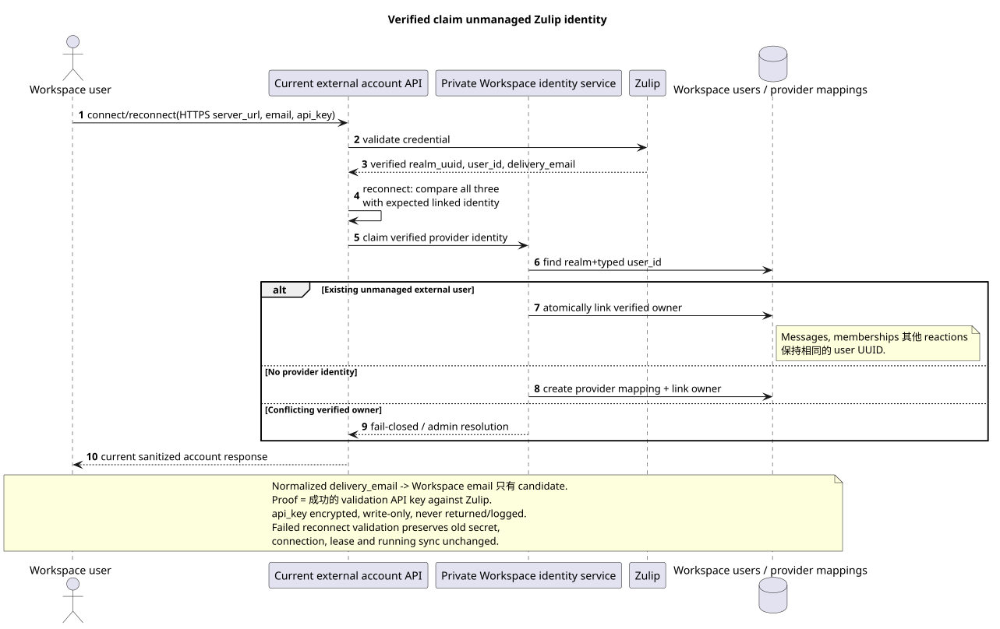

# 帐户的生命周期和 identity Zulip

状态: **proposal; current public API 保存,目标语义精确**.

[← 文件的主要索引](../index.md) · [索引 Zulip Bridge](README.md) · [Bootstrap 其他 recovery](coordination_and_recovery.md) · [Provider mappings 其他 content](provider_mappings_and_content.md)

文件记录一个用户的生命周期 Zulip account, verified
identity claim 它不添加路线,字段,
actions 现在的公开合同仍然存在
[`workspace_api.md`](../workspace_api.md) 其他
[`zulip_bridge_v1_product_and_api.md`](../zulip_bridge_v1_product_and_api.md).

## 永久公开 account API

下面所有的路径都在
`/api/workspace/v1/messenger`. 最多一个 account
`settings.kind="zulip"` 允许一个 Workspace owner.

| Method | Current route | 保存的 semantics |
| --- | --- | --- |
| `GET` | `/external_accounts/` | 清理当前帐户列表 owner. |
| `POST` | `/external_accounts/` | 创建和验证 Zulip account 用客户端生成的 `uuid` 和 write-only credential. |
| `GET` | `/external_accounts/{account_uuid}` | Sanitized snapshot 只有自己的 account. |
| `PUT` | `/external_accounts/{account_uuid}` | Revision-safe 变化 `selection_mode`, `history_depth`, `default_project_id`; `If-Match` 保持. |
| `POST` | `/external_accounts/{account_uuid}/actions/reconnect/invoke` | 检查并替换`server_url`/email/`api_key`,然后执行相同的启动 connect. |
| `POST` | `/external_accounts/{account_uuid}/actions/disconnect/invoke` | 停止同步,保存 account/credential 和 frozen visible history. |
| `DELETE` | `/external_accounts/{account_uuid}` | 返回现有 empty `204`;目标清理 account-scoped 并未删除 shared canonical data. |

Zulip create/reconnect 接收HTTPS`server_url`,电子邮件和 write-only
`api_key`. Workspace 检查 HTTPS,加密 key 持续存储和从来没有
不返回信誉或加密封面, public event,
检查,追踪或安全错误.
预期的 verified `realm_uuid`, provider `user_id` 和 normalized
`delivery_email`. 只有完全匹配才能允许原子替换. encrypted
secret 任何验证/mismatch失败都会留下旧的
credential, connection, lease 和 sync 没有变化.

公开字段 `selection_mode` 存储了 `explicit` 的正确字母, `all`.
用户同意的单词individual表示现有的
`explicit`: owner 选择单独的聊天. `all` 保持动态  新
可用的聊天会自动获得任务 `default_project_id`.

`history_depth` 只有 `new`, `7_days`, `30_days`, `90_days`, `all`;
default — `30_days`. Filter 对于每个人来说都是单独的 connected account.
每个 selected external chat 在任何时间都被分配到一个 Workspace
project; 行动
`/external_chats/{chat_uuid}/actions/move/invoke` 保存 atomic reassignment
没有任何中间状态,或是两个. projects».

## Connect 其他 reconnect

Connect 并且使用一个算法
[`coordination_and_recovery.md`](coordination_and_recovery.md#единый-bootstrap-connect-reconnect-и-recovery):

1. Workspace 通过 Zulip 验证凭证,并得到 verified
   `realm_uuid`, authenticated Zulip `user_id` 其他 `delivery_email`.
2. 为了重新连接,它将它们与预期的链接身份进行比较.
   在一个 Workspace 交易中,加密的秘密取代了
   联系/确认 verified provider identity; mismatch fail-closed 和没有
   停止旧连接.
3. Workspace sticky scheduler 指定一个 account healthy compatible
   Bridge 根据最低 normalized load `active_accounts / declared_capacity`
   并且提供租/fencing时间和历史都留在这个. owner.
4. Bridge 仅为此记录新的Zulip事件队列 supported event types,
   获取边界并立即启动 sequential realtime loop.
5. 只有成功登记后,边界桥才会在
   Workspace root history task 没有 current selection/history settings.

旧的Zulip队列/cursor不是 prerequisite reconnect. Local Bridge
cache 可能是空的; authoritative account, mappings, tasks, outbound
operations 租和租产品都在 Workspace.

## Disconnect

Disconnect 原子化将 account 转换为当前 `disconnected` 生命周期,
取消/增加账户租代. commit:

- 新的 Zulip 事件和 account 的外bound 提供商调用不被接受;
- credential/account 它们保留在 current reconnect action;
- selected-chat assignments, user bindings 并且已经可以看到的历史仍然存在
  frozen 并且根据当前的访问规则进行阅读;
- canonical/provider mappings 没有删除;
- pending work 在 reconnect 之前无法执行,并且不能转移到其他 account.

Disconnect 不是删除或隐藏已有的历史记录.

## Delete: accepted target semantics {#delete-accepted-target-semantics}

公众`DELETE`路线和`204`路线保留,但目标清理不同
这是一个被接受的内部变化. semantics,
而不是改变. browser contract.

在一个 account-scoped cleanup operation Workspace:

1. 停止同步,围取消租,禁止新 provider
   calls.
2. 解开 verified Zulip identity 的 IAM/Workspace owner; external identity
   可能会保持unmanaged author/member没有 session/credentials.
3. 删除加密帐户凭证,帐户分配/mappings和 queued
   history/outbound work 这就是 account.
4. 仅删除 account-derived user bindings,access/projection行和
   account provenance. Native access 并且获得了其他人的访问权限. connected
   account, 它们会被保存.
5. 不删除共享的正规 `MESSAGE`, `TOPIC`, `STREAM`,用户身份或
   file, 它们在通过其他连接帐户访问/链接时, native
   relation.
6. 仅在证明后删除物理文件/blob zero remaining
   references; shared/deduplicated object 永远不会被删除 account flag.

Cleanup retry 没有删除. author UUID,
message content, reactions 或剩余的会员 canonical union.
如果删除的帐户拥有提供者routing共享 same-project chat,
Workspace 通过核电传输到 account cleanup stream/topic/message/file
provenance 您的姓名是: `DELETE 204`
保存并不会让通用流没有 outbound route.

## Verified user claim

可编辑的源:
[`identity_claim.puml`](diagrams/identity_claim.puml).

Normalized Zulip `delivery_email` 和正常化Workspace帐户电子邮件给
只有初始匹配候选人.
provider identity key.

Verified claim 执行方式:

1. Existing Workspace user 显然调用 current account create/reconnect
   Zulip `api_key`.
2. Bridge 验证 Zulip 的凭证,并得到 authenticated
   `(realm_uuid,user_id,delivery_email)`.
3. Workspace 在交易锁定下验证提供者身份 owner link.
4. 如果 stable identity 是未管理的, Workspace 将其绑定到 IAM owner UUID,
   没有创建新的userUUID和没有重写消息, memberships,
   reactions, URNs 或 provider mappings.
5. 如果 identity 已经被验证为另一个 owner,则操作失败-闭,并且
   需要管理员的许可; email similarity 没有改变.

## Unmanaged external identities 其他 bots

History/realtime `realm_user/add` 创建或重用一个 unmanaged
external Workspace user 如果适用,通过stable provider identity Workspace
account 没有,是这样的. identity:

- 可视为 author/member 并且只参与进口的地方;
- 没有凭证,登录/session或代表人行动的权限;
- 可以稍后 claimed verified connection 没有更换 UUID/references;
- 获取用户更新/avatar/status根据 accepted event coverage.

`realm_bot/add` 创建一个特殊的机器人用户.`realm_bot/update`转换数据保持
unsupported. Zulip deactivate/delete 单方面关闭/删除 bot,
它的 account-derived access; 分享的消息内容不会被删除.

## Multi-account canonical union

对于一个 verified Zulip realm,可靠的提供者实体 union
所有的人 connected accounts:

- provider user/channel/topic/message/file identity 创建一次,
  根据 stable realm-scoped mapping;
- history depth 选择是对每一个单独的 account;
- per-account provenance 并且 per-user bindings/access 的不同;
- 您可以添加一个帐户的更深的历史记录 canonical topics,
  messages 没有人见过的文件. account;
- 如果删除一个帐户,只会删除其登录证,而不是
  shared row.

如果一个提供者聊天同时 selected多个 accounts, target
必须把剩余的 account-access sources 作为 binding/file和非binding
使用 首个 account 为永久 owner canonical row.

已通过的 `2A` 决定,将跨账户边界明确:一个
realm-global provider chat 只有一个可以选择 `project_id`.
Same-project accounts 通过使用一个流/topic graph,
其他项目获得 `409 provider_scope_conflict`. Public
`provider.account_uuid` 标示当前的routing owner;
deselect/delete ownership 原子传递给其余 selected alias 没有
修改了canonical row或公共浏览器合同.
根据第十五条
[`workspace_server_v2_decisions.md`](../workspace_server_v2_decisions.md#2a--один-realm-global-provider-chat-принадлежит-одному-project).

[← 文件的主要索引](../index.md) · [索引 Zulip Bridge](README.md) · [Bootstrap 其他 recovery](coordination_and_recovery.md) · [Provider mappings 其他 content](provider_mappings_and_content.md)
