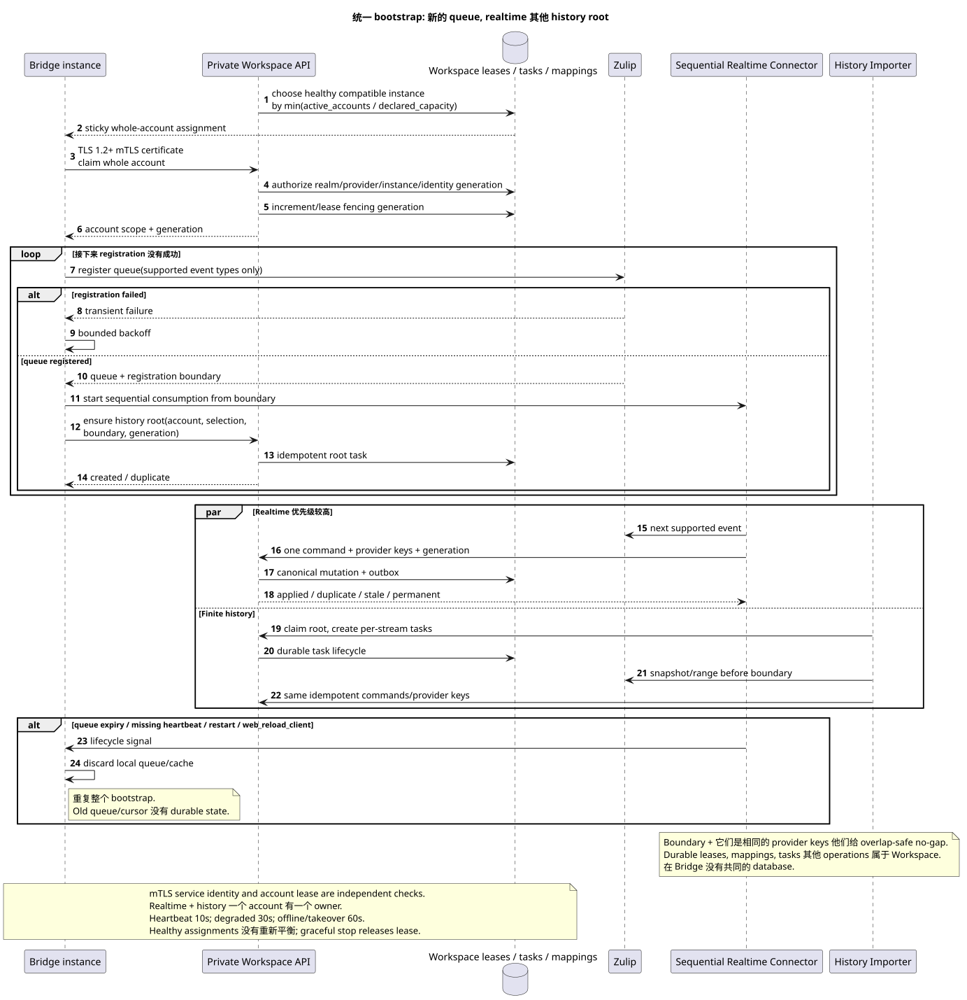

# 目标架构概述 Zulip Bridge

状态: **提案; docs-first, public Workspace API 未改变**.

[← 文件的主要索引](../index.md) · [索引 Zulip Bridge](README.md) · [事件矩阵](event_coverage.md) · [规范库存](../messenger_architecture_inventory.md)

Zulip Bridge — 没有直接访问的单独信任线路 Workspace DB.
它由两个独立的过程组成, private Workspace
API, 一个服务身份政策和相同的 provider/idempotency keys.

## 责任的组成部分和范围

| 组件 | 拥有 | 没有 |
| --- | --- | --- |
| `Zulip Realtime Connector` | Whole-account lease, 新的 supported Zulip queue,严格连续的 inbound 循环和 durable Workspace-origin delivery | 不导入旧范围,不 recipient fan-out/projections |
| `Zulip History Importer` | Workspace-owned root/per-stream tasks 选择的最终进口 history range | 没有实时队列,没有存储 message checkpoint v1 |
| Private Workspace API | 现行 realm-bound mTLS service identity, server-owned scope, provider mappings, idempotent canonical mutation, account/task/outbound lifecycle | 不信任HTTP header/body,转移到 Bridge `project_id`/user或 account lease 作为替换 authentication |
| Workspace workers | Fan-out, bindings/state, snapshots/counters, ready events | 不读 Zulip 也不是 Bridge workers |
| WebSocket dispatcher | Replay/live delivery durable ready events | 不创建或决定商业活动 provider sync |

所有的 durable assignments, account lease generations, mappings, history tasks,
outbound operations, failures 审计证据位于 Workspace. Bridge
没有共用库; local cache/queue connection 可以丢失和恢复.

Bridge 作为协议适配器,而不是第二域服务.Workspace他是
能够将 Zulip 事件转换为私有命令, Workspace outbound
operation 返回 Zulip,但没有解决 historical visibility, membership
bindings, archive/delete policy 或 notification eligibility.

两种过程都会利用现有的 S2S boundary
`workspace-external-bridge-api`: TLS 1.2+ mutual TLS, realm control CA 其他
generation-bound client certificate 没有URI SAN只有
`realm_uuid`/`provider_kind`/`bridge_instance_uuid`/`identity_generation`.
一次性 enrollment和 renewal/revoke生命周期保持相同
current control/file/Provider API. Whole-account lease/fencing 检查
对于每个 account 命令,并不是 authentication.

## Account 其他 identity boundary

目前的 public account/chat routes 和 payloads 存储. Connect/reconnect
验证 Zulip `api_key`,得到验证的领域/user/`delivery_email`和
只有那时才能连接 identity. Email  候选人,不是 proof. 缺失
Workspace account 成为一个没有登录的未管理的外部用户/session; 晚期
verified claim 通过使用 identity.:
[`account_lifecycle_and_identity.md`](account_lifecycle_and_identity.md).

History depth 并且 selected chat scope 都属于一个特定的帐户,
canonical provider entities 删除 account 则删除
只有其凭证/work/access证据;共享的正规行仍然存在.

## 单一的启动和 recovery

可编辑的源:
[`bootstrap_to_realtime.puml`](diagrams/bootstrap_to_realtime.puml).

Connect, reconnect, queue expiry, missing heartbeat, `restart` 其他
`web_reload_client` 它们运行相同的算法:

1. Workspace scheduler 将所有帐户分配到一个 healthy compatible Bridge
   具有最小的正常负载 `active_accounts / declared_capacity` 并提供
   lease/fencing generation. Assignment sticky.
2. 仅为支持事件类型注册新Zulip队列,并返回
   registration boundary. 如果有错误,重复 backoff;历史无法启动.
3. 立即开始严格连续的实时循环 boundary.
4. 具有权力,为截图/range创建Workspace历史根任务
   boundary 没有 account selection/history settings.

旧的 Zulip queue/cursor不是一个 durable 条件.
provider keys 允许重叠,但不允许差距:第一个实际 state mutation
创建出箱/event,重复成为 duplicate/no-op.

V1 能够使用一个桥,但该电路支持多个 instances.
新的健康实例不会调整健康帐户:它会得到
新的任务; 转移只发生在 dead/draining owner. Graceful
shutdown 租,收购,收购等都已被批准. `60s` offline timeout
他总是得到新的. fencing generation. Heartbeat interval `10s`, status
`degraded` 在 `30s`, `offline`之后 `60s`.

## 信息的域名突变

Inbound realtime 历史使用一个命令. Workspace
transaction 她是:

1. 允许 realm-scoped provider mapping 和 canonical `MESSAGE`;
2. 允许一个强制性的 `TOPIC`,属于一个 `STREAM`/`PROJECT`;
3. 创建 `MESSAGE_PLACEMENT`, author `USER_MESSAGE_BINDING` 和
   placement-scoped `USER_MESSAGE_STATE`;
4. 计算出公共放置 UUID 的
   `UUIDv5(namespace=TOPIC.uuid, name=MESSAGE.uuid)`;
5. 他写道 immutable outbox event.

`2xx`/`201` 意思是 commit canonical state/idempotency,不是完成 fan-out.
Workspace workers 它们可以不同步地创建接收者状态, counters/snapshots和 ready
events. Bridge 不会替换这个子系统.

## Structure, content 其他 files

- Numeric users/channels/messages/attachments 有一个 realm-scoped UUIDv5 exact
  ASCII name `<entity_type>:<decimal_provider_id>`; allowed types 其他 decimal
  normalization 已在 provider mapping document.
- Zulip topic 有 Workspace-owned durable mapping 和 alias 历史; UUID 不
  直接/group直接得到私人`STREAM`和
  mandatory synthetic default `TOPIC`.
- Whole-topic rename 保留了 topic UUID. canonical
  `MESSAGE`, 删除旧的位置,创建一个位置 target topic; old URL
  返回 `404`,公众事件反映 delete+create/update.
- 一个文件匹配`(realm_uuid,attachment_id)`;消息链接是单独的,
  physical blob 只有在 zero references.
- Public content — 只有有效的 canonical Markdown/URN. Latest raw Zulip
  payload/version/converter metadata 隐藏 private; 修改历史 raw 不
  保存. 最新-第一未解决的链接 deferred repair; reconversion
  只有执行 manual versioned batch tool.

详细介绍: [`provider_mappings_and_content.md`](provider_mappings_and_content.md).

## Realtime, history 其他 outbound

Realtime per account 读出一个事件,把它变成一个事件. internal
command, 重复到applied/duplicate/stale 或 classified permanent failure,
历史根会创建每个流任务,
streams 执行与 configured limit 并行,一个流一个 worker,
topics/messages 在此里,新一代是最新的一代.
stream task 完全重复范围; 提供器键将执行已导入的范围
快速的 no-op.

一个桥的历史库具有默认 `4`; upper limit/optimum
在账户之间使用公平轮回, account —
newest stream first. Workers account 它们使用 rate limiter. Zulip
`Retry-After` 暂停 account 历史; realtime 优先,并且
恢复第一个.

Workspace-origin mutation 原子保存了canonical状态,outbox和 durable
outbound operation. Transient delivery retry 担心 failover; internal
`permanent_failed` 不会创建新的 public endpoint. Last confirmed mutation
wins, delete wins stale edit, echo suppresses reciprocal write. 详细介绍:
[`delivery_and_events.md`](delivery_and_events.md).

## Public events

每一个实际 client-visible transition — live, backfill, deferred repair
或重置原子化创造出一个 ready public event. Duplicate/no-op
event 没有创建. Workspace worker commit-it projection+event 一起, dispatcher
只有传送/replay-到它. `delivery_class`和通知元数据仍然存在
在 current shape 中; Bridge 无法解决 desktop/push policy.

## Event coverage 限制和限制

定向矩阵只能在
[`event_coverage.md`](event_coverage.md). Unsupported families 没有得到
guessed fallback. 剩下的运输/serialization/limits/policy解决方案
仅在
[圣经中的 OPEN-list](README.md#единый-список-open-решений-zulip-bridge).

[← 文件的主要索引](../index.md) · [索引 Zulip Bridge](README.md) · [事件矩阵](event_coverage.md) · [规范库存](../messenger_architecture_inventory.md)
