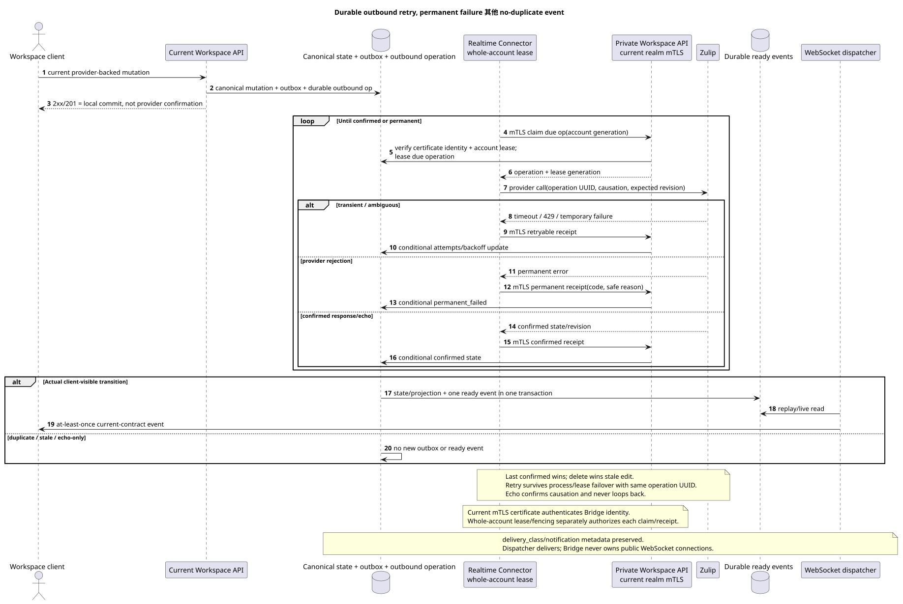

# Outbound delivery, conflicts 其他 public events

状态: **proposal; public routes/`delivery`/event shapes 不变**.

[← 文件的主要索引](../index.md) · [索引 Zulip Bridge](README.md) · [Realtime Connector](realtime_connector.md) · [内部 Workspace API](internal_workspace_api.md)

文件设置了 durable outbound语义和规则 public WebSocket events.
它没有添加通知UI,冲突UI,重试路线或新 public
status literal.

## 成功的意义 Workspace response

对于提供者支持的变异,公共 Workspace `2xx`/`201` 表示
地方 transaction committed:

- canonical primary mutation 和目前 author/placement/state rows;
- immutable domain outbox event;
- durable outbound provider operation 没有 stable operation UUID,
  `causation_uuid`, provider target mapping 其他 expected revision/state;
- 已经被清理了.`delivery`现在的投影 contract shape.

Response 不意味着 Zulip 已经确认了 mutation. Transient provider
failure 不会推翻 committed Workspace 状态,也不会丢失 operation: retry
survives Connector process crash, account lease expiry 和转移到另一个
Bridge instance.

Current public
`/external_operations/{operation_uuid}/actions/retry/invoke` 并且他的 errors 不
内部接入 `permanent_failed` 没有创建新的 UI/action:
这不是新事物. public retry endpoint.

## Durable operation lifecycle

可编辑的源:
[`outbound_delivery.puml`](diagrams/outbound_delivery.puml).

Internal operation 保存 operation UUID, source outbox event UUID, account
lease generation, provider object identity, expected/confirmed provider
revision, causation, attempts/backoff 其他 sanitized failure code/reason.

最低 internal outcomes:

| Outcome | Semantics |
| --- | --- |
| `pending` | Durable operation committed, provider call 尚未确认. |
| `retryable` | Transient network/`429`/provider failure; same operation waits until `next_retry_at`. |
| `confirmed` | Provider response/state/echo confirms requested transition. |
| `permanent_failed` | Provider 终于拒绝了 operation; endless retry 禁止. |
| `superseded` | 更新的 confirmed/delete operation使旧的突变不适用. |

这是一个内部模型,不是扩展. current public `delivery.status`. Existing
`delivery`, `safe_error`, `can_retry`, `can_discard`, duplicate/reconciliation
fields 保持当前值和 authorization. Internal
`permanent_failed` 仅通过已允许的 sanitized failure
semantics; raw provider response/content 没有发布.

Future operator requeue 现在没有.
永久性失败存储/警报并可访问 private
reconciliation; 新的浏览器通知/retry 操作未创建.

## Retry 其他 account failover

Bridge 验证私人 API请求为有效 realm-bound mTLS client
certificate 并且单独获得全账户租/fencing
Workspace. 在每次 provider call 和 receipt update Workspace 之前,检查和
certificate identity, 之后,我们将 expiry:

1. 旧的所有者无法再验证 result.
2. 只有在 `60s` 后,离线时间out scheduler 才会指定 healthy compatible
   owner; 新桥声称全新帐户与围,执行
   通过私人 API 获得 due operations.
3. Retry 使用相同的操作UUID/provider key/causation 并开始
   reconcile-其他 ambiguous provider state.
4. Confirmation 按lease generation和 provider
   revision; stale response 变得 no-op.

Bridge-local retry queue 没有权威性./attempts/next试试
terminal state 在 Workspace.

Graceful draining/shutdown 显然释放租;健康粘贴账户没有
只有由于较少的负载出现而重新平衡 instance.

## Conflict semantics

- Last **confirmed** mutation wins; arrival time/job time 没有 version.
- Delete wins over concurrent 或稍后送到 stale edit.
- 对于双向存在/status桥接连续提供两者
  双方不选择winner:最后一个赢 confirmed state.
- `origin`/`causation_uuid` 它们用于反响抑制/idempotency而不是
  作为优先级 Workspace 或 Zulip.
- Echo 同样的 causation 确认操作,并不会产生 reciprocal
  outbound work.
- 没有文本合并,隐藏分叉或 conflict UI.
- Stale edit 删除后得到 internal no-op/superseded outcome; canonical
  deleted state 客户端事件不会翻转.
- Same provider operation retry 模糊的结果可以通过
  provider identity/revision/state, 没有时间标记猜测.

## 实际事件中准备的事件 transition

每个实际创建/修改/删除的交易 client-visible
state, 原子能创造出一个相应的 durable ready public event
这对于 transition/audience.来说是相同的 `live`, history
backfill, deferred reference repair 其他 manual reconversion.

- State/projection row 和ready event commit together 或 rollback together.
- Idempotent duplicate/stale/no-op 不会创建新的 public event.
- 在 history/realtime 重叠时,第一个 committed transition 创建一个 event,第二个
  提供商 key/version 返回 duplicate/no-op 没有 event.
- Recipient fan-out 只有在一个完成的交易中才会创建 ready event
  具体的收件投影可见.
- Delete old placement + create/update target placement 在partial move时 两个
  实际的公共状态过渡, 每个是当前合同事件,但 retry
  不重复它们.

`delivery_class` (`live`/`backfill`) 和现有的
`notification_eligible`/notification metadata 在 public sanitized
projection. Bridge 不解决 desktop/push eligibility: 客户端使用
current contract. Backfill event 存在,但元数据并没有将其转化为
desktop notification.

WebSocket dispatcher 他不是创建商业活动,而是阅读 durable event store,
让它进行反播放/live 交付至少一次,而客户端则按 event UUID.

## Internal retention

- Successfully completed history tasks 其他 confirmed/successful outbound delivery
  operations 通过内部清理删除 `30 days`.
- `permanent_failed` operation 随着安全代码/reason的存储 `90 days`,
  然后删除 internal cleanup.
- Provider mappings 和最新隐藏的原始 payload/converter没有元数据
  task TTL: 它们的寿命是相应的 Workspace/provider
  entity.

Retention 不添加公共字段/actions. 可能 future internal requeue
没有实现并不会改变现有的 public external-operation retry route.

## 监视性

没有 account/operation-scoped metrics 的必须 content/credential:

- pending/retryable age, attempts, next retry 其他 oldest operation;
- confirmed/permanent_failed/superseded counts by safe code;
- account lease owner/generation mismatch 其他 stale receipt rejection;
- provider rate-limit/backoff 其他 outbound lag;
- duplicate/no-op count 其他 unexpected duplicate-ready-event guard;
- public projection→ready event transaction failures 和分别调度器延迟.

[← 文件的主要索引](../index.md) · [索引 Zulip Bridge](README.md) · [Realtime Connector](realtime_connector.md) · [内部 Workspace API](internal_workspace_api.md)
