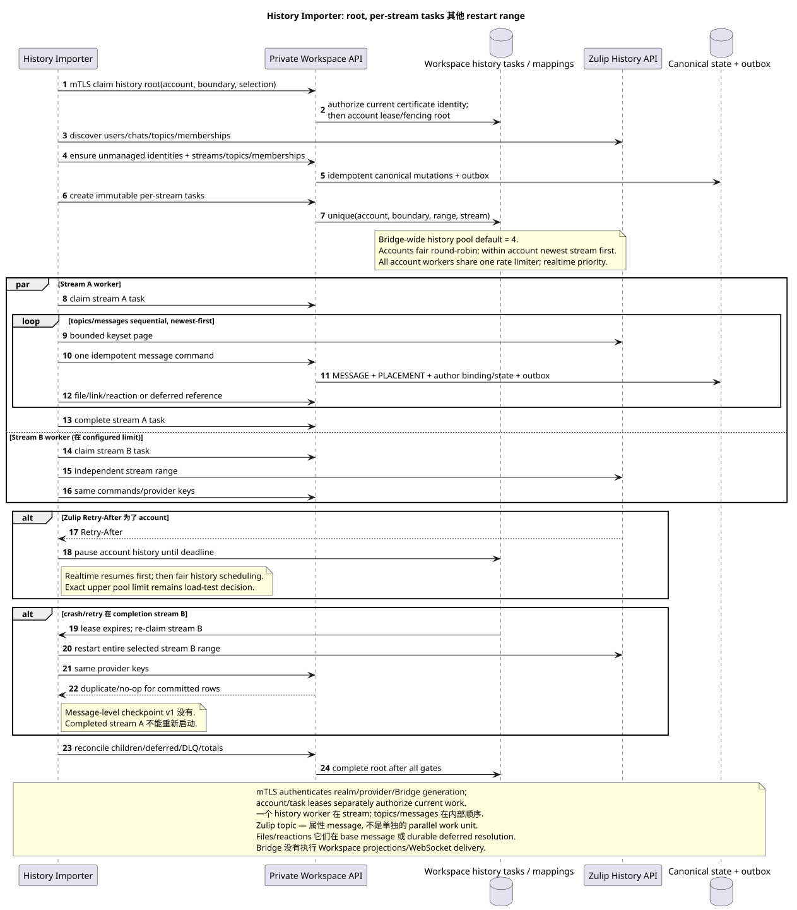

# Zulip History Importer

状态: **提案;最终 Workspace-task-driven import**.

[← 文件的主要索引](../index.md) · [索引 Zulip Bridge](README.md) · [事件矩阵](event_coverage.md) · [Bootstrap 其他 recovery](coordination_and_recovery.md) · [Provider mappings/content](provider_mappings_and_content.md)

`Zulip History Importer` 执行已选项的finite import account history
range. 它没有实时队列,没有写WorkspaceDB,也没有存储
message-level checkpoint. Durable root/child tasks 和 results 的属性
Workspace private API.

## 条件

History root 只有在成功注册新 supported-events
queue 并且从注册边界开始实时启动. server-owned
account, verified realm, selection, `history_depth`, boundary, lease generation
没有边界历史,它就无法启动..

Importer 调用 current private API 在同一个位置下 realm-bound mTLS client
certificate, 实时连接器 Bridge instance. Certificate
检查服务身份;每个root/stream任务的 claim, active whole-account
lease/fencing 独立证明自己有权与具体的 account/range.

History depth (`new`, `7_days`, `30_days`, `90_days`, `all`) 应应用于 per
account; default `30_days`. Canonical entities 形成所有人的联盟 connected
accounts, 因此,更深的帐户可以添加 topics/messages/files
复制 provider identity.

## Root 其他 per-stream tasks

可编辑的源:
[`history_importer.puml`](diagrams/history_importer.puml).

Root task 执行发现,并为每个创建不可变的子任务 selected
channel/direct/group-direct stream:

1. 检查/创建未管理的外部用户身份 bot identities;
   verified connection claim — 单独的 account operation.
2. 允许 realm-scoped canonical channels/streams.
3. 对于频道,阅读可访问-主题元数据,并仅包括
   它们里面有信息 account history range.
4. Direct/group direct 创建一个私人流 mandatory synthetic
   default topic.
5. 传输会员身份/subscriptions和服务器所有项目任务
   Workspace; domain service 历史可见性和 bindings.
6. 按顺序创建每流任务 last activity descending.

Workspace idempotency/unique task key 确保重新尝试的根源不会创建
另一个孩子 immutable stream range.

## 并行性和秩序

一个桥有共同的 configurable history worker pool, default `4`.
具体的安全上限和最佳值是在负载测试之前. stream tasks
它们可以同时运行,但同时有一个流,
history worker. Topics 和 messages 在流中被处理顺序,
因为 Zulip topic  属性 message; message priority — `created_at DESC`,
在 stable provider message ID descending 时. `OFFSET` 不使用;
每一个边界请求都会应用 keyset/provider pagination.

Scheduler 选择公平轮回账户, account —
newest stream first 所有的工人账户都共享一个
account-level rate limiter. Zulip `Retry-After` 暂停历史
这个 account; realtime lane 是优先级的,并且是第一个恢复的.

Realtime loop 独立且始终在优先级上/admission.
暂时保持全帐户锁定 provider request; lease generation
检查在Claim和每一个 private API commit.

## No message-level checkpoint v1

Child task 没有保存最后的输入消息. process crash, lease expiry
或 retryable failure unfinished stream task 开始整个selected range
开始. 同一个领域/provider 键转换到以前 committed users/topics/
messages/files/reactions 在 duplicate/no-op中,没有创建第二个 canonical row,
outbox 或ready event. 完成流任务无法重新启动.

Task lifecycle Workspace-owned: `pending` → `leased/running` → `completed` 或
`failed`, 通过尝试/backoff,租到期/fencing,边界重复和 DLQ.
Default pool `4` 只有上限/optimum和可测量 rate/batch
budgets 留在 canonical OPEN-list.

## Message 其他 dependency order

在流导入器内部,首先提供用户,流,强制性主题和
memberships/bindings. 然后,每个人都 message newest-first:

1. 引起一个 idempotent `message.create`/`update`/`delete`/`move` command;
2. Workspace transaction 创建/更新 canonical `MESSAGE`, placement,
   author binding/state 其他 outbox;
3. 在base message之后导入 files/attachment links 和 reactions;
4. unresolved older quote/message/file reference 保留作为延期而不是
   synthetic public object;
5. actual later repair 创建普通的Outbox/ready事件,没有op 没有.

一个 canonical file 可以在 `(realm_uuid,attachment_id)`. Topic
通过 Workspace-owned mapping/alias history 进行.
改变UUID; partial move 创建目标位置并删除 old placement.

## Current state, deletes 其他 unsupported families

History 恢复可证明的当前状态/range没有
没有虚构的修改历史. latest
payload/revision/hash/converter metadata. Persistent supported state 包括
message flags, reactions, memberships, selected user fields/status, files and
links. Presence/typing/heartbeat/restart 没有背填. Experimental
`submessage`, unsupported UI/personal/org families 没有进口;
`saved_snippets` 留下来 OPEN.

## Completion 其他 reconciliation

Stream task `completed` 代表所有 immutable range 的终端处理和
durably classified deferred/permanent items. Root 结束后,所有 child
tasks 其他 reconciliation:

- selected stream/topic/message ranges, provider identity uniqueness 其他 gaps;
- memberships/access, attachment references, reactions 其他 deferred refs;
- no duplicate canonical rows/outbox/events 在重叠时 realtime;
- Workspace task/DLQ/outbound failures and projection lag reported separately.

Backfill actual transition 通过原子创建一个准备好公开事件
常规的 Workspace 投影路径 `delivery_class="backfill"`; duplicate/no-op
没有创建事件. notification policy.

## Graceful restart 其他 observability

Graceful stop 停止新的流索赔,完成/交出当前任务,
硬崩盘只允许接管之后
`60s` offline timeout; 新的fenced owner重复 bootstrap, unfinished stream
task range, 但没有 completed siblings.

Completed history tasks 它们是 audit/retry evidence `30 days`,然后
内部retention清理删除它们. Provider mappings/raw entity metadata
没有跟随这个任务TTL,并生活在相应的 entity.

测量: root/child counts, stream ordering/age, full-range restarts,
messages/files/reactions scanned vs applied/duplicate, deferred/DLQ, provider
rate limits, history lag and reconciliation mismatch. Raw content/credential 没有
登录.

[← 文件的主要索引](../index.md) · [索引 Zulip Bridge](README.md) · [事件矩阵](event_coverage.md) · [Bootstrap 其他 recovery](coordination_and_recovery.md) · [Provider mappings/content](provider_mappings_and_content.md)
