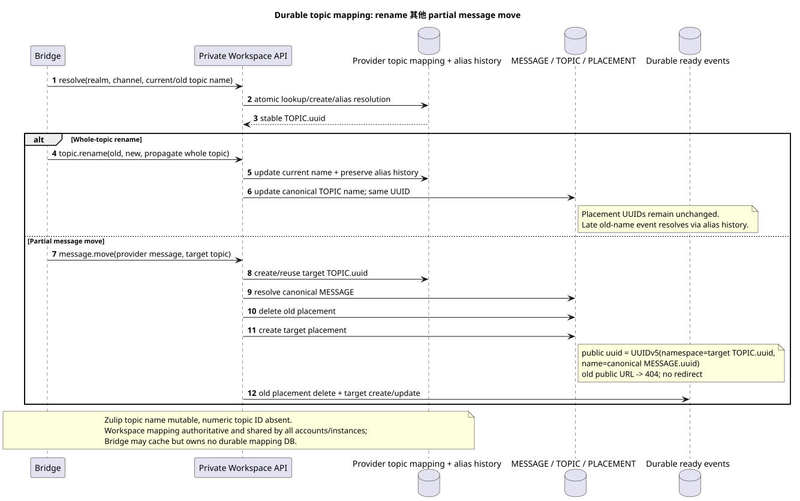
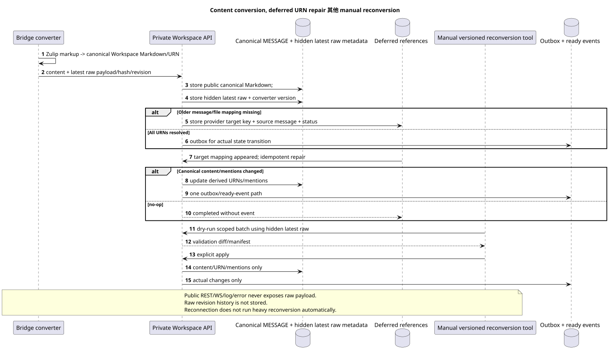

# Provider mappings, topics, files 其他 content conversion

状态: **proposal; internal design, public Markdown/URN 合同没有变化**.

[← 文件的主要索引](../index.md) · [索引 Zulip Bridge](README.md) · [Account lifecycle 其他 identity](account_lifecycle_and_identity.md) · [内部 Workspace API](internal_workspace_api.md)

文件记录 realm-global provider identity, durable topic mapping,
file/attachment reuse 并且 Zulip↔Workspace内容转换.
authoritative mappings 在本地,并没有添加 Bridge-specific public markup.

## Realm-scoped provider identity

Stable numeric Zulip IDs 它们使用逻辑 key
`(verified_realm_uuid, entity_kind, numeric_provider_id)`. `entity_kind`
必须和防止同数之间的碰撞 user/channel/
message/attachment domains.

| Provider kind | Stable logical key | Canonical result |
| --- | --- | --- |
| user | `(realm_uuid,"user",user_id)` | 一个管理或 unmanaged `WorkspaceUser` identity. |
| channel | `(realm_uuid,"channel",channel_id)` | 一个 canonical channel `STREAM`. |
| message | `(realm_uuid,"message",message_id)` | 一个可定性 `MESSAGE`,无论 importing account. |
| attachment/file | `(realm_uuid,"attachment",attachment_id)` | 一个canonical Workspace文件;链接到单独的消息. |

Target UUID/provider mapping 使用一个精确的算法:

1. Namespace — 已验证的稳定Zulip领域UUID.
   canonical lowercase hyphenated UUID text, 它们将被分解到UUID,然后传递到UUID
   UUIDv5 像是十六岁.RFC 4122/network-byte-order octets. Project/account UUID没有
   没有使用 namespace.
2. 允许的 `entity_type`  是其中一个 lowercase ASCII literals:
   `user`, `channel`, `message`, `attachment`.
3. Numeric provider ID 首先,它是整体,没有符号.,
   数或非数值被拒绝. decimal form —
   shortest base-10 ASCII: `0` 对于零,否则数字 `0..9` 没有 leading zeros,
   `+`, 没有空白或 locale formatting.
4. UUIDv5 name — 精确的 ASCII 行
   `<entity_type>:<decimal_provider_id>`, 例如 `message:12345`.
5. Bytes name 它们是平等的.ASCII/UTF-8没有这个行的字节 NUL, BOM, newline,
   braces, prefix, project/account/server URL 或其他字段.

结果是 `UUIDv5(namespace=verified_realm_uuid, name_bytes)`.
numeric ID 由于必须的 prefix.
Mutable email/name/server URL 和importing account 不包括在 identity.

Provider mapping 并且可以通过 private
Workspace API. Multiple Bridge instances/accounts 得到一个结果;
local cache 可以丢弃,不需要损失 identity.

## Discovery 其他 history scope

History depth 对于频道流根任务,读取
Zulip accessible-topic metadata 并且选择时间边界. account
只有有信息的主题才会被投影 `history_depth` range.
其他帐户可以在后面添加更深的范围.
canonical topics/messages; 这是一个正常的扩展联盟,而不是 duplicate.

Direct, self-direct 并且在 private Workspace `STREAM` 中显示
必须有一个synthetic default.`TOPIC`. Nullable/sentinel为了
placement 完全稳定的对话密钥来自 provider mapping,
而不是从 display name.

## Durable topic mapping 没有 numeric Zulip topic ID

可编辑的源:
[`topic_mapping_and_move.puml`](diagrams/topic_mapping_and_move.puml).

Zulip topic 没有 stable numeric ID,因此 `TOPIC.uuid` 不能输出
只有从可变主题名. Workspace 拥有 durable provider topic mapping,
只有通过私人API才能访问桥梁.:

- `realm_uuid` 其他 stable provider channel identity;
- current normalized provider topic identity/name;
- stable canonical `TOPIC.uuid`;
- rename/alias history, 足以 late old-name event;
- immutable owning canonical stream/project association.

创建/reuse是通过Workspace交易锁完成的.
Bridge instances 一个领域使用映射,而桥缓存不是
source of truth.

### Whole-topic rename

Whole-topic rename 更新了canonical topic name和alias历史,但保留了
这就是`TOPIC.uuid`. 通过历史记录允许以旧名字的晚事件
topic identity. 因为名字空间的位置 UUID 仍然是原来的, public
message placement URLs 只有因为 whole-topic rename.

### Partial message move

Partial move 一个/部分的消息不是 rename:

1. Workspace 在 `MESSAGE` 上找到可靠的源 realm/message mapping.
2. Target topic 通过 durable mapping.
3. Source `MESSAGE_PLACEMENT` 删除;内容 `MESSAGE` 不复制.
4. 在目标主题中创建一个新的位置 public UUID
   `UUIDv5(namespace=TOPIC.uuid, name=MESSAGE.uuid)`.
5. 旧的 public message URL 在 commit 之后返回 current `404`; redirect 和
   hidden primary placement 禁止使用.
6. 在同一状态转换中,创建了 ready events: deletion
   旧的位置和当前合同创建/update新的一张快照
   placement. Duplicate retry 不会产生第二对. events.

## Canonical files 其他 attachments

一个 canonical Workspace 文件相应
`(realm_uuid,attachment_id)`. Repeated history/realtime import 并且引用
几条消息/accounts将重复使用 file row/blob. 规范化
message↔file links 是独立的 source-of-truth 行,并且具有自己的
referential integrity.

除掉 account 或一个 attachment relation 暂时不会删除 file/blob
物理对象只会在
zero-reference check. Provider file bytes/metadata 其他 mapping account-independent;
access 根据 message/stream/user bindings.

Workspace→Zulip upload 只有作为一部分执行 provider-backed
message/action 已验证账户/mapping. 常见的无关的 Workspace 文件
发送到 Zulip 自动.

Typed UUIDv5 serialization 对于 users/channels/messages/attachments 完全
没有被定义为OPEN. 业务独特性文件仍然存在
`(realm_uuid,attachment_id)`.

## 规范的Markdown和 URNs

Public `payload.kind="markdown"` 并且当前 URN 保存不扩展:

- `[name](urn:user:<user-uuid>)`;
- `[message](urn:message:<placement-uuid>)`;
- `[stream](urn:stream:<stream-uuid>)`;
- `[topic](urn:topic:<topic-uuid>)`;
- `[file](urn:file:<file-uuid>?name=...)`;
- `` 其他 `urn:video`;
- `[url](urn:url:https://...)`;
- 现有 quote/reply 标记下规则
    [`workspace_api.md`](../workspace_api.md#messages).

Inbound Zulip content converter 只有创建 canonical Workspace Markdown.
Outbound converter 通过 durable provider mappings 解决 URN,并形成
Zulip markup. 不允许的 UUID 不用 display name/URL 猜测.

## Latest raw provider layer

可编辑的源:
[`content_conversion_and_repair.puml`](diagrams/content_conversion_and_repair.puml).

仅存储一个 canonical provider message latest raw Zulip message
payload, latest provider revision/hash, converter version 其他 bounded conversion
result metadata. Revision history raw payloads 没有.

Raw layer 完全隐藏:

- 没有串行化 public REST list/get/search/action response;
- 没有 public WebSocket event;
- 没有写入log,trace,metric label或 public/safe error;
- 只有私人认证提供商/BridgeAPI和 versioned manual
  reconversion tooling 没有 server-owned realm/account scope.

Provider mapping, latest hidden raw payload, provider revision/hash, converter
version 转换元数据的寿命长得如同相应的
Workspace/provider entity. 这是一个内部生命周期,而不是一个单独的公共领域,
不独立的 raw revision archive.

Public content 总是有 canonical Markdown. `provider`/`delivery` 仍然存在
已有的 sanitized public projections; raw protocol fields 不会添加.

## Deferred references 在 newest-first import

新消息可以引用未导入的旧消息 message/file.
Converter 保存内部延期引用 provider target key,
canonical source message UUID, converter version 其他 repair status. Public
Markdown 没有得到 synthetic entity.

当目标映射出现时,idempotent repair 仅允许重复
affected references. 如果 canonical public content/mentions/derived URNs
实际上改变了,交易更新消息状态,写出box,
创建一个准备的当前合同事件. event.

## Manual reconversion

Heavy reconversion 永远不会在 schema migration 或常规
request path. Schema migration 只能注册一个新的 converter
version/need. 必须支持单个版本ed手动工具:

- `dry-run`/check-only 其他 explicit apply;
- realm/account/project/range scope;
- bounded batches, restart/checkpoint 其他 audit manifest;
- raw access 只有通过 private authenticated boundary;
- validation counts/diffs 应用和调整后.

Reconversion 它可以改变可规性的Markdown,衍生URNs和提及.
变化 author, canonical/placement UUID, stream/topic, public timestamps,
read/star/pin state, reactions 任何实际的变化都需要
常规的outbox/projection/ready-event规则; no-op不会创建 event.

[← 文件的主要索引](../index.md) · [索引 Zulip Bridge](README.md) · [Account lifecycle 其他 identity](account_lifecycle_and_identity.md) · [内部 Workspace API](internal_workspace_api.md)
