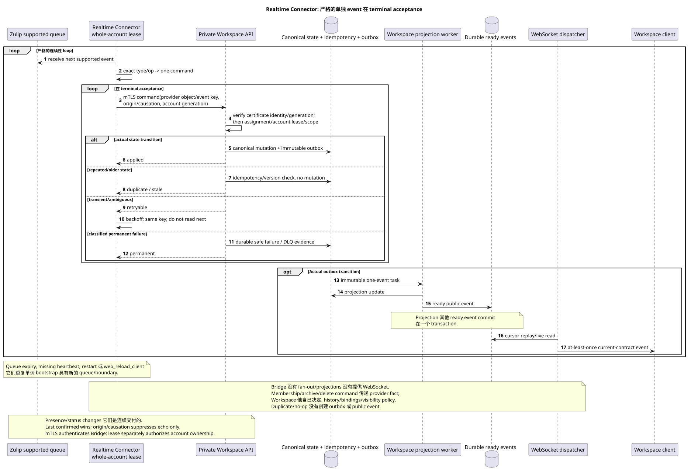

# Zulip Realtime Connector

状态: **提案; 持续的序列过程,公众 API 未改变**.

[← 文件的主要索引](../index.md) · [索引 Zulip Bridge](README.md) · [事件矩阵](event_coverage.md) · [Bootstrap 其他 recovery](coordination_and_recovery.md) · [Outbound delivery](delivery_and_events.md)

`Zulip Realtime Connector` 在一个外部帐户下服务于所有外部帐户
Workspace-issued lease. 它只接受支持的事件,
durable Workspace-origin operations 并且从来没有直接写WorkspaceDB.
它是协议翻译,并不会做出 Workspace 域-政策决定.

## 启动

可编辑的源:
[`realtime_connector.puml`](diagrams/realtime_connector.puml).

Connector 始终通过
[一个 bootstrap](coordination_and_recovery.md#единый-bootstrap-connect-reconnect-и-recovery):

1. 验证当前实域绑定的mTLS客户端证书,然后 claims
   整个 account 与单独的 fencing generation.
2. 创建新队列 allowlist supported event types.
3. 得到 registration boundary.
4. 现在开始了 realtime consumption.
5. 经过成功的启动, history root task.

Registration failure 不允许使用 boundary. Queue expiry, missing
heartbeat, `restart` 和 `web_reload_client` 释放当前连接和
它们重复整个算法./cursor没有 durable state.

## 严格的连续性 inbound loop

Per account 一次处理的正是一个 inbound event:

1. 获取 next supported event.
2. 通过当前mTLS private API; Workspace 独立发送命令
   检查身份证和 account lease/fencing generation.
3. 根据`type`/`op`进行分类
      [`event_coverage.md`](event_coverage.md), 没有任何概率 fallback.
4. 创建一个私人 Workspace 命令 provider object/event key,
   origin/causation 如果存在,则提供者修改/hash.
5. 重复命令 terminal acceptance.
6. 只有在 applied/duplicate/stale/confirmed 或 classified permanent
   failure 转到下一个 event.

Transient timeout/`429`/temporary provider error 留下相同的事件
缺失的依赖性仍然存在 durable Workspace deferred reference
在终端接受之前. subscription;
如果提供商仍然返回了它们, Connector 写了 bounded audit/metric,而不是
创建 guessed mutation.

## Workspace transaction 其他 async boundary

Private API 仅从已验证的服务身份中获取 mTLS certificate,
a project/source/user/account scope  在 Workspace assignments/mappings 中,
active lease. 对于实际的突变,它在一个交易中
idempotency check, canonical mutation, placement/binding/state 如果有必要
并且 immutable outbox append. Duplicate/no-op不会创建第二个 outbox/event.

Recipient fan-out, counters, reactions/file snapshots 其他 ready public events
它们正在做.Workspace连接器不会等待它们结束,
准备事件是从实际的原子事件中生成的. projection;
WebSocket dispatcher 仍然是一个单独的组件.

## Supported message/content paths

- Create/update/delete/move messages, reactions, files/attachments, read/unread,
  starred, mentions/links/render-related changes 接下来 bidirectional matrix.
- Inbound content 转换为 canonical Workspace Markdown/URN; latest raw
  payload 已被隐藏. Workspace.
- Whole-topic rename 保留了持续的主题 UUID. old
  placement, 创建目标主题中的新位置; old public URL 返回
  `404`, redirect 没有创建.
- Reactions 它们将 public placement 作为访问的地址,但 fact/snapshot 仍然存在
  canonical-message-global 根据 semantics.
- File reuse 根据 `(realm_uuid,attachment_id)`; unrelated native file
  没有送到 Zulip.

## Structure, users 其他 ephemeral events

- Zulip channel create 创建 mapped Workspace stream; native Workspace stream
  create 没有创建 Zulip channel.
- Membership add/remove 在 group/private chat 中,一个人传递 Workspace private
  command. Bridge 由于组合变化,无法创建新流,也无法解决,
  什么历史可见或创建/删除什么消息绑定:这会
  Workspace domain service 根据 stream settings.
- Channel archive/delete 作为提供者命令传输; Workspace 解决
  archive/history/bindings/visibility. Bridge 不重复 policy.
- 其他订阅/topic/user selected updates如下 exact matrix.
- 不知 ordinary identity 在 unmanaged external user 中变为 import;
  verified existing user claim 只有 explicit account connection.
- Bot add 创建 special user; bot metadata update unsupported;
  deactivate/delete 这样就行了. Zulip→Workspace.
- Presence/status/typing 双边;基于和非基于存在/typingTTL durable
  history, `user_status` persistent. Echo suppression 没有创建 reciprocal op.

对于双向存在/status 连接器连续传递变化
两者都无法解决冲突.
赢得了.`origin`/`causation_uuid`仅用于呼应抑制和
idempotency, 没有优先考虑一方.

## Workspace-origin outbound lane

Workspace `2xx` 保存 local canonical mutation + outbox + durable outbound
operation. Connector 通过私人 API 获得相同的操作 account
generation, 调用 Zulip 并条件确认 receipt. Transient retries
他们很担心. process/lease failover. Last confirmed wins; delete wins stale edit;
echo 确认了无反作用的因果关系 command. Provider permanent rejection
变为内部 `permanent_failed`,不是新的 public action/status.

完全 semantics:
[`delivery_and_events.md`](delivery_and_events.md).

## Backpressure, restart 其他 observability

Realtime lane 历史的重点是 inbound loop sequential,
它的队列增长由提供者队列/backoff调节,而不是并行 reorder.
所有的历史工人账户共享 account-level limiter; `Retry-After`
暂停历史,而实时恢复第一.
在 graceful stop Connector 上,它不接受 next event/provider operation,它完成或
留下可复用的当前单元,条件租.:
新的所有者启动bootstrap,而replay/overlap则被重复 provider keys.

测量: queue registration/expiry, event processing age, terminal outcomes,
duplicate/no-op, retry/backoff, lease generation mismatch, echo match failure,
outbound pending/permanent failure 和单独 Workspace projection/WS lag. Raw
content, email 您的文件和凭证被禁止在 labels/logs/errors.

[← 文件的主要索引](../index.md) · [索引 Zulip Bridge](README.md) · [事件矩阵](event_coverage.md) · [Bootstrap 其他 recovery](coordination_and_recovery.md) · [Outbound delivery](delivery_and_events.md)
